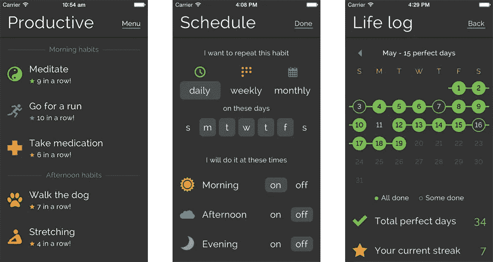
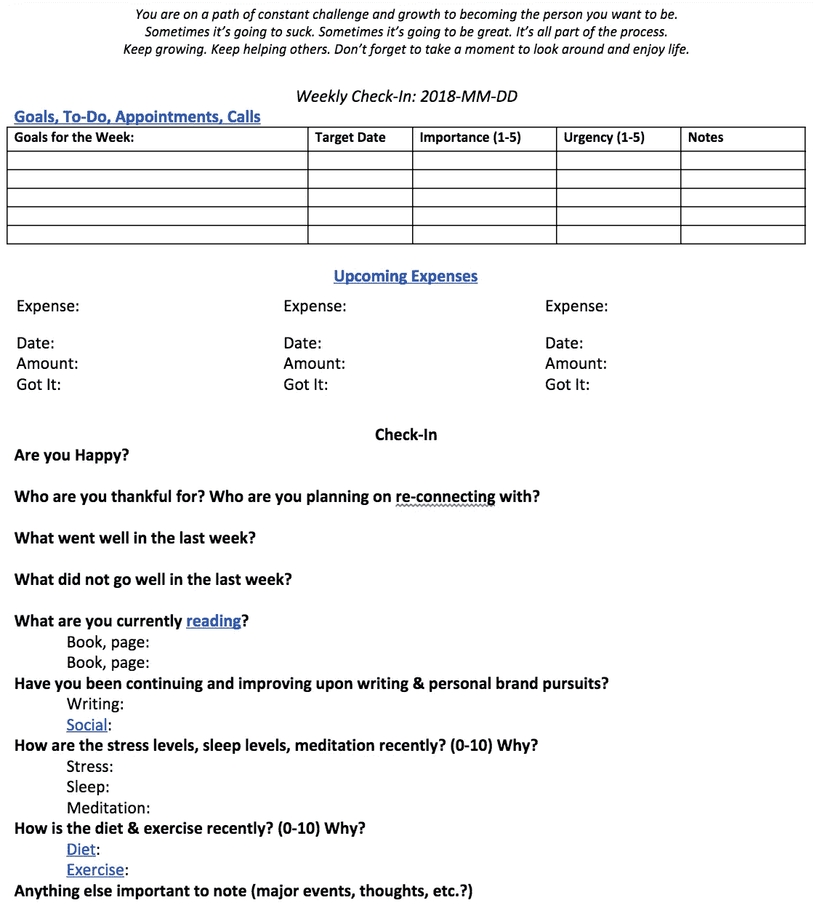
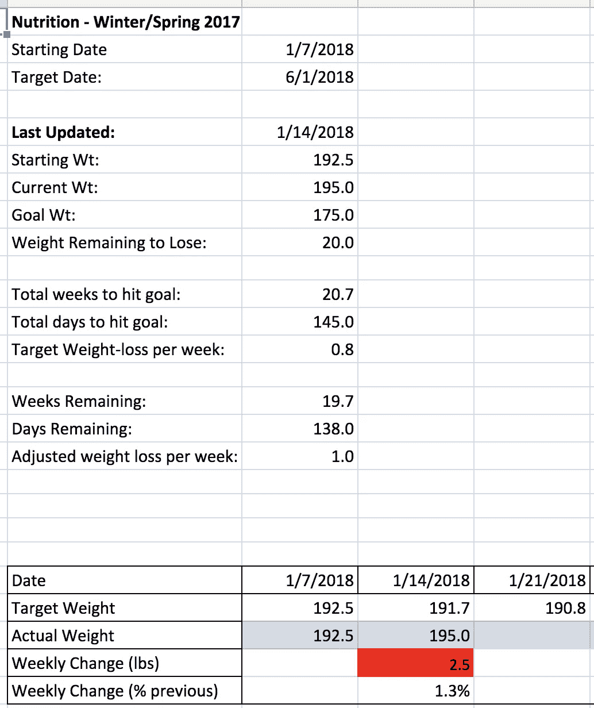

# 最重要的习惯是反思

> 原文：<https://medium.com/swlh/the-most-important-habit-is-reflection-e18b1eba7710>

## 不是冥想。不是运动。不是读书。反思。

假期里，我花了一些时间来回顾 2017 年。

> 今年我取得了哪些成功？
> 
> 我的失败是什么？
> 
> 2018 年我该如何调整？

这篇文章是关于这三者的，但是我的失败是最好的开始。

## 习惯培养失败

在整个 2017 年，我广泛关注习惯培养。我甚至贴出了我的习惯追踪应用程序的照片。有些周比其他周好，但一般来说，我每天都专注于改善行为变化。

Daily tracking & metrics drove me crazy. (not actually my stats)

不幸的是，过度关注跟踪、数据和度量以及习惯的养成是不健康的。我给自己太多压力去追求完美。当我错过一个习惯时，我自己的情绪压力超过了我从“平衡”的生活方式中获得的任何健康益处。

将健康的习惯消耗殆尽并不健康。 在试图在一份全职工作、一家初创公司和几段紧张的人际关系之上建立 5 个新习惯之后，我筋疲力尽了。我的习惯养成恶化了。

除了我个人的幸福要考虑之外，我不得不问:

> 如果习惯养成在压力下崩溃了，那它还有什么用？

## 长期变化

我后来意识到，我在 2017 年为自己做的最好的事情*(还远着呢)*是定期抽出时间反思。

不做。只是在反思。

由于我超级神经质，我不得不创建某种记录系统来组织我的思考。每个周日，唯一固定在我日程表上的事情就是每周检查:

I fill out this template every week, and it’s made me more consistent and generally happier as well.

这份单页的谷歌文档是一个概述，主要回答“上周怎么样，这周怎么样？”这是实用主义和个人主义的完美结合。

## 拦截和拦截

我开始关注我的个人待办事项和未来一周的账单——链接到我的 [Asana](https://app.asana.com/) 和 [Mint](https://www.mint.com/) 账户的网址。每周，我都会提前看看我的待办事项清单是什么样的，并复制一些信息到每周的检查中。移动数据的过程是确定优先级的一个很好的强制机制；我很懒，所以我尽量在给定的一周内减少“优先事项”的数量。当我去 Mint 的时候，我会确保我的交易被正确地记录和标记，我会检查我的预算以确保我没有超支。

# 个人的反思是奇迹发生的地方。

## 你开心吗？

最重要的是，我从问自己开始…“你快乐吗？”如何回答这个问题没有固定的标准，更多的是关于如何看待生活。当我连续太多次回答“不”的时候，那么是时候做出改变了。

如果我讨厌它，那么生活和养成这些好习惯又有什么意义呢？

## 你感谢谁？你打算和谁重归于好？

接下来，我优先考虑关系。

我不擅长与人交流。真的很糟糕。

当我变得忙碌、参与或紧张时，我会进入一个狭窄的视野。和我一起在隧道里的人会得到关注，而隧道外的人会被遗忘。承认这一点很糟糕，但这就是我。认识到这一点后，我把思考“你感谢谁”作为首要任务以及“你打算和谁重新联系？”结果令人震惊。我在与朋友和家人保持联系方面已经好多了，而且我经常承认他人在我生活中的重要性。

光是这颗子弹就确保了我维持了原本会恶化的关系。

## 上周发生了什么好事？上周什么事情不顺利？

同样，这一周还有两个更广泛的问题需要思考。

有一周，我写了一篇关于在芝加哥跑步的文章。我讨厌跑步，这是我书中的一个重大利好(不要评判！).

几个星期以来，我写了一些关于以不健康或无效的方式与他人争论的文章。其他几周，我写了关于看太多网飞的文章。

重点是让我自己说出积极和消极的一面。肯定有几个星期，我回头看，意识到…

> 没有。没有积极或消极的东西可写。

当这种情况发生时，我提醒自己每周都有积极或消极的事情发生。每周都有一课要学。“没事”表示我在巡航控制中，需要把头从沙子里抬起来。连续太多的“不”周意味着生命飞逝，我没有成长或者我没有注意。

## 你目前在读什么？

这里有两颗子弹…

> 书籍，第页:
> 
> 书籍，第页:

隐含的假设是我总是同时阅读多本书。虽然不总是正确的，但这是一个保持阅读的好提醒。在我本科期间，很容易因其他承诺和上课阅读而停止个人阅读。现在我完成了，我想确保它永远是我生活的一部分。

## **你在写&个人品牌追求的时候有没有继续和改进？**

这开始只是一个关于“写作”的问题，但后来已经扩展到我自己的个人品牌。在 2018 年，每个人都有一个个人品牌，我想确保我倾向于半频繁地挖掘。品牌是几十年建立起来的，所以从现在开始——即使很小——从长远来看会有帮助。继续写作的提醒确保了我半频繁地发帖，甚至在重大变化的时期。

## **最近压力水平、睡眠水平、冥想怎么样？(0–10)为什么？**

在这一部分，我给自己一个 1-10 分的快速评分，然后询问理由。

> 压力:
> 
> 睡眠:
> 
> 冥想:

这个列表让我对自己承受的压力保持诚实和深思熟虑，并提醒我要留心。我的一生都会充满压力，所以我最好建立一些适当的处理机制。在假期，我在这一部分增加了睡眠和冥想，因为我发现我在 2017 年没有足够重视它们。

## **最近饮食&运动怎么样？(0–10)为什么？**

This tracking sheet auto-updates as I gain/lose weight over the time period.

这一部分非常简单明了:我给自己的饮食习惯和日常锻炼再打一分。如果我一周有 4 次“平均”锻炼，我可能会给自己打 7 分。如果其中一项锻炼很棒，我会把它提高到 8 分。

饮食链接到一个跟踪表(左)，我用它来监控我的饮食。跟踪表会根据我当前的体重和目标自动更新“每周目标减肥量”。随着时间的推移，我将建立这一部分来评估我的饮食质量——即我是否持续摄入足够的水果、蔬菜和营养素？

## **其他需要注意的重要事情(重大事件、想法等)。？)**

这一部分尽可能的开放和宽泛。如果发生了重要的事情，我会在这里记录。写下来是一种宣泄，可以帮助我处理糟糕的事情，或者发生了很棒的事情，我想以后记住它。

顺便说一句，我预测当我最终挖掘这些文件并发现趋势时，会有一些有趣的发现值得探索。

> 这是什么？每当生活中发生重大事件时，杰克吃得更差，锻炼更少，但睡得更多？嗯…

# 为什么这是最重要的习惯？

这是我第一次真正保持健康的习惯。在过去的几年里，我会开始一个新的习惯(例如，一个更加坚持锻炼的新年决心)，并在短短几周内入睡。

当我开始做这个每周反思时，我的一致性显著地提高了*。我并不完美，但我正朝着正确的方向前进。这个模板快速、简单、全面。当在空中杂耍成吨的小球时，退后一步呼吸一秒钟是很好的。时间和开销相对很少，所以很少有理由错过每周一次的快速检查。*

## *下游习惯*

*请记住，上面描述的整个事情是一个 20 分钟的谷歌文档。这通常是我周日早上做的第一件事或周日晚上做的最后一件事，但它实际上并没有完成任何事情；它只是反映。*

*然而，从这 20 分钟的过程中，我想在接下来的 30 多年里培养生活中的所有其他事情。我问过很多人，尤其是成年人，“你希望自己在 22 岁时就知道什么？你希望自己早点开始做的事情是什么？我今天能做些什么让 55 岁的杰克欣赏呢？”*

*答案通常分为几类:*

*   *优先处理关系*
*   *节省你的钱。*
*   *注意你的健康。*
*   *活在当下。*
*   *不要太担心。*

*还有很多其他的答案，但是我发现我的每周检查模板把它们都击中了。通过不断地问自己上面的问题，我会一路留意所有这些建议。这种低压力、低开销的模板帮助我回到健身房，读更多的书，并在持续的基础上与朋友保持联系。所有这些习惯都与一个更大的反思习惯联系在一起。*

## *一致性*

*有很多很多周，我在个人习惯上犯了错误。有几周，我对提示的回答是“绝对不行”。我快淹死了，抽不出时间去健身房/写作/阅读。”这没关系。最终，我还是回来了。*

*我最终回来了，因为我一年中只错过了 9 次每周检查。那就是 43/52 周！总的来说，我变得比以往任何时候都更加稳定。*

*开始时，我的目标是在一致性、严谨性和灵活性之间找到平衡。有几个星期，我没有击中一切。实际上，我会说我很少做到清单上的每一件事。然而，填写这个模板对我来说是正确的平衡，它使世界变得不同。*

## *你后脑勺的那个小红灯*

*在假期中，我意识到我每天经历的焦虑大多来自于“我没有做我应该做的事情”的感觉这种感觉的产生部分是因为我甚至不知道我“应该”做什么。对我来说，这创造了“你后脑勺的那盏小红灯。”当我假期休息时，我意识到我“应该做”的许多事情都是人为创造的——是我自己创造的。它们不是“不成功便成仁”，而是“不成功便成仁”*

*我“应该做”的许多事情——比如健康、人际关系等等。—已经记录在我的每周检查中了。基本上，如果我在我的模板上保留要点，几乎所有其他的事情都会自己解决。*

## *展望未来:优化和迭代*

*我的每周检查也是一种优化例行程序的强制机制，这种机制比手动更好地自动化和验证。例如，当我去年一月开始这样做的时候，我手动支付账单。通过创建一个迫使我手动评估的每周检查，它鼓励我设置自动支付。现在，我核实账单是否按时支付，并提前查看有未付款的账单。似乎很明显，对吧？这是显而易见的，但是每周的烦恼促使我寻找更好的方式来自动化我生活的一部分。*

*通过创建这个模板，我也为将来的迭代创建了一个框架。到了 2017 年底，我在模板中加入了睡眠、冥想、个人品牌建设。如果我想优先考虑我生活的其他方面——也许是我未来的孩子，或者绘画，或者旅行——我可以将它们添加到我的模板中。*

## *最后的想法*

*模板顶部的提醒很有帮助。我经常听到人们回顾生活中的艰难时刻并反思:“我什么都不会改变。尽管有负面影响，但它让我成为了现在的我。”为什么不在当下欣赏这种智慧呢？为什么这是二十年后的教训？这个提醒帮助我正确看待生活，尤其是当我感到不知所措的时候。*

> *为了成为你想成为的人，你走在一条不断挑战和成长的道路上。*
> 
> *有时候会很糟糕。有时候会很棒。这都是过程的一部分。*
> 
> *继续成长。不断帮助别人。别忘了花点时间四处看看，享受生活。*

*你觉得我每周反思的习惯怎么样？你有类似的东西吗？我错过了什么？你在每周的反思中加入了什么？我一直在寻求学习和与他人分享，所以请伸出手来！*

**

## *这篇文章发表在[《创业](https://medium.com/swlh)》上，这是 Medium 最大的创业刊物，有 292，582+人关注。*

## *订阅接收[我们的头条新闻](http://growthsupply.com/the-startup-newsletter/)。*

**