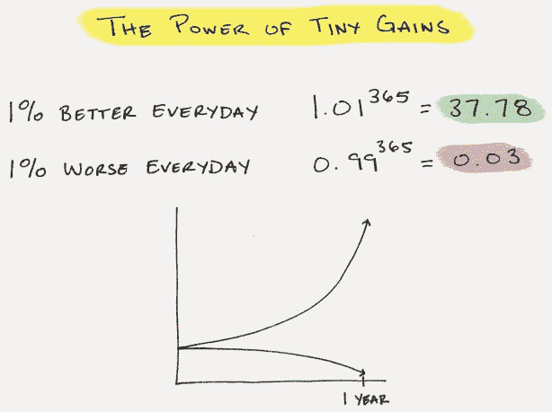
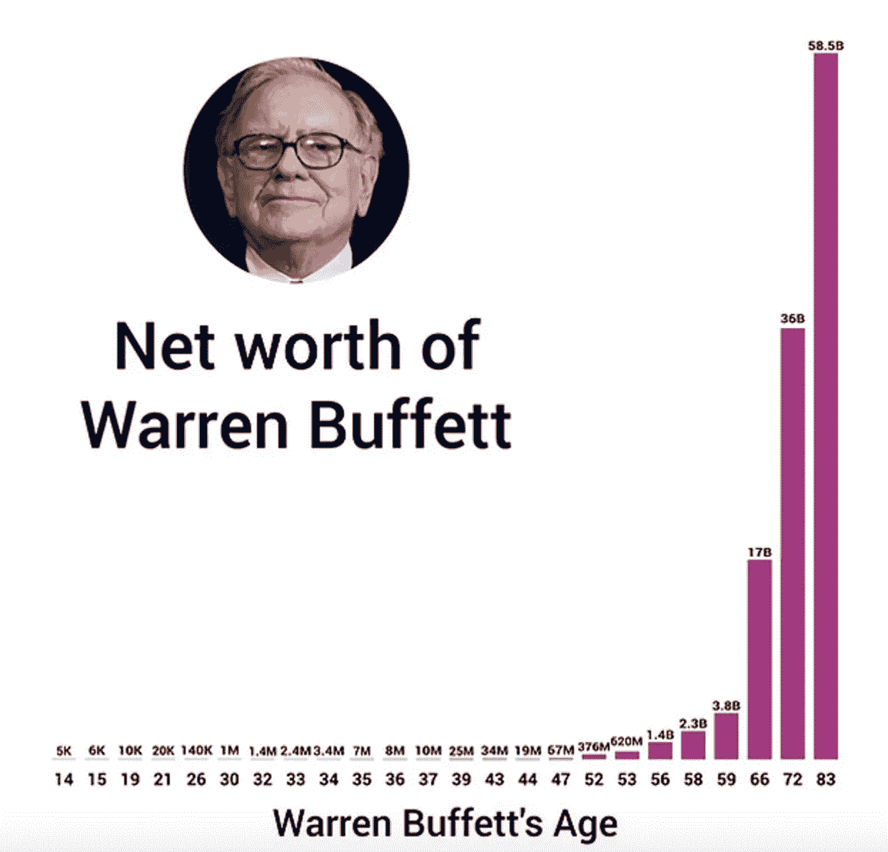

# 生活中最重要的想法

> 原文：<https://medium.com/swlh/the-most-important-idea-in-life-8df67ce7894b>

Photo by [Joshua Earle](https://unsplash.com/photos/-87JyMb9ZfU?utm_source=unsplash&utm_medium=referral&utm_content=creditCopyText) on [Unsplash](https://unsplash.com/?utm_source=unsplash&utm_medium=referral&utm_content=creditCopyText)

爱因斯坦称它为世界第八大奇迹。

**这里有一个简单的事实:**

如果某样东西一天改善 1%，一年后就会好 37 倍。

***那叫复利。***

你觉得每天能好 1%吗？

Source: Jamesclear.com

复利可以适用于你想要的任何东西。

你可以用它来实现你的任何愿望。

复合就是每天变得更聪明、更富有、更快乐的行为。

当你试图实现某个目标时，只有三件事很重要:

1.  你每天、每周、每月有多接近？
2.  你有多少时间？
3.  你从哪里开始？

这就是复合的全部。

**您的问题是:**

> 你一直在做什么，你在朝什么方向前进？

**我发现生活中，最强大的方程式是:**

> **持续重复的动作+时间=不可征服的结果**

**成功人士将复利运用到三个最重要的领域:**

1.  变聪明
2.  变得快乐
3.  致富

# 变聪明:

试着每天只聪明 1%上床睡觉。随着时间的推移，这些小增量累积起来。在你意识到之前，你会成为世界上前 5%的人。

学习遵循一个简单的模式:

种植→培育→收获

是需要时间的培养。这是每天 1%的收入。

每天要做的五件事:

1.  试着和一个比你聪明的人说话。
2.  读 25 页的书——最好是 10 年以上的书。
3.  做一些你多年来害怕做的事情。
4.  教某人你知道的东西。
5.  每天读一份报纸——是的，它们仍然有用。

# 变得快乐:

幸福是一种精神状态，有两个关键组成部分，你相信什么和你和谁在一起。

你的信念决定了你是谁，以及你的行为方式。将它们复合是很关键的。他们将决定你的行动。

关系，就像学习一样是指数增长的。正确的人和关系会成倍地改善你的生活。

**每天必做的十件事:**

1.  每天早上，写下三件你感激的事情。醒来的时候要感恩。关注你所拥有的一切。
2.  每天花两分钟写下你在过去 24 小时内的一次积极经历。
3.  冥想你的呼吸 2 分钟。深呼吸，保持安静。
4.  每天随机做一件好事。
5.  每天锻炼十五分钟。
6.  联系一个几个月没联系的朋友——安排一个时间打电话
7.  试着每天和一个陌生人交谈——即使只有 5 个单词。
8.  介绍两个你认识的人，他们希望彼此认识
9.  安排一次早餐、午餐或饮料，和一个比你更聪明或更有权力的人，你很想向他学习
10.  每天找一个小方法与他人分享你的经验和知识

# 致富:

当涉及到金钱和你的财富时，你不能过早地从复利的力量开始。

看看它为沃伦·巴菲特做了什么。

这张图表的神奇之处不在于巴菲特在任何时候的价值。

号码

> 这个图表的强大之处在于，由于复利，巴菲特 93%以上的财富都是在他 60 岁以后建立的！

想象一下。

**这意味着对你来说，你 99%的财富还在你前面。**

你现在拥有什么并不重要。重要的是你开始。开始吧。

**这里有一些简单的数学:**

> 如果你每月只存 200 美元，以 5%的利率存 30 年，最终你会有超过 167，000 美元

这对于每月 200 美元来说还不错(使用这个[计算器](http://www.moneychimp.com/calculator/compound_interest_calculator.htm)来尝试其他选择)

**五件简单的事情开始:**

1.  开一个储蓄或投资账户。
2.  不管你挣多少，开始把 10-15%的工资存起来。
3.  检查一下你的月支出，找出 100 美元来削减。
4.  每年看四本关于投资的书。
5.  每个月找一个方法来增加你的收入:协商加薪，承担更多的责任，开始兼职或者找一份薪水更高的工作…

> 复利是一个强大的概念。不要限制。

**从今天开始，你打算对什么应用复利？**

**无论如何，你都承诺要改变生活中的什么？**

## 这个故事发表在 [The Startup](https://medium.com/swlh) 上，这是 Medium 最大的企业家出版物，拥有 284，454+人。

## 在这里订阅接收[我们的头条新闻](http://growthsupply.com/the-startup-newsletter/)。

