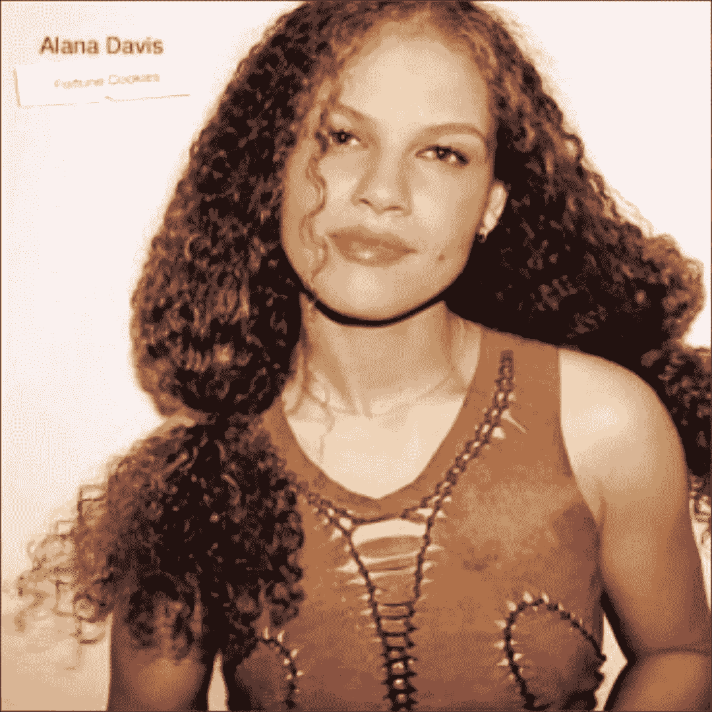

# “我们要记住的最重要的事情是，我们已经和阿拉娜·戴维斯一起做到了完美”

> 原文：<https://medium.com/swlh/the-most-important-thing-for-us-to-remember-in-order-to-thrive-is-that-we-are-already-perfect-b939e70b6116>

> …我认为，为了茁壮成长，我们要记住的最重要的事情是，我们已经是完美的了。没有成功，没有目标，没有任何在此时此刻之外可以获得或创造的东西会让我们比今天更好。我们是一体的。这个想法让我茁壮成长，因为它的力量。

> 我有幸采访了 Alana Davis，她是一位创作型歌手和曼哈顿本地人，曾在华纳/埃莱克特拉、协和音乐集团/Telarc 和最近的埃及艳后唱片公司发行过专辑。除了凭借歌曲《32 种口味》登上公告牌排行榜前 40 名之外，Alana 还与 Jay-Z、法瑞尔·威廉姆斯、舞韵合唱团的 Dave Stewart 和卡基·金合作过。她的最新专辑《再爱》于 5 月发行，她将于今年秋天开始东海岸城市酒庄之旅。

非常感谢你加入我们！你能告诉我们是什么让你走上这条职业道路的吗？

D AVIS:嗯，事实证明，我从来没有想过成为一名歌手，或者乐队的主唱。我想成为贝斯手。我试图在高中组建乐队，但当时没有人想玩雷鬼和朋克摇滚(谁知道为什么？！)，或者就是不想和我玩:(所以最后我一个人玩了很多次，差不多一直都是。最终我意识到听到更多的色彩可能会很有趣，所以我用我的皮革飞行员夹克换了一把木吉他。这是一个霓虹灯粉红色的声学尖，重金属车头，这是非常拉德。我想我在那个时期开始寻找我的道路、声音和歌曲。

**你能分享一下你音乐生涯中遇到的最有趣的故事吗？**

戴维斯:我觉得有意思的是，有些流行明星是我的粉丝。这些年来，我遇到过一些人，他们告诉我，我对他们来说是鼓舞人心的，有趣的……当凯蒂·佩里说她和她的朋友们想在唱歌时成为阿拉娜·戴维斯时，我有点震惊，因为我根本没想到我会在他们的关注范围之内..我来自爵士乐的发源地，根本不是流行音乐。

你现在从事的最有趣或最令人兴奋的项目是什么？

戴维斯:我一直在创作新的素材。我刚刚发行了十多年来的第一张专辑，能和想念我的人联系上感觉太棒了。我有一些很酷的合作进入下一个项目，我还不能说是谁，抱歉！你得把它捡起来！

你接触过的最有趣的人是谁？那是什么感觉？你有什么故事吗？

戴维斯:特里萨修女是我成长过程中的朋友。她搬进了格林威治村华盛顿街我家隔壁的大楼，第一个照顾那些被诊断出患有艾滋病的人，而在那个时期，医生们害怕接触他们，害怕与这种新疾病有任何形式的接触。我几乎每天都会不经意地看到她…很难描述那段关系对我来说是多么独特和特别，但也许你可以想象。她是独一无二的。

历史上哪些人对你的启发最大？为什么？

戴维斯:我不得不说我受到了先驱者的鼓舞。我喜欢人类面对逆境并创造奇迹的时候。你知道，我们有能力做到这一点。

**你是如何用你的成功为世界带来益处的？**

戴维斯:这很难。我没有一个基金会或任何东西，我不捐钱给慈善机构，虽然我经常很乐意贡献我的时间。我救助了数百只动物，对它们进行了绝育手术，并把它们安置在永久的家园里。奉献时间比金钱更符合我的风格，因为我觉得金钱更有价值。我也用我的双手在大自然和泥土中工作。我已经用低生长、可持续的食物/药物植物取代了一些无用的绿草地…如果我不是音乐家，那就是地球和动物…毕竟我是金牛座，哈哈！除了我写的音乐，这是我与每个人的灵魂联系的延伸，我不太关注团体，我更多的是关于个人，在听众和歌曲之间，有对我们所有人的治疗。这是我的作品。

**你是一个很有影响力的人。如果你能发起一场运动，为最多的人带来最多的好处，那会是什么？你永远不知道你的想法会引发什么。:-)**

戴维斯:我会在任何地方种植桉树，只要它们能生长。这种水果有有毒的恶名，但它不是。这是一种完美的食物，富含天然脂肪、糖和营养物质…对素食者来说比豆腐健康得多，是一种天然食物，而不是加工食品！如果在我们的星球上有足够多的植物生长，没有人会挨饿。(你好，非洲妈妈，我在和你说话！)

**你会向你所在行业的同事推荐哪些建议来帮助他们发展壮大，而不是“筋疲力尽”？**

戴维斯:我认为，为了茁壮成长，我们要记住的最重要的事情是，我们已经很完美了。没有成功，没有目标，没有任何在此时此刻之外可以获得或创造的东西会让我们比今天更好。我们是一体的。这个想法让我茁壮成长，因为它的力量。

**你的“刚开始工作时希望有人告诉我的 5 件事”是什么，为什么。请为每个人分享一个故事或例子。**

戴维斯:五件事？嗯嗯…

1.  不要为了写作而写作。很多歌曲作者会告诉你，你必须一直写作，才能偶然发现一首好歌。就我个人而言，我认为最好是当你感觉到一些具体的事情，心中有一个具体的问题或议题时再写。当你为了写作而写作的时候，我相信这会让你的写作保持在一个更基础的水平上，并且会让你更难达到真正深刻的东西，而当你在失落或悲伤的时候写作，在任何积极或消极的方面充满激情的时候，那就是净化和魔法可以存在的时候。
2.  不要跟随行业趋势。音乐行业的事情总是在变化，如果你不断试图改变，你将没有任何基础。潮流跟随音乐，而不是相反，你呢？
3.  请假。当你没有新的体验时，很难写出新的音乐。我指的是真实世界的经历，不是音乐行业。和真诚的人一起过真诚的生活，你会一直受到鼓舞。
4.  不要和乐队成员睡觉。很容易感觉到这种联系并被诱惑，但这是一条我没有越过的线，我看到它对一位女艺术家造成了巨大的误解和破坏。简单地说:一旦他们达到顶峰，你就不能告诉他们没有。如果失去了尊重，一切都没了。
5.  留住你真正的朋友。在音乐界有很多奉承，尤其是当你获得成功的时候。但是不要相信炒作。所有的奉承来来去去，如果你不知道谁是你的朋友，你会被生吞活剥。保留旧的，谨慎对待新的。

我有幸采访并接触了一些商界、风投基金、体育界和娱乐界的大腕。在这个世界上，或者在美国，有没有一个人是你愿意与之共进私人早餐或午餐的，为什么？他或她可能会看到这一点，特别是如果我们标记他们:-)

戴维斯:斯蒂维·旺德。他和我父亲是很好的朋友，曾经一起分享一个钢琴凳，一起弹奏那些该死的琴键！我只是从我母亲那里听说过这件事，我从来没有机会见到他，告诉他他不仅是我父亲生活中的重要力量，也是我生活中的重要力量。直到今天，我心目中的完美歌曲，基本上是由他创作的。在我成长的过程中，在我的房子里没有其他的艺术家像我这样旋转。

**我们的读者如何在社交媒体上关注你？**

【https://www.facebook.com/AlanaDavis/】[脸书](https://www.facebook.com/AlanaDavis/)

**insta gram:**@ alanadavissmusic

## 这篇文章发表在 [The Startup](https://medium.com/swlh) 上，这是 Medium 最大的创业刊物，拥有+ 373，446 名读者。

## 在这里订阅接收[我们的头条新闻](http://growthsupply.com/the-startup-newsletter/)。

