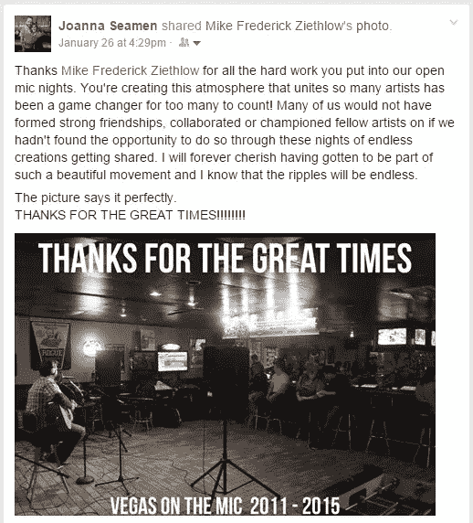

# 在主持了 300 场公开麦克风之夜后，我学到的关于文化的最重要的事情

> 原文：<https://medium.com/swlh/the-most-important-thing-i-learned-about-culture-after-hosting-300-open-mic-nights-b8f0a9420a76>

我有段时间过得很奇怪。

我会在晚上醒来，去酒吧，设置一个开放的麦克风，然后主持一个狂野和受欢迎的活动，往往会狂欢到凌晨。

It’s 4am in Las Vegas, show’s over, time for shots.

用我没有杀死的脑细胞，我了解了很多关于我自己，经营一家企业，以及这些年来与我互动的 5000+艺术家。

我学到的最重要的事情:**你想在你的组织中灌输的每一寸积极的文化都必须用野蛮的凶残去争取。**

每一件小事都是一场战斗，让人们展现出最好的一面。

不是说人不好。这是因为人们认为他们知道什么对其他人最好，并会争夺对他们的控制权。因此，如果你是你的文化之船的船长，无论其他人想去哪里，你都必须驾驶这艘船。如果你在乎坚持一种特定的文化价值观，你最好绘制一条路线，握紧方向盘，与那些将你拉离正轨的力量作斗争，朝着你的目标径直前进。

文化必须是一个单一的愿景，自上而下授权。

# 你的阳光委员会完蛋了

如果你的公司有一个微笑巡逻队或阳光委员会，你可能会处于不利地位。不干涉的经理可能想做些事情来提高他们办公室的士气，所以他们任命一些人组成一个文化委员会。但是一个软弱无力的“让我们做有趣的事情”俱乐部实际上只会让事情变得更糟。从广义上讲，文化价值观是人们为之自相残杀的东西。如果办公室里有文化冲突，你认为一个蛋糕或相配的 t 恤是正确的回应吗？

The team trying to come to a consensus.

来自[哈佛商业评论](https://hbr.org/2002/07/make-your-values-mean-something):

> 许多高管在决定实施价值观倡议后做的第一件事是什么？他们将工作交给人力资源部门，人力资源部门将该计划作为包容性良好工作的借口。为了让员工参与进来，人力资源部门展开了员工调查，并举行了许多城镇会议来收集意见和建立共识。这恰恰是错误的方法。价值观倡议与建立共识毫无关系——它们是关于将一套基本的、战略上合理的信念强加给一大群人。

哇哦。“将一套基本的、战略上合理的信仰强加给一大群人”听起来非常冷酷，如果不是独裁的话。哈佛的这些人知道他们在说什么吗？是不是蛋糕会更好？

# 被扔进了停车场

你认为一个开放的话筒应该有多少规则？

一把？一打？用 10 号字体写满 2 页怎么样？

我们在所有的桌子上都有一个两页的小册子，在网站上有一个版本，还有一个要求你签名的签到表，声明你已经阅读了规则。如果你不识字，我会给你读规则——没问题，没有问题。我们还在舞台旁边的墙上贴了一张 4 英尺长的规则海报。如果你违反了规则，我会关掉你的麦克风，播放室内音乐。如果你想发脾气，并为此进行肢体斗争(很少，但它发生了)，你会被扔进停车场，警察也会被叫来。

虽然听起来很刺耳，但这是影响积极变化所需要的力量。

我们管理严格，旨在为每个愿意遵守规则并成为我们文化一部分的人提供出色的体验。

The right values attract the right people.

你的文化委员会对“关掉麦克风”或“把那些与文化冲突的人扔进停车场”的类比是什么？除非得到上级的直接授权，否则你根本无法解决你发现的任何实际问题。

例如，如果你有一种文化价值观，而有人拒绝在其中行动，没有蛋糕可以解决这个问题。任何没有公司最后手段(解雇员工)支持的干预最终都是无效的——员工知道他们没有必要听你的。

我不是说阳光委员会应该有能力解雇公司里的任何人。我的意思是，当人们在文化期望中失败时，他们应该像在工作期望中失败一样被对待。

所以既然我们在这里谈论人们的工作…

# 首先，问问你是否应该关心文化

当然，书上说你应该。成功的首席执行官说你应该这样做。但是让我们坦诚相待。你的企业可能会在一段时间内赚一些钱，然后就不复存在了——就像所有的企业一样。

因此，你可能只是希望它足够稳定，让人们能够相处，让一些人能够维持一段时间的生计，仅此而已。在这种情况下，**正确的做法是甚至不去理会文化**。

像[谢家华](https://en.wikipedia.org/wiki/Delivering_Happiness)或[克里斯·鲁弗](http://www.self-managementinstitute.org/about/people/1435)这样的领导需要付出很多努力和痛苦。

《哈佛商业评论》[又一次赤裸裸地展示了这一点:](https://hbr.org/2002/07/make-your-values-mean-something)

> 提出强大的价值观——并坚持这些价值观——需要真正的勇气。事实上，一个考虑价值观倡议的组织必须首先接受这样一个事实，即当正确实践时，价值观会带来痛苦。他们让一些员工觉得自己被抛弃了。它们限制了组织的战略和运营自由，并约束了员工的行为。他们让高管们因为哪怕是很小的违规行为而受到严厉的批评。他们需要时刻保持警惕。

HBR 总结道，“如果你不愿意接受真正的价值观带来的痛苦，就不要费心去制定一份价值观声明。”

# 如果你在乎，就做好痛苦的准备

我告诉自己我在乎。我首先想创造一个平等对待每个人的东西。平等的文化价值观意味着什么？以下是开放麦克风之夜的一些例子:

*   这意味着给每个人一个机会，不管他们有多坏。(一位无家可归的绅士路过酒吧，看到我们在做什么，就问能不能在台上吹口哨吹个曲子。他当然可以！)
*   这意味着如果有人超过时限，就关掉他的麦克风。
*   这意味着被称为种族主义者、性别歧视者和书中的所有其他人，因为你平等地执行规则，而没有给一些人他们认为他们应该得到的通行证。
*   这意味着当你的朋友越轨时，你要斥责他们。
*   意思是当那些对你恨之入骨的人的行为符合文化价值观的时候，要表扬他们。
*   这意味着没有人是特别的——我们可以在房子里有一个真正的明星，但他们必须像其他人一样等待轮到他们，呆在他们的时间段。([扎克·加利费安纳基斯](http://www.imdb.com/name/nm0302108/)来到我们的开麦。他没有逗留足够长的时间去表演。)

> 当正确实践时，价值观会带来痛苦。

如果我们放弃价值观，通常是为了避免他们的痛苦或者为了短期利益。如果你试图在强大的文化基础上建立一个组织，这两个答案都是错误的。

如果我早点让扎克·加利费安纳基斯上台，或者不让专业的吹口哨者里基用他 10 分钟的即兴唇齿表演来娱乐我们，我可能会在一个晚上给酒吧带来更多的销售。但如果我在这些情况下让步，我将失去社区对我平等对待每个人的信任。

本着平等的文化价值观，我努力让每个人都感到有能力站到麦克风前。

# 你为什么关心文化？

不好的答案看起来像:

*   降低员工工资，但让他们开心，这样他们就不会介意了。
*   因为这本书说我需要。
*   我希望每个人都开心。

唯一的好答案是:

*   我相信这种价值观会给公司带来实实在在的好处，我愿意誓死创造一种培养这种价值观的文化，淘汰那些不符合这种价值观的人。

“我希望每个人都快乐”听起来是件好事。但是你可能会有一些员工不认同组织的使命，可能会积极参与搞砸。如果他们高兴，公司实际上正在受损。

# 文化与政治

文化是艰难的、痛苦的、分裂的，缺乏强有力的文化价值强制导致“政治化”的工作场所，充满了暗箭伤人、指责游戏和旁门左道。

> 政治行为几乎总是从首席执行官开始。可悲的是，你不必政治化就能在你的组织中创造极端的政治行为。事实上，通常是最不关心政治的首席执行官管理着最激烈的政治组织。不关心政治的首席执行官经常——也偶然——鼓励激烈的政治行为。本·霍洛维茨

设定公司的价值观，并在前进的道路上奋力捍卫这些价值观，需要强大、独特的领导力。如果这是一位首席执行官想要在没有真正支持的情况下通过的东西，它肯定会失败。你不能置身事外，不关心政治，而成为一个价值观驱动的组织。管理一个由不可动摇的文化价值观驱动的团队需要每天亲自培育、纠正和修剪，以确保它能够生存下去。

# 300 个晚上的课程

这是我在 300 个开放式麦克风之夜中学到的。我犯了错误。我帮了一些人的忙(为了短期利益),结果却看到整个社区的信任在长期内被侵蚀。

转向基于价值观的经营并不容易。当我决定无论如何都坚持自己的观点时，我失去了友谊，因为我不会放过我的朋友。当我像个傻瓜一样严格遵守规定时，人们怒气冲冲地走出了大楼。

但这项业务确实因其价值而增长。我可以证明它是有效的。我也可以证明这很难，而且如果你考虑长远的话，这可能是值得的。

I gave every artist the same attention and setup speech every time.

组织文化不应该被归入一个次要的项目或者一个无关紧要的委员会。如果一家公司选择以文化价值观为指导，这些价值观需要被灌输自上而下的权威，并成为真正的优先事项。最终，他们需要“持续的警惕”——每天都要为之疯狂地战斗。

## 这个故事发表在[的创业](https://medium.com/swlh)上，这是 Medium 最大的创业刊物，有 317，238+人关注。

## 订阅接收[我们的头条新闻](http://growthsupply.com/the-startup-newsletter/)。

