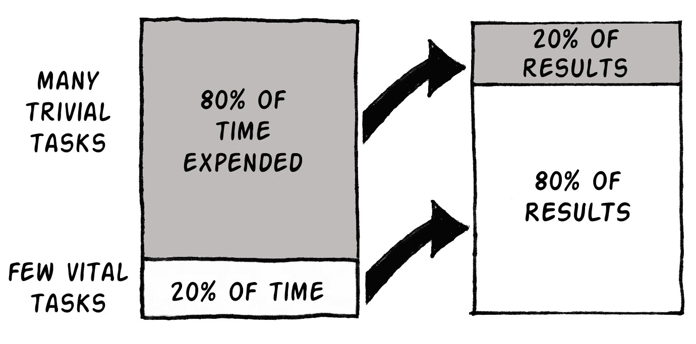
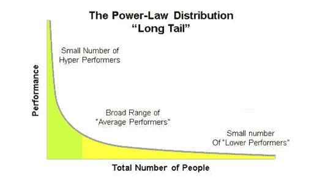

# 世界上最珍贵的东西

> 原文：<https://medium.com/swlh/the-most-precious-thing-in-the-world-6a3313c16fb2>

只有一件事我们不能做得更好。

这是你和亿万富翁的一个共同点。

**时间。**

没有人拥有足够的爱，它总是离我们而去。

我个人在二三十岁的时候浪费了很多时间做各种乱七八糟的事情。

**我只是忙着忙着。**

直到我 40 岁，我才意识到关于时间的几件大事。

允许我创造更多的秘密，更好地使用它，利用它实现我的目标。

# 秘密是这样的:

大多数事情并不重要。

我再说一遍:**大多数事情都无所谓**

在你做的任何事情中，可能有 20%是有意义的。

那 20%的人要对所有的结果负责。

生活的秘密是在你做的任何事情中找到关键的 20%。

专注并执行好关键的 20%。

**完全无视其余。这是关键。**

那是你创造的时间。

Source: Lifehack.org

对大部分结果负责的那至关重要的 20%也被称为帕累托定律，以一位在 19 世纪晚期发现它的古代意大利经济学家的名字命名。

法律基本上说:

20%的工作导致 80%的结果。

20%的人拥有 80%的资产。

20%的工人做了 80%的工作。

这也被称为幂律分布。

**如果你想成为世界上为数不多的超级执行者，你需要专注于那强大的 20%,那会带来巨大的成果。**

这个想法对你如何生活和如何安排你的一天至关重要，因为我们大多数人都关注 80%的结果，但它只给我们带来 20%的结果。

**比如:**

1.  参加毫无意义的会议
2.  检查和回复不必要的电子邮件
3.  非常高效地做无效的事情

如果我们能专注于关键的 20%会怎么样？

那时我们的生活会是什么样子。

想象一下你会有多少时间去做那些重要的事情。

关键的事情，那些能改变你的事情。

下面是我如何在生活中最重要的领域使用这关键的 20%。

# 使用秘密来:

1.  变聪明
2.  开心起来
3.  发家致富

# 变聪明:

在你学习的任何事物中，确定核心思想、核心主题和构建模块。

然后围绕这个建立你的心智模型。

看看埃隆·马斯克，在这里谈论第一原则的力量:

**每天要做的三件简单的事情:**

1.  当了解一项新的投资或业务时——询问这项业务或投资成功的核心假设是什么。关注那些。
2.  当学习一门新的学科时——问我想学的学科的核心书籍是什么。读那些。
3.  我可以就这项投资、业务或机会与哪些关键人物交谈。跟他们说话。

# 变得快乐:

很容易找到很多事情做。

总有更多的事情你可以去做，去阅读，去看，去工作，去和人聊天。

通常没有足够的时间让你处理好你计划要做的每一件事。

不知不觉中，几周、几个月、几年过去了，你却一事无成。

**前进是人生的关键。人类生来就是为了前进和成长。**

当我们发现我们没有成长，没有进步，我们开始关闭。变得抑郁。

**三种利用 80/20 时间的方法&每天从时间中获得更多:**

1.  对你想要实现的一年或五年的大目标有一个想法，然后把这些目标变成一个系统。一个能让你系统地[实现任何你想要的](/swlh/will-power-doesnt-work-here-s-how-to-actually-get-stuff-done-3532dc10c732)的系统。
2.  对你每个月、每个星期想要完成的关键事情有一个想法。在你开始工作之前，把这些都冲掉，并安排在你的日程表上。**这是必须的**。
3.  精力最充沛的时候做最难的工作，累的时候做最容易的工作。我试着每天只关注 3-4 件大事。

来源:泰勒·皮尔森

# 致富:

说到投资，幂定律更为普遍。

这就是彼得·泰尔的书《从零到一》的全部内容。

**你投资的大部分东西，都不会有关系。**

一两项关键投资将会让一切变得不同。

**如果投资真的是基于幂律，你需要:**

1.  像企业家一样思考——去寻找新的机会。找到不好的，找到坏的。看看你如何成为解决方案。寻求竞争小的东西。寻求垄断，无论是本地的还是全球的。
2.  熟知你的领域——不要试图成为每件事的专家。了解你的优势并专注于此。就连巴菲特也在下面谈到了他的能力圈。
3.  忽略你听到的 80%的事情——忽略 80%的新闻，对人们向你提出的 80%的想法说“不”。这个世界是用来分散你的注意力，偷走你的注意力的。不要让它。

一旦你发现 20%的想法、行动和人给了你 80%的结果，加倍努力。

然后每天坚持这样做。

分享你的 20%——你做了什么来获得超大的结果？

# 你准备好更进一步了吗？

我们是一群致力于帮助下一代的金融老手。我在华尔街学到的是让你更聪明、更富有、更快乐。[注册](http://www.wilowallstreet.com)获取我们关于任何工作的网络电子书，并获得我们每周的 VIP 电子邮件。

## 这篇文章发表在[《创业](https://medium.com/swlh)》上，这是 Medium 最大的创业刊物，有 295，232+人关注。

## 在这里订阅接收[我们的头条新闻](http://growthsupply.com/the-startup-newsletter/)。

