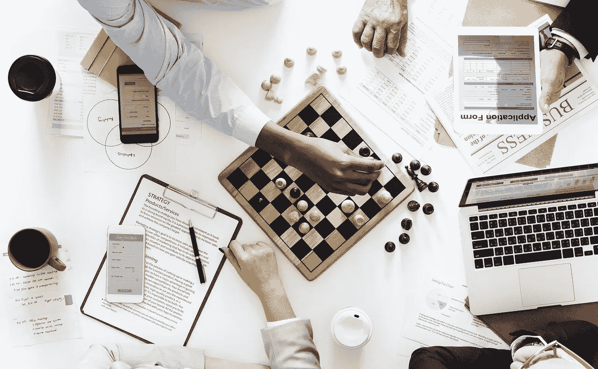

# 最适合我们生活的现实的策略

> 原文：<https://medium.com/swlh/the-most-suitable-strategy-for-the-reality-that-we-are-living-in-721937b7b6cf>

[rawpixel/pixabay](https://pixabay.com/en/business-computer-woman-office-3192205/)

一篇博文的目的是什么？

*   是为了定罪吗？
*   是告诉你该做什么吗？
*   是给你提供新的选择，让你来决定吗？
*   是用正反两面来讨论一个想法吗？
*   是为了展开讨论以获得读者更多的投入吗？

有时候，当我开始写博客时，我对主题没有明确的信念。我想讨论它的不同方面。我想写下支持和反对双方的论点。希望在博文最后得出结论。

有时候，有可能在博文的最后得出结论。有时候，并不是这样。如果不是，我向读者征求他们的意见。有时候，我会保留这个问题。

我一直在寻找答案。我进行实验，观察不同的选择来得出结论。我把写博客作为一种工具来达到头脑清晰。

我不认为自己是无所不知的专家。我在这里提出新的想法，讨论它们，并试图得出一些结论。如果我不能成功，我会和我的读者展开讨论，或者在我的生活中尝试这些想法。

我相信这是一种更好的对待生活的方式，而不是妄下结论并根据这些结论采取行动。

> ***下结论是人的天性。不确定的感觉不好。***

过早下结论和有坚定的信念是危险的。

我们生活在一个混乱的现实中。

九年前，当比特币还不到 1 美分时，谁会想到它会涨到 2 万美元？谁会想到比特币会在两个月内贬值 70%，从 2 万美元跌至 6 万美元？

在市场最高涨的时候，我写了一些关于[80%修正的可能性](https://ideavisionaction.com/investment/before-you-invest-all-of-your-savings-in-bitcoin/)和[不要对此过于热情](https://ideavisionaction.com/investment/7-tips-for-a-first-time-bitcoin-investor/)的帖子。不是因为我确信它会损失 70%的价值，而是因为我知道可能性是存在的。

如果我能确定，我会卖空比特币。不是我做的。那样做肯定是危险的。

> ***过早下结论并有坚定的信念是危险的。现实比这更复杂。它随时都可能改变。***

拥有坚定的信念并全力以赴是有风险的。考虑到不同结果的可能性并采取相应的行动是更安全的策略。

**结论**

保持开放的心态需要很大的努力。妄下结论和坚定信念很容易，但也很危险。

保持开放的心态，接受相反选择的可能性是很难的。然而，这一战略是最适合我们生活的现实的战略。

> ***目标不是了解一切。那是一个不可能的目标。目标是想出一个在这两种情况下都有效的策略。***

*阅读下一篇:* [*心智清明实验*](https://ideavisionaction.com/personal-development/mental-clarity-experiment/) *或报名参加* [*每周简讯*](https://ideavisionaction.com/email-newsletter/) *。*

## 这个故事发表在 [The Startup](https://medium.com/swlh) 上，这是 Medium 最大的创业刊物，拥有 303，461+人关注。

## 在这里订阅接收[我们的头条新闻](http://growthsupply.com/the-startup-newsletter/)。

