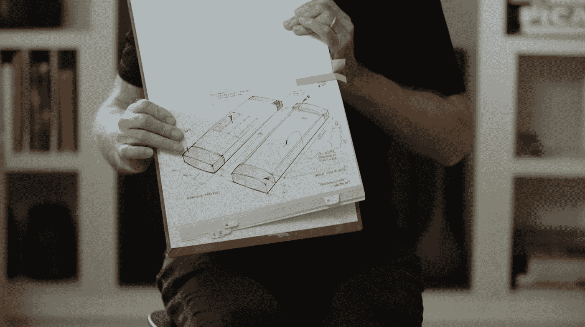

# 对科技创业公司最有价值的一课

> 原文：<https://medium.com/swlh/the-most-valuable-lesson-to-tech-startups-64dc33b3dd2a>

9 月 7 日，爱沙尼亚的塔林将会发生不寻常的事情。超过 300 人将观看一部改变他们对生活理解的电影。

> [Nevercode](http://nevercode.io) ，首席执行官 [Triin Kask](https://medium.com/u/78f36db423de?source=post_page-----64dc33b3dd2a--------------------------------) 讲述了这部年度纪录片如何打动了她的心，以及为什么她觉得有必要与爱沙尼亚科技界分享这个想法。

这不会是又一部好莱坞戏剧，奇迹发生了，世界在一切被邪恶毁灭之前得到了拯救。这是一部关于一群人的电影，他们的世界确实结束了，却没有奇迹拯救他们。这将会更加引人注目，因为没有邪恶，只有纯粹的激情、天赋和梦想。

梦想是 [**通用魔法**](https://en.wikipedia.org/wiki/General_Magic) ，一家由少数超级天才苹果员工创立的初创公司，他们去构建 iPhone 和许多其他产品的祖先，以支持技术和人之间的即时交流。然而，12 年后，该公司发现自己破产了，几乎没有人记得它，直到现在。

General Magic Assembled

通用魔法公司的故事确实很迷人，因为几乎整个智能手机市场都是由该公司的前员工定义的，包括**托尼·法德尔**(iPod 和 iPhone 的共同发明人)**安迪·鲁宾**(Android 的发明人)**凯文·林奇**(Apple Watch 团队的负责人)和**约翰·詹南德雷亚**(苹果人工智能/搜索部门的负责人)。该公司的工程团队被视为硅谷历史上最有才华的团队之一。与此同时，这个故事告诉我们，你可以拥有所有的激情、才华和金钱，但这可能仍然不足以取得成功。

> *时机也需要合适，激情和才华才能迎接机遇。*

当我第一次听说通用魔法公司并听说有一部关于它的电影时，我想让我团队中的每个人都来看看。Nevercode 是一家初创公司，我们每天都面临许多挑战，有时会非常严峻。当一切都不尽如人意时，人们往往会失去动力，因此许多人甚至在尝试之前就放弃了。这就是为什么勇气、**冒险和不怕未知是我们团队文化的基石**。

> 我们相信生活必须充满冒险和乐趣，而实现这一目标的唯一途径就是知道即使在黑暗的时候也总会有出路。

Failure isn’t the end, failure is actually the beginning!

10 个创业公司中有 9 个会失败。我希望我是错的，这个比率更像是 4/10。应该是，考虑到有这么多的加速器、博客和在线课程教创业企业家如何以正确的方式做事而不失败。但是生活不断告诉我们，我们不会从别人的错误中吸取教训，因为每个人，每个故事都是独一无二的。

> 所以，你只会从自己的失败中学习，你从别人那里听到的，才是你自己见解的反思点。这正是我第一次创业时发生的事情。

我与许多有经验的企业家交谈，参加不同的课程，阅读大量的文章，我仍然犯那些最终导致公司失败的错误。实际上是我的失败，因为这些都是我的错误。但是我学习并反思了我所听到或读到的一切，然后这些学习变成了我的。它们在我的血液里，在我的细胞里，在我的过去。

> 现在在 Nevercode，我欢迎每一次失败，鼓励每个人犯错，不要害怕冒险。因为这是将世界推向这样一个地方的唯一方法，在那里每个人都可以成为创造者，而不需要为了实现他们的想法而写代码。永不编码是我们的愿景。

我们决定将通用魔法的故事带给更广泛的人群，以表明伟大的梦想需要时间来实现。这样，那些犯过错误的人可以找到反思点，那些将要第一次跃入未知领域的人可以明白，他们有可能会失败。当这种情况发生时，它会很痛，但最终，它会导致新的冒险，可能会永远改变世界。

> 下一件大事来自过去，就像引力波穿越太空。我们只需要有足够的耐心去见证它。

*   ***你人生中最有价值的一课是什么？请在评论中分享你的想法。****

## 这篇文章发表在[《创业](https://medium.com/swlh)》上，这是 Medium 最大的创业刊物，有+366，567 人关注。

## 在这里订阅接收[我们的头条新闻](http://growthsupply.com/the-startup-newsletter/)。

