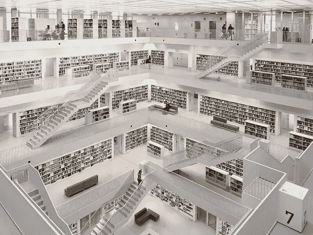

# 21 世纪最有价值的追求

> 原文：<https://medium.com/swlh/the-most-valuable-pursuit-in-the-21st-century-c5d1961da2b6>

[Nordseher/pixabay](https://pixabay.com/en/modern-architecture-urban-3166056/)

今天早上我在看我的 Evernote。我翻了翻旧笔记，意识到在过去的几个月里，我对博客了解了多少。

当我看着那些笔记时，我意识到我对博客了解得多么少。我不知道如何想出引人注目的标题，如何格式化我的帖子，以及如何推广它们。

在过去的六个月里，我学到了所有这些，甚至更多。我从博客帖子和电子邮件时事通讯中学到了一些，还有一些是通过反复试验学来的。

这些知识让我从博客的新手变成了初学者。要达到中级和精通水平，还有很多东西要学。

我希望有人把这些知识传授给我，这样我所要做的就是按照书中的指示去做。不幸的是，生活不是这样的。

> 你必须找到适合你的方法。没人会为你这么做。

我们必须亲自检查所有信息，进行试验，找出哪些有效，哪些无效。 [**辨别真相**](https://ideavisionaction.com/personal-development/the-only-skill-you-need-to-succeed-in-life/) 是成功的核心技能，如果不是唯一技能的话。然而，它可能是最难开发的。

# 信息丰富的时代

我们生活在 [**富足的时代**](https://ideavisionaction.com/personal-development/abundance-is-harming-us/) 。大量的信息可以免费且廉价地获得。那有它的优点也有它的缺点。

大量的信息除非被组织成知识，否则毫无用处。这就是为什么谷歌是当今最有价值的公司之一。

这也是数据科学如此热门的原因。使用数据科学甚至可以影响选举结果。

# 信息丰富时代的最大挑战

在这个信息丰富的时代，我们面临的最大挑战是将信号从噪音中分离出来。在互联网上可获得的所有信息中，哪种信息最有价值？

我相信对我们所有人来说，都有一些改变生活的信息。我们如何找到这些信息？这是我们时代最大的挑战。

我们不再寻找金矿了。 [**知识是 21 世纪的新黄金**](https://ideavisionaction.com/marketing/data-is-the-gold-if-you-know-how-to-use-it/) 。我们在寻找改变生活的知识。

# 寻找改变生活的知识

我真诚地相信，我们每个人都有改变人生的知识。我亲身经历过。我们的任务是出去找到它。

有很多免费的内容，其中一些是有用的和有价值的。我从博客帖子、播客和 YouTube 视频中学到了很多。

还有很多廉价的优质内容。我喜欢 Kindle 和有声读物。我以低价从他们那里获得了很多价值。

对我来说，付费内容的主要价值在于它是一种浓缩的形式。我不能听加里·维纳查克的每一个播客，也不能读赛斯·戈丁的每一篇博客。但我可以购买他们的书籍和有声读物，了解他们最有价值的想法。

# 将信息转化为知识

当我们遇到有价值的信息时，我们必须 [**让它成为我们功能知识的一部分**](https://ideavisionaction.com/personal-development/how-to-learn-something-for-life-and-make-it-a-part-of-your-functional-knowledge/) 。做到这一点的第一步是决定我们使用它的频率。

如果我们要在日常生活中使用它，我们需要学习并内化它。如果我们打算偶尔使用它，我们需要将它添加到我们的知识库中。让我用一个例子来解释每个选项。

# 日常使用的学习

假设我有注意力分散的问题。我经常用智能手机转移注意力。我对这个挑战的解决方案是想象我自我分心习惯的后果。

当我感受到这些不良后果时，查看智能手机就不再那么有趣了。

这是我每天都需要学习和应用的习惯，每当我想查看手机的时候。我需要通过 [**的四级学习**](https://ideavisionaction.com/personal-development/four-levels-of-learning/) 来完成这个新的练习。

# 学习的四个层次

在**无意识无能**的层面上，我不知道我可以通过视觉化练习来治愈我的分心习惯。

在**意识无能**的层面上，我意识到了视觉化练习，但是我没有成功地用它来克服我的分心习惯。

在**意识能力**的层面上，我有意识地努力使用视觉化练习来克服我的分心习惯。

在**无意识能力**的层面上，观想练习自动发生。每当我有分散注意力的冲动时，我就会产生不良后果的感觉。我不需要做任何有意识的努力来进行观想练习。

# 达到最高学习水平的途径

从第一级到第四级需要时间和努力。首先，你需要意识到你有一个问题。然后，你需要找到一个解决方案。

很多时候，那个解决方案是在 [**你不知道的领域里**](https://ideavisionaction.com/personal-development/what-you-dont-know-you-dont-know-can-change-your-life/) 。你可以通过阅读博客文章、听播客或者从其他来源找到它。

现在，你处于有意识的无能水平。你有知识，但你不能在日常生活中使用它。

这需要重复，直到你将知识内化。不要指望你的生活会因为你看了一篇博文而改变。有时候会，但大多数时候不会。

# 间隔重复法

你需要隔一段时间一遍又一遍地重复你所学的东西，直到你 [**把它变成你的功能知识**](https://ideavisionaction.com/personal-development/how-to-learn-something-for-life-and-make-it-a-part-of-your-functional-knowledge/) 的一部分。

你需要实践你所学的。只有这样，它才给你的生活增添了价值。但当它发生时，它会给你的生活带来巨大的变化。

# 建立一个知识库

第二种知识是你偶尔会用到的。这并不意味着这类知识不那么重要。它和你每天使用它的知识一样重要。

我建议您维护一个知识库来保存和组织这些知识。为此，我使用了 [**Evernote**](https://ideavisionaction.com/productivity/the-app-that-i-use-the-most/) 。

有些程序我必须偶尔执行。例如，我每年都要收集一堆所得税申报表的文件。

我不可能把那些程序的所有步骤都记在脑子里。我不能冒险错过一步。我把所有这些步骤都写在 Evernote 笔记上，并做上标记。

当需要执行这些步骤的时候，我会搜索笔记并执行这些步骤。我不需要努力去记住所有的步骤。我也相信我没有忘记中间的一步。

> **本质上，这个想法是，如果你经常使用某个知识，就把它内在化；如果你偶尔会使用它，就把它记录在某个地方。这种方法节省了我大量的时间和头痛。**

# 正规教育的可悲现状

不幸的是，我在 K-12 教育期间学到的大部分信息不仅没用，而且很容易被谷歌搜索到。

可悲的是，一些大学课程只是那种教育的延续。这就是为什么现在大学教育的名声如此之差。

# 理论知识的意义

现在理论知识被误解了。作为一名软件程序员，我是一名从业者。然而，我向你保证，如果没有理论基础，你会失败得很惨。你会撞到墙上，像蚊子一样被压扁。在我 15 年的经历中，我一遍又一遍的见证。

> **重视实践，但绝不轻视理论。在两者之间保持平衡。**

# 理论实际上意味着什么？

理论不是图书馆里一些书的信息集合。理论是你在多年的刻意实践中内化的基本知识。这正是罗伯特·格林在他的书《掌握》中所解释的。

估计需要 10，000 小时的有意练习才能达到这种精通。当然，这个数字在不同的领域有所不同，但它很好地说明了达到熟练程度需要什么。

这就是为什么 [**时间管理**](https://ideavisionaction.com/productivity/the-overlooked-variable-of-time-management/) 至关重要的原因。你必须把大部分时间和精力投入到学习中。

好消息是知识是免税的。没有人能过来把你这些年积累的知识全部征税。都是你的，你可以用它来创造你想要的生活。

# 结论

积累理论和实践知识是 21 世纪最有价值的追求。你需要学会如何学习。

在某些情况下，您需要在知识库中记录信息，并能够快速找到它。在其他情况下，你需要通过重复和练习将知识内化。

如果你这样做了，你的知识将会得到回报。

[***注册我的电子邮件简讯***](https://ideavisionaction.com/email-newsletter/) ***接收我关于个人发展和生活经验的最新帖子的每周摘要。***

## 这个故事发表在 [The Startup](https://medium.com/swlh) 上，这是 Medium 最大的创业刊物，拥有 326，962+人关注。

## 在这里订阅接收[我们的头条新闻](http://growthsupply.com/the-startup-newsletter/)。

