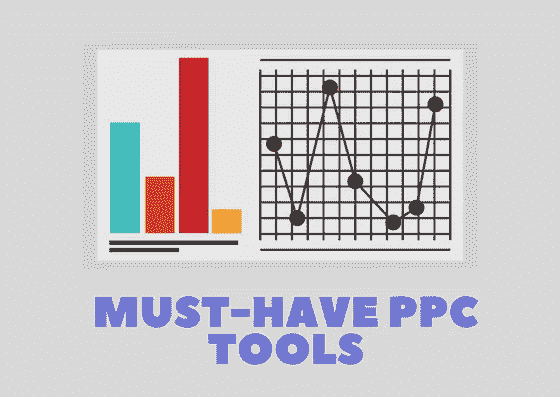
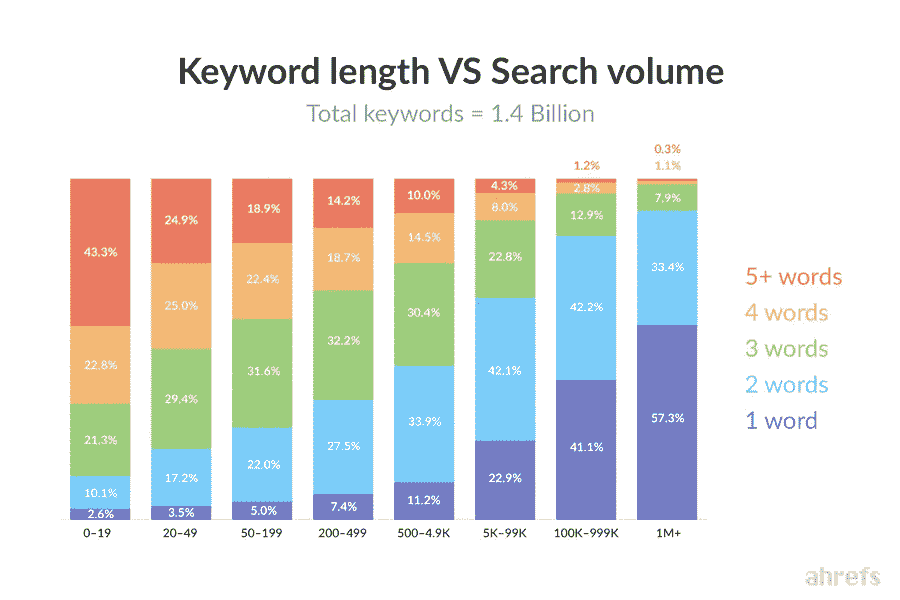
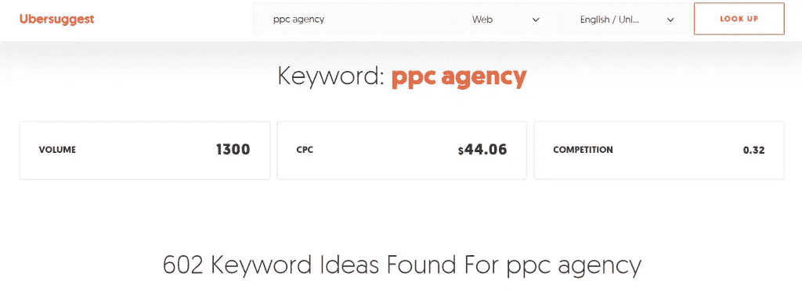
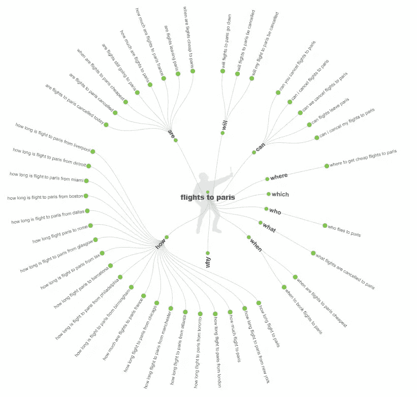
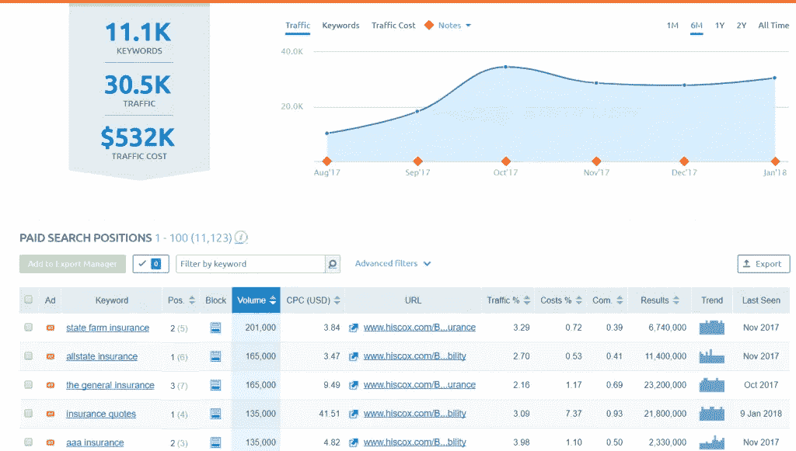
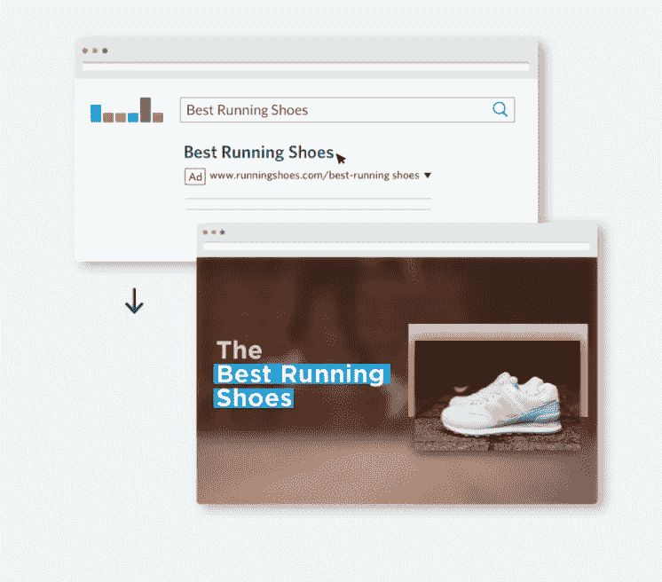
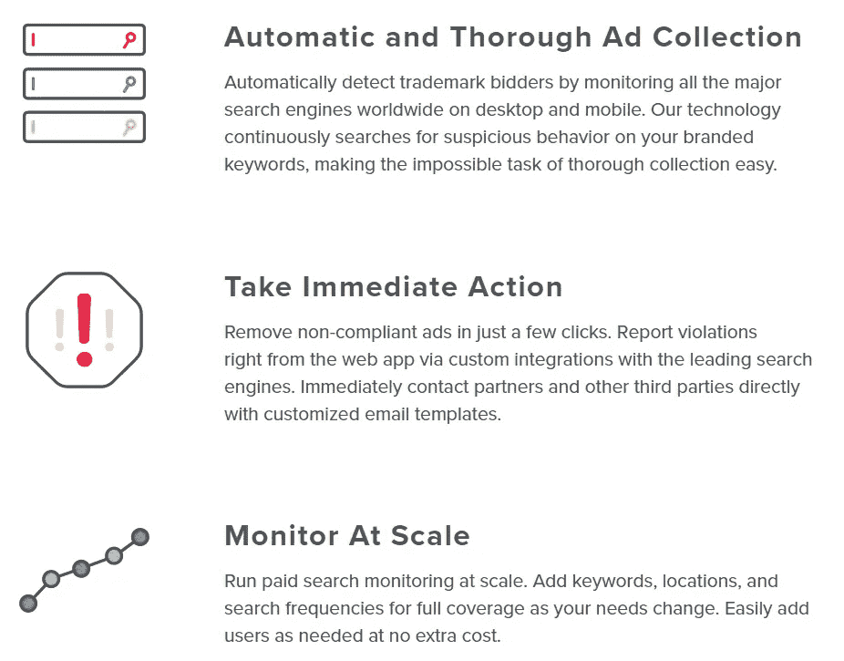
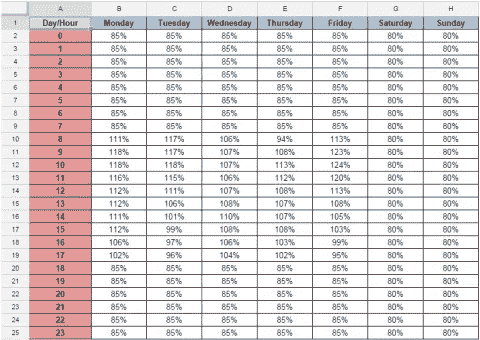

# 付费搜索成功的必备工具

> 原文：<https://medium.com/swlh/the-must-have-tools-for-paid-search-success-867bf5e6325b>

## 付费搜索营销人员期待技术为他们提供竞争优势。

[**关键词**](https://searchenginewatch.com/2017/10/17/google-adwords-the-beginners-guide/) **拥有一系列日益复杂的功能，但也有许多第三方工具增加了额外的洞察力。下面，我们回顾一些实现 PPC 成功的重要工具。**

付费搜索行业将在 2018 年取得显著发展，无论是对广告商的选择还是作为营销渠道的复杂程度。创新的步伐正在加快，技术让搜索专家有更多时间花在战略上，而不是重复的任务上。

谷歌继续向 AdWords 添加新的机器学习算法，以提高付费搜索的效率，这无疑是一个受欢迎的发展。然而，考虑到每个人都可以使用这些相同的工具，这项技术最终变成了某种均衡器。

正是在人和技术的交汇点上，品牌才能在 PPC 营销中茁壮成长。更好的培训和更开明的策略可以帮助充分利用谷歌的 AdWords 和 [AdWords Editor](https://searchenginewatch.com/2017/07/11/adwords-editor-12-everything-you-need-to-know/) ，但还有其他工具可以增加竞争优势。

以下是可以节省时间、揭示见解、增加数据分析规模或三者结合的技术。

# 关键词研究工具

当然，找到合适的关键词添加到你的付费搜索账户中是成功营销活动的一个基本组成部分。

Google 会在关键字规划工具中建议一些相关的查询，但是它确实有一些固有的限制。该工具中提供的关键字列表远非全面，考虑到提供的潜在回报，老练的营销人员最好寻找第三方解决方案。

Seer Interactive 的 Wil Reynolds 最近的一篇文章揭示了建立一个广泛的目标关键词列表是多么重要，因为消费者正在以多种方式、跨设备和跨地域进行搜索。根据 Ahrefs，85%的搜索包含三个或更多的单词，尽管较短的关键字往往有较高的搜索量，长尾也包含大量的价值。

再加上日益增长的趋势，如采用语音搜索，情况变得更加复杂。从本质上说，有必要研究谷歌关键词规划器以外的东西来发现这些机会。

[Keywordtool.io](http://keywordtool.io/) 将一个初始的关键字建议作为刺激，并使用它来产生多达 750 个目标建议查询。这在一定程度上是通过使用 Google Autocomplete 拉入客户通常搜索的一系列相关术语来实现的。该工具的专业版许可起价为每月 48 美元。

[Ubersuggest](https://neilpatel.com/ubersuggest/) 是另一个历史悠久的关键词工具，搜索营销人员使用它来寻找新的、有时意想不到的机会，通过搜索与客户交流。它根据词汇相似性将建议的关键字组合在一起，并可以导出到 Excel 中。

该工具还允许营销人员添加负面关键词，以增加其结果的相关性。

我们已经写了 [Google Trends 对于 SEO](https://searchenginewatch.com/2017/12/08/how-to-use-google-trends-for-seo/) 的好处，但是同样的逻辑也适用于 PPC。谷歌趋势可以成为付费搜索的绝佳资源，因为它允许营销人员识别需求高峰。这种洞察力可以用来在关键词受欢迎程度上升时锁定它们，让品牌以更低的成本吸引点击。

Google Trends 最近进行了更新，包括了许多新功能，因此对于那些在过去的迭代中可能没有发现它足够强大的营销人员来说，它是值得重新访问的。

“回答公众”是理解与品牌产品或服务相关的更长的信息查询的另一个很好的工具。它创建了与标题术语相关的最常见问题的可视化表示，例如下面示例中的“飞往巴黎的航班”:

随着付费搜索的角色演变成一个涵盖信息查询和交易术语的全渠道，像这样的工具将被证明是非常宝贵的。它揭示的见解可以用来定制广告文案，问题列表可以导出并上传到 AdWords，以查看是否有相当大的机会直接针对这些问题。

对于想要调查关键词集内的语言趋势的营销人员来说，使用 Ngram 查看器是个好主意。有大量的选项可用，但这个工具是免费且有效的。

# 竞争对手分析工具

[AdWords Auction Insights](https://support.google.com/adwords/answer/2579754?hl=en-GB) 是竞争对手分析的重要工具，因为它揭示了不同网站在关键词集上的印象份额，以及竞争对手网站之间的平均位置和重叠率。

然而，这应该被视为竞争对手分析的起点。还有其他技术为这项任务提供了更广泛的衡量标准，包括 [Spyfu](https://www.spyfu.com/) 和 [SEMrush](https://www.semrush.com/) 。

Spyfu 的 AdWords 历史为我们提供了一个非常有帮助的关于竞争对手策略的视角。这揭示了他们的广告策略，也揭示了他们改变的频率。因此，它是定性和定量研究的有益结合，不仅显示了品牌如何定位他们的产品，还显示了他们愿意支付多少钱才能让它出现在观众面前。

Spyfu 的基本许可证起价为每月 33 美元。

SEMrush 是分析竞争对手的一个很好的工具，无论是对付费搜索还是对有机搜索都是如此。该软件显示了付费搜索中某个域名的关键词排名，并计算出该网站最终获得的流量。

产品列表广告功能特别有用，因为它们提供了对竞争对手表现最好的广告及其谷歌购物核心关注领域的洞察。

通过 SEMrush 比较桌面数据和移动数据也很容易，随着向移动流量的转移，这一功能变得越来越强大。

SEMrush 的许可证起价为每月 99.95 美元。

这些工具与 AdWords Auction Insights 配合使用，可以更全面地了解竞争对手的活动。

# 登录页面优化工具

从广告文案和关键词定位到转化，优化完整的搜索体验至关重要。因此，PPC 经理有责任确保现场体验符合消费者的期望。

各种工具可以帮助实现这一目标，只需对页面的源代码进行最少的更改，就可以对登录页面的内容和布局进行分割测试。事实上，大多数这些不需要编码技能，并允许 PPC 营销人员作出改变，只影响他们的渠道的客户。主网站体验保持不变，但付费搜索访问者将会看到一个根据他们的意图定制的登陆页面。

Unbounce 有超过 100 个响应模板，动态关键字插入特性非常有用。后者根据用户点击的广告调整页面上的内容，根据用户的期望帮助将用户的旅程联系在一起。

# 品牌监控工具

品牌关键词应该是任何公司持续的收入来源。虽然没有自满的余地，即使当人们已经在搜索你的品牌名称，这些查询往往会提供一个可持续的和成本效益的点击付费流量来源。

当然，除非竞争对手试图窃取部分流量。谷歌确实有一些保护品牌的立法，但事实证明这不足以阻止公司竞标竞争对手的品牌条款。当这种情况发生时，它也会推高品牌关键词的每次点击成本。

Brandverity 通过在竞争对手侵犯其品牌条款时触发自动警报，为广告商提供进一步保护。

这一覆盖范围包括购物广告、移动应用和全球搜索引擎。

# 自定义 AdWords 脚本

虽然不是一个特定的工具，但值得一提的是自定义脚本可以为 AdWords 性能带来的额外好处。这些脚本提供了额外的功能，从更灵活的投标时间表，到基于股票价格的投标调整和第三方数据集成。

[这个来自 Koozai 的精彩列表](https://www.koozai.com/blog/pay-per-click-ppc/google-adwords/100-google-adwords-scripts-using/)是一个全面的资源，来自免费 Adwords 脚本的[也是如此。PPC 代理 Brainlabs 也在其网站上提供了一个有用的脚本列表，通常每隔几个月就会更新一次。](http://www.freeadwordsscripts.com/)

使用上面列出的工具可以为 PPC 活动增加一个额外的维度，并带来推动增长的基本竞争优势。随着行业继续快速发展，这些工具应该比以往任何时候都更有价值。

## 这个故事发表在 [The Startup](https://medium.com/swlh) 上，这是 Medium 最大的企业家出版物，拥有 292，582+人。

## 在这里订阅接收[我们的头条新闻](http://growthsupply.com/the-startup-newsletter/)。

