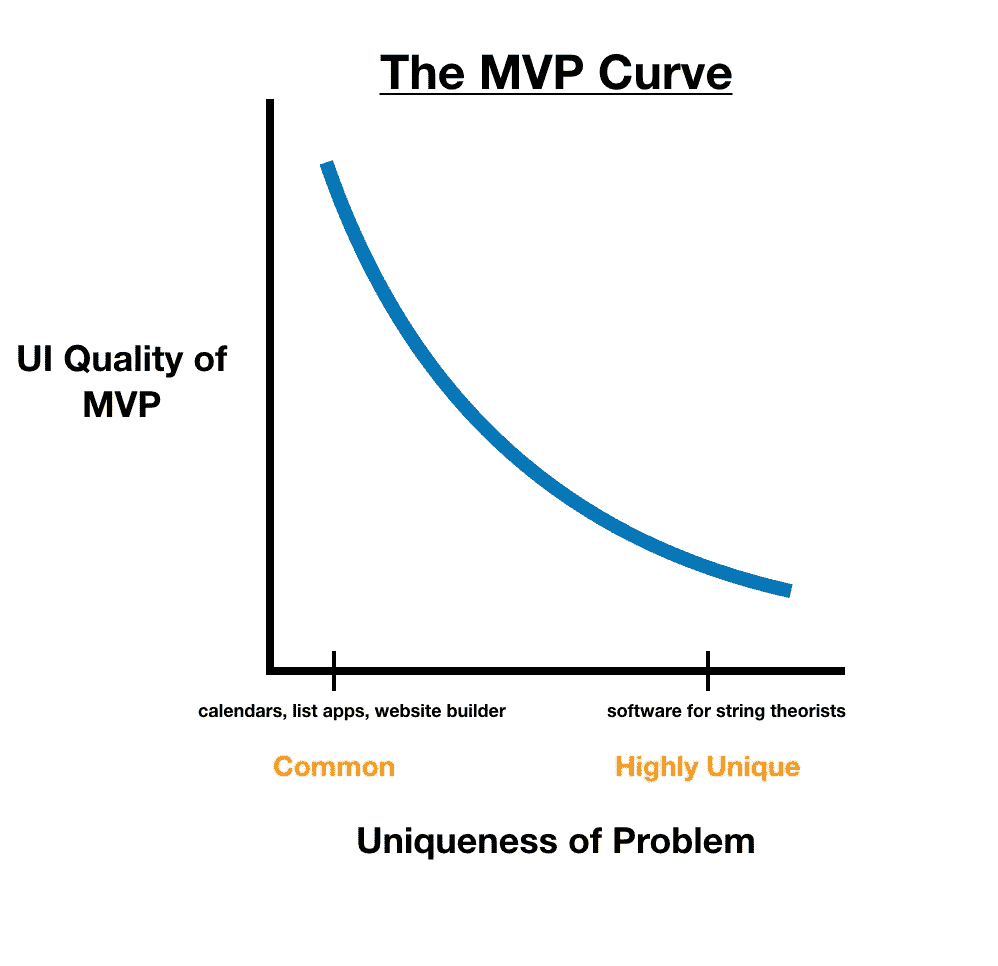

# MVP 曲线

> 原文：<https://medium.com/swlh/the-mvp-curve-392993f25656>

最小可行产品(MVP)在创业社区中极具影响力。它们有助于降低花费大量时间和金钱构建没人想要的东西的风险。不幸的是，MVP 的兴起导致许多人发布实际上不可行的产品。让我解释一下。

想象一下，如果我决定做一个日历 app。没有人会使用我的日历应用程序的 MVP，因为已经有数百个完全开发的、外观漂亮的日历应用程序。我销售我的日历应用程序的唯一方法是 MVP 比所有的应用程序都好。

另一方面，如果我决定开发一个软件来帮助每年只有 50 人患病的病人，那么这个软件的设计和体验就不会那么复杂。

很明显，某些类别的产品比其他产品有更高的 MVP 进入壁垒。我决定用一个图表来形象化这个问题:

你试图解决的问题越独特，你花在 MVP 的设计和用户体验上的时间就越少。相反，你可以专注于产品的核心功能，用户会解决剩下的问题。

大多数人忘记了 MVP 需要是可行的。下一次你在 MVP 上工作时，确保你定义了最小生存能力的真正含义。在某些情况下，你需要的“最低”并不是那么最低。

## 这篇文章发表在《初创企业》杂志上，这是 Medium 最大的创业刊物，有 332，253 人关注。

## 订阅接收[我们的头条](http://growthsupply.com/the-startup-newsletter/)。

