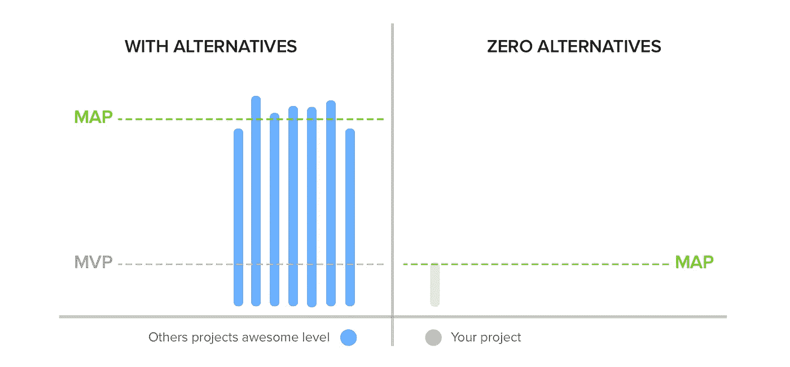

# MVP 死了，长命到图。(最低牛逼产品)

> 原文：<https://medium.com/swlh/the-mvp-is-dead-long-life-to-the-map-minimum-awesome-product-404df90fef7f>

## 先去🇪🇸。你想用西班牙语读这篇文章吗？ [**在这里勾选**](http://bit.ly/mvp-muerto-map-mola) 。

我会直截了当、毫不掩饰地说……**MVP 已经去世**。但是你首先需要处于那种情况。什么是 MVP？

> MVP:最小可行产品

**最小可行产品(MVP)** 是具有足够的特性来满足最初客户的产品，并为未来的开发提供反馈。一些专家认为，在 B2B 中，MVP 也意味着可销售。

> “在卖出去之前，它还不是一个 MVP。可行意味着你可以卖掉它”。

是的，这是对维基百科中一个简单定义的复制粘贴。一个我在很多方面都认同的。主要源于一个因素，分析。在我看来，MVP 更准确的定义应该是:

> 最小可行产品(MVP)是允许我们推出尽可能少功能的产品，以便我们可以通过一系列指标从试用期和用户交互中学习和提取相关信息，然后根据这些数据采取行动。

解释 MVP 的最好(也是最常见的)方式是使用这张著名的图片。

Image by Henrik Kniberg. Example of MVP.

方法很简单。

你想制造一辆汽车吗？完美！让我们开始这个过程。怎么会？先是一个轮子，然后另一个，然后另一个，然后引擎，等等…有问题吗？制造我们想要的汽车需要太长时间。解决方案？首先做一个溜冰鞋，然后是自行车，然后是摩托车，最后是汽车。

**过程比较长吗？是的。是否更可行？是的，当然！**

我不会详细介绍 MVP 的流程，因为这方面的信息已经足够多了。我们在这里评论 MVP 的死亡，以及让我相信这一点的原因。

做好、好看、便宜的东西很难。最后，在制定 MVP 时，需要确定优先级。成本必须很低，说到底这只是一个简单的“测试”，但是…

**潜在客户是否愿意仅仅因为这是一个测试而失去质量(或者至少是质量的表象)？**

这是我想说的一点，我想解释一下。随着新时代，新技术，尤其是新的一代，互联网不再是一个新奇的事物，电子商务不再是一个新奇的事物，一个免费的聊天应用程序也不再是一个新奇的事物。**一切都变了。**

几年前，随着新技术的蓬勃发展，一位 30 岁的潜在客户刚刚开始在家里上网，智能手机，如果你不是高管，几乎无法想象会有一部智能手机，但一切都变了。

我 12 年的邻居带着一部容量为 10 万的智能手机，这是美国宇航局 40 年前阿波罗 11 号需要的。

技术发展正在迈出巨大的步伐，消费者也在前进，即使他们的步伐较慢。

呀！当我 14 岁的时候，我不知道也没听说过脸书、Instagram、亚马逊或 Whatsapp。他们都不存在。**现在世界上 18-40 岁的人有谁不知道这些服务？很少，如果有的话。**

这一切有什么问题？

> 用户习惯于最低限度的质量，他们期望所有的新产品都是如此。

这是什么意思？所有用户都期望新的社交应用与其他社交网络共享该应用的活动(无论它是什么)。脸书、推特、Instagram、Whatsapp 等等……就这么简单。

如果我们的产品没有这么简单的功能，人们会自动认为这是一个质量差的产品，他们不会认真对待它。**这不是他们所期望的。**

因此，我认为 MVP 已经死亡，而 Map 已经诞生。

> 地图:最小牛逼产品。

现在，当你在考虑一个新产品的开发时(无论是实体的、网络的、应用程序的等等)，你不仅会问自己“这是我使它可行的最低要求吗？”，起初，这似乎是正确的问题，但当我们提出以下问题时，方法就变了。

这是我所能创造的最少的不可思议的产品吗？

语境的变化很重要。以前，我们只想到要推出的产品足够实用。客户/用户可以完美地运行至少 2-3 个基本的东西，但是客户已经成长，客户很容易理解 5-6 个基本的东西，我们必须提供更多的东西，一些感觉熟悉的东西，同时会让你感到惊讶的东西。

了解这种方法的最佳方式是通过一个例子。

Example of job search app design, both designs made in little more than 1h. Sorry, in Spanish.

这两款产品有什么区别？他们真的在展示同样的内容。两者都有:

*雇用的标题和项目(包括:姓名、日期、公司、类型和报酬)。*

## 但在 MAP 中，它似乎更可靠，对用户/最终客户更有吸引力。

 [## 创业中的“产品”价值。

### 投资产品和投资技术一样重要，你希望成千上万的用户使用…

medium.com](/swlh/the-product-value-in-a-startup-aa848983880e) 

这个虚拟应用程序的目标是年龄在 18-36 岁之间的人(男性或女性)，他们知道在线求职的功能，他们可能已经使用了应用程序和 Talent、LinkedIn、JobToday 等工作类型。

Example of current job search apps.

在 2017-2018 年，当我们的竞争对手拥有几年优势的应用程序，并且成千上万的客户已经在使用它们时，我们打算如何与一个平庸的产品竞争？

我们不仅要记住，我们必须在特性(功能)、速度和流动性方面进行竞争，而且还要在产品设计方面进行竞争，因为用户/最终客户已经在头脑中预先设计好了“就业申请应该是什么样的”。

# “真正的竞争是为我们的产品提供更好的体验。”

而更好的体验包含了一切:**特性、速度、流畅性、设计**。这对于与其他应用进行正面竞争至关重要。

6-8 年前，没有“标准”设计或设计模式，一切都有待发现。

A simple graph of what was or was being sought with an MVP, which requires an MAP.

最后一个简单的例子，在一个新的社交网络中，**,我们真的会期待一个没有搜索栏、信息系统和收藏或喜欢系统的产品吗？**不。我们的脑海中已经有了社交网络中事物应该是什么样子的模式。

这就是为什么在推出新产品时，除了快速、可行、经济实惠之外，我们还需要尽可能地利用我们拥有的资源。我们需要努力提供一种用户/客户觉得足够好的体验，给你一个机会。

## “我们不仅要寻找最简单可行的产品，还要利用我们现有的资源寻找最佳的产品体验。”

显然，**戴夫·麦克卢尔**在[推特](https://twitter.com/davemcclure/status/961305517149818883)上提到了关于我的文章的一个细节，它非常重要…

> MAP 在很大程度上取决于你的目标行业中可用的替代方案有多“棒”。如果零个备选项，那么 MVP = MAP 如果选项很多，那么地图> MVP。

非常感谢 Dave 的评论，非常正确。**实现这一想法的方法是什么？简单。**

所以下次你想 MVP 的时候，想想地图，*(除非你没有竞争对手，那你的 MVP 就自动是地图了，因为没有参照物)*:特色少，但都设计得当。

在你的产品(MVP)中创建任何新功能之前，想一想…你真的需要这个吗？如果答案是“是”，完美，就去做，但要保证效果很奇妙(图)。

# “如果你要做一个新产品，想想你的客户期望什么，并尽可能提供最好的体验和产品。”

而且很多人会问… **去哪里找那些开发商或者设计师做地图？**错题！这不是开发商或设计师的问题，而是管理者的问题。你必须提高期望，激励自己，知道一切都需要你的时间，你不可能在几周或一个月内完成一张地图。你必须接受它！

你需要管理和接受一切都需要你的时间和成熟。**更好的管理是创建好地图的解决方案。**

你喜欢邮报吗？

**给我鼓掌！**你可以向鼓掌欢呼 50 次，这样会有更多的人发现和知道这个帖子，当然，别忘了分享。

让我们看看掌声！

*免责声明:很多人会说地图和 MVE(最低可行体验)一样，我同意 90%左右，但我更赞成体验和一个好的产品合并，但不一定要提供一个好的产品设计。例如，Craigslist，尽管他们的服务非常高效，但产品设计非常糟糕，所以我更喜欢搜索尽可能棒的产品。地图。*

## 这个故事发表在 [The Startup](https://medium.com/swlh) 上，这是 Medium 最大的企业家出版物，拥有 293，189+人。

## 在这里订阅接收[我们的头条新闻](http://growthsupply.com/the-startup-newsletter/)。

# 你可能感兴趣的其他文章…

 [## 创业中的“产品”价值。

### 投资产品和投资技术一样重要，你希望成千上万的用户使用…

medium.com](/swlh/the-product-value-in-a-startup-aa848983880e)  [## “产品设计师”的工作及其在创业中的重要性

### 先去🇪🇸。你想用西班牙语读这篇文章吗？在这里检查一下。

uxdesign.cc](https://uxdesign.cc/the-job-of-the-product-designer-and-its-importance-in-a-startup-37f7235f5955)  [## UX 法律与实例。

### 先去🇪🇸。你想用西班牙语读这篇文章吗？在这里检查一下。

medium.com](/swlh/ux-laws-with-practical-examples-c418b4738d20)  [## 不同类型的“产品经理”:我是谁，我需要谁？

### 重要的事情先来！什么是产品经理？

medium.com](/@carlosbeneyto/types-of-product-manager-startup-3bb978f50d2f) 