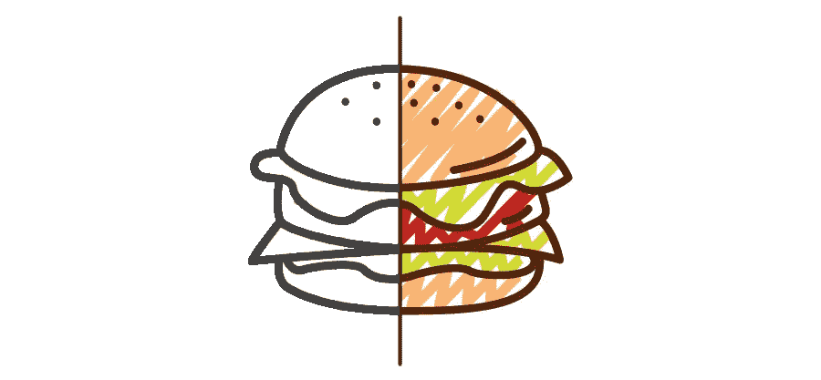

# UX 设计师的神秘生活

> 原文：<https://medium.com/swlh/the-mysterious-life-of-ux-designers-7cc45740e267>

许多人完全不知道一个 UX 设计师到底是做什么的。有些人有想法，但是他们经常混淆 UX 和 UI 的功能。

这就是为什么第一个也是最重要的一点是通过一个简单的例子来介绍 UX 和 UI 设计者的区别。

## **UX 和 UI 设计师的区别**

证明这一点最方便的方式是说我们假设的产品是一个**汉堡。**我们假设的公司向各种客户销售汉堡包，我们也有一些员工参与这个项目。就像在现实生活中，用户界面和 UX 设计师有着几乎完全不同的角色。

先从 **UI 设计师**说起。他们是汉堡制作专家。他们几乎就像厨师一样:他们有制作汉堡包的适当知识和合适的工具。他们知道如何使用刀子，如何完美地烹饪肉类和融化奶酪。

而 **UX 设计者**会告诉 UI 设计者使用哪些特定的成分，如何将它们分层。她了解**顾客的需求**，如何强化不同的口味，汉堡应该如何包装等等。

显而易见，离开了另一方，任何一方都不可能成功。

谁会想要一个制作完美的芝士汉堡，如果里面有不相关的成分，而且看起来像垃圾 T21？

相反，谁会想要一个看起来完美无瑕的汉堡，如果它有令人作呕的味道？

## 那么……一个 UX 设计师到底在做什么？

UXD 的活动范围非常广泛。这是多学科的，因为一个 UXD 必须在市场营销、设计、项目管理等领域拥有相当多的知识。

[这个术语的发明者唐纳德·诺曼也有自己的解释:](https://en.wikipedia.org/wiki/User_experience_design#History)

“我发明了这个术语，因为我认为人机界面和可用性太狭隘了。我想涵盖人们对系统体验的所有方面，包括工业设计图形、界面、物理交互和手册。自那以后，这个词广为流传，以至于它开始失去意义。”

UXD 的工作在项目生命周期之前就开始了，并不以简单的模型或原型结束，所以它不能被限制在简单的阶段。

以下是 UXD 工作的关键部分:

## **竞争对手分析**

正如我之前提到的，一个 UXD 必须在很多方面出类拔萃。在**初始阶段**对竞争对手的深入分析可以最大限度地减少我们**潜在错误**的数量，可以突出我们**的优势和劣势**，帮助我们熟悉**竞争领域**。

## **客户分析**

UXD 的第一个也可能是最重要的任务是创建项目的 ***人物角色*** 。**这些是虚拟的消费者类型，他们会使用你的产品。**有不同的方法可以做到这一点。一种流行的方法是创建不同的简介，陈述最重要的**信息**，这些信息会影响我们设计产品的方式。通常是通过安排面对面的面试来完成的。

然后剩下的工作就按照潜在客户的口味来做了。

## **视觉设计**

视觉设计或者平面设计，基本上就是关于一个产品在用户交互过程中的**外观**和**感觉**。UXD 将决定混合哪些颜色，在哪里插入图片等等。她将知道如何组合视觉元素，以使给定产品的效果最大化。也许从外行的角度来看，这是 UXD 工作中最引人注目的部分。

## **信息架构**

这一部分几乎像真实的架构，因为它是关于产品的**结构**和**信息组织**。它的主要目标是**通过将所有东西分解成最基本的组件，然后将它们管理成**一致的布局**，来提高可用性**。我的观点是，如果用户可以轻松找到几乎所有东西，并且可以毫不费力地浏览网站或应用程序，那么 UXD 就是成功的。

## **交互设计**

这一领域由 5 个同等重要的步骤组成，即所谓的维度，每一个步骤都是相互联系的。

***1。*字样**

沟通的最**根本**部分。其他四个步骤也是基于我们使用的单词，所以关注它们是非常重要的。

***2。视觉表现***

这可能包括**排版**、**图标**或附加的**图形**。文字和它们的视觉表现必须和谐一致。这是一个小问题，但它可以在一秒钟内毁掉一切。

***3。物理对象和空间***

物理对象和空间也是交互设计的重要部分。**基本上这决定了界面看起来如何**，页面应该如何**拥挤**，如何以及在哪里插入普通**白色背景**，留出多少**空间**等等。

***4。*时间**

在某些情况下，时间并不那么重要，但在出现**视频**、**动画**甚至**声音**的情况下，强烈建议留意时间。如果您的页面或应用程序中有**动态内容**，建议谨慎处理。

***5。行为***

为了最大化你产品的可用性和价值，你必须知道你的用户/顾客的行为，他们实际上在做什么等等。当然，你可以让 **A/B 测试**和**原型测试**与真实用户一起进行，但是我们都知道在那些情况下仍然缺少一些东西。**你真的知道缺少什么吗，是什么让人们困惑，他们为什么离开你的网站？**

## **可用性**

可用性是关于满足我们用户的需求。在大多数情况下，这意味着它是如此的**透明**，然而**有效**以至于每个人都可以浏览网站/应用程序，从而给用户一种满足感。

根据 [ISO 定义](http://www.w3.org/2002/Talks/0104-usabilityprocess/slide3-0.html):

*“在特定的使用环境中，特定的用户使用产品来实现特定目标的有效、高效和满意的程度。”*

根据普遍接受的框架，有 5 个子类别需要注意:*可学性、效率、记忆性、满意度和错误。*

也就是说，如果用户能够学会高效、愉快地使用产品而不会出错，并且能够记住它以便以后知道如何使用，他们就会感到满意。

## **人机交互**

最后一大部分是关于电子设备和人本身的互动。类似于前面提到的几节，但它的作用是借助**工程学**和**心理学**让这种互动尽可能自然。这个领域还关注**社会**和**文化价值**。

人机交互中使用的心智模型帮助我们将用户的**现实生活知识**实现到屏幕上。由此他们创造出**隐喻**，这是用户心智模型的特征。这些隐喻将有助于 UX 的设计师们。

## **+1:管理**

成为一名经理也是 UXD 的一个重要组成部分。如果设计师不能做演示，不能与人互动，她就不能推销自己的想法，也不能强调潜在的问题，这会给以后带来很多麻烦。

如果她没有**谈判技巧**，她将无法与利益相关者进行恰当的沟通和妥协。

能够协调工人是必不可少的，比如 UI 设计师和其他团队成员。没有这些技能，整个工作就白费了。

## 将所有这些付诸实践

最重要的三种方法是**线框**、**原型**和**测试**。

线框是一个屏幕的**蓝图**，例如一个应用的**初始框架**。这是页面基本布局的草图，由 Balsamiq 样机这样的线框图程序完成。线框的早期版本被称为**实体模型**。

当测试人员有机会**获得关于产品及其特性的数据**和**反馈**时，原型制作就开始了。

uxd 可以使用大量的工具来简化和缩短原型制作阶段。

制作好线框、实体模型和原型后，就可以进行测试了。

## **结论**

一些拥有相当大公司的雇主可能会说，这甚至不是一个专业的工作:他们做同样的任务，但他们不称自己为 UX 设计师。我的看法是没那么简单， **UXD 不仅仅是纯粹的常识。**

让这份工作更有吸引力的是它不断变化的环境和多样的挑战。

如你所见，UXD 在工作时有一个**广泛的待办事项列表**。如果你要推出一款产品，并且希望它有最好的效果，你应该考虑聘请一名 UX 设计师。

你喜欢我的文章吗？
如果你推荐并分享它，这对我意味着整个世界。

(Ps。欢迎随时在[推特](https://twitter.com/intent/user?screen_name=meli_berki)上关注我

*发表于* **创业、旅游癖、生活黑客**

-