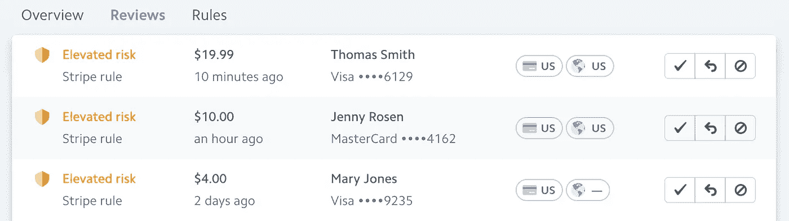
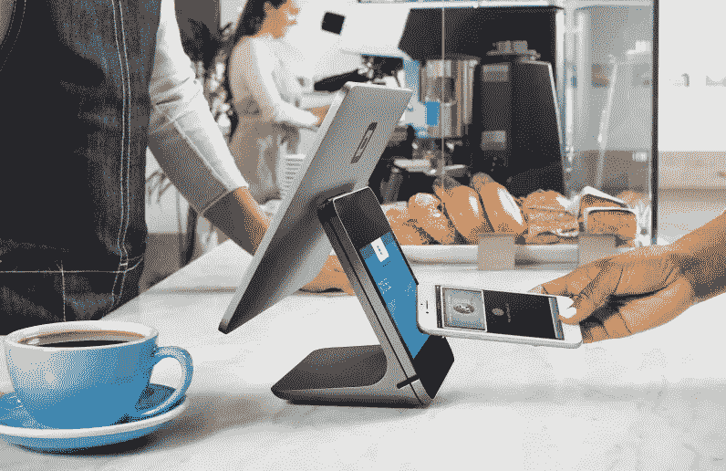
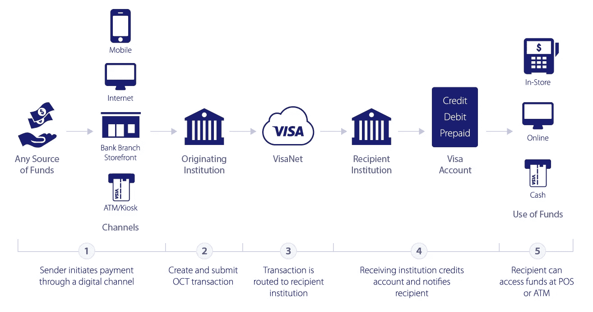

# 支付行业的新商业模式

> 原文：<https://medium.com/swlh/the-new-business-model-of-the-payments-industry-dbf1e9ab9426>

*初创公司如何通过在处理支付的基础上为他们的商户增加价值来创造新的收入来源。*

Is your PSP optimized for a Mobile-Centric World?

在过去的几年里，金融科技，尤其是支付领域，涌现出了一些令人惊叹的公司。最引人注目的当然是 [Stripe](https://www.stripe.com) 和 [Square](https://www.squareup.com) ，它们已经分别积聚了 92 亿美元和 189 亿美元的估值*(2018 年 4 月 3 日星期二估值)*。人们公认他们有能力改变线上和线下世界的客户体验，但也有人说这两家公司在改变现状方面做得很少。Stripe 和 Square 建立在现有的万事达卡和 Visa 基础设施之上，并没有从根本上改变支付方式，但是它们为未来如何实现支付货币化增加了新的视角。在这篇文章中，我将讨论新创公司如何改变支付方式，以及他们如何利用数据来创建长期盈利的公司。

## **电子商务创业:条纹**

Stripe 从开发者的角度出发，彻底改变了支付整合到网站和应用的方式。使 Stripe 的集成尽可能容易，同时提供具有相同目标的用户体验。Stripe 获得了包括 Lyft、InstaCart 和脸书在内的备受瞩目的初创公司的大量关注，使用其平台的商户数量已经超过 10 万。

由于支付是 Stripe 平台的核心，他们一直专注于推出能够提供同样简单的集成和使用的产品。随着基于订阅模式的公司的兴起，Stripe 推出了订阅，使订阅计费变得尽可能简单。另一个快速增长的业务模式是平台，通过 Stripe Connect，公司能够简单地管理谁将接收资金以及商家/用户的身份，从而减少了商家的 PCI 和 KYC 义务。

近年来，Stripe 推出了一些服务，旨在让商家更容易地开展业务。Atlas 让非美国企业家能够在美国创办公司，扩大他们的创业规模。为了进一步保护他们的商家免受日益增长的无卡欺诈趋势的影响，Stripe 推出了 Radar，这是一种基于机器学习的欺诈检测工具，它与基于规则的逻辑相结合，能够阻止可能的欺诈交易。

Stripe Radar UI

## **POS 启动:方形**

当我们看 Square 时，他们基本上做了与 Stripe 相同的事情，即改善购物者和商家双方的客户体验。随着 Square 读卡器的推出，杰克·多西和吉姆·麦克维(Jim McKelvey)能够将智能手机转变为销售点设备，创造了现在更为人所知的 mPOS(移动 POS)。这些年来，Square 一直在为购物者和商家开发更先进和用户友好的设备，包括 Square Stand 和 Square Register。除了开发更好的硬件，Square 还能够开发基于服务的产品，如 Square Capital，为商家提供贷款，以及 Square Payroll，帮助管理员工和工资。Square 还收购了一家名为 Caviar 的高端餐厅送餐公司，以取代其自己的应用 Square Order。

Square Register

## 当前的商业模式可持续吗？

通过在核心产品(即支付处理)的基础上增加更多服务，Stripe 和 Square 等公司正试图使其收入来源多样化，因为支付的日益商品化正在消除他们最大的收入来源。

在四方模式(网关、收单机构、方案和发卡行)中，Stripe 和 Square 作为网关运营，并在交换(发卡行)、方案费用(方案)和收单机构加价的基础上收取加价以产生收入。根据商家的规模和数量，这种加价幅度可以在 0% — 2%之间。随着公司处理量的增加，他们能够协商更好的价格，这主要来自网关的口袋，因为交换、方案费用和收购方加价几乎是不可协商的。

*因此，有人可能会问，如果支付正在商品化，并将基本免费，支付公司将如何赚钱，投资者将如何收回投资？*

正如我已经提到的，Stripe 和 Square 已经做出审慎的决定，通过利用数据(支付)来实现收入来源的多样化，以开发新产品和服务，并将其销售给现有的客户群。但到目前为止，Stripe 和 Square 一直专注于唾手可得的果实，主要是因为他们的产品是建立在基础设施之上的，这种基础设施不具备成为真正创新所必需的灵活性。

## **创造更好的(全栈)产品**

当我们看到拥有支付价值链更大部分的公司时，真正的机会在于通过利用云和大数据开发更好的产品。

在四方模式中，我们已经看到 Gateway 申请获得许可证，这对行业产生了非常有趣的影响。传统上，网关、收单机构、方案和发卡行作为独立的公司运营，而全栈收单机构已经成为网关和收单机构。这创造了一个机会，因为数据科学家可以访问更丰富的数据集，从而改善现有流程中的低效率。

通过分析大量数据和开发利用洞察力优化支付或处理轨道的功能，网关和收单机构之间更好的协调可以带来更高的授权率。改进产品的另一种方法是提取欺诈交易中出现的模式，以标记或阻止新的极有可能是欺诈性的交易，并在整个平台上使用这些见解来帮助其他商家。

随着其他所有技术公司都在云中构建他们的平台，支付行业的新参与者现在也选择在云中托管和处理支付。通过在 [AWS](https://aws.amazon.com/financial-services/) 、[谷歌云](https://cloud.google.com/solutions/financial-services/)或[微软 Azure](https://azure.microsoft.com/en-us/industries/financial/) 上处理支付，这些公司能够利用最先进的大数据技术来创建基于机器学习的欺诈引擎，实现基于 GPU 的数据分析或通过 A/B 测试支付的多种变化来提供支付优化。

## **改善流程**

由于云和大数据有助于改进底层产品，API 和实时处理有助于改进流程。在过去，PayPal 已经表明，建立一个 API 可以为新的创业公司提供更大的 PSP 可能无法建立的灵活性和功能。Venmo 使用 PayPal 的 API，它位于现有的支付基础设施之上，来建立一个点对点的支付服务。最近，Stripe 推出了适马，让他们的商家能够查询自己的数据，减少了创建自己的数据仓库的必要性，同时再次强调支付是公司应该围绕其建立的唯一真实来源。除了查询数据之外，API 还可以提供对外汇汇率、风险评分、财务状况、绩效指标的实时访问，这可以让商家建立更好的客户体验。

另一个有趣的发展是实时处理，受比特币和 Ripple 等加密货币和区块链技术的启发，卡计划认识到他们几十年前建立的系统无法满足互联网和移动时代用户的期望。即使到今天，处理一笔信用卡交易也需要 1 到 10 天。但随着万事达卡和维萨卡继续占据主导地位，它们已经在进行几项“创新”。 [Visa Direct](https://usa.visa.com/partner-with-us/payment-technology/visa-direct.html) 和 [Mastercard MoneySend](https://www.mastercard.us/en-us/consumers/payment-technologies.html) ，利用他们现有的 rails 使用点对点技术，从批处理转向实时处理，为用户提供在几秒钟而不是几天内发送和结算交易的能力。

Visa Direct Flow

## **手机和应用**

与所有技术一样，后端承担了大部分繁重的工作，却从未得到与前端同样的关注。这就是 Stripe 和 Square 这样的公司能够给这个名字加上“面孔”的地方。Stripe 的品牌结账页面和 Square 设计时尚的设备有助于创建品牌，并最终提高估值。从发行的角度来看，ApplePay 和 AndroidPay 通过尽可能简单地用手机进行交易，改变了人们的支付方式。

随着越来越多的消费者在他们的手机上下单或使用像[优步](https://www.uber.com)(运输)、 [Deliveroo](https://www.deliveroo.com) (食品)、[亚马逊](https://www.amazon.com)(购物)和[脸书](https://www.facebook.com)(社交)这样的应用程序来提供商品和服务，PSP 需要确保他们能够轻松集成到这些平台中，以捕捉正在发生的交易。通过利用硬件技术以及构建功能来提供更快的结账和安全性，PSP 可以将自己与那些不够灵活和创新的公司区分开来。

SDK 的软件开发工具包已经成为 PSP 必须提供的新标准，以确保尽可能快速和简单地集成到应用程序中，同时仍然给企业提供灵活的功能和设计。

但是，即使公司正在开发更多的应用程序，这些应用程序感觉更适合消费者正在使用的设备，通过浏览器购物仍然是巨大的，在台式机、笔记本电脑、平板电脑甚至手机上。因此，通过提供插件来支持 Magento 和 Shopify 等电子商务购物平台，与提供优秀的 API 和 SDK 同等重要。

## **机会依然存在**

随着支付商品化的继续，我们已经看到了整合，不仅是在收单方与 [Vantiv](https://www.vantiv.com) 和 [WorldPay](https://www.worldpay.com) 、 [Ingenico](https://www.ingenico.com) 和 [Bambora](https://www.bambora.com) 、 [First Data](https://www.firstdata.com) 和 [Acculynk](https://www.Acculynk.com) 的整合，而且在方案方与 Visa Inc .和 Visa Europe、Mastercard 和 [VocaLink](https://www.vocalink.com/) 的整合。

然而，网关/收购方仍然足够灵活，能够通过利用数据来改进其核心产品，通过创建 API 和实现实时处理来改进流程，并在移动和应用程序中提供服务，仍然有能力提供商家实际寻找的价值。最终，将脱颖而出的支付公司能够处理交易，并将这些支付作为开发额外服务的垫脚石，这些服务将增加交易，并通知、支持或帮助商户管理这些支付。

## 感谢阅读；)，如果你喜欢它，请点击下面的掌声按钮，这对我意义重大，也有助于其他人了解这个故事。通过在 Twitter 或 Linkedin 上联系让我知道你的想法。或者关注我，阅读我关于数据科学、支付和产品管理的每周帖子。

## 这篇文章发表在 [The Startup](https://medium.com/swlh) 上，这是 Medium 最大的创业刊物，有 312，822+人关注。

## 在这里订阅接收[我们的头条新闻](http://growthsupply.com/the-startup-newsletter/)。

