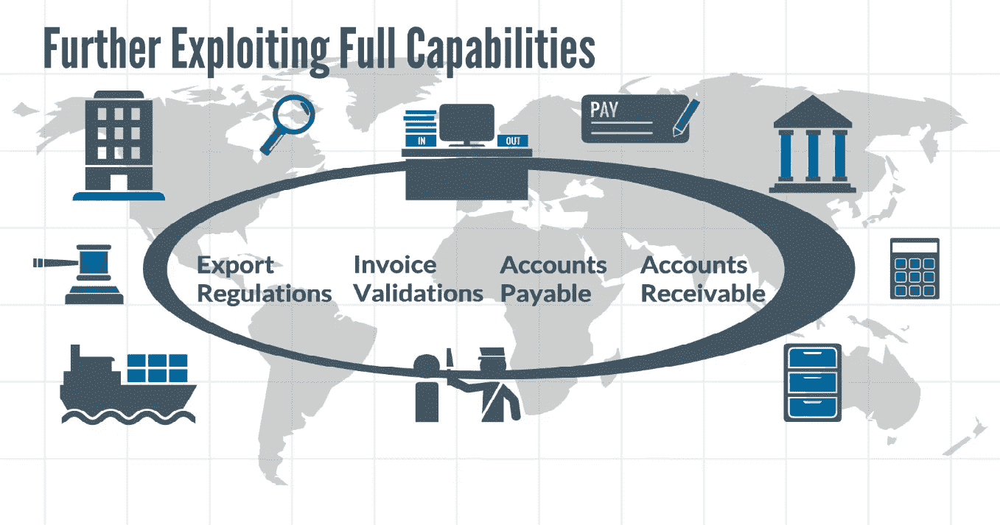

# 2018 年最新交通行业趋势值得关注

> 原文：<https://medium.com/swlh/the-newest-transportation-industry-trends-in-2018-237b9152cc74>

随着运输行业的竞争日益激烈，相关公司应该部署新的现有技术，并广泛提高服务质量，以保持业务。即将到来的引领整个物流行业的制胜策略有哪些？

运输货物是每个国家经济的重要组成部分。根据 Statista 的数据，2016 年，卡车运输对美国国内生产总值的贡献超过 1500 亿美元。仅领先的货运公司联邦快递在同一年就创造了超过 6000 万美元的收入。物流公司大多专注于服务电子商务市场。联邦快递的创始人弗雷德·史密斯预测，到 2018 年，这个市场的价值将达到近 2.4 万亿美元，比 2016 年增长 26%。

运输行业成功的关键是提供最具成本效益、最灵活、最高效的服务。这就是为什么航运公司应该转向运输业的现代战略和趋势，以与市场参与者竞争。

# 趋势#1:司机使用电子设备，道路更安全

电子日志设备(ELDs)可能会对 2018 年的交通运输行业产生重大影响。这些设备旨在让司机每周最多工作 50 小时，休息两天，通过鼓励司机充分休息，使道路更加安全。虽然，承运人可能不再像过去那样用 ELDs 装运那么多货物。此外，这些设备的成本将包含在服务价格中。到 2018 年 4 月，通过卡车运输货物的运输公司必须实施 ELDs。

# 趋势 2:无人驾驶卡车

自动驾驶卡车的技术仍在完善中，它必须克服某些障碍，例如改进无人驾驶软件，使其能够在交通繁忙的城市道路上有效运行。然而，这是交通运输的未来趋势之一。从长远来看，运输企业应该开始为行业内即将到来的技术变革做准备，并开始为他们的卡车配备能够向真正的司机学习的自动导航系统。

由于[人工智能](https://stfalcon.com/en/blog/post/artificial-intelligence-in-website-development) (AI)和无数传感器，支持人工智能的车辆可以正确评估路况，并学习卡车司机在道路上异常情况下的行为。此外，通过车对车(V2V)通信，卡车可以共享学习到的信息，使其他车辆更加智能。从长远来看，这些车辆可能会成为比人类驾驶员更好的驾驶员。

事实上，这个未来比它看起来更近。特斯拉的电动半卡车具有自动驾驶功能，可以极大地方便驾驶过程。沃尔玛以及许多其他公司，如百事可乐、Asko 和 Loblaw，都证实已经订购了特斯拉 Semi 卡车，以满足他们的商业需求。

# 趋势#3:法规遵从性

更正确的说法是，法规合规性是必须的，而不是交通运输的最新趋势之一。商业运输公司应及时了解任何地方、州或联邦管理机构采用、更改或取消的最新要求和法规。无论是关于电子日志、加班或安全规则的法规，及时监控法规将永远是一种趋势。

# 趋势#4:物流中的区块链

区块链成为交通新趋势之一。卡车运输中区块链技术的一个潜在使用案例是确保性能历史记录的准确性。当一辆卡车第二次出售时，潜在客户可能会对这辆车的使用方式产生疑问。由于区块链交易是不可变的和透明的，参与交易的所有各方都可以确信关于卡车的信息是可信的。

区块链在交通领域的另一个潜在用途是容量监控。运输费用取决于货运量。使用物联网传感器可以帮助确定特定货物占用的空间。该数据可用于计算运输成本。将这些信息存储到与智能合同签署的区块链系统中，将允许根据货物占用的空间量自动执行付款。

# 趋势#5:地址交付

电子商务业务的增长导致对地址递送的需求增加。提供更好的服务意味着更有竞争力。重型卡车运输企业应该考虑增加小型车队，以占领更大的市场份额。然而，最后一英里的交付导致紧张的运输时间表，甚至额外的供应链风险。无论如何，地址递送是 2018 年运输和物流行业的趋势之一。

# 趋势 6:扩张低成本航空公司

低成本航空公司已经赢得了巨大的市场份额，并对航空运输定价产生了重要影响，特别是在欧洲和北美。他们有不同的服务级别，足以让不同的客户只为最少的一组服务付费。低成本航空公司积极扩张，同时降低价格以保持飞机满员。其中一些既关注国内航班也关注国际航班。他们的低价格主要与他们工作的国家的低劳动力成本和克服特定距离所需的较小部分燃料有关。这就是运输公司应该努力提高服务效率的原因。

# 趋势#7:无人机送货

在零售商和运输公司的最后一英里交付趋势中，一些公司测试通过无人机交付包裹。2016 年底，亚马逊首次使用无人机向其客户交付订单。这种递送是在亚马逊名为 Prime Air 的新项目中在英国进行的，这意味着客户可以在 30 分钟内收到包裹。在亚马逊取得成功后，各种公司开始投资无人机送货，以提高其业务的成本效益。考虑到这种方法的机会，通过无人机运送包裹将成为 2018 年主要的运输市场趋势之一。

随着运输公司费用(燃料、汽车零部件等)的增加。运输公司应该应用新的方法和策略来提高他们的效率和机动性。出于同样的目的，他们应该向前看，准备投资为车队配备智能设备，并部署现代技术来促进交付。

Stfalcon 已经与运输公司合作了大约十年，我们已经为货运和客运业务开发了[许多](https://stfalcon.com/en/portfolio) web 应用程序。我们知道如何让您的交付更高效、更经济。请在 info@stfalcon.com[给我们写封短信，了解更多信息。](http://stfalcon.com/en/contacts)

## 【stfalcon.com】原载于

**

## *这篇文章发表在 [The Startup](https://medium.com/swlh) 上，这是 Medium 最大的创业刊物，拥有 294，522+人关注。*

## *在此订阅接收[我们的头条新闻](http://growthsupply.com/the-startup-newsletter/)。*

**