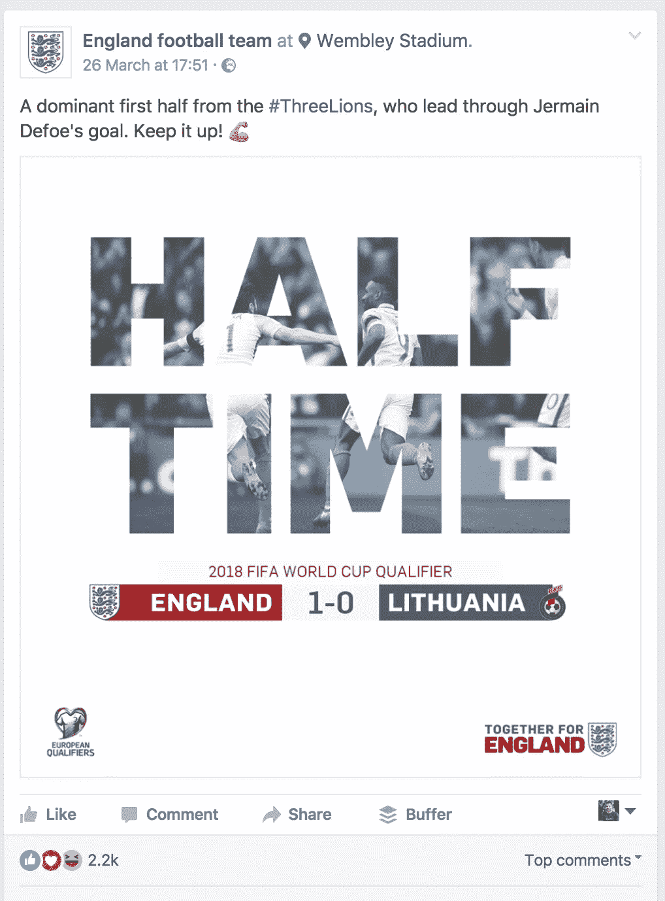
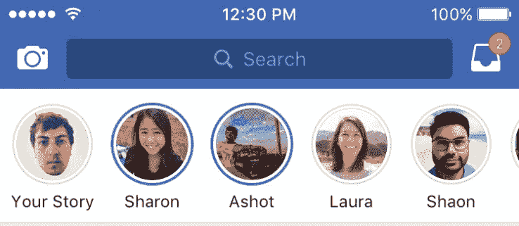
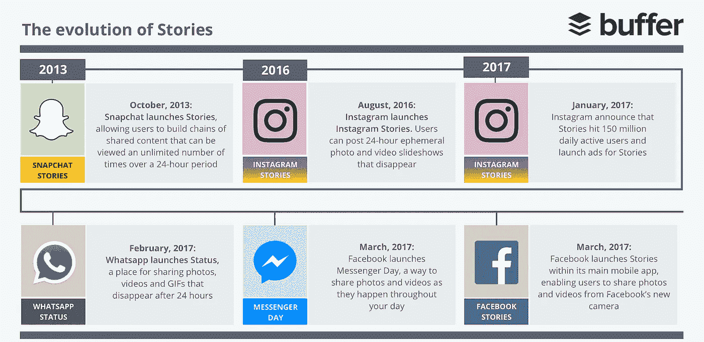
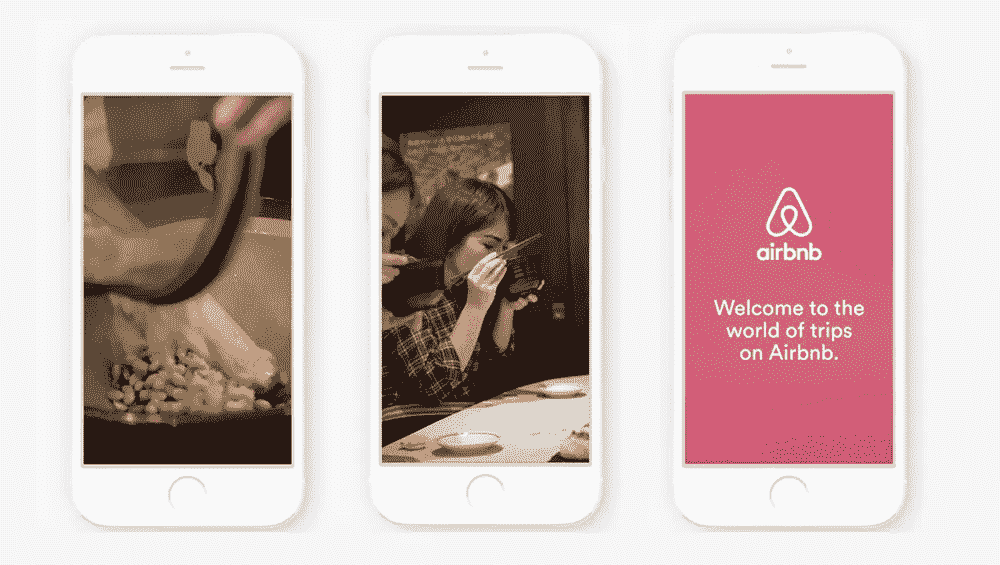
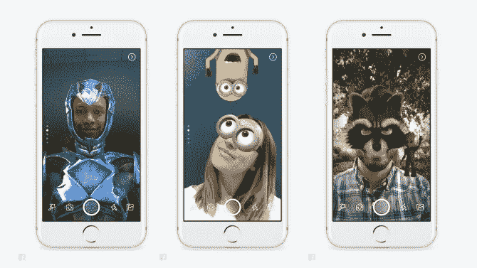

# 新闻源已经过时

> 原文：<https://medium.com/swlh/the-news-feed-is-outdated-c049c93a5581>

## 故事如何改变我对社交媒体的看法

[This post was originally published on Buffer’s blog](https://blog.bufferapp.com/the-news-feed-is-outdated).

现在，我们在网络上期待的标准正在为移动设备而改写。故事在 Snapchat、Instagram、Whatsapp、Messenger 和脸书的兴起就是一个完美的例子。

**新闻提要已经过时，而** **的故事正在成为内容消费的默认选择**。

很少有格式、功能、应用或服务是真正独特的。

例如，脸书并没有发明垂直滚动提要。

几十年来，在马克·扎克伯格被哈佛大学录取之前，在线内容一直是以垂直滚动的方式浏览的。

从阅读博客和新闻网站上的内容到查看你的哪些朋友最近[在 Bebo](https://cnet3.cbsistatic.com/img/8eAdCYbMownrmzXyjo1pvbrkEao=/2008/12/09/419ece6e-fdbd-11e2-8c7c-d4ae52e62bcc/bebo-Home_mail_420.png) 上做了改变，从我记事起，我们就习惯于看到垂直汇总的数据。

脸书实际上推广的是算法排序提要，这是他们在 2006 年发布新闻提要时开创的。

自从新的 Feed 推出以来，我们已经看到了脸书对整个网络的影响，许多平台也采用算法向用户展示更具体、个性化的内容，一些数据奇才认为他们会感兴趣:

*   2016 年，Instagram 转向了[算法排序的 feed](https://blog.bufferapp.com/instagram-news-feed-algorithm)
*   Twitter 推出了“[当你不在的时候](https://blog.twitter.com/2015/while-you-were-away-0)”来显示自从你上次打开应用程序以来你可能错过的推文
*   Medium 根据您过去阅读/推荐的内容对您的主页进行排序

现在，自从 [Snapchat](https://blog.bufferapp.com/snapchat) 使 stories 格式变得突出以来，我们已经看到它的影响在整个移动领域得到了反映，世界上许多最大的社交/媒体产品都实现了自己的版本。从[脸书故事](https://blog.bufferapp.com/facebook-stories)到媒体系列和[推特时刻](https://blog.bufferapp.com/twitter-moments)。

你总是看到它。当一个应用或产品爆发并挑战规范时，其他应用或产品将会跟进。你只需要看看在过去几年里有多少优步 X 或 Tinder 风格的应用程序已经发布。

但是为什么我们会看到这种对成功新技术的抄袭呢？

作为《连线》的作者，[大卫·皮尔斯解释道](https://www.wired.com/2017/03/medium-series/)，当一个系统工作时，如果每个人都实现它，它会变得更容易:

> *拥有一个被广泛采用的系统只会让生活变得更容易，因为人们不必每次想尝试一些东西的时候都去学习一门新的语言和舞蹈。例如，不久前在台式电脑上就发生了这种情况:最终决定键盘应该是 QWERTY 键盘，界面应该是图形化的，而且东西应该上下滚动。*

# 为什么故事是新的新闻源

## 新闻提要并不是手机上的一种本地体验

该新闻源是为桌面设计的，是一个分享基于文本的状态和链接的好地方，这些状态和链接指向你最喜欢的博客文章、最有趣的 YouTube 视频和你假期照片的完整相册。但是社交媒体现在已经向前发展了。

脸书现在达到[18.6 亿月活跃用户](http://mashable.com/2017/02/01/facebook-earnings-record-user-growth/#y8l4tK2L9iqK)，收入和用户增长的最大驱动力在移动。**脸书现在拥有 12.3 亿日活跃用户，其中 11.5 亿是手机用户。就广告收入而言，移动广告也占到了总收入的 84%。**

相比之下，随着移动设备在网络上的主导地位日益增强，脸书在其平台上分享的原创用户生成内容有所下降，据报道，2015 年年中至 2016 年年中下降了 21%。

脸书相机产品经理 Connor Hayes [向 TechCrunch](https://techcrunch.com/2017/03/28/storybook/) 解释说:“10 年来，人们被提示分享的方式是非常以文本为中心的。“即使你看看我们在手机上的做法，你也会发现屏幕的一半仍然被你用来输入文本。”

虽然脸书的用户生成内容呈下降趋势，但据报道，Snapchat 每天的视频浏览量超过 100 亿次，Instagram 用户每天也有超过 1.5 亿人在创作故事。

似乎分享到订阅源不再那么吸引人了。通过垂直订阅来消费内容也不是。

# 照相机正成为交流的焦点

使用新闻提要，用户必须投入大量工作才能获得任何价值:内容被空白空间包围，你必须滚动才能找到你感兴趣的内容，而且通常内容不会占据整个屏幕，所以你必须点击才能享受完整的观看体验。

“我们喜欢把相机想象成新的键盘，”一位脸书产品经理告诉 TechCrunch 。在 [Snap 致投资者的 IPO 信函](https://www.sec.gov/Archives/edgar/data/1564408/000119312517029199/d270216ds1.htm)中，埃文·斯皮格尔写道:“就像闪烁的光标成为台式电脑上大多数产品的起点一样，我们相信相机屏幕将成为智能手机上大多数产品的起点。”

有时很难用语言来概括瞬间或感受，这就是相机作为一种交流工具发挥作用的地方。通过照片和视频，我们可以与我们最亲近的人分享我们生活中有趣、短暂的时刻，而不需要一两次总结它们。

当然，相机不会完全取代我们对键盘的需求，如果有可能的话。脸书将故事视为一种“添加剂”，与新闻供稿和他们的其他产品并列，而不是取代它们。“我们已经在市场上用 [Instagram Stories](https://blog.bufferapp.com/instagram-stories) 和 Messenger Day 进行了测试，我们认为这是一种增值。他们最终会发布更多内容，他们喜欢在应用程序之间使用故事格式。

# 分享习惯的转变

随着 Snapchat 的兴起，我们已经习惯了整天分享多次频繁的更新——这种交流方式不适合传统的基于网络的垂直订阅。

使用垂直订阅源，很难将几组帖子组合成一个有凝聚力的故事，人们可以很容易地跟随。一个恰当的例子是脸书的体育直播，我经常在一场比赛结束后的几个小时内看到比分和比赛中的更新。

An update in the Facebook News Feed

但是有了故事，一切都在那里，从开始到结束都在一个地方。观众总是在最新或最受欢迎的帖子之前看到故事中的第一个帖子。

故事的美妙之处在于它们很容易被创作和消费。只需轻点几下，你就可以创建并分享你一天中的片段。故事让我们能够分享生活中激动人心的生动瞬间。我们可以分享身临其境的故事，讲述一个 24 小时内的故事，而不是将我们一天中的精彩片段发布到新闻提要上。

正如过去十年左右，新闻订阅一直是发现和消费内容的默认方式一样，我觉得现在所有的社交渠道都转向了类似故事的移动原生方式来创建和消费内容。故事的短暂性质*——它们在每个频道播出 24 小时后消失*——也使它们成为必看内容。

“故事是一种格式，不是一个应用程序，”脸书前产品设计师米尔斯·贝克在 Quora 上解释道。“当 Periscope 和 Meerkat，以及后来的 Twitter 和脸书(以及其他公司)推出“直播”视频时，或者当多家公司为“360 度”视频提供解决方案时，我们认为它更接近于一种商品功能，而不是一种独特的创新。”

脸书故事的推出使脸书开始逐步转向真正为移动/视频世界打造的移动产品。有了 stories，脸书的核心产品和新闻源继续为每个人服务，但它们现在可以同时支持新用户和渴望分享的用户。

自 2016 年 8 月推出 [Instagram Stories](https://blog.bufferapp.com/instagram-stories) 以来，脸书已经在其各种平台上推出了 Messenger Day、WhatsApp Status 和[脸书 Stories](https://blog.bufferapp.com/facebook-stories) 等各种故事。

此外, [Twitter 推出了 Moments](https://blog.bufferapp.com/twitter-moments) ,作为一种将多组推文拼接成一个故事的方式，Medium 最近推出了系列，作为一种鼓励用户创作随时间推移而展开的故事的方式。

# 故事如何改变我对社交媒体的看法

当 Instagram 第一次引入 Stories 时，感觉有点像一个噱头:*“嘿，Snapchat 的酷孩子在做故事。我们也做吧。但是故事不仅仅是一个噱头。它们可能会给我们创造和消费内容的方式带来翻天覆地的变化。*

随着最近脸书故事的推出，这种格式现在已经暴露在脸书 11.6 亿移动用户面前——比已经在 Instagram 和 Snapchat 上使用故事的人多得多，insta gram 和 Snapchat 都有大约 1.5 亿人使用这一功能:

*   Snap 在他们的 S-1 文件中宣布，Snapchat 在 2016 年第四季度拥有 1.58 亿日活跃用户
*   Instagram 宣布，2017 年 1 月[Stories 拥有 1.5 亿日活跃用户](https://techcrunch.com/2017/01/11/instagram-stories-hits-150m-daily-users-launches-skippable-ads/)

就本质而言，故事比其他类型的数字和社交内容更具沉浸感。这种体验存在于一个单一的地方，不会试图将你带到新的网站和平台*(尽管 Instagram* 已经*尝试了故事中的链接*)。

# 创造分享经验的机会

社交媒体的未来将不再仅仅是分享完美的时刻。这将不再是关于转发和有多少人喜欢你的内容。这是关于深入，而不是广泛:每天有多少人收听你的故事；有多少人直接与他们的朋友和关系密切的团体分享你的内容，以及我们如何通过分享经历用讲故事来创造共鸣。

用户生成的内容对品牌来说一直很有价值，但故事将可能性提升到了一个新的水平，并创造了一个空间，每个人都可以在重要时刻创建和分享真实的内容。

例如，Snapchat 定期围绕大型和重要事件策划众包故事，让任何人，而不是“影响者”，在一个地方大规模分享他们的经验。

Snapchat 还开放了搜索功能，允许用户根据主题搜索要关注的账户或要看的故事。

这为用户发现与他们相关的内容提供了新的机会——无论是他们家乡的本地事件还是大型国家体育赛事。

媒体上的系列，另一个基于故事的功能，也使创作者和消费者之间分享经验。例如，一个系列讲述了一个人训练灌篮的故事，记录了他一路上的奋斗。

连续剧在几个方面不同于故事:连续剧是永久性的，作家可以同时创作多个连续剧。有了 Series，你不必就内容发表长篇大论，而是可以定期讲述一个故事，以一种移动友好的方式进行创作和消费。

# 品牌(和美元)跟随关注

故事格式作为一种用户行为已经获得了发展速度，并且深受在社交媒体上做出贡献的个人的喜爱:你、我、我们的朋友和家人。像新闻提要这样的转变和像故事这样的转变首先是因为个人的需求而发生的。随着越来越多的人开始使用一个平台或行为，企业也随之而来。

在脸书、Twitter 和 Instagram 的早期，许多企业不太知道如何使用这些新平台。但是那些成功的人赢得了大胜利。

社交媒体的早期采用者知道，人们的注意力正从广播、电视和电子邮件等更传统的渠道转移到社交媒体上。他们以一种真实的、令人信服的方式加入了对话，并开始从零开始建立庞大的受众，并将他们的预算从传统广告渠道转移到社交媒体。

感觉我们即将再次看到类似的转变，注意力从垂直卷轴转移到故事上。

Airbnb Instagram Stories ad

广告收入总是会随着关注而增加。随着脸书的主要应用程序和 Instagram 增加了故事，脸书创造了额外的收入流和机会，将新闻内容以外的内容货币化。

除了付费营销机会，还会有更多通过故事进行接触和参与的机会，因为这是许多消费者将要使用的媒介。企业对 Instagram 故事的快速采用就证明了这一点。

> “通过 Instagram Stories 进行身临其境的故事讲述，吸引并邀请我们的社区成为冒险的一部分。“Instagram 为我们提供了围绕我们最近推出的产品 Airbnb Experiences 建立知名度的完美工具，”[Airbnb 社交营销和内容全球主管 Eric Toda](http://blog.business.instagram.com/post/155717870326/business-insights-and-ads-in-stories) 说。“通过创作和发布体验驱动的故事，我们可以真正吸引并接触到希望在 Airbnb 上预订理想旅行的旅行者。”

# 新的广告机会

脸书每个季度都赚取数十亿美元的利润，主要来自其令人难以置信的广告产品。是的，你猜对了，新闻也给脸书带来了新的广告机会。

Snapchat 和 Instagram 已经在你朋友或你关注的其他账户的两个故事之间加入了广告，我认为用不了多久，我们也会在脸书上看到故事之间的广告。

这里的一个大机会是在以前很难产生广告收入的地方创造额外的广告空间，比如 Messenger 和 Whatsapp。

对话很难赚钱，如果脸书在即时消息中插入广告，可能会引起用户的极大愤怒。然而，视频之间的广告更容易被接受。如果 Messenger Day 和 Whatsapp Status 开始受到关注，脸书可能有办法从这两款产品中增加收入。

*类似地，连续剧也可以为在幻灯片之间播放全屏插播广告的媒体提供一条收入途径。*

## 增加相机收入

新的脸书相机还配备了六个类似 Snapchat 的镜头，这些镜头来自六个主要的好莱坞工作室，用于宣传当前或即将上映的电影:

这是脸书从其最大的广告商那里创造额外收入的另一种方式*(这些广告商能够负担得起与这些类型的赞助相关的可能六位数或七位数的成本——据报道 Snapchat* [*以每天 45 万至 75 万美元的价格出售*](https://www.ft.com/content/4e2f193c-6860-11e5-97d0-1456a776a4f5#axzz3nLagUJcj)*。*

*Snapchat 上的赞助商镜头已经被证明是一种很好的商业广告模式，佳得乐的赞助商超级碗镜头在超级碗周末 [**产生了超过 1 亿的观看量**](https://twitter.com/Gatorade/status/696787243277615104)**——这几乎是比赛在电视直播中获得的观看量(1.119 亿)。***

***通过在自拍上使用增强滤镜，让自己成为内容的一部分，品牌可以为消费者创造有趣、可分享的体验，而不是广告。***

***通过整合故事和推出一款新相机，脸书在以前广告会觉得具有侵略性的地方开辟了新的广告机会。***

***故事不仅仅是另一个功能或时尚。它代表了我们在移动设备上交流方式的彻底转变，挑战了规范，打破了我们创造和消费内容的模式。***

***尽管许多市场对脸书故事的接受没有 Instagram 上故事的接受那样迅速，但我坚信该功能的推出标志着一个巨大的转变。这感觉就像是对未来的一瞥，我真的被故事的潜力所激动。***

****原载于 2017 年 4 月 11 日*[*blog.bufferapp.com*](https://blog.bufferapp.com/the-news-feed-is-outdated)*。****