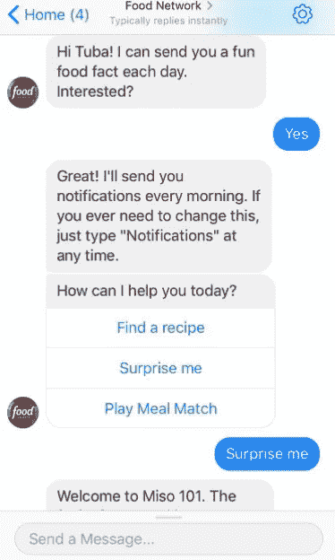

# 下一件大事？聊天机器人

> 原文：<https://medium.com/swlh/the-next-big-thing-in-content-marketing-chatbots-54ad20603c25>

我们都曾得到过客服聊天机器人或致力于特定任务的助理的帮助。但是真正想在聊天机器人领域引起轰动的企业正在将注意力转向作为内容交付系统的聊天机器人。为什么企业应该关注聊天机器人中的内容？[随着用户关注消息而不是他们的社交源](http://www.businessinsider.com/the-messaging-app-report-2015-11)，消息平台有可能成为推动内容和营销的下一个大渠道。这意味着希望在行业中保持相关性的品牌必须做好适应的准备。

# **为什么使用聊天机器人获取内容？**

聊天机器人最大的特点之一是 te 非常适合用户个性化。虽然内容传统上围绕搜索词或趋势来寻找可发现性和相关性，但聊天机器人可以通过从用户那里获得的大量数据为用户提供相关内容。

> “更个性化的交付使您的内容对用户更具吸引力，有助于提高点击率和用户满意度。”

接下来，聊天机器人作为内容帮助你人性化你的品牌，以一种他们觉得自然的随意方式与用户联系。例如，你可以创造一个友好、有趣的角色作为品牌大使。也就是说，对于一个[聊天机器人内容策略](https://botanalytics.co/blog/2017/10/02/develop-chatbot-content-strategy/)来说，仅仅拥有良好的个性是不够的，尽管我们将在下面深入探讨如何构建优秀的内容聊天机器人。

# **围绕用户需求设计角色**

> “一个有效的内容聊天机器人应该找到一种新颖的方式来支持你的品牌或公司的目标和价值观——就像你现有的产品或服务一样。”

你的品牌旨在解决什么问题，聊天机器人如何支持它？一个惊人的例子是卡斯帕的 [Insomniabot-3000](http://insomnobot3000.com/) 。Casper 是一个床垫品牌，旨在给顾客一个美好的睡眠，但那些失眠的人无论睡在什么床上都会有睡眠障碍。Insomniabot-3000 让事情变得稍微好一点，它让失眠症患者在深夜他们的朋友都睡着了的时候有人可以说话，以一种创造性和幽默的方式支持该品牌的使命——帮助那些睡眠质量低的人。

Casper’s Insomniabot-3000

# **增加你已经提供的经验**

这种内容策略非常适合娱乐行业的品牌。一个内容聊天机器人可以把一个想象的世界带入生活，让用户置身其中。这可以通过与吉祥物或虚构人物的讨论或通过类似游戏的体验来实现。Activision 是一家很好地实现了这两种风格的公司，它使用聊天机器人来增强其广受欢迎的*使命召唤*视频游戏系列。

该公司的第一款*使命召唤*聊天机器人是一款基于*使命召唤:无限战争*主角雷耶斯中尉的[。动视公司通过在之前的游戏中隐藏复活节彩蛋，将用户引向脸书上的聊天机器人，从而使聊天机器人成为一个奇观。聊天机器人在第一天就收到了超过 600 万条信息，这些信息将用户导向了即将到来的游戏的独家预告片。Activision 本可以以传统方式发布预告片和其他内容，但他们的 Lt. Reyes chatbot 却模糊了小说和现实之间的界限，为忠实粉丝提供了一种独特的方式来参与他们建立的世界。](https://venturebeat.com/2016/05/03/call-of-duty-infinite-warfares-first-victory-6m-bot-messages-on-facebook/)

Activision 的第二个聊天机器人系列于*无限战争*发布前一周发布，采取了[导游](http://www.alistdaily.com/social/call-duty-infinite-warfare-explores-space-facebook-messenger/)的形式，通过选择自己的冒险风格体验。用户与宇宙中的导游 Alana 聊天，Alana 用幽默的结果指导他们了解游戏中未来的太阳系。这种体验在性格和语气上与第一次不同，但用于增强和推广相同的产品，展示了如何通过聊天机器人更新体验和重新吸引用户群。

# **以新的方式利用现有内容**

你如何确保你的常青树内容在网上推广后不会在以太网中丢失？虽然你可以单独依靠 SEO，但一个可靠的替代方法是在对话中最相关的时候，通过聊天机器人把它推给用户。

因为聊天机器人随时提供复杂的个性化和即时通信，它们是帮助用户发现内容的好方法，否则这些内容可能会被忽视。

这里要记住的重要事情是*用户何时、何地、为何以及如何*想要或需要你的内容。一个很好的例子是[美食网聊天机器人](https://www.foodnetwork.com/site/apps/chatbot)，它让用户可以通过几种简单的方式从美食网网站上轻松搜索和发现菜谱。它最令人印象深刻的功能是，用户可以询问最近在电视上播放的食谱(与用户的观看习惯很好地匹配)，或者在厨房免提时调用基于配料的食谱(通过 Alexa 技能)。

# **跟上聊天机器人分析，看看什么在起作用**

你如何知道你的内容聊天机器人在吸引用户方面有多有效？就像跟踪网络内容的分析一样，你需要跟上[对话分析](https://botanalytics.co/)的步伐，看看是什么吸引了用户，是什么给他们带来了问题。例如，通过跟踪对话中最常用的短语或单词，您可以发现什么主题对您的用户最重要，以及什么时候最重要。由此，您可以更有效地设计跨所有平台的内容策略。

## 这篇文章发表在 [The Startup](https://medium.com/swlh) 上，这是 Medium 最大的创业刊物，有 351，974+人关注。

## 在这里订阅接收[我们的头条新闻](http://growthsupply.com/the-startup-newsletter/)。

