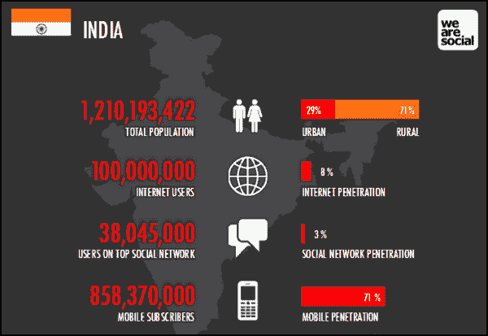

# 内容战争:占领印度的竞赛

> 原文：<https://medium.com/swlh/the-next-frontier-in-digital-entertainment-conquering-india-a7456a39867b>

印度快速发展的数字娱乐产业所带来的机会的规模和深度令人震惊。印度是新数字进入者的理想市场。

> 拥有 13 亿人口和 9.7 万亿美元的购买力，国内外玩家都在积极努力进入这个市场并不奇怪。网飞、亚马逊和 Hotstar 等媒体巨头正在投入大量资源制定占领印度市场的战略。然而，目前还没有一家公司能够获得重要的立足点。

我们在过去的十周内与该国的一系列初创公司和媒体巨头进行了交谈+进行了调查+深入的二次研究，以便更好地了解该国正在酝酿的内容战争。

这是我们的发现:

**市场机遇**

传统的市场因素使得印度的数字化成为一个有吸引力的机会。首先，该国的媒体和娱乐业继续增长，预计到 2021 年将达到 348 亿美元。

*互联网采用*

印度越来越多的互联网用户为数字玩家提供了越来越多的机会。近年来，互联网的使用增长到了大约 38%。虽然与美国等拥有 76%普及率的国家相比，这一比例似乎较低，但考虑到印度的庞大人口，这仍代表着近 5 亿消费者。此外，转换剩余的 62%是一个巨大的机会，使市场非常有吸引力。幸运的是，数字希望者不必等待太久就能获得这一增长的好处，因为假设目前的趋势持续下去，渗透率预计将在 2020 年达到 60%。

虽然有大量人口的可支配收入较低，但该国惊人的收入不平等造就了大量的中上层阶级。到目前为止，这些课程是美国互联网普及的最大推动力。虽然存在争议，但这种分散的互联网采用为数字玩家创造了机会，他们现在明白，他们赢得这一关键市场的战略的一部分是开发印度穷人和农村人口可以获得的解决方案。

*手机普及*

此外，智能手机和蜂窝数据使用的增加为互联网创造了新的接入点，特别是对互联网普及率较低的贫困和农村公民而言。大型企业 Reliance Industries 引入移动网络 Reliance Jio，推动了印度互联网使用的增长。

> 自 2016 年 9 月推出以来，该公司已经“获得了超过 1 亿用户——许多人生平第一次连接到移动互联网。”

Jio 的引入不仅增加了现在通过移动设备访问在线内容的用户总数，还增加了在这些设备上发生的消费数量，因为对于价格敏感的消费者来说，数据定价现在是一个低得多的壁垒。

**不断发展的数字浏览器**

印度的第一批数字消费者是生活在城市地区的男性千禧一代。然而，随着互联网和手机在该国的渗透率增加，普通数字观众的形象正在发生巨大变化。

> 2016 年至 2017 年间，数字使用量增长最快的是三个群体:女性、老年千禧一代和农村人口。

*女人*

女性，尤其是小城市的女性，正在快速上网。根据 Hotstar 的*印度观察 2018 年报告*，在 2016 年至 2017 年期间，人口在 1L 和 10L 之间的城市中的女性在线使用增长了三倍，相比之下，大都市地区和至少有 100 万居民的城市中的女性增长了两倍。这一趋势归因于越来越多的廉价智能手机可供选择，这使得妇女和农村地区的人第一次能够在他们的移动设备上访问在线内容。女性互联网用户的增加也很重要，因为女性拥有巨大的购买力，控制着 44%的家庭支出。

*千禧一代*

印度千禧一代的特点是强大的购买力，互联网接入的增加，以及超过 4 亿的人口数量。与中国和美国等其他主要市场相比，印度人口相对年轻。事实上，据摩根士丹利称，到 2020 年，印度有望成为世界上最年轻的国家。此外，他们比前几代人受教育程度更高，与全球的联系也更紧密，他们希望内容和信息能够自己找到，而不是像老一代人那样通过印刷和电视渠道主动寻找。

有了这些因素的作用，千禧一代以及更少的一代人成为印度数字消费增长的驱动力就不足为奇了。随着移动和数字的采用(通常)与年龄成反比，消费品牌将印度的千禧一代和 Z 世代作为主要的人口统计对象也就不足为奇了。

*印度农村*

虽然主要大都市地区的居民消费增长了 3.5 倍，但在较小的城市，这一增长最为明显——是 2016 年的 4.3 倍。推翻了大都市地区是所谓的“不眠之城”，因此比较小地区的消费更高的流行观点，我们的研究证明，较小地区的总体消费和疯狂观看率最高，那里的人口比大城市地区的人口醒得更晚。

**改变消费模式**

印度人口越来越倾向于数字媒体，而不是传统的印刷、电视和电影。据 eMarketer 称，“数字媒体将占据印度近三分之一的日常媒体时间”。今年，平均每个成年人每天会花大约 1 小时 18 分钟在数字媒体上。

*控制、便利和质量*

2018 年第一份印度观察报告强调了消费者习惯的一些有趣转变。新一代消费者优先考虑控制和便利。在线视频消费在过去一年增长了 5 倍，随着一些网络连续剧的观众人数开始首次超过印度最受欢迎的在线电视节目，网络连续剧正在获得牵引力。

有趣的是，该报告还指出，Hostar 超过 96%的观看时间来自超过 20 分钟的视频:这让我们相信消费者愿意在高质量的内容上投资时间。就类型而言，体育和宝莱坞电影继续推动最高的参与度，喜剧和电视剧排在第二位。

*地区内容*

第二个关键转变是地区内容的普及。印度有超过 1.25 亿人说英语:在网上，英语仍然是印度的主导语言。精英观众主要消费英语内容:预计到 2025 年，这一人群将从 8%增加到 16%。然而，这些用户中的 70%也查看其他语言的内容。

重要的是，毕马威印度谷歌最近的一项研究发现，近 70%的印度人认为本地语言的数字内容比英语内容更可靠。区域语言 OTT 市场每月增长 60–65 %,而区域内容占印度整体在线视频内容消费的近 45%。

此外，根据同一项研究，到 2021 年，预计将有 2.01 亿印地语用户(占印度互联网用户群的 38%)上网。鉴于其需求的增长速度，预计 2018 年地区内容将占整体数字消费的 20-25%。

> 向创建地区内容的转变才刚刚开始，并将成为印度市场未来内容消费增长的关键驱动力。

*个性化内容*

通过我们的采访和消费者调查，消费模式的另一个转变是从家庭观看转向个人内容消费。我们认为这种转变值得注意，因为从家庭到私人环境的转变创造了为各种人群创造更多个性化、当代内容的机会。

**敬请关注第二部分，我们将分析媒体领域的现有参与者，并强调为什么我们认为尽管争夺印度眼球的竞争日益激烈，但仍有足够的空间接纳新的参与者和方法。**

*本文由 Candace Jones & Natasha Malpani 发表，她俩都是斯坦福大学 2018 届 MBA 班的学生。在过去的十周里，他们采访了该国的几个数字平台，进行了二次研究，并调查了 200 多名印度数字内容的消费者，以探索这个复杂市场带来的机遇和挑战。这个项目是由斯坦福的前任院长监督的。*

## 这个故事发表在[的创业](https://medium.com/swlh)上，这是 Medium 最大的创业刊物，有 332，253+人关注。

## 订阅接收[我们的头条新闻](http://growthsupply.com/the-startup-newsletter/)。

