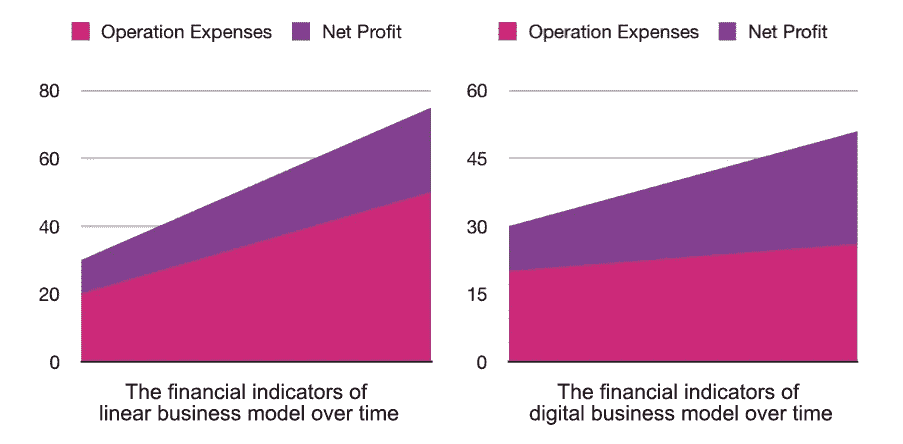

# 下一代 IT 服务提供商

> 原文：<https://medium.com/swlh/the-next-generation-of-it-service-providers-c929f30bdaea>

IT 外包是技术驱动型企业在不牺牲核心产品质量的情况下控制运营成本的最常用策略之一。

“[为什么企业外包](https://anadea.info/blog/software-development-do-it-inhouse-or-outsource)”是一个反复出现的话题。虽然外包的想法似乎是一个古老的故事，但客户与 IT 服务提供商建立合作关系的方式正在迅速变化。这种变化在很大程度上反映了提供商从根据客户需求销售纯技术解决方案的公司到在软件开发生态系统的不同领域拥有丰富经验的公司的演变。在 Anadea，我们观察到许多新客户寻求我们的合作主要是因为[我们的多学科专业知识](https://anadea.info/projects)，这使我们能够建议客户如何最好地从我所说的“线性商业模式”过渡到“数字”模式。我将很快回到这些概念。

不过，首先，我想提出两个主要原因，说明为什么客户对整体解决方案比短视的解决方案更感兴趣。

1.  我们已经到达了一个技术进步的点，在这个点上，促进多个系统、服务或平台之间的通信比以往任何时候都更容易。感谢像[微服务架构](https://anadea.info/blog/microservices)和 REST 这样的概念，我们在很大程度上从对单个技术栈或开发范例的严格遵循中解放出来。
2.  许多企业不再认为定制软件具有内在价值。虽然在过去，公司可能将软件视为自动化日常人工流程的一种方式，但他们现在将其视为从根本上转变核心业务流程的一种方式。换句话说，他们认为这是一种“数字化”的方式。

# 企业如何运作:从线性模式到数字模式

就其本身而言，业务流程的自动化可以通过减少运营支出和提供更好的客户体验来帮助公司变得更加有效。也就是说，专注于流程优化只能产生线性增长，因为收益来自每个流程的边际性能改进。换句话说，“运营量”越高，公司获得的收入就越多。这种策略的问题是难以扩展，因此可能会产生一系列新的低效问题，必须加以解决。

另一种方法是开始数字化思考。虽然“数字化”的想法显然已经融入了时代精神——事实上，仅这一表述就足以在首席执行官的头脑中产生利润率提高的愿景——但很难确定它的确切含义。概括地说，数字化使公司能够发展客户网络，增加销售额，或以独立于员工所能执行的“操作量”的方式控制运营支出。数字化的价值不是边际的，而是指数级的。

下图展示了线性模型和数字模型之间的差异。

看到了从线性业务运营模式转换到数字模式的好处，接下来我们需要解决的下一个问题是公司如何实现这一转变。

也许并不奇怪，从线性到数字商业模式的转变始于我们理解常规商业过程和软件之间关系的方式的根本改变。

而在线性模型中，我们问‘这个软件如何改进一个已经建立的常规操作？“在一个数字模型中，我们首先提出一个问题，‘软件如何能直接为我的业务增值？’

已经采用这种理念的公司与 IT 服务提供商的关系明显不同于那些仍然坚持“线性”模式的公司。“数字”模式的追随者更可能关注这样的问题:“你已经为我的业务部门建立了什么样的解决方案”或“我们如何使用软件实现我们想要的。”他们更关心的是更广泛目标的实现，而不是实施的具体细节。

“数字”公司在另一个重要方面不同于“线性”公司，后者将服务提供商主要视为离散技术服务的供应商，而前者将他们视为知识丰富的合作伙伴，将通过他们的数字化转型为他们提供支持。

世界在不断变化，如果企业想要实现数字化，拥有一个“数字伙伴”是必不可少的。

# 结论

我们在本文中讨论了很多关于线性企业和数字企业之间的区别，以及后者如何从技术创新和与 it 服务提供商的战略合作伙伴关系中获益的巨大机会。然而，对于提供商本身的未来，我们能说些什么呢？

首先，我们可以肯定，随着业务环境的变化，IT 服务提供商将继续随之变化，成为在软件开发生命周期的每一步都知识渊博的领域专家的集合。服务公司的每个人都知道他们在做什么，客户的需求是什么，以及客户计划如何利用公司的产品或服务来改善其业务。虽然技术技能仍然是提供商产品的重要组成部分，但对客户业务运作方式的深入了解也同样重要。当 IT 服务提供商结合了这两种品质时，您可以确信他们能够帮助您向数字化公司转型。

第二个方面是准备好为邀请您参与数字化转型之旅的客户服务。

那么，下一代 [IT 服务公司](https://anadea.info/)会是什么样子呢？首先，它将是跨整个交付流程的领域专家的公司:从客户关系经理到收尾工程师。此外，服务公司的每个人都知道他们在做什么，客户的需求是什么，以及客户将如何使用他们的软件。

*最初发表于*[*anadea . info*](https://anadea.info/blog/the-next-generation-of-it-service-providers)*。*

## 这篇文章发表在 [The Startup](https://medium.com/swlh) 上，这是 Medium 最大的创业刊物，有 305，398+人关注。

## 在此订阅接收[我们的头条新闻](http://growthsupply.com/the-startup-newsletter/)。

