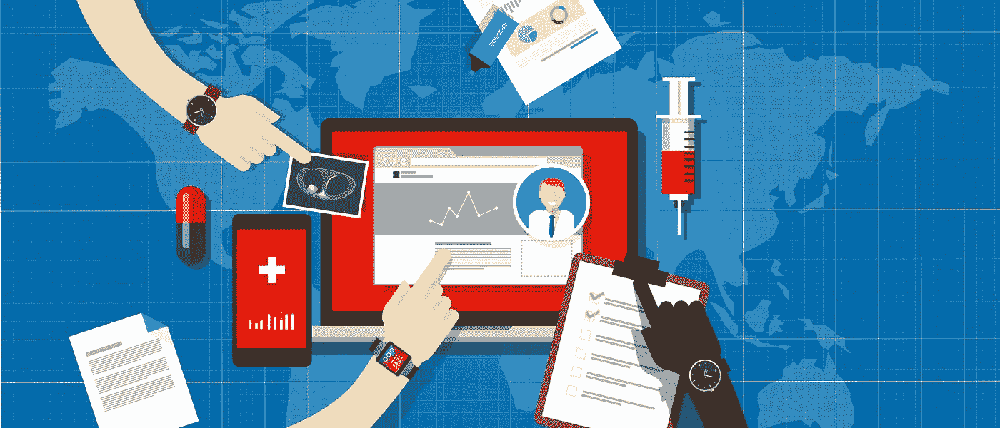

# 设备的下一步？你的健康

> 原文：<https://medium.com/swlh/the-next-step-in-devices-your-health-2c18b0b6a2a>

你可能错过了今年最重要的科技新闻之一。今年 1 月，苹果宣布，他们正在与几家主要医院和医疗机构合作，为 iOS 用户开发一种新的个人健康记录(PHR)功能，基本上允许个人随时将自己的个人病历记录在身上(或者至少嵌入到他们的设备中)。这里的承诺是*便携性*——有机会真正拥有你的病史，并随时随身携带。

当然，这个消息根本算不上什么新闻，至少对那些从 iOS 诞生之初就开始关注它的人来说不是。当 iOS 开发刚刚开始时，我正在苹果公司工作，随身携带个人医疗记录的能力是一个热门话题。我将许多领先的医学院与 iOS 开发团队联系起来，我接触过的每一位医学院院长都希望参与其中。

这也是苹果后来取得突破的动力——包括一些没有像苹果希望的那样取得突破的突破。手表推出时，我已经放弃了苹果，但我自信地说，个人和便携式医疗管理是该产品的主要考虑因素*。它并不十分流行，但在几年后，我们可能会把 Apple Watch 作为一种超前的产品来看待。就像苹果的许多创新一样，它还很早，而且经常不被理解。*

这是因为，虽然这听起来微不足道，但我真的相信个人医疗记录的普遍可携带性是医疗保健领域的下一次大变革——或任何地方的大变革——也是健康和技术交叉的下一个前沿。但是，在便携式医疗记录变得普遍之前，还有一些突破有待实现——包括格式标准化。

这是科技史上一个熟悉的主题。想想 MP3 是如何最终成为音乐的标准文件类型，MPEG 是如何成为压缩视频文件的主流。我可能还会向您介绍 TCP/IP 或传输控制协议/互联网协议，这是允许计算机相互通信的标准网络协议。

值得注意的是TCP/IP 实际上是由一个大学联盟和国防部开发的——不管喜欢与否，我认为我们已经到了另一个政府领导会有所帮助的关头。现在，我不是大政府的支持者，但我是智能政府的粉丝——在我看来，全球政府在这里做出的明智之举是将医疗专业人士和技术创新者聚集在一起，开发标准化的电子医疗记录(EMR)或个人健康记录(PHR)——选择你最喜欢的三个字母缩写(TLA)——并强制使用。

我很难想象有哪个医生不会注册一个真正提供 T2 通用可用性的电子病历系统。想想这对个人的好处，尤其是那些不容易获得初级保健的人；能够轻松上传完整的病史，没有任何麻烦、繁文缛节或(最糟糕的是)丢失记录，将使像远程医疗*这样有限的事情变得更有帮助和影响力。也想想那些不得不去急诊室或紧急护理机构的人；提供完整医疗记录的能力是无价的。这真的可以拯救生命。*

当然，肯定会有担心，比如担心别人会染指你的医疗记录。让我首先说，鉴于人们愿意在脸书和推特上与世界分享的东西，我觉得回避 PHR 应用程序的想法很奇怪。也就是说，技术也可以为这个问题提供答案，也许是以区块链安全的形式。(注意，我使用“区块链”本质上是一个隐喻，一个安全医疗记录的理想；这项技术仍然是如此之新，以至于术语有些争议。)

记住:iPhone 的重大创新是它以客户为中心的用户界面(iOS)，它有效地创造了我们现在称之为“设备”的整个技术类别设备总是与个人有关。这就是为什么我认为人们的健康是所有类型设备的下一个飞跃——苹果再次引领潮流。

## 这篇文章发表在 [The Startup](https://medium.com/swlh) 上，这是 Medium 最大的创业刊物，有 312，596 人关注。

## 订阅接收[我们的头条新闻](http://growthsupply.com/the-startup-newsletter/)。

