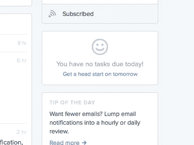
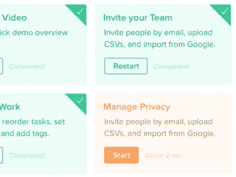

# 设计的九种状态

> 原文：<https://medium.com/swlh/the-nine-states-of-design-5bfe9b3d6d85>

现代 UI 团队首先设计组件；接口仅仅是组件经过深思熟虑的组合。这在“不愉快的路径”上给用户留下了一个明显的漏洞——用户可能会有意或无意地偏离你的理想化流程。当我们学习制作系统而不是页面时，我们必须投入精力来塑造这些经常错过的设计状态，并创建一个可以支持每个人的组件生命周期。这是我所看到的生命周期:

## 州

1.  **没事**

在之前*你的组件做了什么？可能是用户第一次看到吧。可能还没激活。本质上，组件存在，但是*没有启动*。*

[Jonas Treub](https://dribbble.com/jonastreub) makes sure framer gets you up to speed.

2.**装载**

可怕的状态。在一个完美的世界里，没有人会看到这个；唉，我们发现自己在这里。有很多方法可以让你的装载状态微妙而不引人注目。脸书在这方面做得很好:

Facebook uses a “dummy post” rather than a traditional loading spinner.

3.**无**

您的组件已经初始化，但它是空的。没有数据。没有项目。现在可能是让用户行动的好时机(“做这件事！”)，或者是为了奖励他们(“干得好，一切都搞定”)。

[Luke Seeley](https://dribbble.com/lukees) knocked this one out of the park.

4.**一个**

你有一些数据。在输入时，这可能是在第一次击键之后。在列表中，它可能是当你有一个项目(或一个左)。

[Luke Seeley](https://dribbble.com/lukees) again for MetaLab.

5.**有的**

这通常是你首先想到的。这个组件的理想状态是什么？你的数据被加载，你有输入，用户熟悉它。

A big comfy dashboard from [UENO.](https://dribbble.com/teams/ueno)

6.**太多**

哇哦！用户在某些方面做过头了。结果太多(可能你现在分页了)，字符太多(可能省略号？)，等等。

Good ol’ pagination from [Pete Orme](https://dribbble.com/ormeski)

7.**不正确**

组件有些不对劲。出现了一个错误。

A nice error state from dunked.com

8.**正确的**

可以走了！这个项目已经满足了它的需求。

short form [Ionut Bondoc ( ►IB )](https://dribbble.com/IonutBondoc)

9.**搞定**

应用程序已经接收到用户的正确输入。他们再也不用担心这个了。

[Igor Chebotarev](https://dribbble.com/IgorCheb) gives some positive feedback.

这些状态会根据页面、用户交互、更新的数据以及应用程序状态的任何变化而重复。通过针对这些变化进行精心设计，无论用户处于何种情况，都可以为他们创造完美的体验。

这些状态中的许多要么被团队推断出来，要么被遗忘，或者干脆被忽略。这是一个巨大的错误，也是你超越竞争对手的机会。通过将有状态思维集成到您的过程中，您可以在控制应用程序的同时与用户共情。

九种设计状态适用于所有设计和所有组件。*即使*你有意识地决定忽略其中的一个，遵循这条指导方针将确保你*真正思考不愉快的道路*。

发表于*[**# SWLH**](https://medium.com/swlh)**(***创业、流浪、生活黑客)**

******