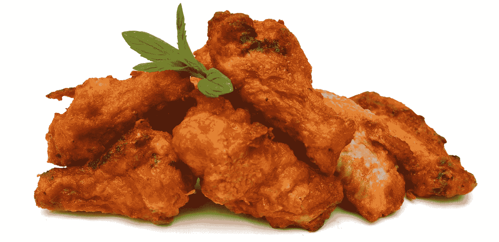

# 让这个品牌赚了 10 亿美元的无借口方法

> 原文：<https://medium.com/swlh/the-no-excuses-approach-that-made-this-brand-1-billion-45612a20d181>

## 每个企业家、初创公司和首席执行官需要知道什么来创建一个没有借口的品牌。

一般来说一下鸡肉或者快餐。

还有一家公司打破了所有的规则 ***和*** 的所有记录。

# 这种不找借口的方法正在彻底摧毁竞争

*   他们每家餐厅的收入比业内任何其他连锁店都高
*   在美国客户满意度指数中，他们得到了令人吃惊的 87 分(满分为 100 分)
*   他们星期天关门
*   即使一周工作 6 天，他们的表现也超过了肯德基和墨西哥卷饼店*的总和*
*   *这是消费者连续第三年将它评为全国最受欢迎的快餐店*
*   *他们是销售额排名第八的快餐公司*
*   *为了证明这一切，他们去年的收入增加了 10 亿美元，总销售额达到 90 亿美元。*

*公司？鸡肉三明治。*

# *障碍升级为借口的唯一途径*

*在思想领袖中谈论没有借口变得很流行。*

*今天的周三一分钟解决了你正在前进的某件事是一个障碍还是一个借口。障碍的命运取决于你。*

*以下是我对今天“周三一分钟”的看法:*

# *没有借口=没有障碍*

*如果你曾经想要一个借口，你可以选择快餐业，以一种“人们付钱就能得到什么”的态度(或者任何其他借口邋遢，服务慢于需要，或者不一致)。*

*但是你知道我和[超出预期](https://www.risingabovethenoise.com/top-23-most-influential-people-on-value-of-exceeding-expectations/)的重要因素。*

*Chick-Fil-A 有一种文化，一种表演标准，以及一种在没有借口的基础上运作的自豪感。*

*见鬼，被特许经营权接受的几率，你几乎有更好的运气赢得彩票。*

*然而，他们正迅速接近颠覆前三大快餐连锁店。*

**

# *如何采用没有借口的方法并取得胜利*

1.  *明确你的目标。否则，你将无路可走，最终会像著名的棒球传奇 Yogi Berra 所说的那样:*“如果你不知道你要去哪里，你可能就不会到达那里。”**
2.  *认识到每一条前进的道路都会有障碍。可能是时间，距离，内部政治，不可能的情况，等等。*
3.  *克服它。不是你。就是这个:生活。只要你有了人，有了时间，有了目标等等。，你会遇到障碍。*
4.  *不畏艰难，坚持不懈。*
5.  *当你决定一个障碍“比你大”的时候，它就成了你的主人。超越任何障碍。*
6.  *通过决定不放弃，这个障碍最终会被克服(前提是你足智多谋、坚持不懈、坚持创新、富有弹性)。*
7.  *当你朝着你已知的目标前进时，冲洗并重复。*

*每一个障碍的命运都掌握在你手中。*

*只有得到你的允许，它才成为借口。*

**

## *从这篇文章中获得了价值？然后鼓掌，分享，关注我，订阅我的 [YouTube 频道](https://www.youtube.com/user/headmusik)，每周都有新视频。需要一个品牌重塑或一个难忘的主题演讲人？这里联系我[。](http://david@risingabovethenoise.com)*

**

## *这篇文章发表在 [The Startup](https://medium.com/swlh) 上，这是 Medium 最大的创业刊物，有 343，876+人关注。*

## *在这里订阅接收[我们的头条新闻](http://growthsupply.com/the-startup-newsletter/)。*

**