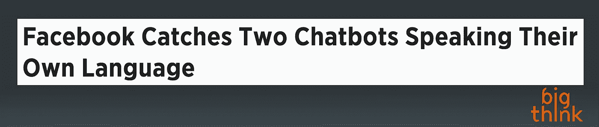
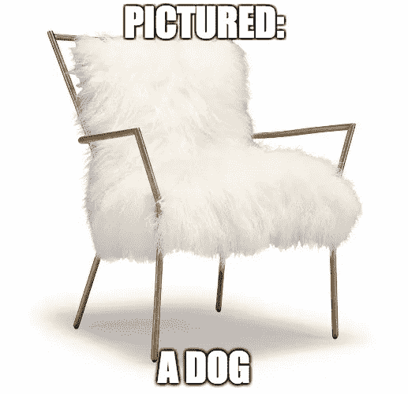
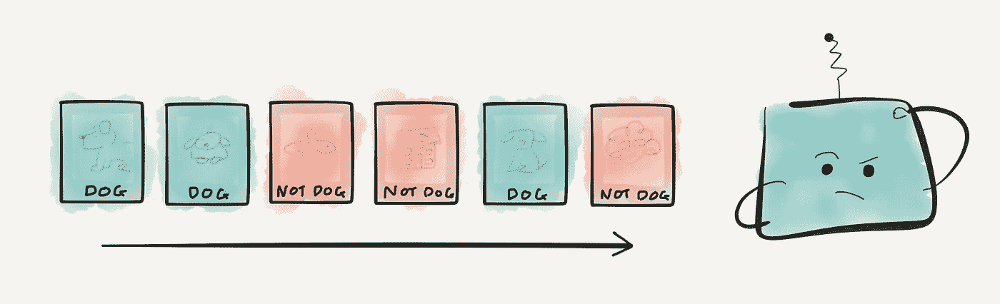
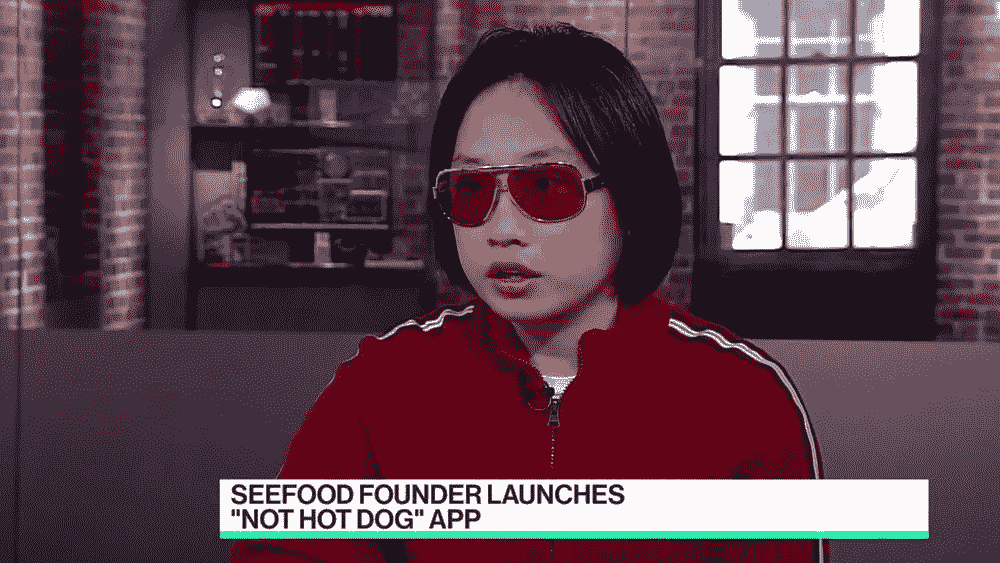
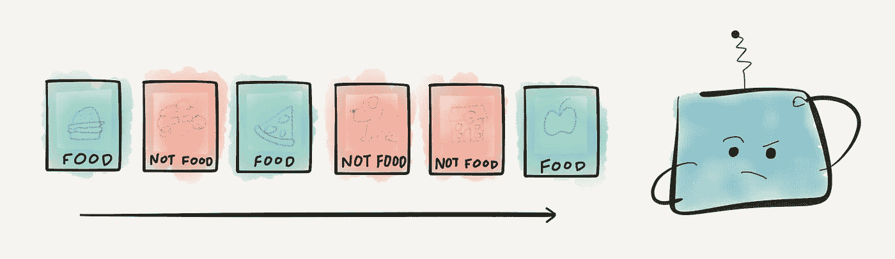
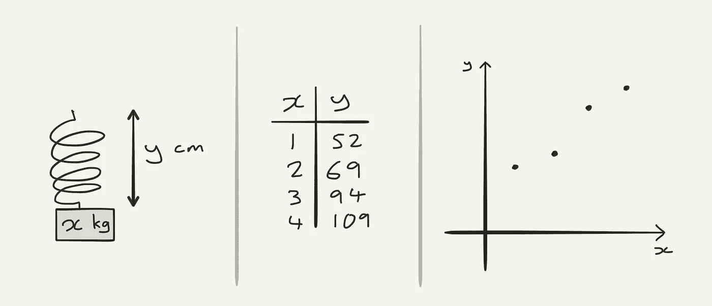
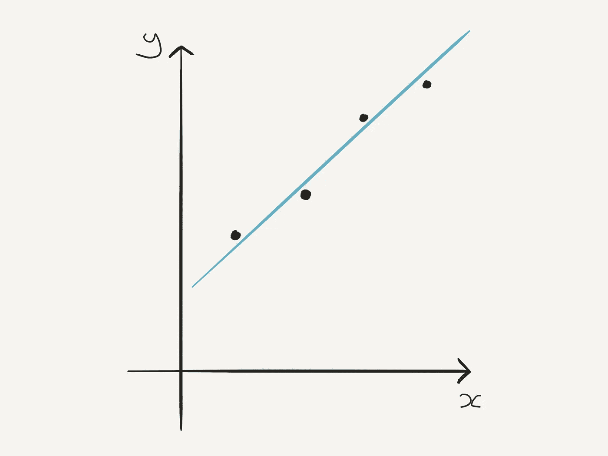
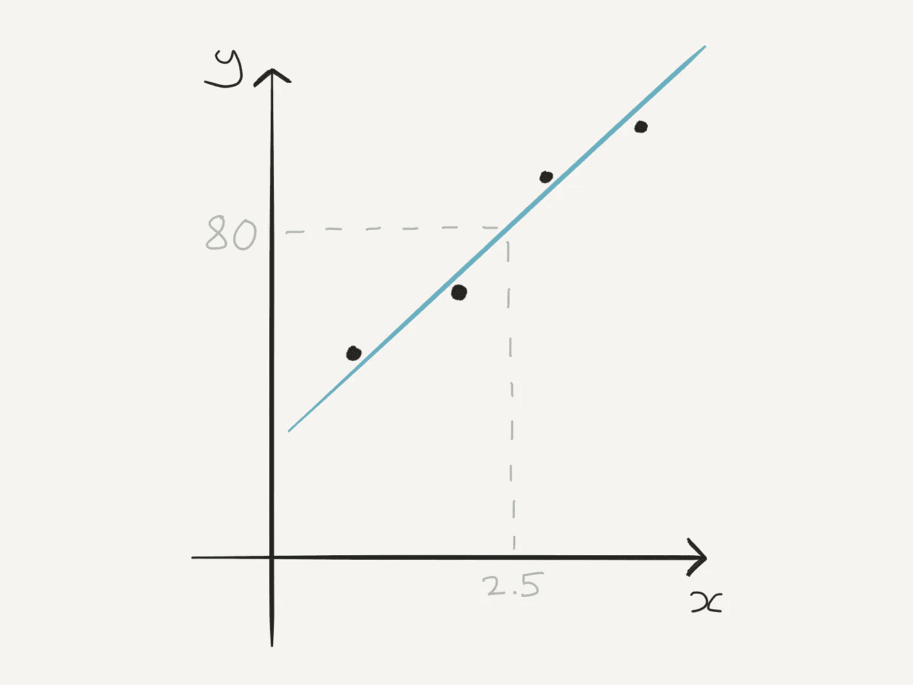
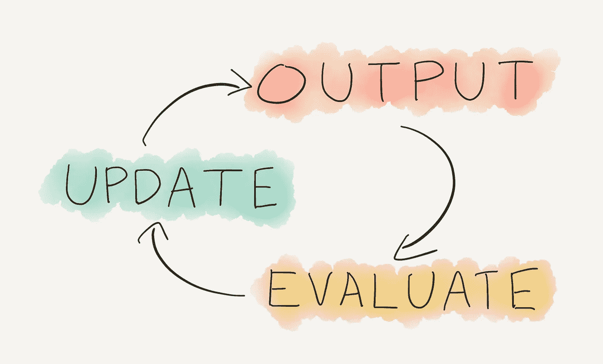

# 非技术人员的机器学习指南

> 原文：<https://medium.com/swlh/the-non-techies-guide-to-machine-learning-45337265e01e>

你发现自己在另一个创业聚会上，靠在吧台上，啜饮着你的饮料。今晚是第一夜，你对自己说。*今晚，我要做一些网络工作*。

然后你听到了。一段对话飘进你的耳朵:

“……他们绝对是值得关注的*机器学习初创公司。”*

**否…**

*“他们不是还在使用统计 NLP 吗？递归神经网络似乎是前进的方向……”*

**又来了……**

*就像病毒一样，它会扩散。你惊恐地看到，几分钟之内，酒吧里的每个人都在谈论机器学习。*

*当然，你以前听说过这个术语。谁没有呢？机器学习是前进的方向，人工智能的未来。当然是了。*

*问题是，你根本不知道那是什么意思。*

*你喝了你的酒。这将是一个漫长的夜晚。*

# *世界末日*

*首先，我们听说机器学习机器人正在抢走我们的蓝领工作。*

**

*然后，我们发现白领工作也不安全。*

**

*听天由命，面对失业的未来，我们发现机器人现在在我们背后说话。*

**

*可能是在八卦我们这些懒惰的失业人类。*

*机器学习在如此多的不同背景下被谈论，以至于很难理解它到底是什么。你查找它，得到抽象的理论解释，高功率拼字，以及数学和代码墙。*

*你只是想知道机器学习到底是什么，为什么它很重要，也许还想知道它是如何工作的。老实说，你只是想弄清楚那些到处流传的流行词汇，比如中学教室里的脏话:每个人都在使用它们，但你有一种感觉，没有人知道它们的意思。*

# *让我们开始吧*

*所以，机器学习。那像不像……AI？*

*这是一个很好的开始。我们都知道人工智能意味着什么。我的意思是，我们都在想不同的事情，但肯定是想法最重要。*

> *人工智能(AI)是对构建能够做出“智能”决策的系统的研究。*

*基本上，如果一台计算机做了一些看起来有点智能的事情，我们就称之为人工智能。*

*让我们用一个你可能遇到过的例子。电脑游戏通常以看起来聪明的敌人角色为特色。他们跟着我们，他们的行为方式让游戏充满挑战。那是人工智能的一个例子。*

*游戏的开发者通过给 AI 一套规则实现了这一点。*跟随玩家。如果玩家在射击，找掩护。如果玩家停止射击，尝试射击玩家。这些规则越多，游戏看起来就越智能。**

*问题是，一个电脑游戏通常是非常有限的。玩家只能执行一些特定的动作，关卡完全是由开发者设计的。因此，开发者可以为伟大的人工智能角色制定看起来非常聪明的规则。*

**

*Well, **pretty** intelligent.*

# *不是所有的问题都可以用规则来解决*

*比如说我们想让一台电脑检测这是不是一张狗的照片。*

**

*我们如何开始为这项任务定义规则呢？*

*不，真的。试着想想我们需要什么样的规则。*

*狗有四条腿？*

*狗是白色的？*

*狗有毛？*

**

*This one already knows “sit”.*

*计算机视觉问题，像识别一个物体，真的很复杂。但是我们的大脑几乎是凭直觉解决的。所以，我们真的很难拿出明确的规则。*

# *进入机器学习*

*我们没有建立一个识别狗的系统。我们建立一个系统，可以让 ***学习*** 来识别狗。*

**

*我们给它提供了数以千计的图像，有些包含狗，有些不包含。系统*学习*定义狗图片的规则。*

> *机器学习是研究构建能够 ***学习*** 做出智能决策的系统。*

*关键词**“学习”**是机器学习区别于其他类型人工智能的地方。*

> *“你说机器可以学习规则。很明显，规则是存在的。我们只是没有尽全力去寻找它们。”*

*你完全正确。如果我们足够努力，我们可能会开发一个基于规则的狗检测杰作。它将有数以千计的规则涵盖每一种可能的情况，这将是一件美妙的事情。*

*如果我们现在想让系统检测包含食物的图片呢？好吧，我们把整件事都扔了，从头开始。这些规则都不适用。*

**

*“Well technically, a hot dog **is** *a dog”**

*一个可以*学习*识别物体的系统，可以简单地通过使用食物的图片而不是狗来训练识别食物。*

**

*这就是机器学习的力量。我们有一台灵活的机器，可以学习和适应，而不是一套固定的规则。*

# *保持真实*

*现在，我完全让它听起来像我们已经建立了一个生活，学习的存在，并教它通过让它与小狗玩耍来识别狗。然后我们教它可爱的意义和爱的意义，希望说服它不要起来把我们都杀了。对吗？*

*现实要简单得多。我们希望机器学会做出决策，通常是基于预测。所以让我们从这个问题开始:人类是如何做出预测的？*

*这里有一个我们如何做预测的例子。你甚至可能在中学的科学课上做过类似的事情。*

*假设你做了一个实验。你收集数据，并绘制成图表。*

**

*Experiment → Data → Plot*

*x 轴是您更改的值，y 轴是您测量的结果。然后你在图上画一条**趋势线**(或**最佳拟合线** ) 。*

**

*这是最能模拟数据的线。*

*现在有了这条线，就可以做预测了。你可以选择一个你以前从未测量过的重量，在 x 轴上查找，然后从 y 轴上读出，来预测弹簧的长度。*

**

*你用了**数据**，建了一个**模型**，用它做了一个**预测**。*

*如果你写了一个可以执行这些步骤的程序，那么恭喜你:这就是机器学习。*

*不，真的。找到线性模型并使用它进行预测:这完全是一种机器学习技术，称为**线性回归**。*

*我们就不能把模型输入系统吗？然后，系统可以预测今年春天的天气。但是，如果我们不编写新代码，它就无法预测其他弹簧。*

*相反，如果我们教程序自己执行线性回归，而*学习*模型，这就是机器学习。*

**我们*不提供型号。我们让*机器*学习模型。*

# *骗局*

*如果你从这个例子中学到了什么，那就是:*

> ***机器学习不是魔术**。*

*我们并没有建立一个能够学习一切的有自我意识的存在。春模程序永远学不会认狗。*

**

*Even you, Slinky.*

*我们建立了一个系统，可以学习一种特定类型的模型。我们所遗漏的是*型号是什么*。*

*几乎每个机器学习系统都做以下的一些版本:*

**

*系统根据模型给我们一个**输出**。它**评估**该输出以确定它有多差。然后**更新**模型，使未来的输出稍微好一点。*

*机器学习是构建一个系统的艺术，该系统可以针对特定问题执行这一循环。*

*根据问题的不同，输出可能会有很大的不同。这可能是来自聊天机器人的文本响应。或者可能是决定是否在自动驾驶汽车中踩刹车。*

*实际模型可以是线性的，就像我们的弹簧问题一样。它可以是基于**统计和概率**的更复杂的模型。或者，它可能是一个**神经网络**，设计用来模拟人脑的工作方式:*

* [## 神经网络:1 分钟指南

### 它们是什么，如何工作，一分钟的阅读。

hackernoon.com](https://hackernoon.com/neural-networks-the-1-minute-guide-a2909507f350) 

无论细节是什么，几乎每个机器学习系统都在运行这个循环。每过一个周期，这个系统就会改善一点点。经过数千甚至数百万次的循环，我们可以让系统学会比任何人更好地完成这项任务。

各种各样的应用，以及解决这些应用所需的技术，是机器学习与许多其他领域交叉的原因。这也是为什么机器学习现在是一个如此令人兴奋的话题。

# 我们走吧

构建机器学习系统可能很复杂，但理解机器学习不一定如此。

所以，去征服那个创业聚会吧。抛出一些新的流行词汇。从那个房间出去。你只需要再做几年，真的。到那时，我相信我们也会有机器人为你做这些。* 

**如果你觉得有趣，可以看看我的* [*1 分钟神经网络指南*](https://hackernoon.com/neural-networks-the-1-minute-guide-a2909507f350) *！**

**订阅我的下一篇文章:**

**

## *这个故事发表在 [The Startup](https://medium.com/swlh) 上，260，100+人聚集在一起阅读 Medium 关于创业的主要故事。*

## *在此订阅接收[我们的头条新闻](http://growthsupply.com/the-startup-newsletter/)。*

**