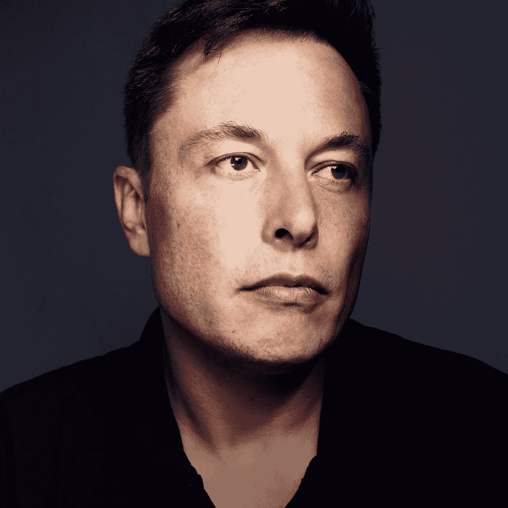

# 埃隆·马斯克采访中捕捉到的细微差别揭示了获得巨大成功的真正关键

> 原文：<https://medium.com/swlh/the-nuance-captured-in-this-elon-musk-interview-reveals-the-actual-key-to-massive-success-a5ec09b30108>

Photo by GQ

## 当被问及是什么激发了他探索太空的想法时，马斯克回答道:

> “保护人类的未来，确保意识之光(人)不会熄灭，以防灾难降临地球，这是防御性的理由。但就我个人而言，我发现更让我兴奋的是这将是一次不可思议的冒险。这将是有史以来最伟大的冒险。这将是令人兴奋和鼓舞的。需要有让你兴奋和激励人们的事情(在这种情况下，他探索太空本身)，需要有早上起床的理由。这不仅仅是解决问题(甚至是拯救人类这样的大问题！)一整天。”

让我们仔细看看这段引文。

马斯克的意思是，尽管人类处于灭绝的边缘，我们需要探索其他殖民地来拯救我们，正如他所说的那样，拯救“意识之光”，但他的个人动力和动机来自冒险本身的[自私]体验。

简而言之，马斯克并不是为了世界的利益而拯救世界。

他试图为自己拯救世界，成功的副产品是世界被拯救。

本文的目的不是说埃隆·马斯克是好是坏(他很了不起)。

这篇文章的目的是探索走向卓越的动机和大胆目标的驱动力。

**什么是巨大的成功(以及这对你和马斯克意味着什么)**

> “不要以成功为目标。你越是瞄准它，让它成为目标，你就越是会错过它。因为成功和幸福一样，是不可追求的；它必须随之而来，而且它只是作为一个人献身于比自己更伟大的事业的意外副作用，或者作为一个人屈服于一个人而不是自己的副产品。”维克多·弗兰克尔

我全心全意地相信这句话的第一部分，尽管我认为这句话的第二部分应该重写为一个人的*“对自我的个人奉献和屈服的意识状态，这创造了成功所需的深刻存在”。*

巨大的成功很简单:

自信的 ***心态和信念*** 心态、技能和工具组合在一起，认识到最大限度地发挥你的潜力和坚持卓越是生活本身的意义。

追求旅程本身就是成功之路

*   这种状态给你勇气。
*   这个州给你信念。
*   这种状态给你自信。

这些事情结合起来给你动力。

势头产生更多的势头，很快你就会有如此大的势头，你会达到埃隆马斯克的状态，他是不可阻挡的，像上帝一样大。

这给了你超越恐惧并将其转化为能量的能力。

马斯克在特斯拉和 SpaceX 这两家大型组织最糟糕的时候受到了经济衰退的打击，他在完全没有保证的情况下，用自己最后的 1.8 亿美元个人储蓄来拯救他们。

这听起来最像是第一世界的问题，在某种程度上的确如此，但这都是相对的。他在拥有数十亿美元公司的亿万富翁联盟中打球。那 1.8 亿美元是他最后一次孤注一掷，毫无疑问，他冒着破产的风险，因为他是一个巨大的成功人士，他不在乎 1.8 亿美元，因为巨大的成功保持饥渴和愚蠢，因为它有信念。

你可以从他说话和思考的方式看出来。他是一个在操场上的孩子，他的思想比他的语言超前一万步。

这是伟大的泰坦们的秘密。

矛盾的是，他们不在乎金钱、浮华和魅力。他们只是周围[最成功的标本。就像，他们将优秀视为法律。这是他们的代码，他们在竞争中茁壮成长，因为他们或他们让竞争变得有趣)，而不是因为他们一定想打败另一个人(尽管在这个过程中，他们非常想)。](/swlh/the-surprising-secret-to-changing-the-world-dd4d2519f940)

看到细微差别了吗？

杰夫·贝索斯买得起，我相信他会乐意给他的员工提供免费咖啡，但不为所有员工提供无限量的咖啡是他的“保持饥饿和保持愚蠢”的廉价文化，他从第一天起就在亚马逊保持这种文化，直到今天仍然如此。

这是文化的涓滴效应。

为了检查我的上下文，我邀请你在[观看马斯克从 1:03 到大约 1:3](https://www.youtube.com/watch?v=SNauCFxJWfQ) 0 的视频，看看我到底在说什么。

**如何利用这一点获得巨大成功**

> "我有这么多事要做，我得祈祷三个小时才能做完。"马丁·路德

要想获得巨大的成功，你需要做的与直觉相反的事情是，尽可能自私地不懈关注推动你个人成长的因素。

你必须积极投资自己。

你必须积极地相信自己。

你必须坚持这些信念，积极投资于自己。

一般人会认为你疯了。

一般人会认为你被迷住了。

如果你还没有痴迷，投资自己会让你痴迷。

如果你被迷住了，投资你自己来度过难关。

你的潜意识必须相信你能完成你的意识欲望告诉你的事情，而通往这一信念的道路就是投资于你自己。

你越想完成，工作和恢复就越深入。

你越想带进这个世界，你就越需要关注潜能。

你越关注潜能，你就越能培养你内在的创造过程。

你想带到这个世界上的东西越大，你就越需要管理你的思想。

思想变成事物，事物变成习惯，习惯变成你。

所以习惯性地向自己和世界发出信号，你值得建造火箭船和电动汽车，你会的。

**结论**

> “如果你在工作的时候没有哭过，你就没有被你正在处理的问题折磨得足够痛苦。”—我

目标越大，输赢的差距就越小。

目标越大，取得巨大成功的目标就越需要个性化。

它越是个人化，你的自我就会投入得越多，它就会成为你的一部分。

那么你将被授予。

那你就有勇气让自己无路可走了。

然后你会烧了你的船。

那就是你占领这个岛的时候。

这就是走向巨大成功的旅程变成成功本身的时候。

那就是你知道自己像埃隆·马斯克一样非常成功的时候。

## [每周一次点击接收我承诺的改变游戏规则的文章，这是你在互联网上其他地方找不到的。你还会收到我的指导，告诉你如何在你所做的事情上成为世界上最好的。你不会后悔的。](https://betreatedhowyouwanttobetreated.com/optin-main)

## 这篇文章发表在《T4》杂志《创业》(The Startup)上，这是 Medium 最大的创业刊物，有 317，238 人关注。

## 在这里订阅接收[我们的头条新闻](http://growthsupply.com/the-startup-newsletter/)。

