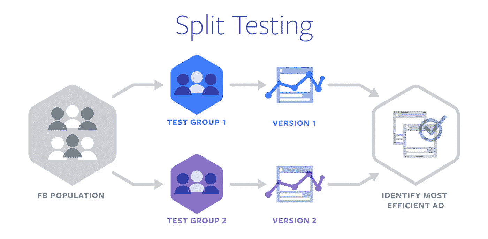
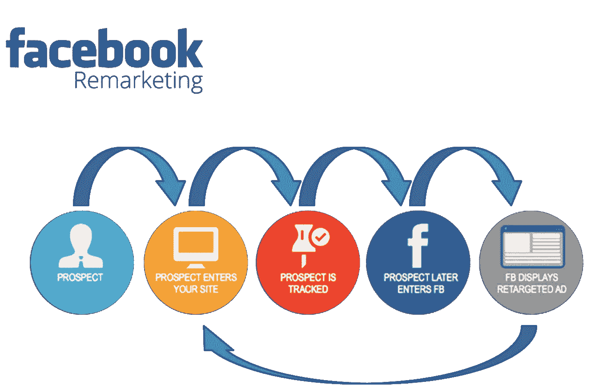
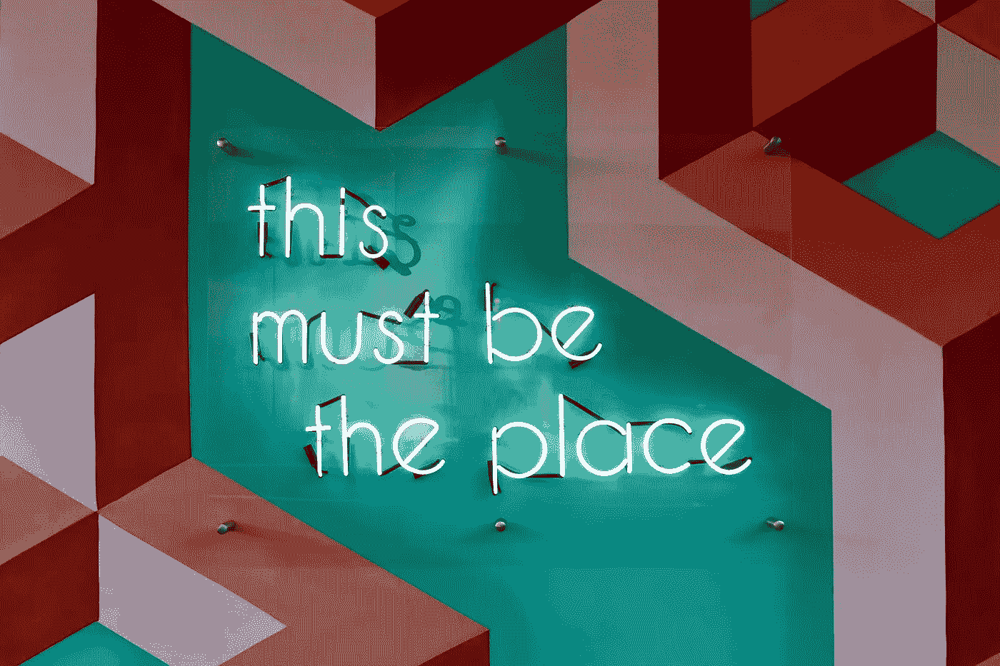
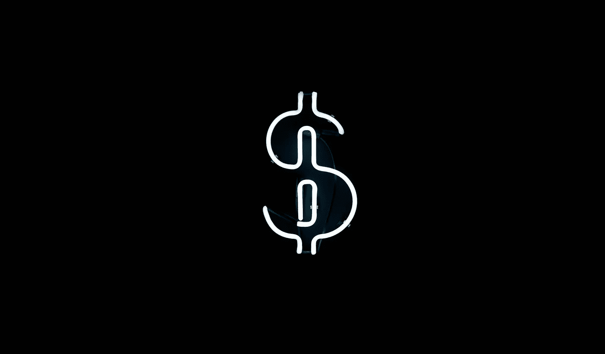

# 我从花 304，000 美元在脸书做广告中学到的一个教训是！

> 原文：<https://medium.com/swlh/the-one-1-lesson-i-learned-from-spending-304-000-in-facebook-ads-31f70e07f460>

## 以及如何计算真实的脸书投资回报率。

*我喜欢罗伊·h·威廉姆斯的这句话*

> **“一本旧书中的五分钟很快揭示出，如今作为对人类行为的新见解出售的大多数东西，只不过是对我们几个世纪以来拥有的知识的重新发现。”**

*我们生活的商业世界仅仅是文化潮流的集合……潮流来来去去，最终又会回来！！*

**成功重振这些趋势并利用文化关注的品牌是赢家——“格子裤、高腰牛仔裤、厚底鞋、冠军和卡帕复兴……听起来耳熟吗？?'**

*我们以前都见过它，现在我们再次看到它！！*

**这正是我所学到的…**

*虽然你可以投资数量惊人的广告选择，但没有一个广告能像 FB 广告那样有助于你的成长，特别是在目标重新定位方面。*

> *是啊！重新定位才是游戏！*

*如果你观察每一家成功的网上销售公司(非上市)，你会发现它们都有一个共同点。*

*→不是更好的产品(尽管这很重要)*

*→不是更好的服务(尽管这真的很重要)*

*→这不是最新最棒的营销技术！*

*他们有一个共同点，那就是先说服，后销售！*

*有趣的是。脸书内外的大多数人都不会从竞选的角度思考问题！他们会考虑广告、目标市场、登陆页面或电子邮件……虽然所有这些都非常重要，但与真正的营销活动的全部潜力相比，这些都不算什么！*

*一个广告活动应该被划分为多个广告集，进行分割测试以找到合适的定位和广告版本(也进行分割测试)以了解合适的创意。*

**

*此外，像素跟踪将那些冷线索>转化为暖线索>转化为转化。*

**

*是的！再营销是绝对必要的！轰炸你的广告信息、服务或产品，联系你的目标受众应该是你关注的第一项技术。*

## *1.不是他们。是你！*

*首先，忘掉迄今为止你听到的所有关于脸书广告的负面消息。*

*→确实有效！*

*→效果好得难以置信！*

*→例外，如果我可以的话！*

*第二，忘掉迄今为止你听到的所有关于重新定位的负面消息。*

*→不是网上盯梢。*

*→人们实际上并不觉得它令人毛骨悚然。*

*→如果他们这样做了，简单地告诉他们烧掉他们所有的设备，搬到南太平洋中部的一个不知名的岛上去……这就是世界的发展，我们不会后退！*

*广告通常是客户的第一个接触点，但它是创建营销活动的最后一步。你可以创造有史以来最盛大的脸书竞选活动，但是如果没有人想要你卖的东西，或者没有人收到你的信息……它就会失败。*

*付费流量是最后一步，如果剩下的客户旅程失败了，你的广告也会失败。*

> *“我的创意很棒，我的目标很明确，我的文案无懈可击……为什么我的广告不起作用？”！！*

*神奇的事情发生在我改变心态去开发广告的那一刻。有信心知道什么会起作用和谦逊地对你的最终客户进行逆向工程之间有一条细微的界限。*

*→他们想要什么？*

*→这将如何为他们的生活增值？*

*→为了传达我的信息，我可能需要打破哪些坚定的信念？？*

> *当你不是在猜测的时候，这个公式是非常简单的。放出来内容，A/B 测试一遍再测试一遍！！*

*一旦你做对了， **FB 重定目标**是唯一的前进之路！*

*从本质上讲，FB 重定向是一种营销方法，在人们访问过你的网站、使用过你的移动应用程序或给过你他们的电子邮件地址后，向他们展示你的企业的广告。当人们访问或在其他网站购物、使用社交媒体、观看视频、使用其他移动应用程序或在谷歌上搜索时，他们会看到这些广告。*

*它可以成为你最强大的工具！*

**

*人很忙，容易分心。他们可以因为任何原因离开你的网站或放弃他们购物车中的物品——一个来电，需要回复一封紧迫的电子邮件，停下来看一个 YouTube 视频，或者来自@iblamesid 的 Instagram DM，关于[“学习新技能的艺术”的必读故事。](https://byrslf.co/the-art-of-learning-a-new-skill-cba65226dc61)不管什么原因，他们已经走了。*

*重新定位有助于你接触到很大一部分人，这些人访问过你的网站，在 30 到 60 天或更长的时间里，可能每天或每周几次，通过各种网站，没有转换就离开了。*

*把你的再营销努力想象成一个温和的(或积极的)提醒，一个鼓励访问你的网站的人完成他们开始的事情，同时在每次他们看到你的时候加强你的品牌和信息给那个用户的提醒。*

## *2.投资回报前的品牌召回*

**难忘…那就是你。或者至少，这是每个品牌都想成为的！**

*我在许多不同的客户身上看到过这种情况；在他们成为一个成熟的企业之前，他们有一个严重的品牌识别问题。*

*根据我的经验，他们在 SEO 上投入了大量资金，这给他们带来了大量的有机流量，但每月只有 3%左右的浏览量来自品牌搜索。*

*在许多情况下，他们在 SEO 上的投资大大超过了他们在品牌建设上的投资。他们在搜索中排名很好，并获得了大量的流量，当然，但没有人记得他们是谁！*

*我们介入，重新定位改变了这一切。在实施像素跟踪和事件召回后，我们看到直接流量大幅增加，人们开始通过搜索公司品牌来找到他们的网站。*

*展示广告有一种谷歌搜索无法复制的魔力。正确的创意总是会产生影响，帮助人们记住你和你的信息。*

**

*很明显，品牌召回带来了它应有的好处。它是独立的意识，在让客户成为你公司的长期客户方面起着至关重要的作用，并主张当有人需要你的产品时，第一个想到的公司就是 T1，这意味着你不必努力工作来保持稳定的收入。不要再去寻找每周的投资回报率为正的活动，看看你的广告组合的寿命！*

> *人们总是高估他们在 1 年内能做什么，而低估他们在 10 年内能取得什么！*

*因此，下一个问题是:*“你是在告诉我们，在考虑 FB 广告和重新定位策略时，ROI 并不重要吗”？**

***绝对不行！**然而，品牌应该是你获取客户策略的核心！*

*虽然我通常更喜欢将投资回报率作为一个整体的商业指标，但理解 ROAS(广告支出回报)应该是你短期内关注的唯一指标是很有价值的。当然，在为其他企业投放广告时，短期证明往往非常重要！*

***下面是如何计算脸书投资回报率:***

*→ ROI 公式:ROI =(收入—成本)/成本*

*→投资回报率百分比=(收入-成本)x (100 /成本)*

***下面是如何计算脸书的 ROAS:***

*→ ROAS 公式:ROAS =收入/成本*

*ROAS 百分比=(收入-成本)x(100/成本)*

## *3.精明理财*

*为什么会有人打广告？发展他们的生意，充实他们的钱包。有了社交媒体，这比以往任何时候都容易。根据 2017 年的统计，70%的 B2C 营销人员通过脸书获得了客户。这只会有增长的潜力。*

*重新定位不是免费的——但是在市场营销中，没有什么能推动有效的、真正的增长是免费的。然而，时至今日，重定目标的定价仍然相当低。*

*当运行脸书广告时，你要确保你从已经在市场上购买你的东西的人那里转换或挤压价值(可以是金钱上的)。这是你唾手可得的果实。*

*【1,000 次浏览的赞助广告平均价格约为 12 澳元。一点都不贵！*

**

*这些广告的成本比超级竞争行业中的搜索广告低 2 到 100 倍，尽管典型的点击率非常低(约 0.2%)，但转换率在许多行业中与搜索广告竞争。*

*相反，重定目标给了我们第二次机会(第三次，第四次，等等。)与已经对该品牌或该企业提供的东西感兴趣的人进行交流。*

*首先，你可能会花费大量的金钱和精力让人们访问你的网站。这些人中只有一小部分人会真正按照你的要求去做，无论是购物、预订，还是注册白皮书、免费试用版、时事通讯或其他。*

*一个成功的重新定位增长策略是检查你网站上的人的意图。这是 FB 像素和事件发挥作用(但这是另一个时间更技术性的解释)。简而言之，尝试你的产品的人比阅读你的博客帖子的人更有可能成为潜在客户。对于零售商来说，一个放弃购物车的人比一个浏览了几分钟就离开的访问者更有可能转化。*

*那么，你的重新定位投资能得到什么呢？*

*在我的案例中，(平均而言，不同的 FB 账户)在重新定位之前，企业看到的流量转换不到 2%。重新定位后，我们的重复访问率提高了 56%，网站访问者向潜在客户提交表单的转化率提高了 59 %，网站停留时间增长了惊人的 310%。对于相对较少的投资来说，这是巨大的数字。*

*在一个理想的世界中，客户会搜索你，访问你的网站，永远不会分心，花时间探索你的内容或产品页面，注册，预订，购买，并成为永远的忠实客户。但我们不是生活在这样的世界里！*

*在这个世界上，2019 年你不使用脸书广告绝对是疯了，不使用脸书重定向会更疯。*

*如果你在你的市场营销——你的搜索、内容和社交媒体——上投入了一大笔钱，你为什么要花那么多时间和金钱让人们访问一次呢？这太疯狂了。*

*然而，许多企业成为这种疯狂定义的受害者——一遍又一遍地做同样的事情，却期待不同的结果。*

> *在 2019 年做一些彻底不同的事情。**该是脸书广告的时候了……该是重新定位的时候了！！***

# *我想做的是…*

****……就是写值得你花时间，能给你带来价值的东西。如果你喜欢阅读，请点击💚这样其他人也会看到它(你最多可以点击 50 次)！！****

*此外，如果你伸出手说‘嘿！’,那绝对会让我开心一天上有 [***这里有***](http://instagram.com/iblamesid) ***。真的很期待连接！*😊***

## *西德尼*

**

## *这篇文章发表在 [The Startup](https://medium.com/swlh) 上，这是 Medium 最大的创业刊物，拥有+397，714 名读者。*

## *在这里订阅接收[我们的头条新闻](http://growthsupply.com/the-startup-newsletter/)。*

**