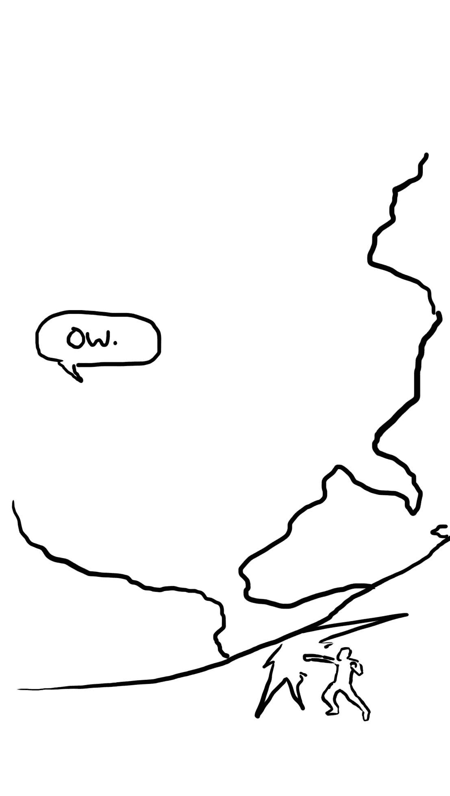
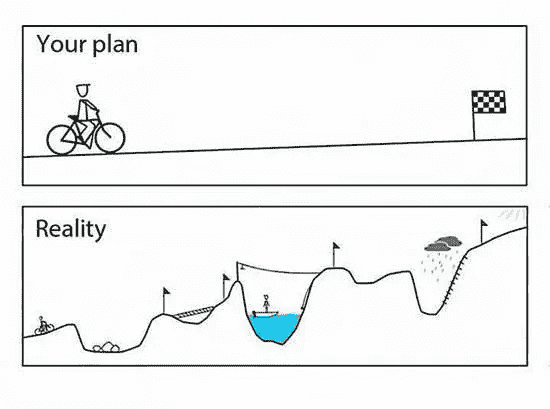

# 将成功的创业公司与普通公司区分开来的能力。

> 原文：<https://medium.com/swlh/the-one-ability-that-separates-successful-startups-from-the-average-edff66ec18e>

[Do it!](https://unsplash.com/photos/oqStl2L5oxI?utm_source=unsplash&utm_medium=referral&utm_content=creditCopyText)

## 你只有一次生命。让其他人不去改变世界。

成为企业家并不意味着聪明。

不是有无止境的资金。

这与你投入的时间长短无关。

这是关于找出你想改变世界的地方，并着手去做。

这是关于视觉。

而是要有设定愿景的能力，并坚持下去。

这是关于拿起你的执行之斧，砍倒那棵阻碍别人成功之路的树。

愿景是做别人不会做的事。

这是一种超越他人视野的能力。

而是固执和冒险。

而是为了一个喷火器扔掉了执行的斧头。

# 超越大众

“不，我们不能！”

几乎每个人都这么说。

“不可能”VS“走吧！”

“走吧”=视觉。

愿景=不找借口，而是创造未来。

除非有人去做，否则不可能的事情就是不可能的。

接下来的事情似乎很愚蠢，直到它成为现实。

这就是远见。不再耍花招，不再解释。

而是迈出那一步。

创造未来。

# 目标更高

你改变了什么？

去掉你的特征。别再说你的技术了。

你的创业公司的成功并不取决于你建立一个史诗般的解决方案。

这取决于在结构上比其他任何人更好地解决某人的斗争。

五年后，你会有什么改变？

现在再想想。

这世界怎么了？

什么是没有得到正确解决的大问题？

是什么阻碍了你对它进行大规模的修复？

10 年后，你会改变什么？

那是你的愿景。

这不是怎么做的问题。

愿景是关于哪里。

别再说为什么了。

5 到 10 年后，世界会变成什么样？

现在，为实现这一目标做好一切准备！

[Check this Fake Robot Dinosaur out](https://twitter.com/FAKEGRIMLOCK/)

# 聪明失败，然后快速失败

愿景是你在 5-10 年内需要达到的目标？

未来 5 到 10 年，你将把世界带向何方？

抓住一切不能让你到达那里的东西，把它踢出窗外！

你在做什么不能让你实现你的梦想？

停下来！

所以从这一刻开始，你可以开始快速失败了！

因为你所做的一切都在让你走向梦想。

你不再在无关紧要的事情上失败。

你想出了更好的方法。

所以现在你失败了。

然后构思，假设，建造，测量，学习。迭代。快速失败。

企业家精神是一种更好的做事方式。

愿景比任何人都更能解决斗争。

# 执行！

测试。

再次测试。

测试更多。

开始跑，不要回头！

站起来，让改变发生！

像你风帆中的风一样有远见。

当你失败时，让远见来帮助你。

有百分之百的眼光去做。

要有远见，提高标准，发射火箭。

有远见，相信你会在失败前学会如何驾驶火箭。

# 现在去踩油门

每个人都在建造东西。比你的好的东西。

愿景是让你领先于他们的东西。

愿景能帮助你超越自我。

视觉是把别人没有的点连接起来。

愿景是有勇气去做别人不会做的事情。

愿景是失败的。

现在去做别人需要的。

# 喜欢你读的书吗？阅读更多信息:

 [## 为什么 90%的创业公司会失败，该怎么办

### 大多数企业家认为他们正在打造下一个大东西。

medium.com](/swlh/why-90-of-startups-fail-and-what-to-do-about-it-b0af17b65059)  [## 创业成功必不可少的前 7 步。

### 成功所需的基础

medium.com](/swlh/the-essential-first-steps-to-startup-success-2f133f2c6741)  [## 创业前我不知道的 10 件事

### #1:创业是为了“怪异”,但没关系。

medium.com](/swlh/10-things-about-startups-i-didnt-know-until-starting-a-startup-1dbb6bc66874)  [## 扼杀创业的最佳方法

### 避免这些错误会让你的创业之旅更加容易。

medium.com](/swlh/best-ways-to-kill-your-startup-8604a1768a89)  [## 制作人们喜欢的东西的六分钟指南

### 你创业的意义是什么？

medium.com](/swlh/the-six-minute-guide-to-making-things-people-will-love-1b7ddbc55205) 

## 这个故事发表在 [The Startup](https://medium.com/swlh) 上，这是 Medium 最大的创业刊物，有 291，182+人关注。

## 订阅接收[我们的头条新闻](http://growthsupply.com/the-startup-newsletter/)。

