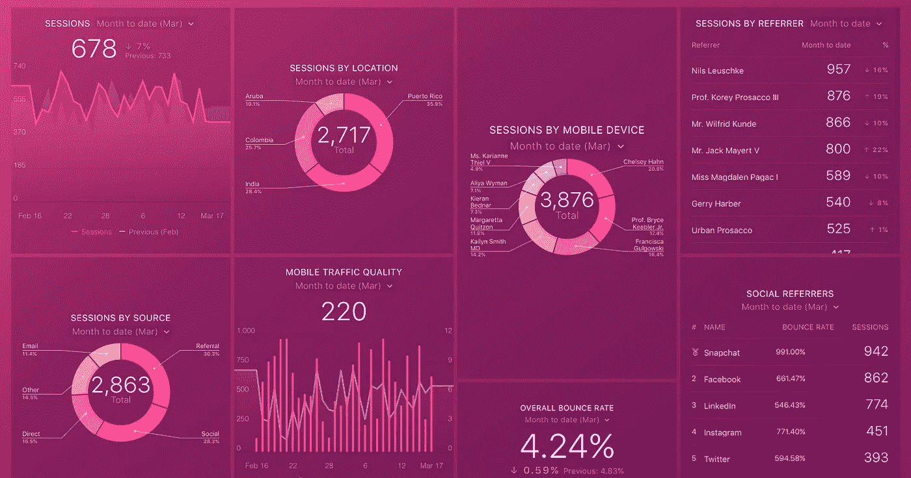

# 你可能没有衡量的一个重要指标

> 原文：<https://medium.com/swlh/the-one-crucial-metric-you-probably-arent-measuring-4493c6022773>

> “让你陷入麻烦的不是你不知道的事情。这是你肯定知道的，但事实并非如此。”
> 
> ——马克·吐温

## 爱上数字很容易

指标和趋势是必不可少的。它们给人一种确定感，一种我们知道自己在做什么的坚实可靠的证据。当恰当地想象时，它们甚至有催眠般的魅力。我们的增长速度有多快？我们赚了多少？点击量/点击数/点赞数？我们还在曲棍球棒上吗？

这可能就是为什么，特别是在自举的情况下，有一种无法控制的冲动想快速看到数字，以至于我们不会停下来问什么才是真正重要的(“把一些实时跟踪的 KPI 挂在墙上！”).

我们应该跟踪用户数量吗？月活跃用户？花费的时间？收入？NPS？(不要让我从[这个](https://blog.usejournal.com/net-promoter-score-considered-harmful-and-what-ux-professionals-can-do-about-it-fe7a132f4430)开始)。其中一些很重要，但对外部数字的痴迷很容易从一个关键方面转移你的注意力，这将决定你的长期成功: ***你的团队进展如何？***

你可能会翻白眼，心想“什么？！真的吗？这不是大人的 KPI！我们在这里做生意！…此外，我们正在进行团队回顾，就这样。我们被覆盖了。”

[你不是]

在我合作过的无数团队中，无论行业或地点，持续成功的团队和产品的最大贡献者(除了时间和运气，这些都是你无法控制的)是团队如何健康、忠诚和有动力。跟踪它可能很棘手，但请记住:

> “不是所有有价值的东西都能被计算，也不是所有能被计算的东西都有价值。”
> 
> 威廉·布鲁斯·卡梅隆

*如何真正发展和维持一个健康、有动力的团队，这本身就是一个极具挑战性的话题，也是我非常热衷的一个话题，尽管衡量起来并不那么微不足道，但它将会十倍地回报你的投资。*

你应该把它作为仪表板挂在墙上吗？大概不会。是否应该每天取样，每周讨论一次，并在出现“meh”方面的迹象时立即采取行动？绝对的！

对于这个重要的脉搏分数，你的团队有多少意识、透明度和关心？如果你的答案不是“很多”，那就开始工作吧:

*   你能做些什么来围绕它展开讨论？
*   你应该多久测量一次？
*   谁应该拥有它？

在每家公司，关于谁、如何和什么的答案可能是不同的，但不要回避挑战，在你花足够的时间弄清楚这个之前，满足于任何其他指标是至关重要的。

答对这一题，我向你保证增长之神很快就会给你一个冰球棍。

## 这篇文章发表在《创业公司》杂志上，这是 Medium 最大的创业刊物，有 307，871 人关注。

## 订阅接收[我们的头条新闻](http://growthsupply.com/the-startup-newsletter/)。

[你可能没有衡量的一个关键指标](https://yanayz.com/blog/the-one-crucial-metric-you-probably-are-not-measuring/)最先发表在[亚奈·佐哈尔的网站](http://yanayz.com)。请访问以获得更多见解。