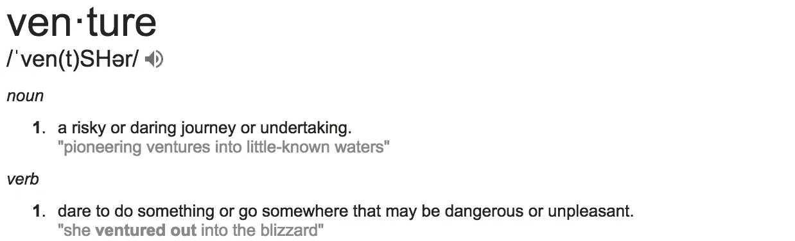
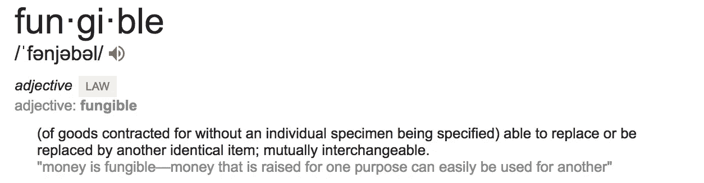

# 每个风险投资家都应该知道的一个基本原则

> 原文：<https://medium.com/swlh/the-one-fundamental-every-venture-capitalist-should-know-2675cb175cf8>

## 是什么让风险投资如此独特？

Photo by [Jonatan Pie](https://unsplash.com/photos/3N5ccOE3wGg?utm_source=unsplash&utm_medium=referral&utm_content=creditCopyText) on [Unsplash](https://unsplash.com/?utm_source=unsplash&utm_medium=referral&utm_content=creditCopyText)

接着，大多数有经验的投资者都不知道这个问题的客观答案。有些人会说风险投资是技术投资，有些人会说是研发融资，还有很多人会说是早期投资。这些答案没有一个是错的。然而，都忽略了风险投资背后的核心基本面**。**

# **风险资本与其他种类的私募股权有何不同？**

**风险投资是一种私募股权投资。**

**私募股权是不在公开交易所交易的资本。这是一种非流动性资产类别，这意味着你不能随意买卖。当失败风险适中时，私募股权基金为处于成长阶段的项目融资。预期收益很高，并且集中在正态分布的中心。**

**风险资本也是不在公开交易所交易的资本。它的流动性不如私募股权。风险投资在项目失败风险非常高的最早期阶段为项目融资。回报可能是非凡的，但只能在罕见的机会中实现，或者在“分布的尾部”。**

> **想了解更多风险投资的回报分配，请阅读我对一个读者问题的回答“ [**追逐超常回报**](https://buildingvaluetogether.com/chasing-extraordinary-returns-af9c97cae499) ”。如果你认为我应该深入调查此事，请在下面添加评论。**

**这些差异是进行区分的充分理由。然而，它们并不是区分风险资本和其他投资的核心金融基础。**

****

# **投资的性质**

**投资者根据预期的风险回报平衡来分配资源。在私募股权中，有许多投资选择，如房地产、成长型资本、夹层融资、杠杆收购、不良资产甚至风险资本。大多数投资讨论只会把**预期回报**带到聚光灯下。这的确是一种有效的方法，但却是一种浅薄而冒险的心态。**

**根据一个训练有素的投资者的哲学，人们应该首先问:**

> **我的钱会去哪里？它将被用来做什么？为什么它会返回一个收益或者一个损失？**

**有了这些答案，投资者就可以做出谨慎的决策，决定承担什么样的风险，并以预期回报为目标。如同任何其他投资一样，风险投资遵循一条有着清晰标志的道路:你投资的**在哪里**、**是什么**以及**为什么**。**

# **哪里**

**在风险投资中，你的钱会进入一家初创公司的账户，这家公司由所谓的伟大企业家管理。伟大的企业家都是快节奏的聪明的远见卓识者，固执地相信一个新的市场机会。他们可以想象一家初创公司会成为*品类之王*。**

> **“品类王同时设计一个伟大的品类、一个伟大的产品和一个伟大的公司。”**
> 
> **—玩得更大:盗版者、梦想家和创新者如何创造和主宰市场。作者:阿尔·拉马丹，戴夫·皮特森，克里斯多夫·洛希黑德，凯文·马尼**

# **什么**

**质疑你投资的目的地揭示了**核心金融基础**，它将风险投资与其他类型的投资区分开来。**

> **这项投资的收益会有什么用途？**

**创业公司很少从运营中产生现金。一旦进入创业公司的账户，你的投资将被用于风险业务。初创公司将主要用它来支付工资、广告、公用事业和管理等费用。在费用报告中，**【OpEx】**被细分为固定费用和可变费用等类别。**

**与其他类型的股权投资不同，初创公司不太可能为资本支出进行大规模部署。营业外支出，又称**资本支出**，可以是有形资产，也可以是无形资产。**

> **创业公司将投资收益用于运营支出。**

**运营费用不可退还。除非创业公司建立了知识产权，注册了专利，或者获得了其他你可以出售的有形或无形资产，否则你将无法收回创业公司花费的资金。这就是最大的不同之处。**

> **你的投资将被计入费用。**

**传统的股权投资通常投资于产生现金流的业务。企业的现金流为他们的运营支出提供资金。凭借稳健的资产负债表，他们可以通过举债来筹集营运资金。这些企业筹集股本，主要为资本支出融资。因此，股权投资在企业内部是不可替代的。**

**风险资本通常投资于不产生现金流的初创企业。创业公司只能用股权来为他们的运营支出融资。鉴于他们没有一个坚实的资产负债表，他们有限的债务融资营运资本。这些初创公司的资本支出需求很低，通常不会筹集股本来融资资本支出。他们唯一可用于资助整个运营的资本是股本。因此，股权投资在创业公司内部必须是可替代的。**

****

> **风险资本投资在创业公司内部必须是可替代的。**

# **为什么**

> **还有什么比帮助聪明的年轻人成功，同时获得非凡的回报更有吸引力的呢？**

**这是一项光荣的事业，但回报仍是投资的最终驱动力。无论机会多么诱人，投资者都需要看到一条通往流动性和实现收益的清晰道路。一个风险资本家从投资到收获要走很长的路。比起到达目的地，我们更喜欢旅途。**

**风险资本家不会坐在电脑后面工作。通过一种建设性的方法，我们支持固执而聪明的远见者。打开大门，促进投资轮，并导致流动性，风险资本家以非常特定的方式工作，使创业公司蓬勃发展。**

# **每个企业都是独一无二的**

**我与新兴的创业生态系统密切合作，我看到了许多错误的做法。我尊重所有愿意帮助初创公司茁壮成长的投资者，但风险投资背后有很多技术知识。债务模式不应被复制到风险资本中。私募股权心态不应该指导你的投资决策。**

**风险资本是一种独特的投资选择。这是一项有风险的事业，筹集资金是为了一个目的，但很容易被用于另一个目的。失败和挫折导致风险投资获得非凡的成功。**

**如果你同意，请帮助传播这个词！**

****Derek L. Bittar** 是 [IndicatorCapital](https://indicatorcapital.com/) 的联合创始人和管理合伙人。他以帮助企业家在新兴的创业生态系统中茁壮成长为使命进行写作和旅行。**

****

## **这篇文章发表在[初创企业](https://medium.com/swlh)的媒体刊物上，拥有超过 256，410 人的关注。**

# **订阅[在这里获取头条](http://growthsupply.com/the-startup-newsletter/)。**

****

***重要免责声明
本故事(或文章)仅供参考/娱乐之用，无意提供投资建议或任何投资要约或出售。这个故事是作者的观点，仅供参考。***