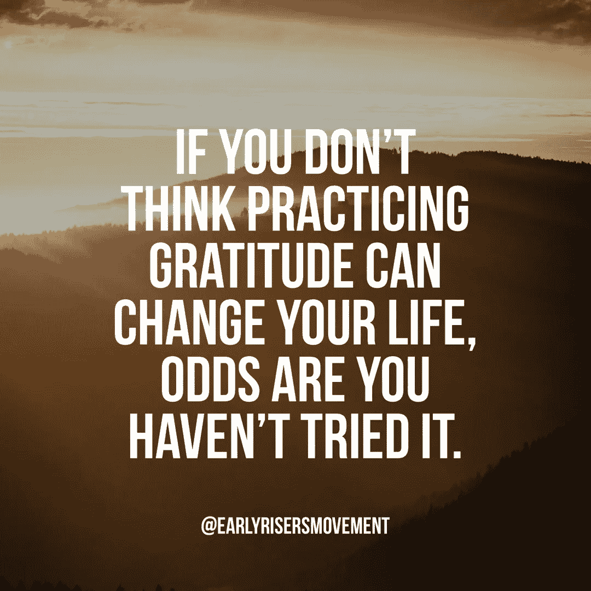

# 改变你一生的晨练

> 原文：<https://medium.com/swlh/the-one-morning-practice-that-will-change-your-life-fb6b419a9f18>

(No, it’s not drinking coffee)

有这么多不同的事情不断吸引我们的注意力，现在比以往任何时候都更重要的是确保我们不仅关注我们每天在做什么，而且关注它如何实际改善我们的生活。

你现在可能已经意识到了，我非常热衷于早早开始一天的工作，以便形成某种晨间惯例。我不仅相信这会让你为个人成长留出持续的时间，而且我坚信这会培养纪律性，让你也能改善生活的其他方面。

# 输入感恩:

当人们试图改变他们的生活时，我看到的最大的反对意见之一是，这需要太多的工作。让我们面对现实吧……早起很难，要做出能改善你整个生活的长期改变，也一定很难，对吗？嗯，不一定…

早上醒来，花不到五分钟的时间**练习**感恩，这个简单的行为可以彻底改变你的心态和人生观。是的，我说的是**练习**。因为对于任何你想做得更好的事情，你都需要花持续的时间来练习这种技能。

感恩就像肌肉，你越锻炼它，它就越强壮。曾经让你感到紧张或痛苦的情况慢慢变成了审视生活中美好事物的机会。看到那个装满盘子的水槽了吗？你曾经把它看作是你讨厌的平凡琐事，但是在练习感恩之后，你现在看到它是你有食物吃和盘子吃的标志。过去常常困扰你的交通高峰时间？现在你把它看作是一个信号，表明你有了一份工作，可以去任何你想去的地方。

感恩触动了你大脑中的一个开关，它可以改变你生活中看待世界的整个视角。

# 那么，你是如何实践感恩的呢？

锻炼 1: 这是我每天早上做的锻炼，它不仅彻底改变了我的人生观，也改变了我对每一天的积极态度。首先拿起一张纸和一支笔，写下你感激的一件事及其原因(是的，在纸上写下来。这激活了大脑中如果你在手机的记事本中输入或只是在脑海中想象时不会被激活的部分。就是这样。当你写下你所感激的*和*为什么你会有这样的感觉时，它会让你体验到一种感觉，如果你只是写下你所感激的事情，你就不会得到这种感觉。它让你感受到那些可以立即改变你心态的感激情绪。

练习 2: 这个练习没有第一个强，但总比没有强。你要做的就是写下三件你感激的事情。就是这样。如果你需要指导，挑一件大事，一件小事，一次经历。如果你坚持这样做，你仍然会看到心态的改变。

如果这对你来说没有意义，或者看起来没什么大不了的，我建议你坚持尝试 30 天。看看你是否能每天早上醒来，立刻让自己处于一种更积极的心态。如果你这样做了，请在下面留下你的评论，这样我就知道你在阅读了！如果你真的坚持下去，并且发现自己的心态发生了变化，我只是敦促你告诉其他人。我相信，传播感恩可以消除我们日常生活中看到的许多消极因素，如果我们真的想改变世界，那就从改变自己开始。

# 我们来连线:

我一直在发布关于个人发展的免费信息，我很乐意以某种方式与您联系！在 [Instagram](http://instagram.com/earlyrisersmovement) 上关注我，给我拍个 DM，加入我们的个人成长[脸书小组](http://facebook.com/groups/earlyrisersmovement)，或者[获取你的免费更好睡眠蓝图](http://go.earlyrisersmovement.com/freegift)并注册我们的每周简讯！非常爱。

# 录像

# 要分享的报价:

## 这篇文章发表在 [The Startup](https://medium.com/swlh) 上，这是 Medium 最大的创业刊物，有 343，876 人关注。

## 在这里订阅接收[我们的头条新闻](http://growthsupply.com/the-startup-newsletter/)。

