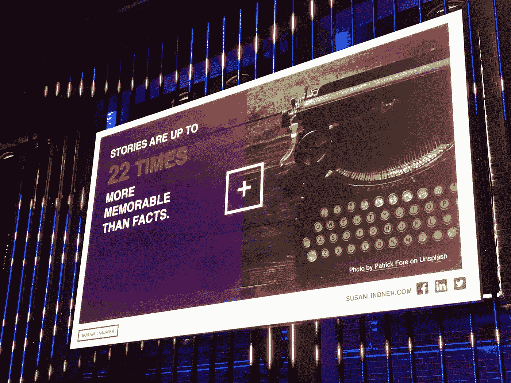

# 根据讲故事大师苏珊·林德纳的说法，每个初创公司创始人或首席执行官都应该问的一个问题是

> 原文：<https://medium.com/swlh/the-one-question-every-startup-founder-or-ceo-should-ask-according-to-storytelling-master-susan-98bacf2ea61>

> 最伟大的故事讲述者是那些能够让别人为他们传递信息的人。”——苏珊·林德纳，*新兴媒体公司的首席执行官兼创始人*

我第一次见到苏珊·林德纳[是在上个月的下一届 Web 2018 (TNW2018)上，](https://blog.storychief.io/the-next-web-2018-highlights-breakdown)她发表了关于战略性讲故事的主题演讲。

## 这个故事背后的故事

我被 TNW2018 的这个特别的会议所吸引，因为 Susan 和我都来自纽约市。她和我，尽管我们当时并不认识对方，但都在曼哈顿工作，经历了 2001 年 9 月 11 日，感受到了那一天的影响。每一个纽约人都可以证明这一事件产生的意想不到的联系。

但更重要的是，她和我都相信故事就是生活。

苏珊的个人和职业经历跨越了南美、内战期间搭便车和泰国——为妓女提供更美好未来的基石。在学习了宗教和文化人类学之后，她还作为疾病控制中心的流行病学家进行了艾滋病研究。

这一切都发生在她发现自己在通过公共关系、品牌和营销的方式讲故事方面的真正使命之前——否则，她会与我们这个时代的一些最大的颠覆者一起颠覆。

苏珊的经纪公司[新兴媒体公关](http://emergingmediapr.com/)是一家屡获殊荣的全垒打公司，她仍然抽出时间回馈“企业家社区，为颠覆性的美国和国际初创公司担任导师，并担任纽约科技周、Mashies 等顶级比赛的评委。”

她已经完成了遗愿清单上的许多事情，包括但不限于骑马、尝试单口喜剧只是为了好玩，以及像女老板一样沿着科罗拉多州最长最高的滑索而下。

而[故事长](https://storychief.io/)就是为此而来。我们很高兴她花时间和我们交谈:

## Q1:从阿姆斯特丹回来后你过得怎么样？

忙！从下一届 Web 开始，我一直在德国、挪威和洛杉矶，然后回到我的家乡纽约市。

## Q2:你真是个公路勇士！在我们开始一些更实质性的事情之前，你愿意分享一些关于商务旅行的经验吗？

嗯嗯。是的。道路的教训:

1.  为了你的理智，永远不要检查你的行李。
2.  无论去哪里，都带着充电器。我们的需求层次在几年内确实发生了变化。你首先需要有电，然后是完全的互联网接入，最后，食物、衣服和住所是次要的。所以不要忘记你的充电器！
3.  **如果你从斯堪的纳维亚航空公司(Scandinavian Air)的商务舱里得到一份包裹着辣根奶油的肉，那就不要去了。**

{笑}

## Q3:好的，注意到了。谢谢你。现在，我不得不问，你在旅行和谈话中看到了哪些趋势？无论好坏。请分享。

好吧。从全球来看，政治和我们消费媒体的方式都发生了变化。

年轻人从同龄人而不是专家那里得到确认，这削弱了公关作为营销工具的影响力(与前几代人不同)。

因此，它证明了我们的信念和我们的倾向——我们想要更多。我们希望验证我们的选择，而不是让专家为我们验证。

## 问题 4:我可以证明。你是说这是好事还是坏事？

都是。我想我们回到了原始部落。

但是同样的，如果我们不小心的话，我们会被讲述故事的人所操纵。

重要的是，如果我们从朋友那里获得信息，我们的朋友也从正确的地方获得信息。

## 问题 5:说到合适的地方……你之前提到过像[巴塔哥尼亚](https://www.patagonia.com/employee-activism.html)和[思科](https://www.cisco.com/c/en/us/about/careers/we-are-cisco/people-deal.html)这样的公司，他们通过为员工搭建一个平台来激活公司的故事并强化他们的品牌，从而“做得对”。

没错，这就是战略讲故事。

如果你是一家引进创新的财富 500 强大公司，这种干扰经常发生在员工身上。无论是对某些新产品的个人担忧，还是新创新导致的潜在裁员，领导者都需要在讲故事方面更具战略性。

我们不是在谈论向媒体透露的故事，而是在内部:

*   为了让员工在公司的混乱中更加投入，
*   到**有**有**他们就是** **品牌的冠军**。
*   去**帮助** **它们** **成为**变化的一部分。

## 问题 6:当然。那么现在让我们换个话题，谈谈你与创业公司合作的方式。

当然可以。

这些年来，我发现创业公司有一个很好的故事可以讲述。他们想做的是通过创造朋友而不是敌人来影响市场。

他们可以像牛头犬一样走进去，然后说，“如果人们不喜欢我们，他们可以试图把我们赶出去。”不要请求任何人的允许，但是如果需要的话，以后再请求原谅。

或者，他们可以在发布前先在地面上结盟，然后带着颠覆性的产品或服务进入市场——有一些朋友和大使做后盾。

这是一个选择。就我个人而言，我与颠覆性创业公司合作的方式是后者。

## Q7:这很公平。但是对于创业公司来说……对于这些小公司来说，他们的团队很小，预算很紧，但是产品很棒，他们如何平衡讲故事和商业目标呢？

Fact: Stories are more memorable than fact.

大多数时候，当初创公司准备好参与营销(即付费)时，他们已经开始吸引一些精选的客户。

这非常有助于准备好这些面包屑，通过以下方式讲述一个精彩的故事:

1.  **讲述创始人的故事，以及他们为什么决定建立这样的公司。**
2.  **认识到他们试图解决的问题。**目标市场可能会发生变化。也许一开始他们以为自己的目标市场是金融服务公司，但事实证明人力资源团队更需要他们；这种驱动力、紧迫感和重要性来自创始人从未见过的其他地方。或者，他们可能想卖给小企业，成为小企业的冠军，但他们无法获得足够的吸引力，因为小企业非常分散，很难卖给他们，所以他们不得不卖给一些更大的组织，以维持运营。所以有必要转向。
3.  一遍又一遍地测试这个故事，看看到底是什么引起了人们的共鸣。无论是在你公司的网站上还是通过电子邮件活动。让销售人员参与一对一的谈话，讨论哪个故事更合适。这与我之前提到的战略故事讲述并不完全相同，但除了在较小的团队中可能更快看到结果之外，其他都是相似的。

## Q8。是的。我记得在 TNW2018 上，当你走下舞台时，我真的抓住你，问你这个问题。“在这个讲故事的时代，谁过得更轻松？是创业公司还是这些大公司？”你说过创业公司更好，因为你一开始就做对了。

是的。

创业公司有巨大的机会，因为团队很小，他们有能力让每个人都参与进来。

## 问题 9:那么，那些认为“我们这么小，我们这么年轻”的初创公司呢？没人会关心我们的故事。”

{笑}

我的回答是:

> “好吧，你的故事是你开始的全部，因为你没有别的东西给他们看。”

你知道，技术创始人希望从一开始就深入了解他们产品的特性，因为他们创造了产品。他们为此感到骄傲，这是理所应当的。

但我喜欢问他们，“你们知道吗，iPhone 相机是由 10000 个独立的零件组成的，悬挂镜头本身的电线只有人类头发的十分之一宽？”

大多数创始人会说，“酷。不，我不知道。”

那是因为没人在乎。顾客对它不感兴趣。我们关心的是我的自拍是否重要，我——顾客——是否重要。

因此，我总是告诉创始人，不要再关注所有与产品相关的信息——因为是他们创造了产品。我们明白，这是他们的骄傲和快乐。但我说，“退后一步。问问你自己这个在伟大的故事讲述中最重要但最简单的问题。”

> 我如何从根本上改善他人的生活？

每个潜在客户和每个客户都必须被问到这个问题。“你需要我怎样让你的生活变得更好？”

我指的不仅仅是你的工作生活，还有你的家庭生活。

因为我们每天都在灭火和长时间工作，我们从来没有见过我们所爱的人。或者，如果我们的流程更有效率、更好、更精简、更酷……它会节省时间——节省金钱。每个人都想得到认可。如果你能找到一种方法让它发生，通过消除一些痛苦，那么你就有了突破。

创业公司最容易忘记的就是这个问题。**每个 CEO 和创始人都应该问这个问题。**关于“我如何通过参与其中从根本上让你的生活变得更好？”

是签约一天之内吗？六个月？六周？一年？我如何让你的生活变得更好？

## 问题 10:确实如此。谢谢你。作为这次谈话的结尾，我想再一次转移话题。如果你能给我们一些私人的东西。请告诉我们，你是否能指出你童年或性格形成时期的某个时刻，来概括今天的你？

哦是的。我很清楚。

我大概四岁的时候？我还记得坐在浴缸里为[象牙香皂](https://ivory.com/our-heritage)拍广告。我能记得和姐姐坐在浴缸里，编个顺口溜，编个标语逗她开心{ Laughs }。

我记得我很小的时候就迷上了电视。所以我觉得我从小就有营销基因。

## 故事就是生活，赋予生活

我可以继续说下去，真的，我确实有更多的文字记录。

我不会，但我会说，苏珊·林德纳真的变得更加生动，因为谈话变得更加个人化和亲密。她的家族及其丰富的历史是值得回忆的，至少可以这么说。

像专家一样，她兑现了给我们一些创业建议的承诺。我们祝愿她在不久的将来继续取得成功，并享用一流的商务舱餐！

如果你想开始用自己的方式讲故事，那么 [Story Chief 就在这里](https://app.storychief.io/register)。

## 这个故事发表在[的创业](https://medium.com/swlh)上，这是 Medium 最大的创业刊物，有 339，876+人关注。

## 订阅接收[我们的头条新闻](http://growthsupply.com/the-startup-newsletter/)。

