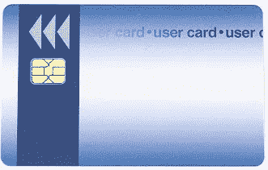

# 网络中的“一样东西”

> 原文：<https://medium.com/swlh/the-one-thing-in-cyber-594b9a5f2c3a>

网络安全专家经常借用公共卫生的术语。“疾病媒介”是传染病在人群中传播的途径。父母会直观地抓住两个主要的疾病媒介——他们孩子的学校和他们自己的工作场所。在网络中，我们以大致相同的方式谈论“威胁媒介”或“攻击媒介”。

这些是攻击者试图破坏系统并窃取数据的途径。即使是非技术专业人士也不会惊讶地发现，至少 91%的“黑客”使用电子邮件作为主要的“载体”，通过电子邮件获取信息，然后用来危害系统。

行业可以采取的防范这种情况的最有效且负担得起的措施是对所有电子邮件通信采用“数字签名”。

# 手段和方法

虽然黑客使用的策略看起来在技术上和心理上都很复杂，但归根结底，他们试图使用电子邮件来冒充你认识和信任的人。通常他们会在电子邮件后打电话来进一步努力。一旦他们成功地让你相信他们是另一个人，就很容易击败最先进的网络安全技术。

重要的是不要把这里发生的事情过于复杂化。 就像现实世界中的疾病病毒(如流感)可以通过经常洗手而被轻易破坏一样，当我们了解网络攻击(电子邮件)的“手段”和“方法”——冒充——时，我们可以设计出一种相对简单和负担得起的方式来破坏载体。

# “数字证书”标识

不需要太多的技术知识，互联网的特点是所谓的公钥基础设施(PKI)。理解 PKI 的细节是不必要的。重要的是，它能让你“确信”你收到的电子邮件的真实身份。(网络安全也叫“信息保障”(IA)。)

这是通过从公认的“证书颁发机构”(CA)获得“数字证书”来实现的。例如，Google 发布了一个他们认为可信的 CA 列表。此列表中提供在线电子邮件证书的 CA 包括 Commodo、Identrust 和 GlobalSign。这些“可信认证机构”还与微软和苹果等供应商合作，以确保他们当前的“根”证书定期更新到您的计算机操作系统中。

这些 ca 将使用各种方法来验证您的身份。根据您购买的证书类型(例如美国国防部接受的证书)，您可能需要发送一份经过公证的申请作为流程的一部分。

CA 将提供下载当前“根”证书并将其导入您的计算机的指导。收到证书(一种特殊格式的文件)后，您可以将其导入大多数电子邮件客户端，然后配置您的电子邮件客户端用您的证书“签署”每封电子邮件。

为了进一步加强这一点，公司可以对公司徽章/ID 卡采用“智能卡”方法。这些“智能卡”几乎与最近采用的“EVM 芯片”信用卡一模一样，这种信用卡在销售点放在读卡器中。这些“智能卡”可以配置一个 PIN，然后将数字证书写入芯片。现在，为了“签署”电子邮件，用户将智能卡/ ID 放入 USB 读卡器，并在发送时被提示输入卡的 PIN。(大多数电子邮件客户端会在第一次输入 PIN 后缓存该 PIN，并将其保存在缓存中，直到您关闭该程序，这样您就不会不断地被提示输入 PIN。)智能卡方法是“双因素认证”(2FA)的一个例子，它要求用户拥有徽章本身，并且知道 PIN。

Smart card with chip. Blanks are usually plain white and can be custom printed.

通过实施数字证书(以及可选的智能卡员工徽章)，现在所有员工都可以在内部和外部发送签名电子邮件。根据收件人使用的电子邮件客户端，他们会在电子邮件列表中看到某种形式的图标，显示邮件已签名。打开电子邮件并点击图标，然后显示证书所属人员的姓名。如果员工收到一封自称来自信任的同事/公司高管的电子邮件，但该邮件没有签名，该员工应立即将其视为可疑邮件。

随着公司越来越多地在内部采用这种技术，公司期望他们的外部业务伙伴、供应商等将变得切实可行。用数字证书签署他们的电子邮件。当我们了解到电子邮件假冒是网络安全中的主要“攻击媒介”时，考虑到“保证”，相对低廉的成本提供了巨大的投资回报，前提是向您发送电子邮件的人实际上就是他们所声称的人。

一般来说，有效期为三年的数字证书的价格不应超过 300 美元。批量购买智能卡相对便宜，许多供应商提供身份证打印服务。USB 智能卡读卡器的价格在 10 到 20 美元之间，现在通常内置在键盘和笔记本电脑中。

## 这篇文章发表在 [The Startup](https://medium.com/swlh) 上，这是 Medium 最大的创业刊物，有+ 370，107 人关注。

## 订阅接收[我们的头条](http://growthsupply.com/the-startup-newsletter/)。

