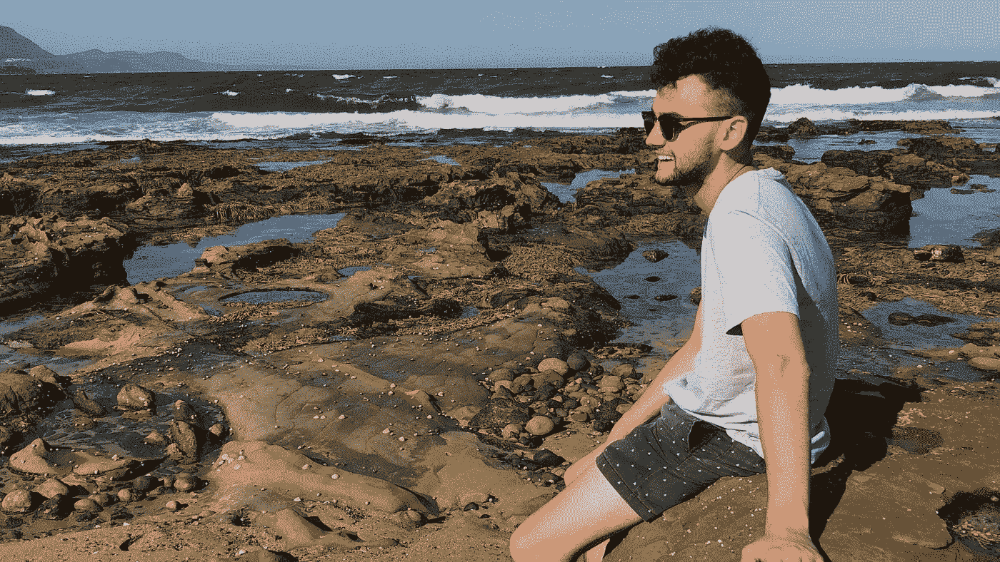

# 疾病教会了我每个人都需要学习的一件事

> 原文：<https://medium.com/swlh/the-one-thing-that-illness-taught-me-that-everyone-needs-to-learn-cc54f9548307>

> 一旦你意识到你能被推多远，你就会意识到你能走多远。

患有慢性疾病会对你的生活产生巨大影响。它把你推到极限，然后把你推得更远。

在过去的七年里，患有溃疡性结肠炎一直是一个考验，直到现在，我鼓起勇气谈论它，我才真正花时间反思我的旅程。

特别是，反思困难时期，但也关注它多年来产生的所有积极影响。

实际上说实话，当我回头看的时候，我没有看到任何负面的东西。

它造就了今天的我。

它让我变得更强大、更勇敢、更愿意尝试新事物，但它让我明白了一件我认为每个人都需要学习的事情。

# 你比你想象的要坚强得多

> “一旦你挨了几拳，意识到自己不是玻璃做的，你就不会觉得自己活着，除非你把自己逼到极限。”格林街的流氓

有趣的是，这些小事情可以粘在一起，在过去的几天里，上面引用的格林街流氓的话就是其中之一。

除了对我和大多数其他人来说，这与被重复击打无关。

相反，它推动生活抛给你的一切。

# 这是关于跌倒后重新站起来

一遍又一遍地重复着…

这第一次真正有意义是在 2011 年，在我告诉任何人之前，我忍受了[溃疡性结肠炎](https://www.medicinenet.com/ulcerative_colitis/article.htm)整整一年。包括父母，医生，朋友。没人知道。

我当时 56 公斤。极度缺铁，经常呕吐，但我还是挺过来了。我还是去上学了。我没有把它当作借口。这主要是因为害怕面对事实，这是一个非常愚蠢的想法，但现在回想起来，这是我第一次意识到，我们的身体和大脑可以忍受比我们想象的更多的垃圾。

第二次是最糟糕的一次，我决定再也不让溃疡性结肠炎影响我的生活。

我卧床不起 3 个月。体重回到 56 公斤，关节疼痛。

我想我永远无法解释疼痛的程度，但我会尽力…

我的肩膀贴在耳朵周围(就像把你的头靠在肩膀上，但保持脖子伸直)。我不能降低它。我甚至不能动我的手指。这是每一个关节，他们都受伤了，每天每一秒钟。

我不得不每天晚上睡到自然醒，然后把我的腿从床上移到床的另一边站起来，大约需要 15 分钟。

每次我坐下的时候。

每天早上。

每天。

*我不会陷入上学的尴尬，但它在那些年里发挥了巨大的作用。每个人都想融入，一切都很尴尬。*

# 简直是地狱。

在这一点上，我真正意识到我们能够忍受的比我们想象的要多得多。

谢天谢地，这已经够糟糕的了，这也是我采纳这句名言的原因:

> 如果你不能掌控自己的生活，别人或其他人会的。

你看，当我开始创业，开始写作，开始分享我的故事时，经历那些困难时期对我来说至关重要。

这让那些伴随着冒险而来的挑战看起来像是在公园散步。

我想，如果我能忍受，还能有什么更糟的呢？

原来真的不能。

它有助于让一切都变得清晰。

# 不要担心那些小事

这尤其有助于正确看待这一点:

> 一旦你意识到你能被推多远，你就会意识到你能走多远。

*   害怕尝试新事物是愚蠢的。
*   害怕被拒绝，是特别愚蠢的。
*   害怕被评判是愚蠢的。

看到主题了吗？

所有你花时间担心的事情都是你在头脑中建立起来的，以至于它们会阻碍你的进步。它们实际上不是问题，你只是有一种它们是问题的心态。

用这些视角来看以上三点:

*   如果你在新事物上失败了。谁在乎呢。至少你尽力了。**至少你掌控了自己的生活，走出了自己的舒适区。**
*   如果有人拒绝你。如果有人对你的请求说“不”。谁在乎呢。请找到不同的路径，然后重试。他们要么说“是”，要么说“不是”。
*   所以如果人们开始在你背后议论你，因为你决定你要追逐你的目标，而不是每个周末都喝醉。你为什么在乎？说实话。摆脱他们，继续前进，和鼓励你的人在一起。

**你需要停止花太多时间去想所有的‘如果’或者一切‘可能’发生的事情，开始专注于实际行动。**

用最严厉的方式来说:

> 不死就没事。

我希望你花些时间考虑一下。

当我要做一些“可怕”的事情时，我采用了一个过程，那就是问自己:

我会死吗？

这让我度过了那么多“可怕”的时光。

我会问自己，有没有可能我会死。如果答案是否定的，我就去做。

突然间，发邮件、对朋友说“不”或者追逐我的目标似乎变得轻而易举。

## 如果你喜欢这篇文章或者觉得它有帮助，按下那个按钮让其他人看看！

## 更好的是，在你的想法上留下评论。

# 喜欢这个故事？在此与我联系:

[insta gram](https://www.instagram.com/jesse.kerema/)|[LINKEDIN](https://www.linkedin.com/in/jessekerema/?lipi=urn%3Ali%3Apage%3Ad_flagship3_pulse_read%3BMbMfWF1NTCO6384kIHw53Q%3D%3D&licu=urn%3Ali%3Acontrol%3Ad_flagship3_pulse_read-nav.settings_view_profile)|[oak trav](https://www.oaktrav.com/jessekerema)|[博客](http://www.jessekerema.com/)

## 这篇文章发表在 [The Startup](https://medium.com/swlh) 上，这是 Medium 最大的创业刊物，拥有 281，454+读者。

## 在这里订阅接收[我们的头条新闻](http://growthsupply.com/the-startup-newsletter/)。

