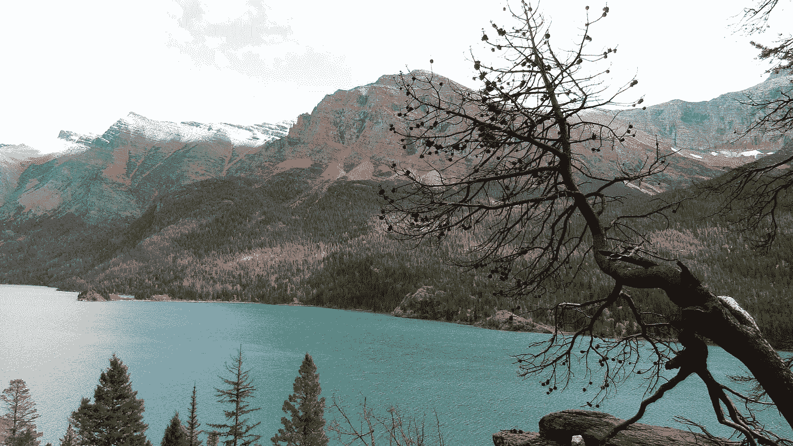

# 将开明的人与其他人区分开来的一点是

> 原文：<https://medium.com/swlh/the-one-thing-that-separates-enlightened-people-from-the-rest-e6375768927a>

> “它改变了我的生活，汤姆。”

在以色列呆了 17 天之后，我的一个好朋友几乎要哭了，他向我讲述了他在耶路撒冷的难忘经历。

我不需要他告诉我，我在 Snapchat 上都看到了。

实际上，我贪婪地享受着每一秒。

> 他很开心，我看得出来。他甚至在 7 月下旬跳上脸书告诉每个人他会再呆一周。

'好样的史蒂夫！'我对自己说。

这让我想起有一次我在盐湖城多呆了一周，因为我遇到了一个女孩。

等等，你又点了这篇文章做什么？

# 这就是你点击这篇文章的原因

1.  因为你不开明。
2.  因为你是开明的，但你只是想确保你没有错过什么。

3.我不知道，你很无聊？

> 你可能期望在接下来的 700-800 个单词中发现生命的秘密。在某种程度上，你会的。我保证。

然而，事实是，你不会从我在这里写的任何东西中得到真正的启发。

# 什么是“开悟？”

在我收到一大堆关于使用这个词的负面评论之前，我最好定义一下启蒙。

> 在这种情况下，觉悟就是意识到实现我们的梦想实际上是多么容易。

理解你最疯狂的梦想实际上是可能的。

如果你真的认为你最疯狂的梦想是可能的，为什么你还没有开始旅程呢？

> 我们大多数人都没有。

# 这是我认真写的话

> 现在我已经让你警觉了，下面是你对催化剂的介绍。

我到底是什么时候开悟的？

我告诉你。

在连续三周的旅途中，我在亚利桑那州的萨比努峡谷看到了完美的日落。

> 在独自看完蒙大拿州最美丽的山之后，因为该死的，我真的觉得有必要去。

# 这些照片是为了阐明我的观点

> 作为一名内容创作者，我尽力让你感受到某种方式。我想和你交流。

但是，尽管我的话可能是正确的，但它不能代替看到山脉，或在凌晨 3 点在你的帐篷里听到狼嗥，或在你攀登亚利桑那州的悬崖时感觉空气变得越来越凉爽。

# 文章不会改变你的生活

> 在亚利桑那州的图斯克恩，我感觉我的灵魂跳出了胸膛。我在冰川国家公园有一次宗教经历。

在这两种情况下，语言都不是等式的一部分。

> [我正在做](https://findingtom.com\)。我在那里，置身于树木、岩石、熊、山脉，甚至是雪中。

一篇文章不会让你去那里，人们。只有经历才能。

# 让我为文章提供一些赎回

言语是有力量的。我一直这么说。

> 我喜欢文字。当我们认真对待它的时候，文字首先让我出门开始我的旅行。你明白我的意思吗？

我每天都看冒险的凯特的博客。我想和她一样。我想看看这个世界，我想我得先看看我自己的国家。

所以我去了。

因为话，我去了。

> 但是因为我的经历，朋友，我变得开明了。

开明的人会。这就是他们与众不同的地方。

> 想在媒体上赚点外快吗？本周我将主持一些免费培训，题目是“**如何在 Medium 上每月额外挣 900 美元**”[在这里获得免费座位](https://events.genndi.com/register/169105139238473045/da2e6c5a01)！

## 这篇文章发表在 [The Startup](https://medium.com/swlh) 上，这是 Medium 最大的创业刊物，有+ 374，685 人关注。

## 订阅接收[我们的头条新闻](http://growthsupply.com/the-startup-newsletter/)。

