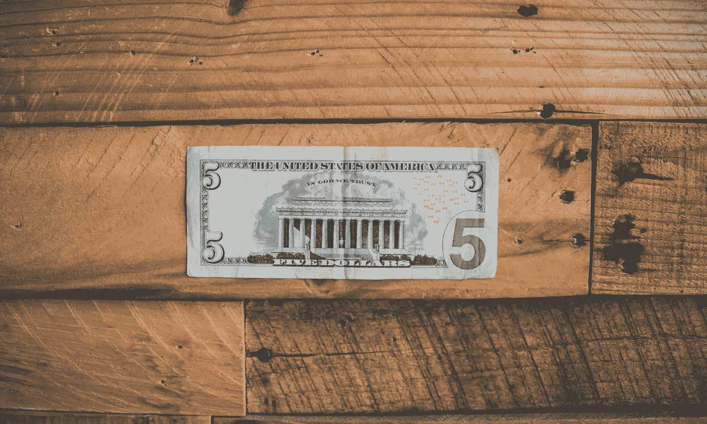

# 区分富有和贫穷的自由职业者的唯一标准

> 原文：<https://medium.com/swlh/the-one-thing-that-separates-wealthy-and-poor-freelancers-b8265f0cb754>

Photo by [NeONBRAND](https://unsplash.com/photos/mVSZWa6JwDE?utm_source=unsplash&utm_medium=referral&utm_content=creditCopyText) on [Unsplash](https://unsplash.com/search/photos/business?utm_source=unsplash&utm_medium=referral&utm_content=creditCopyText)

上周对我来说是非常有趣的一周。

一些自由职业者找到我，告诉我他们的第三份工作(有史以来)是如何收费 57 美元/小时的…

然后，有经验丰富的自由职业者找到我，问我是否有任何方法可以帮助他们每小时赚超过 20 美元。