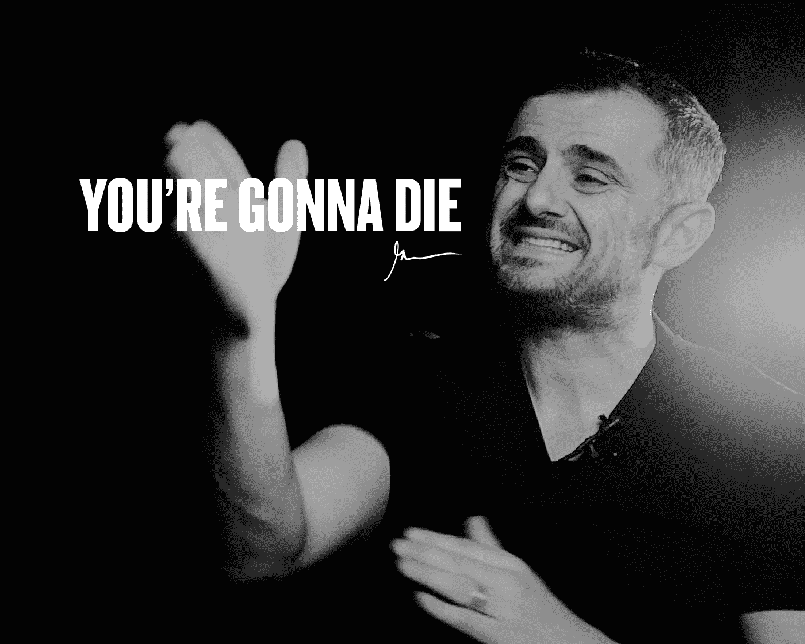

# 这是我坚持下去的唯一动力，即使所有的事情都让我心烦意乱

> 原文：<https://medium.com/swlh/the-one-thing-which-keeps-me-going-even-when-everything-annoys-the-f-ck-out-of-me-436769b1fd2b>

## 我直接说吧:我要死了。

嗯，但愿我明天不会死。

然而，如果我是那些像 90%的人一样自然死亡的人，我可能会在大约 50 年后离开这里(我现在 27 岁)。

没那么长。

这就像如果我生来就有三块蛋糕可以吃，然后被踢出这个世界，而我已经吃了一整块。

有些日子，我觉得我还有 2 整大块可以吃，
而大多数日子，我觉得我只有 2 小块可以吃。

不管怎样，它让我坚持下去。

这不像你现在可以停下来说:
“嗯，你知道吗？我今天不吃任何蛋糕。”

因为不管你吃不吃，享受不享受，
一天下来，多吃一口就没了。

所以我可能只有 5 年多的寿命了，尽管我并不担心，但这是我坚持下去的动力。

即使在所有的事情都让我心烦意乱，没有一件事情按计划进行的日子里。

这就是有限生命的全部意义:时间实际上是有意义的，我们不应该用它来抱怨生活有多艰难，拖延或找任何借口。

我们应该把它投资在重要的、有长期影响的、积极改变我们周围世界的事情上。

不管发生什么，我们都应该坚持下去。

因为生活就是这样:
不管你是否赶上，它都会继续前进。

> “你只活一次，但如果你做得对，一次就够了。”——梅·韦斯特。

## 这篇文章发表在 [The Startup](https://medium.com/swlh) 上，这是 Medium 最大的创业刊物，拥有+ 373，446 名读者。

## 在这里订阅接收[我们的头条新闻](http://growthsupply.com/the-startup-newsletter/)。

