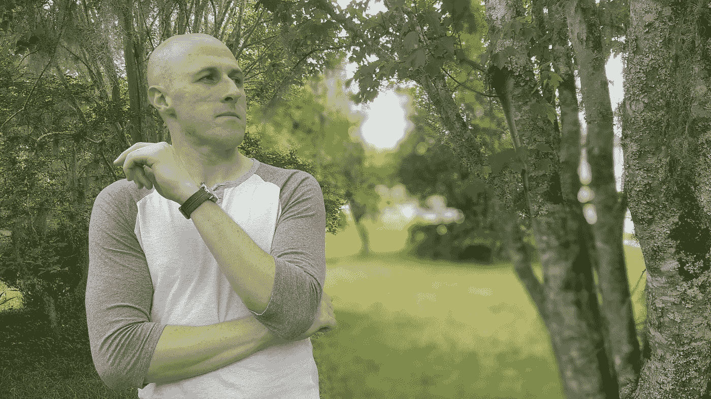

# 你应该害怕的一件事是…

> 原文：<https://medium.com/swlh/the-one-thing-you-should-be-scared-of-9d5a1f020662>

Photo by [JD Mason](https://unsplash.com/photos/cKT0oJL9vMI?utm_source=unsplash&utm_medium=referral&utm_content=creditCopyText) on [Unsplash](https://unsplash.com/search/photos/old-person?utm_source=unsplash&utm_medium=referral&utm_content=creditCopyText)

不幸的是，我成年后的大部分时间都被恐惧所控制。

我记得在高中的时候，我非常害怕进入大学。我害怕申请学校而被拒绝，我害怕被一所学校录取，我害怕大学提供的挑战。

我上大学的时候也是这样。我害怕选择专业。害怕走上一条艰难的道路。我也害怕难学的专业。如果我被发现不是最优秀最聪明的人之一呢？

毕业的时候，恐惧就在那里，一如既往的等着我。我害怕申请工作。害怕把自己锁在一个没有前途的职业里。害怕申请，害怕被拒。

结果是，我在申请工作时并没有表现出应有的进取心。当我找不到工作时，我开始把目标越定越低，直到我得到了第一份全职工作:一家生物技术公司的制造技术员。

最终，我找到了一份初级的有薪工作，成为了一名分析师，但我在恐惧的麻痹下度过了几年无所作为的时光。

事实上，在毕业和找到一份全职工作之间的这段时间里，恐惧不仅阻止了我找到一份好工作。

一个朋友兼导师在这段时间反复跟我说，我需要开个博客。他告诉我，我的想法值得与世界分享，他甚至指出许多人通过写博客赚了很多钱。

你可以猜到他的建议去了哪里:哪里也没去——因为我太害怕了，不敢照着做。

那是在 2009-2010 年。现在看看我最喜欢的一些博客和在线影响者，他们中的许多人始于 2011 年，现在正在粉碎它。我会比他们领先一年。

如果我听了朋友的建议，这能保证我现在会非常成功吗？不，但如果我早点走出舒适区，我会成长得更快。

## 我到底在害怕什么？

事实上，我记得很多具体的恐惧:

*   我害怕开博客所涉及的技术问题
*   我担心不能始终如一地提供内容
*   我害怕我的作品被评判。
*   我害怕我的观点被评判。
*   我害怕设计被评判。
*   我害怕赔钱。
*   我害怕失败。成为“那个人”，总是乐观地开始做事，但永远不会成功。
*   我害怕人们认为我是个骗子。
*   我害怕人们因为我试图在网上赚钱而对我评头论足。
*   我害怕成功，没错，我说的是成功，这意味着你需要想出额外的事情，比如如何处理你的税收，如何投资回企业，等等。

这真是一长串的恐惧。当时，我甚至没有把它称为恐惧。我认为这是我对博客选择的合理评价。恐惧看起来像逻辑，尽管它是深深的情绪化的。

严酷的事实是，如果你寻找不做某事的理由，你会找到的。

所以，近十年后的今天，我不得不面对我一开始就应该害怕的事情:后悔。

现在，让我们弄清楚一件事:这不是一个可怜的聚会。在我与后悔的对抗中，我有两个基本的选择:变得痛苦或者变得更好。我选择了后者。

不，这不是一个同情聚会——这是一个警告。

除非发生灾难性事故，否则我还有很多时间。我对过去的遗憾无能为力，但我可以选择确保它不是我未来的一部分。

但我不会永远享受这种奢侈。我上次查的时候死亡率的致死率还是 100%。

> 31 岁时的后悔是一个令人谦卑的教训。80 岁时的遗憾将是毁灭性的。

据我们所知，人类是唯一发现未来的生物。我们中最聪明的人正在充分利用这种能力。

为了利用你考虑未来的能力，你应该问自己的首要问题是“我会后悔没有采取什么行动？”

有野心的错误，也有懒惰的错误。我们大多数人都在积极避免雄心壮志的错误——因为后果通常是立竿见影的——但从长远来看，懒惰的错误影响更大。

> 懒惰的错误铺就了通往平庸的平静之路。

# 从一般到牛逼

据我所知，从一般到令人敬畏的旅程在开始时有两个关键步骤:承诺和勇气。

这不是你成功所需要的唯一两样东西，但是没有它们几乎不可能启动。

## 承诺

承诺意味着[你需要一个计划](/@thematthewkent/your-10-year-plan-for-a-remarkable-life-f65d661c0594)。你需要主动决定你想要什么，并下定决心去得到它。我喜欢有书面的计划，这增加了承诺的层次。

你应该对更好的未来有一个令人信服的愿景——你的“为什么”——推动你前进。

想出一个计划是很可怕的。一旦你做出承诺，就有可能失败。你不想失败。

也会有改变的需求，改变是不舒服的。

## 勇气

当你看着别人时，很容易把勇气和自信混淆。然而，有一个关键的区别，这就是勇气隐藏的秘密:*勇气感觉像垃圾*。

我们有一种把勇气浪漫化的倾向。勇气是一种高尚的美德。实践勇气的人是英雄。

所有这些都是真的，但它会给你一种错误的感觉，即勇气意味着你在面对逆境时不会害怕。那不是真的。你吓得魂不附体。这并不妨碍你行动。

任何时候你开始任何创造性的努力(比如对我来说，甚至是发表这篇文章)，你的脑海里都会有一个声音在尖叫“不要这样做，这可能行不通！”

你可以把那个声音称为“阻力”、“蜥蜴脑”、“杏仁核”，或者任何你想叫的名字，但重要的是你要认识到，当你试图做一些不同的事情时，它正等着令你着迷。

重要的是要认识到，为了前进，你需要尝试一些可能行不通的东西。你需要走出你的舒适区，做一些可怕的事情。

你的蜥蜴脑可以抗议他想要的一切，但他需要一起来。

# 对失败的恐惧和对胜利的兴奋

我想分享罗伯特·清崎最畅销的个人理财经典《富爸爸，穷爸爸，T2》中最令人难忘的一句话:

> “在内心深处，你害怕冒险。你真的很想赢，但是对失败的恐惧超过了对胜利的兴奋。在内心深处，你，也只有你会知道你没有去争取。你选择了稳妥行事。”

*“在内心深处，你，也只有你自己会知道你没有去争取。”那些话刺痛了我。*

听着，现实是你可能会失败。但这还不是可怕的部分。可怕的是多年后回首往事，痛苦地意识到你希望自己当时采取了行动。

我想成为一名作家。我想成为个体经营者。我想和我的妻子和孩子一起去旅行。我知道这些事情可能不会发生。我知道，公开声明它们，可能会给失败增加尴尬。我知道未来可能会令人失望和沮丧。

但是我愿意在任何失望和沮丧中坚持下去，知道我已经尽力了。

## 我们都应该害怕的是后悔。

# 在这里获取我的免费生产力指南“终极每日清单:赢得胜利的 13 个步骤”:

 [## 终极每日清单

### 更多信息请访问邮报。

thematthewkent.com](http://thematthewkent.com/the-ultimate-daily-checklist/) 

## 这篇文章发表在 [The Startup](https://medium.com/swlh) 上，这是 Medium 最大的创业刊物，有 327，829+人关注。

## 订阅接收[我们的头条新闻](http://growthsupply.com/the-startup-newsletter/)。

