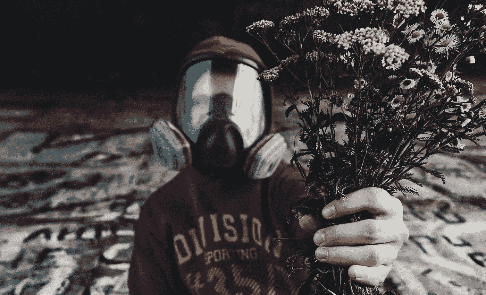

# 你应该对有毒的人做的一件事

> 原文：<https://medium.com/swlh/the-one-thing-you-should-do-with-toxic-people-a02df07eada1>

Source: Unsplash

你不能用你的逻辑和常识去反击有毒的人。

他们只是没有和你一样的世界心智模式。

这并不意味着你是对的，或错的。

这意味着你们都通过不同的过滤器来解读这个世界。

有意识故意害人的人，
非常少见。

我们都基于我们认为正确的事情采取行动。
即使是错的。

当你反击时，你带领他们保护自己，
并因此加强他们的地位。

这使得情况变得更糟。

不要用你的能量滋养某人的毒性。
你会服侍他，而不是你。

通常，最好的办法是接受，明白有些人只是在玩与我们不同的游戏规则。

离开那个耗尽你能量的人。

牢记在心:
*“对蜘蛛来说正常的事，对苍蝇来说就是地狱。”*

## 这篇文章发表在 [The Startup](https://medium.com/swlh) 上，这是 Medium 最大的创业刊物，有+ 375，041 人关注。

## 在此订阅接收[我们的头条新闻](http://growthsupply.com/the-startup-newsletter/)。

