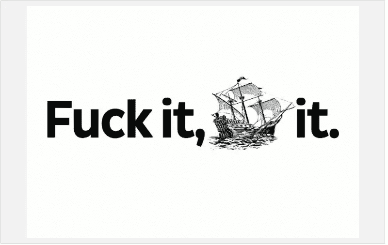

# 大多数创业公司的唯一问题是，讽刺的是，他们并没有真正开始。

> 原文：<https://medium.com/swlh/the-only-problem-with-most-startups-is-that-ironically-they-dont-really-start-e617930e2c8>

## 过于执着于你的想法的代价是进步。

Photo by [Heng Films](https://unsplash.com/photos/xykmZMKimJU?utm_source=unsplash&utm_medium=referral&utm_content=creditCopyText) on [Unsplash](https://unsplash.com/?utm_source=unsplash&utm_medium=referral&utm_content=creditCopyText)

企业家出身的精益创业先驱埃里克·里斯在 2011 年对创业公司提出了一些严厉的建议:[想法被高估了。](https://www.wired.com/2011/08/st_qareis/)

7 年后，这句话仍然适用。

由于成为创始人的宝贝，大多数创业想法都被束之高阁，永远不见天日。那些沉迷于自己的创造，而它还仅仅掌握在自己手中的创业者们，错过了一把重要的钥匙🔑。提出一个想法并不是初创企业的重要组成部分。**航运你的想法是。**

任何人都可以想出一个主意。事实上，就在我们说话的时候，已经有人在世界的另一个地方研究你的想法了。打败他们的唯一方法就是简单地*比他们*更快地将你的想法推向市场。

# 做重要的事情

你不会仅仅因为有了一个创业想法，或者因为你还在创业，就被称为创业公司。一个从来没有执行和出货的创业公司真的没有创业，那只是一个假象。

相反，弄脏你的手，迅速做重要的工作。这种“做”的心态迫使你做出重要的决定。没有时间拖拖拉拉，甚至修修补补太久。

如果你一直处于“做”的状态，另一个主要优势是你可以有效地分散你的注意力。抱歉社交，没时间给你。

# 艺术家与真正的艺术家

同意在构思中有如此多的快乐和幸福。你可以坐在那里几个小时不停地提炼东西。不要被困在创造过程的喜悦中。推动进步。

当你集中精力，致力于实现你的想法时，你自然会凝聚力量，更加努力地工作。把某样东西拿出去所需要的情绪劳动包含了公众尴尬和失败的风险。情感劳动对成功来说是无价的。

> “成功艺术家的一个关键要素是:船。把它拿出去。让事情发生。另一个:失败。经常失败。梦想远大，但不能实现。反正不是每次都这样。”——塞思·戈丁

# 设置发货截止日期

最后但同样重要的是，设定具体的截止日期，并作为一个团队坚持执行。在软件中，有一个时间限制的概念，你将决定在一个商定的范围内完成一个完整的冲刺(比如一周或两周),如果超过了截止日期，就无情地转向下一个。这是一个很棒的技巧，可以让你学会在任何一周内优先处理任务。

请记住，尽管如此，你永远不会完全准备好发射。会有 bug。你的产品中会有一些低劣的地方。但是没关系。完成>完美。

Source: CodeHorror blog

> “版本 1 糟透了，但还是要推出它。— [杰夫·阿特伍德](https://blog.codinghorror.com/about-me/)，StackOverflow 的联合创始人

航运需要顽强的毅力和大胆的勇气。在接近终点线之前的很长一段时间里，它也令人感到无聊和单调。

[塞思·戈丁](http://sethgodin.typepad.com/)作为一名艺术家，从有史以来(至少从我们知道流行说法中的“blogger”这个词开始)，他每天都在写博客，有时他的作品令人惊叹，但其他时候却很普通。然而，他的船。每一天。

你的创业之旅就是这样。一心一意地将你的想法付诸实施会有巨大的力量——勇敢地送到客户手中，并面对结果。

## 埋头做这项工作，然后把它运出去。

*在 ClosingPage 上，我们体验了 5 周的这种心态，包括圣诞假期，并建立了我们的主要公开发布。在这里免费一睹我们的产品***。**

*你有哪些关于航运的故事/想法？创业故事总是很有趣。*

**

## *这个故事发表在 [The Startup](https://medium.com/swlh) 上，这是 Medium 最大的企业家出版物，拥有 286，184+人。*

## *在此订阅接收[我们的头条新闻](http://growthsupply.com/the-startup-newsletter/)。*

**