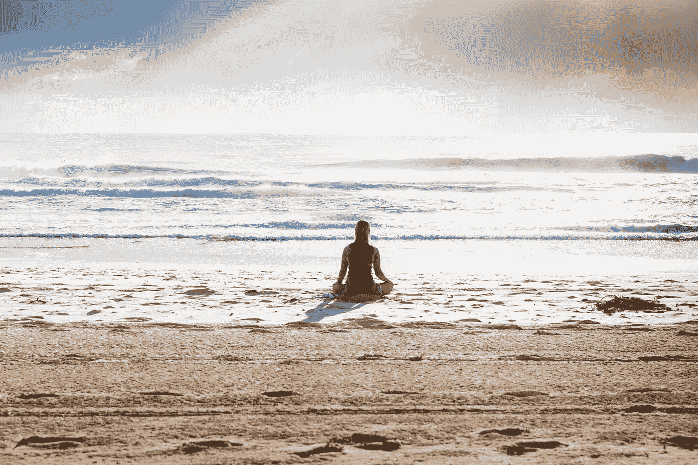

# 提高工作效率和避免分心的唯一秘诀

> 原文：<https://medium.com/swlh/the-only-trick-behind-being-more-effective-at-what-we-do-and-avoid-distractions-e230178d268>

我偶然发现了这个名为 Headspace for 冥想的应用程序，并在过去的一周里每天都在使用它。它有一个令人愉快的设计，有助于培养日常冥想的习惯。

它所采取的简单方法及其背后的原则对于培养任何日常习惯都是至关重要的，对于在从踢足球到写作到避免我们生活中的分心的每件事情上都变得更好、更有效也是至关重要的。

理解如何变得更好，在任何事情上变得更有效率是容易的部分。我们几乎没有人在做以前没有做过的事情。我们总能找到那些在我们着手做的事情上取得成功的人，并向他们学习。

在我们吸取了这些教训之后，就是我们成为它们的热情追随者，并在追求更好的过程中取得进步的时候了。但是，此后我们与世界的每一次互动都使这些学习变得迟钝，直到它们消失在背景中，我们被其他的东西完全消耗掉。公平地说，许多互动也增强了这些学习，但鉴于我们分心的生活，净效应总是使这些学习变得乏味，并将其回避到背景和即时记忆之外，这意味着超出了日常决策的范围。

结果，我们又回到了一条最不适合我们最初计划的道路上。

顶空法所能做到的，也是冥想通常所做的，是让我们坐下来，观察我们头脑中正在发生的一切，从远处看我们的想法和感受，并围绕对这些想法和感受的最适合我们希望取得的进步的方法和反应来收集我们的想法。

早上三分钟就够了。只要坐下来闭上眼睛(或者看看窗外的树木、鸟儿和运河)就足以提醒我们，我们需要以超然的眼光看待事物，并保持客观。

在我们与世界的互动开始再次使这些认识变得迟钝之前，一天的长度对于这种效应来说是足够长的时间框架。

从这个意义上说，冥想就像喝水一样。我们喝一杯水，然后我们继续我们的生活，而不会感到口渴或疲惫，我们的身体能够就如何有效地消耗能量做出理性的决定，而不用担心体内缺水的情况。几个小时后，我们还要补充另一个杯子，等等。

提高工作效率和避免分心的唯一诀窍是控制我们的想法和情绪。每天三分钟就能掌握这种控制。

## 在你走之前…

如果你喜欢这个，请支持我的工作。你需要做的就是鼓掌。

[*跟我讨论美好生活的错综复杂。*](http://eepurl.com/cqwJZT)

[*读我的书*](https://www.amazon.com/s/ref=nb_sb_noss?url=search-alias%3Daps&field-keywords=mayantuyacu)

## 这篇文章发表在 [The Startup](https://medium.com/swlh) 上，这是 Medium 最大的创业刊物，有 344，974+人关注。

## 在这里订阅接收[我们的头条新闻](http://growthsupply.com/the-startup-newsletter/)。

