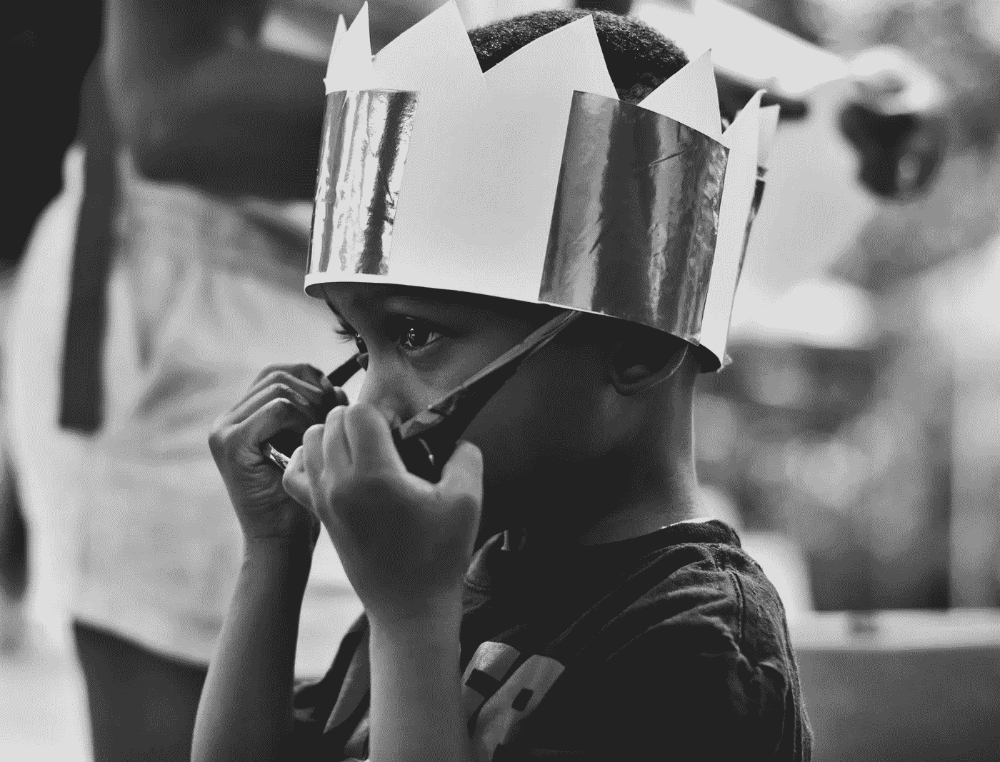
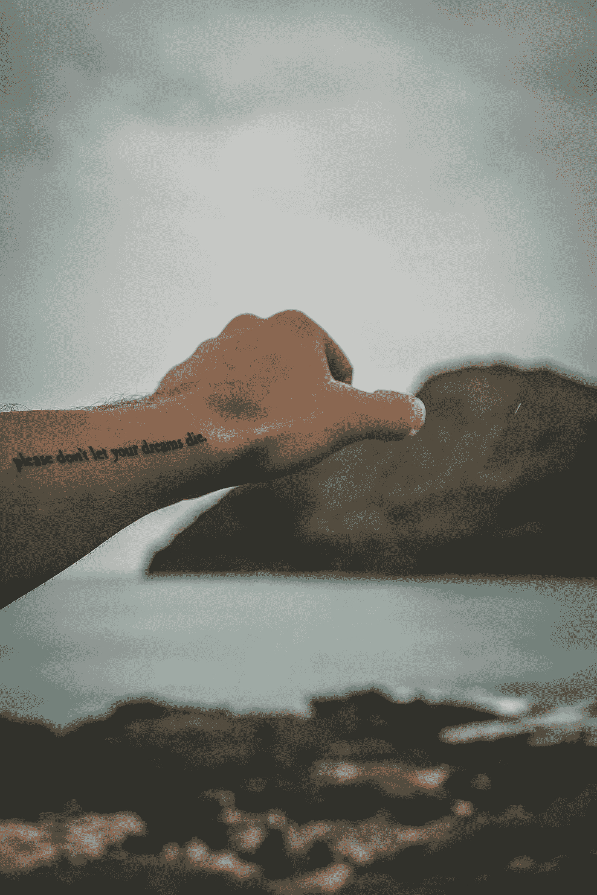

# 成为世界级大师的唯一方法

> 原文：<https://medium.com/swlh/the-only-way-to-become-a-world-class-master-at-anything-ba31857f5d8e>

## 答案会让你大吃一惊…

Photo by [Hal Gatewood](https://unsplash.com/photos/OgvqXGL7XO4?utm_source=unsplash&utm_medium=referral&utm_content=creditCopyText) on [Unsplash](https://unsplash.com/search/photos/brain-cell?utm_source=unsplash&utm_medium=referral&utm_content=creditCopyText)

什么是*精通？*

我们大多数人可能都熟悉 10，000 小时这个命题:

> 要成为某个领域的世界级高手，需要 10000 小时的“刻意练习”。

什么是刻意练习？

> [刻意练习](https://jamesclear.com/deliberate-practice-theory)是指一种特殊类型的有目的、有系统的练习。虽然常规练习可能包括无意识的重复，但刻意练习需要集中注意力，并以提高表现为具体目标。

在我被痛斥 10000 小时规则是一个骗局，新的研究驳斥了[马尔科姆·格拉德威尔](https://medium.com/u/92cc4cc2a4f4?source=post_page-----ba31857f5d8e--------------------------------)和[詹姆斯·克利尔](https://medium.com/u/528e9a6004d8?source=post_page-----ba31857f5d8e--------------------------------)在这个领域所做的任何和所有工作之前，**让我们在可操作的实践和通过所述时间开始之前，在我们的评估中后退一步。**

你必须问自己一个简单而深刻的问题:

> 生活中我对什么充满激情，什么让我兴奋？

这个问题可能对很多人来说很容易回答，但对其他人来说却非常困难。

Photo by [Aziz Acharki](https://unsplash.com/photos/bD1YLSEGZtU?utm_source=unsplash&utm_medium=referral&utm_content=creditCopyText) on [Unsplash](https://unsplash.com/search/photos/holding-light?utm_source=unsplash&utm_medium=referral&utm_content=creditCopyText)

> “通过学习你是谁来成为你是谁。”
> 
> 罗伯特·格林

我知道当我还是个孩子的时候，我的祖父母去了趟西班牙。当他们回来的时候，他们给我带来了一个我永远不会忘记的纪念品。

这是一个很小的——大约手掌大小的陶瓷复制品，是斗牛士斗牛中的一只公牛。

这是一个如此小而微不足道的遗迹。

它的肩膀上和背部正中央有三个小孔。这些洞是在那里，所以三个小弯刀可以休息到后面，并进一步说明了公牛的杀戮。

我记得我问我奶奶那是什么。我不知道斗牛士的存在，也不知道有这样的仪式。

她向我简要介绍了斗牛的情况。

然而，我需要知道更多。接下来的几天，我去图书馆搜寻所有关于斗牛士的信息(是的…这是在互联网出现之前，我们需要在所谓的“书籍”中查找信息)。

我记得翻开书页，看到斗牛士的勇猛和闪光。

Photo by [Giovanni Calia](https://unsplash.com/photos/ezvIERAtqZc?utm_source=unsplash&utm_medium=referral&utm_content=creditCopyText) on [Unsplash](https://unsplash.com/search/photos/matador?utm_source=unsplash&utm_medium=referral&utm_content=creditCopyText)

那一刻，我知道我长大后想做什么——斗牛士。

我撕掉了床上所有的床单。我让我的小妹妹或我的狗假装它们是公牛(我的妹妹总是更讨人喜欢)。我会像竞技场上的英雄一样昂首阔步地穿过客厅。

我在为我的未来训练。

一切似乎都在按计划进行。

> 然后，当然现实就出现了…

我没有花太多时间就意识到，我长大后永远也不会成为一名斗牛士，这个梦想几乎是不可能的。

很长一段时间，我都崩溃了。

当尘埃落定，生活开始了。我被扔进了学校的繁琐事务中。我得到了我的第一份“大男孩”工作，随后被解雇了。

生活还在继续。

在我 25 岁左右的时候，我开始问自己这个问题。生活感觉有点停滞不前。

*   我知道我不想让我的大部分时间都呆在一个荧光灯照明的小房间里。
*   我知道我可以卖我不相信的产品。
*   我知道我喜欢讲故事。
*   我知道我喜欢与人交流。
*   我知道*我喜欢写作。*

Photo by [Thought Catalog](https://unsplash.com/photos/UK78i6vK3sc?utm_source=unsplash&utm_medium=referral&utm_content=creditCopyText) on [Unsplash](https://unsplash.com/search/photos/typing?utm_source=unsplash&utm_medium=referral&utm_content=creditCopyText)

26 岁时，我开始在自己创建的名为[*where sthefidelity*](https://www.wheresthefidelity.com/)*的博客上写作(它还在直播，每当我再次看它时，我都会退缩)。*

*我想成为生活中某方面的大师。我的声音会在深夜折磨我。*

*它告诉我，我跟随我脑海中的缪斯。*

*我就这样做了，我写了。*

*一开始，我经历了如此多的写作乐趣。*

*于是我继续写作。*

*在过去一年半的*刻意练习*我的写作中我取得了一些成绩:*

*   *我的粉丝已经超过了 250 万次*
*   *我的电子邮件列表已经增长到 1200 多名粉丝。*
*   *我通过出售我的电子书《T21》来补充我的收入。*
*   *我已经委托了我的第一份自由职业工作，这进一步帮助我每月额外增加 1200 美元。*

## *这一切都始于当我生活中的许多事情似乎都半途而废时，问自己一个宽泛而明确的问题。*

**

*Photo by [Valario Davis](https://unsplash.com/photos/knAVZEz2Dfw?utm_source=unsplash&utm_medium=referral&utm_content=creditCopyText) on [Unsplash](https://unsplash.com/search/photos/king?utm_source=unsplash&utm_medium=referral&utm_content=creditCopyText)*

> *“如果人们知道我有多努力才掌握了这门技术，那就一点也不美妙了。”*
> 
> *米开朗基罗*

*不要误解我的意思，我是大师吗？*

*不…无论如何也想象不到。*

*然而，我是在追求这样的精通吗？*

> *你打赌你的屁股我。*

*我知道，对我来说，当考虑成为伟大的或世界级的人物时，这种想法通常是势不可挡的，而且是有害的。*

*有一段时间——有时是连续几年，我不知道我应该做什么(有时我仍然认为我不知道)。*

*有很多次，我沿着某条路走下去，却发现了一个死胡同。*

*   *我花了 2.5 年时间表演即兴表演，以为自己会成为下一个史蒂夫·卡雷尔*
*   *我花了一年时间写了一部小说，讲的是一个非常爱迈克尔·杰克逊的男人，在他不幸去世的那一年，他穿越了整个国家去做他的伴舞。这使他陷入了吸毒和堕落的生活。*
*   *我在考虑获得工程硕士学位。*
*   *我以为我会在人生的某个阶段成为一名高中老师。*
*   *我在美国公司拼命工作，结果却被解雇了。*
*   *见鬼……就像之前说的，我以为我会成为一名斗牛士！*

*我不得不尝试许多“错误的道路”,以便找到自己的位置，在那里我实现我的技能，拼命工作，同时从中找到极大的快乐。*

*最终，我发现所有那些“错误的道路”都只是我一直在走的这条生命之路的临时出口。*

**

*Photo by [William Bayreuther](https://unsplash.com/photos/_uFiae5_vME?utm_source=unsplash&utm_medium=referral&utm_content=creditCopyText) on [Unsplash](https://unsplash.com/search/photos/dreaming?utm_source=unsplash&utm_medium=referral&utm_content=creditCopyText)*

> *“只有全心全意献身于一项事业的人，才能成为真正的大师。因此，精通需要一个人的全部。”*
> 
> *——阿尔伯特·爱因斯坦*

*那么你在生活中处于什么位置？*

*你找到你的使命了吗？*

> *你知道你热爱什么，什么让你兴奋吗？*

*如果是的话——真了不起。*

*如果没有——花些时间去真正发展和发现真正让你感动的东西。然而，这不是偶然的努力。*

*这可能需要几周、几个月甚至几年的时间才能发现。*

*你小时候真正喜欢的是什么？*

*在你的过去中，有没有清晰的记忆让你知道你真正体验到了*的快乐？**

*那些会告诉你一些事情，听听那些记忆。*

*找到让你感动和兴奋的东西，并沿着它走向你的*掌握。**

# *还有谁想自己当老板？*

> *我提供给你一个经过测试和验证的 6 部分指南，它包含了强大的概念，可以帮助你识别、规划、成长和完成你的创造性追求。*

# *[> > >在这里获得免费指南< < <](https://mailchi.mp/4b982beed325/free-6-step-course)*

## *学到了什么？按住👏说“谢谢！”并帮助他人找到这篇文章。还评论！*

**

## *这篇文章发表在 [The Startup](https://medium.com/swlh) 上，这是 Medium 最大的创业刊物，有 351，974+人关注。*

## *在这里订阅接收[我们的头条新闻](http://growthsupply.com/the-startup-newsletter/)。*

**