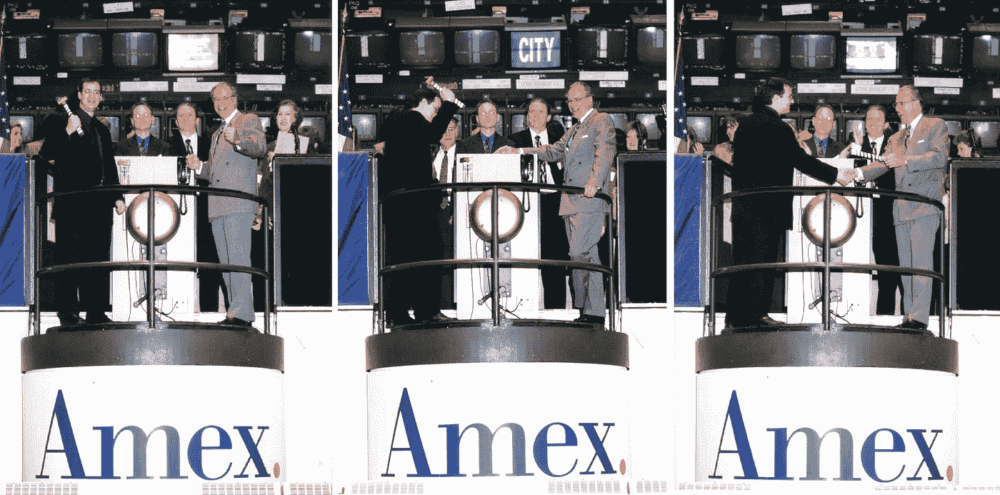

# 开场铃声(没人告诉我我必须演讲)

> 原文：<https://medium.com/swlh/the-opening-bell-no-one-told-me-i-had-to-make-a-speech-cf2a7e1b04e4>

本周将是我有幸敲响美国证券交易所开市钟的 20 周年纪念日。那是 1998 年的春天，我们公司 Sonic Foundry 将在那天正式开始交易。

Sonic Foundry Prospectus from 1998.

1997 年，IPO 市场非常火爆，但现在变得越来越艰难，我们知道我们的机会可能正在关闭。那是纽约的一个周六，我和 Sonic Foundry 的首席执行官 Rimas 正要去见一家小公司的负责人 Ray Dirks。当我们走进去的时候，只有雷在一间空荡荡的大办公室里，里面有一排排的桌子。这就像是华尔街电影里的场景。我清楚地记得，我最好的朋友、最近刚毕业的 MBA 里马斯(Rimas)转向我说:“我闻到了钱的味道”。我在想“你确定你没有把空虚和绝望与金钱混淆吗？”事实证明，Rimas 的嗅觉相当准确，几个月后，我们将进行首次公开募股。

No one told me I had to give a speech.

我被要求在开场前说几句话。我记得我试图鼓舞人心，但中途意识到交易大厅里没有一个人在乎我要说什么。他们只想去工作。

非常有趣。我按了门铃，市场开盘，然后我们参观了交易大厅，看着我们的符号 SFO 第一次出现在电子报价器上(当我们后来转到纳斯达克时，我们就变成了 SOFO)。我们被迅速带到一个庆祝午餐，然后花了一个下午在曼哈顿不断检查股票价格。当我们实际上以高于开盘价收盘时，大家都非常高兴(也松了一口气)。

My co-founder Curtis J Palmer and I with some sweet phones on the trading floor. (My skin tone and slight puffiness would never suggest that I was a coder from Wisconsin)

我们花了 7 年时间才走到这一天，但从我们获得第一笔朋友和家人的投资，永远改变了我们公司的方向开始，也不过 3 年多一点。头四年，我们通过储蓄、VISA 卡和来自[音响锻造](https://www.magix.com/ca/music/sound-forge/)的销售勉强度日。一旦我们决定进行外部投资，重点就变了。突然间，这不仅仅是我们能做出最好的产品。现在的重点是收入和增长，以及做我们认为会让投资者满意的事情。这有时意味着为了短期收益而牺牲长期结果，以及做出如果没有那个额外要求你可能会做得不同的决定。

我不后悔上市，也不后悔我们在互联网泡沫期间的疯狂之旅。毕竟我们能够创造出许多今天仍在使用的产品， [Sound Forge](https://www.magix.com/ca/music/sound-forge/) 、CD Architect、Acid、Vegas、Mediasite 等等。由 XSOFO'ers 创建的公司和产品清单令人印象深刻。我花了 20 年的时间和非常聪明的人一起工作，创造出令人难以置信的产品，并建立了一生的友谊。

但我可以告诉你，我最怀念的是 1994 年。那一年，柯特离开了微软，开车穿越全国，来到威斯康辛州的麦迪逊和我团聚。我们两个雇用了一个刚从大学毕业的年轻工程师，John Feith，我们三个花了 1994 年的时间编写 Sound Forge 3.0。这将是我们的突破性版本，Macromedia 将在年底出现，寻求收购我们。那一年，我们日以继夜地工作，在一个几乎空无一人的水泥墙建筑里，靠吃玻璃镍披萨维生，Curt 用工具和珍珠酱轰炸我们。我们不担心经常性收入或季度业绩。我们只是写代码，这让我们很高兴，因为我们知道我们正在创造人们会喜欢的东西。

所以，下次当你在聚会上，有人对你的“生活方式生意”大加挞伐时，我希望你能想起这句库尔特·冯内古特的名言

> “我敦促你，当你快乐的时候，请注意，在某个时候，惊呼或低语或思考，‘如果这还不好，我不知道什么是好的。"

因为对我来说，1998 年和 1994 年都很美好。

## 这个故事发表在[的创业](https://medium.com/swlh)上，这是 Medium 最大的创业刊物，有 317，629+人关注。

## 订阅接收[我们的头条新闻](http://growthsupply.com/the-startup-newsletter/)。

