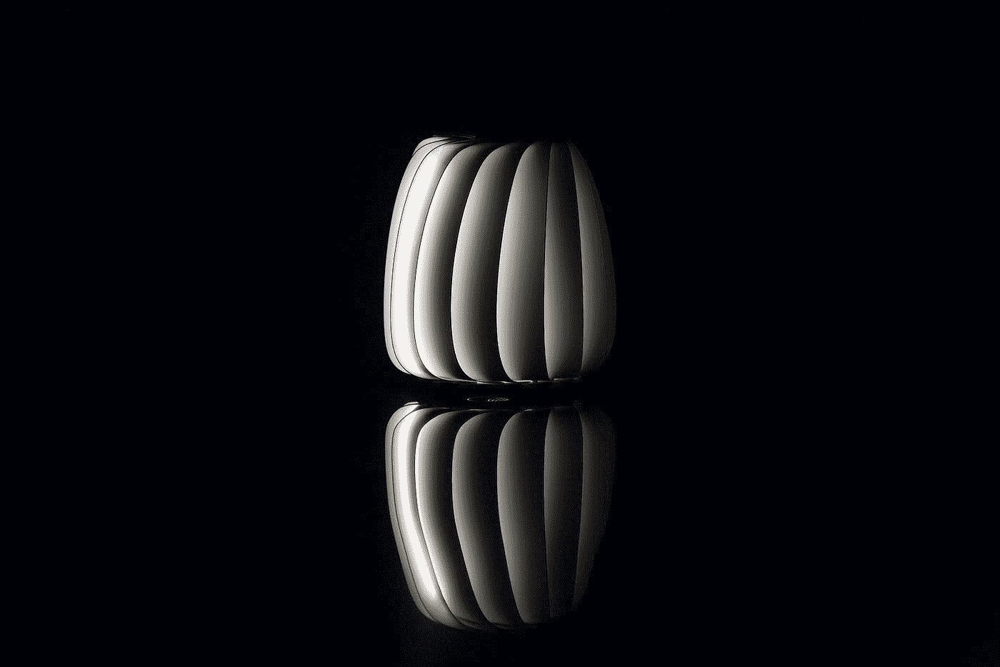
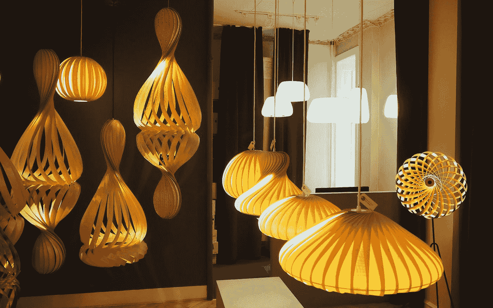
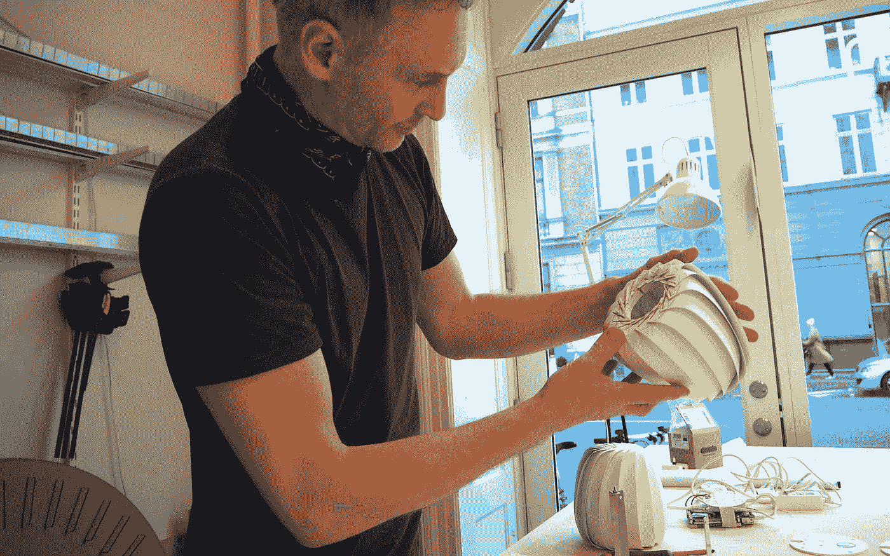
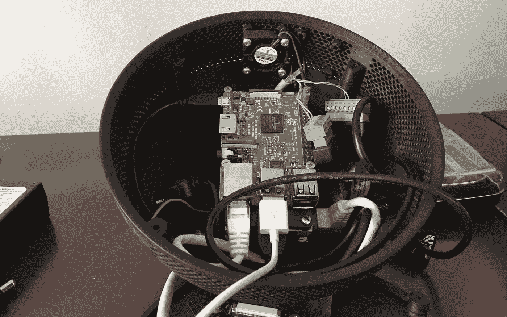
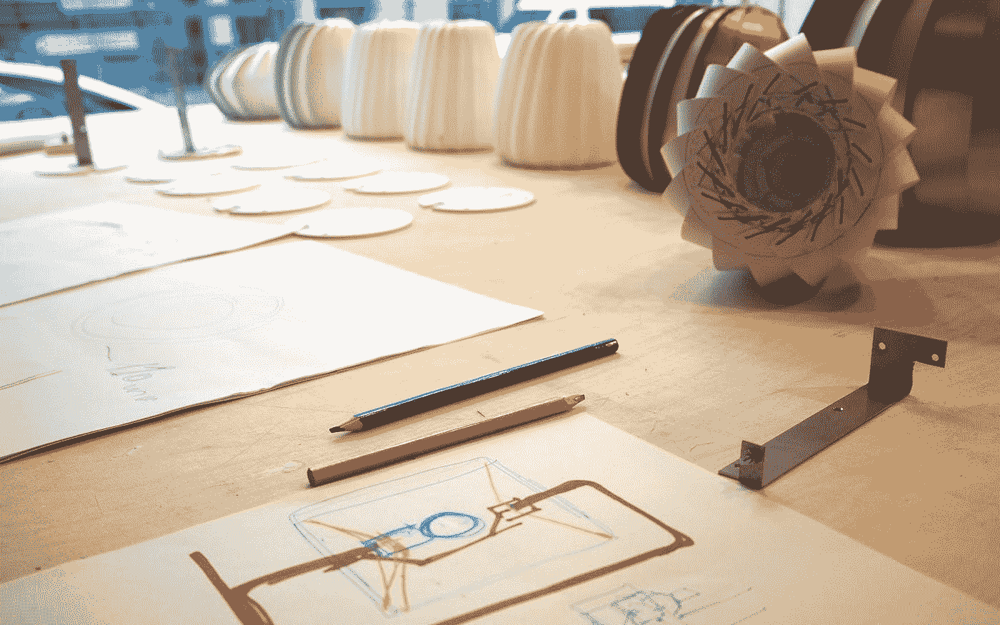
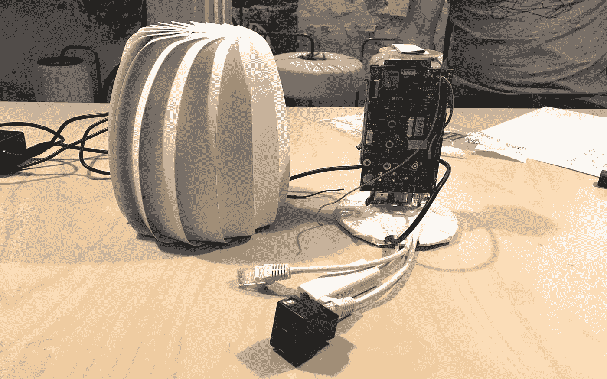
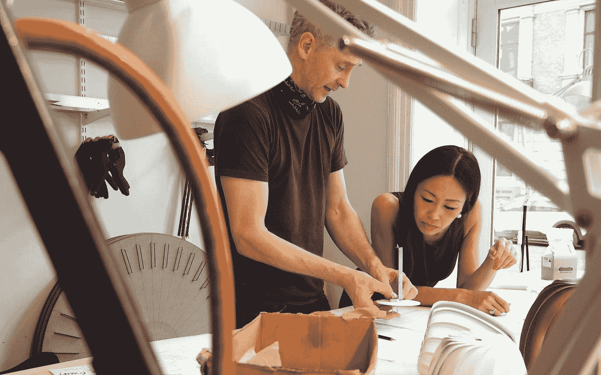
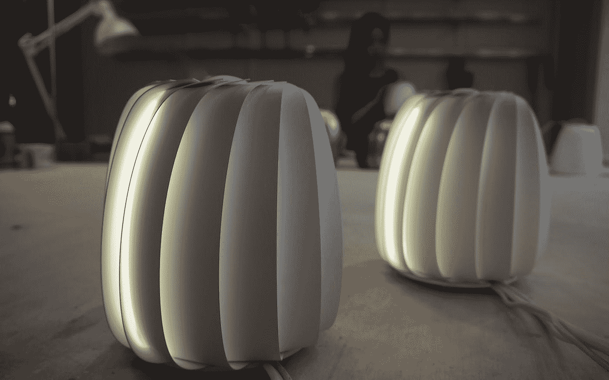
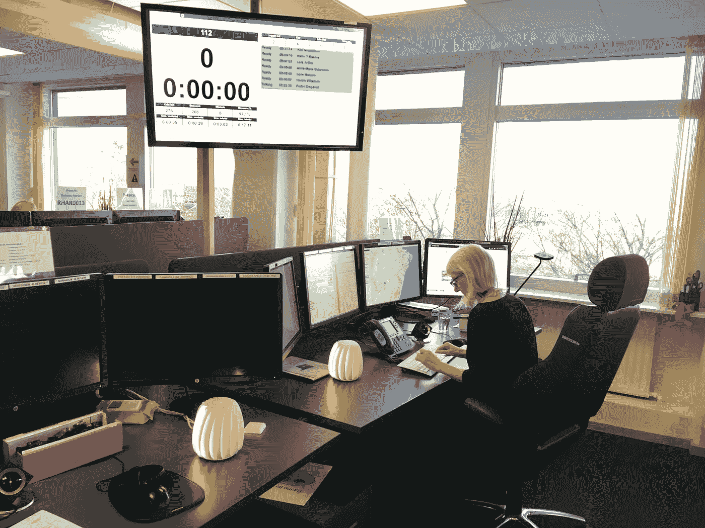

# 球体:设计如何为人工智能注入活力

> 原文：<https://medium.com/swlh/the-orb-how-design-breathes-life-into-ai-a49671bdd3ac>

即使在 Tom Rossau 旗舰店外面，人们也会被无数圆形散发出的温暖光线所迷惑。一簇簇雕塑般的灯布满了墙壁和天花板，就像一队队温柔发光的水母，传达出一种奇异的设计感，这种设计感同样来自几何学、木雕和折纸。

正是这种明亮的诱惑力吸引了 Corti 的首席工艺官袁·尼尔森(Yuan Nielsen)来探索汤姆在美丽的斜坡大道 Frederiksberg Allé上为自己创造的独特空间，这是从邻近 Vesterbro 的一条原始的波西米亚街道 Istedgade 开始的。

汤姆·罗索和他的徒弟亨里克·马丁森谈到他们的工作时，就像僧侣们对永恒的精致艺术大唱赞歌一样。当被问及他是否从自然界的特定形式中汲取灵感时，汤姆回答说他实际上与材料本身相协调。

> 汤姆笑着说:“我认为自己是一名助产士，她最好的工作就是以最好的姿态把这些材料送到这个世界上。”。

就像一个奥林匹克体操运动员通过旋转丝带画出难以捉摸的空中形态一样，他抓起一根细长的白桦树，用心地弯曲它，以解释它的自然倾向。

当汤姆被问及是否想象过有一天为一个救命的人工智能设计外观时，他的回答是“当然不会”。“但这正是这个项目如此迷人的原因:看似截然不同的世界走到一起，创造出一种由内而外的美。”

在其裸露的形式下，一台搭载人工智能的超级计算机并没有最可爱的外观。通常，它是一个冰冷而疏远的电路板，塞满了复杂排列的芯片和连接器。再加上人工智能因在《2001:太空漫游》和《T2:终结者》中以危险的红色机器眼形象出现而声名狼藉，你可能不会认为它们很有吸引力。

回到现实世界，Corti 的心脏停搏检测人工智能只具有仁慈的能力。它应该看起来像。因此，袁尼尔森和汤姆罗索开始致力于一个简单，智能设计解决方案。他们对自己奇怪的使命充满热情，首先花了 48 个小时疯狂谈论目的和恩典，然后才想出一个概念。

之前的尝试包括一个 3D 打印的黑色碗，让人想起达斯·维德的头盔，上面有通风孔，所以当尼尔森/罗索球体最终出现时，反差令人生畏。球体安全地包裹了所有的技术组件，同时符合通风、坚固和适度迷人的外观等标准。

罗索的商标薄片产生了一个外壳，模仿人耳中的膜。但功能仍然是设计的核心，因为鳃状层允许空气进入并冷却处理器。取样材料选择了铝和钢，以提供强度和权威，但通过特殊的白色粉末涂层进行软化，使球体具有温柔和谨慎的性质。

袁找到了一种方法，可以将组件重新排列成一个优化空间的边缘计算新部件，而汤姆和亨里克则凭借多年的经验，一丝不苟地手工制作每个外壳。他们对个人动手制作的坚持激发了一些有趣的思考:

> “令人着迷的是，即使人工智能也是手工制作的，因为它们是由键入的代码制成的。袁·尼尔森说:“自铁匠打造出第一把犁和斧头以来，人类企业无疑已经走过了漫长的道路，但最终我们仍在为我们的文化进步制造工具。”。

如果数字革命看起来与以前的工业革命不同，那可能是因为它错综复杂的技术，只有程序员才能理解它的工作原理。然而，它的破坏性影响与 18 世纪晚期并无太大不同。新鲜感带来不确定性，甚至恐惧，伴随着大量新的可能性。

“我们认识到，有些人对人工智能在社会中的现在和未来角色仍持怀疑态度，但我们发现，这些保留意见中有许多都与数字技术的无形形式有关，”袁继续说。“通过赋予我们的人工智能一个吸引人的雕塑形式，增强了愉快的光芒，我们试图协商这些保留。此外，人们可以根据事物的表面价值来看待它们。如果你不再希望得到球体的帮助，只要拔掉它就行了。”

在一个云计算占主导地位的时代，人们很好奇为什么 Corti 一开始就开始生产硬件？“我们正在为一个尚不能够促进庞大计算模型的环境构建人工智能。因此，Orb 不是要求客户加强他们的服务器机房，而是一个非常用户友好的即插即用解决方案。它只需要几分钟就可以设置好，并允许我们的人工智能运行实时紧急支持，只需直接连接到呼叫接受者的电话，”她总结道。

回到车间，汤姆·罗索正在对另一个球体进行最后的测试。当打开完成的设备时，一个人工智能被激活，并准备好在最关键的时刻赋予电话接听者权力。人工智能和医疗保健的未来看起来很光明，尤其是因为 Corti 的球体将遍布世界各地的紧急医疗服务。

-丹尼尔·弗莱德的采访。

## 这篇文章发表在 [The Startup](https://medium.com/swlh) 上，这是 Medium 最大的创业刊物，有+391，714 人关注。

## 在这里订阅接收[我们的头条新闻](http://growthsupply.com/the-startup-newsletter/)。

