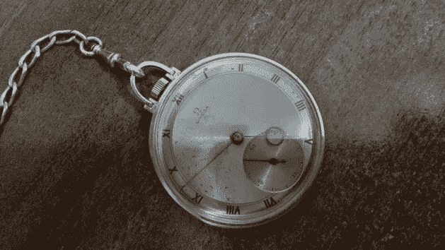
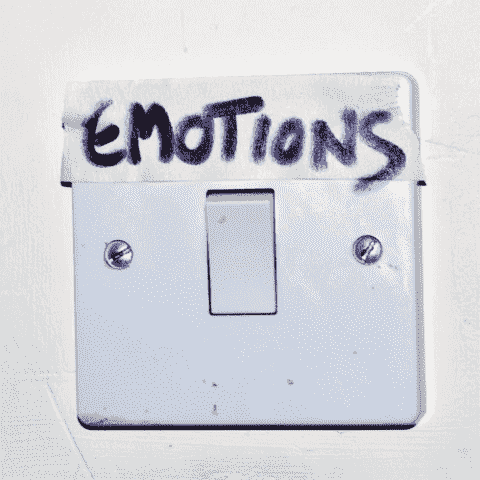
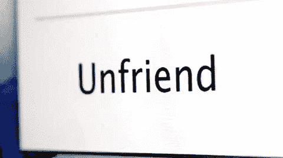
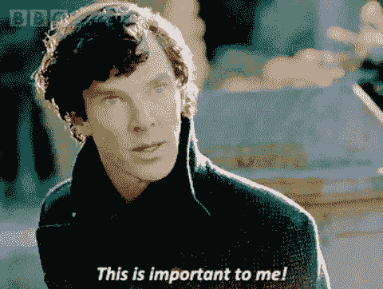

# 另一个似乎没人谈论的整理者

> 原文：<https://medium.com/swlh/the-other-declutter-no-one-seems-to-be-talking-about-4c8e20757752>

## 以及删除脸书朋友会如何改变你的生活

一周前，我发现了一块属于我曾祖父的怀表。这是他在 20 世纪 30 年代末买的一只昂贵的发条手表。他去世前几个月把它给了我父亲，他的孙子。几年后，在我对这块手表感兴趣之后，我父亲把它送给了我。

拥有一块怀表感觉很酷，仿佛我的一部分生活在 20 世纪 30 年代。但最重要的是，我喜欢这块手表，因为它让我想起了我的曾祖父和我们共同度过的美好时光。这让我想起了他。一个为自己建立生活，但首先照顾家庭其他成员的男人。所以这块表的目的不是显示现在的时间，而是让我想起过去。

My great-grandfather’s watch

我最近写了关于极简主义的常见误解以及如何找到你自己的“足够”(见下文)。找到怀表让我想到了极简主义的另一个方面**，这似乎没有人在谈论。
在尤达的帮助下，请允许我解释一下。**

** [## 在这一生中找到你自己的足够的重要性

### 当你认为极简主义是一种饮食时会发生什么

medium.com](/swlh/what-happens-when-you-find-your-enough-in-this-lifetime-65fdc4844aa6)** 

# **精神混乱者**

> **“如果你没有犯错误，但是失去你…**
> 
> **你应该玩一个不同的游戏**

**一旦你发现你“够了”，清理应该是一个非常简单的过程。你扔掉不必要的东西。最简单的方法是检查一件物品是否对你的生活有任何积极的贡献。不需要的物品对我们每个人来说都是不同的。对你来说，它可能是一台你从来没有用过的旧笔记本电脑，对我来说，它可能是一把我留着的破椅子，因为我懒得把它扔进垃圾箱。它通常是我们很少使用的东西。
我们每个人都必须经历自己的旅程，去寻找什么样的物品能给他们的生活带来价值。不容易。有些东西我们就是摆脱不了。这是有原因的:**

## **整理是指我们从生活中移除一些东西，并从中获得快乐。**

**我曾祖父的手表是我不用的东西。它很重，需要维护。它只是坐在架子上收集灰尘。它不包含我曾祖父的记忆。那么，我应该把它扔掉吗？**

**我们都保存有情感价值的物品。这些物品除了它们所承载的情感价值之外，没有任何用处。我们关心的不是物品，而是它讲述的故事。
即使是结婚戒指也可以被视为无用的黄金或金属。然而，我们许多人戴着它们，作为对所爱的人承诺的象征。**

**为了清楚地确定一件物品的价值，我们需要深入了解自己。我们需要进行一次精神清理。
我们精神清理的范围可以比整理我们对我们囤积的物质物品的感觉更深，因为我们也倾向于储存成堆的未解决的感觉。这些是我们不敢面对的感觉，所以我们把它们深埋心底。这样做，我们制造了一个精神混乱。**

# **未解决的感情导致痛苦**

****

> **"在驱逐恐惧之前，你必须先给它命名."~尤达**

****我们都有悬而未决的感情。可能是一个你一直嫉妒的人。你可能会对在学校欺负你的那个男孩怀恨在心。你可能就是那个欺负你的人。找到那些未解决的感觉是精神清理的第一步。这需要很强的自我意识以及前进的强烈意愿。
我个人比较喜欢把自己没有完全处理过的经历都写下来。这样我就能了解他们的底细并开始释怀。****

**一旦你设法承认你未解决的感觉，你会发现其中一些已经消失了。这和你整理完衣柜后的感觉很相似。一切似乎都已就位，触手可及。**

**下一步应该有一个明确的目标:下定决心，放手。
**开始和那些你亏欠的人说话**。**

*   **如果需要，想办法道歉。**
*   **与那些你从未有勇气与之交谈的人交谈。**
*   **向你爱的人敞开心扉，告诉他们你一直渴望分享的东西。**

**这样做并不容易，可能需要时间。但是请记住:可能不会有第二次机会了。你的生命太宝贵了，你不能退缩。**

**我的一个朋友和她父亲有过节。他决定了她的每一个人生选择。当她鼓起勇气做出自己的决定时，他告诉她，他至死都不会原谅她。不幸的是，一年后他突然死亡。这让我的朋友百感交集。她仍在生他的气，但后悔没有告诉他他们的分歧。**

**花点时间搞清楚哪里出了问题，找到你一直背负这个情感包袱的原因。从治疗师或密友那里获得帮助总是一个好主意，因为这是一个复杂的过程。**

**一步一步来，你会摆脱生活中所有悬而未决的感觉，你会立刻感到更快乐。**

# **移除。解除好友关系。**

****

> **"如果你想找到这个阴谋背后的坏人，你必须清醒头脑."~尤达**

**你整理思想的一部分是整理你的人际关系。关系是动态的，一直在变化，所以不时地观察它们是必要的。当你 30 岁的时候，你高中时最好的朋友可能不再那么好了。
理清你的人际关系可能会让一些人从你的生活中消失，就像你删除不需要的东西一样。
这样做绝对没有什么丢人的。将人们从你的生活中移除并不意味着你在逃避你的问题。
**完全相反。****

**是那些给你的生活带来消极的人。那些对你没有价值，只会减少你快乐的人。如果你把伤害你的人留在身边，那么你就忽略了自己的问题。**

**花点时间反思一下。
那些对你的生活没有任何积极意义的人是谁？
如果你不确定，可以把你生活中所有的人列一个清单。从家人朋友到熟人同事。写下他们的名字和所有你能想到的优点和缺点。如果有人只有缺点，那他就是你应该说再见的人。不过，你不必真的说再见。你可以想办法逐渐减少他们对你生活的介入。**

****这里有一个简单的练习可以帮助你开始—**
浏览你的脸书好友列表，把那些你不想再联系的人从好友名单中删除。确保你能区分那些和你有矛盾的人和那些你真心认为在你生活中不重要的人。在接下来的日子里，你在脸书的新闻反馈(由你真正关心的人上传)将比以往任何时候都更有价值。
移除脸书好友将为你提供在虚拟世界之外应用相同过程的工具。**

# **如果它很重要，那就留着吧**

****

> **"我们坚持的许多真理取决于我们的观点."~尤达**

**一旦你经历了一次精神上的整理，你可以再次整理你的东西。看看你的感性物品。这是你的另一半第一次约你出去时穿的旧毛衣。它不再合适了，但你留着它，因为它让你想起了那个神奇夜晚。或者你 15 岁时买的第一张黑胶唱片。你留着它，尽管你甚至不再拥有一台唱机，因为你仍能感受到当年用自己的钱买它时的那种激动。对于每一件物品，问问你自己:****我保留它是因为一种悬而未决的感觉，还是它给我带来了快乐？******

****没有绝对的对错。
我曾祖父的怀表的确是他的一个很大的提醒。当然，我不需要实物来记住他。但这就像是我一直保留着他的一部分。将这块手表传递给家族的下一代会讲述他的故事，并且在很多方面——让他的记忆永存。****

# ****最后要记住的一件事****

## ****整理身心的目的是释放时间和空间，让你可以专注于对你重要的人和事。****

## ****阅读更多信息:****

**** [## 在这一生中找到你自己的足够的重要性

### 当你认为极简主义是一种饮食时会发生什么

medium.com](/swlh/what-happens-when-you-find-your-enough-in-this-lifetime-65fdc4844aa6)  [## 不，谢谢，我不想要彩票大奖

### 我已经选对了号码

medium.com](/swlh/no-thanks-i-dont-want-the-lottery-prize-8d52d84732c5) 

## 这篇文章发表在 [The Startup](https://medium.com/swlh) 上，这是 Medium 最大的创业刊物，有 333，253+人关注。

## 在此订阅接收[我们的头条新闻](http://growthsupply.com/the-startup-newsletter/)。

****