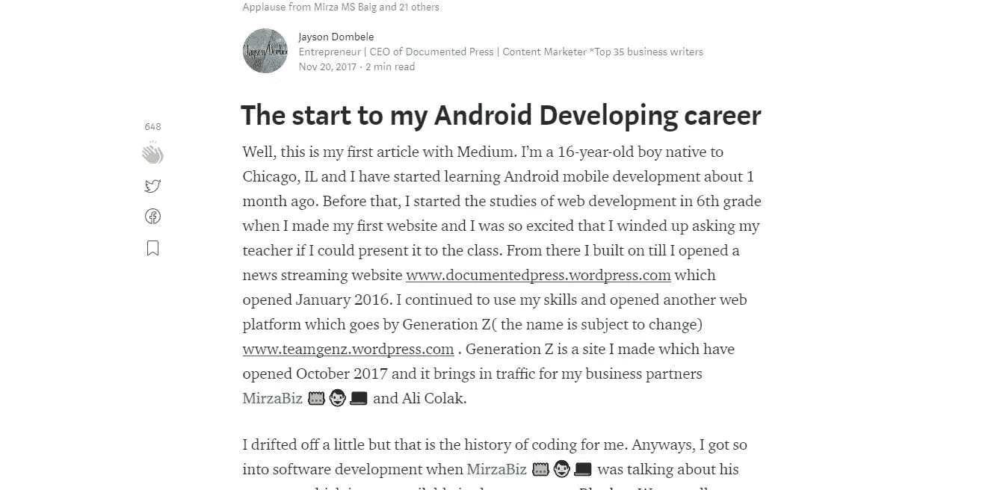
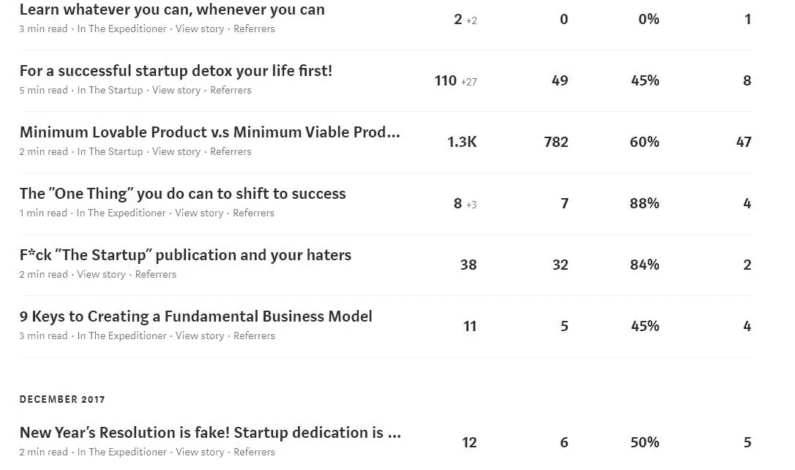

# 扩大知识面的悖论

> 原文：<https://medium.com/swlh/the-paradox-of-expanding-your-knowledge-8ed457230095>

需要搭车吗？

In this picture the growing tree represents me!

作为一名企业家，我的生活向我敞开了许多大门，有时我无法解释。

有时候我甚至不知道该选择什么，总觉得最终会做出错误的决定。

很多人可能从别人那里听说过类似“当一块多米诺骨牌倒下时，它会把其他的也推倒”或者“你犯了一个错误，一切都乱了”。我过去也害怕犯错，但是想想这个:

如果一个孩子因为路上的一颗石子绊倒了，这意味着这个孩子不能再走路了吗？

对！这应该会让你对事情有不同的看法，但是，如果你仍然不同意我的观点，请随时发表评论。

在我陷入成功和扩展你的知识的悖论之前，我希望你注意以下书籍，它们将帮助你了解创业、商业理论、远见、生活和成功的基础。

1.  **反叛的企业家作者:詹姆斯·莫尔斯**

*由于企业就业市场的不确定性，创业正在蓬勃发展。对初创企业的建议无处不在，在书籍、网站、报纸和杂志上，它构成了一个公认的智慧体。记者乔纳森·穆尔花了六年时间采访和报道成功的企业家，他彻底改变了一些建议。他的是一种“反叛企业家精神”的模式，挑战了关于新企业家应该如何行为才能使他们的企业成功的传统观点。*

Moules 的一些另类观点将会令人震惊:他质疑启动和发展企业需要银行贷款，质疑商业计划的必要性，并提出了在艰难时期价格上涨的反向观点。

*他的案例研究不仅涉及企业家如何成功，还涉及他们如何失败或未能实现全部潜力，包括数百年的老公司以及互联网时代的年轻明星，如 Twitter、Gilt Groupe、Criteo、明星企业家詹姆斯·戴森、理查德·布兰森和史蒂夫·乔布斯以及大大小小的公司。*

*穆尔的观点是，在企业的一些主要关注领域采取不同的观点。他的目的是证明不随大流是管理企业的更好方式，并让企业发展得更大更快。*

*(摘自谷歌图书的致谢)*

**2。零对一作者:彼得·泰尔**

*风险投资家、PayPal 联合创始人、早期脸书投资者彼得·泰尔和布莱克·马斯特斯于 2014 年出版了《从零到一:创业笔记》一书。*

*(摘录演职员表维基百科)*

**3。设计的改变:蒂姆·布朗**

著名创新和设计公司 IDEO 的首席执行官蒂姆·布朗在《设计改变》一书中展示了设计的技巧和策略如何适用于商业的各个层面。通过设计改变不是设计师为设计师写的书；这是一本为寻求将设计思维注入到组织、产品或服务的每一个层面，以推动商业和社会的新选择的创意领袖而写的书。

*(摘抄鸣谢:谷歌图书)*

相信我，那些书会帮上大忙的！

当我开始把我对企业家精神的理解提升到另一个层次时，我必须改变我的生活方式。

有些因素不能留在我的生活中，因为它要么分散我的注意力，要么导致拖延和偏离我的目标。

*   和朋友出去
*   社会化媒体
*   看着别人的成功，然后创造自己的成功
*   没有短期目标的长期目标。
*   到处接受建议，不做计划。

这个支点从 2017 年 10 月开始工作，现在我做了这么多，学到了这么多。以下是我的一些继任:

*   要找到媒介，扩大我的观众平台
*   更多的人发现了我的组织记录媒体
*   开始应用程序开发(Android)
*   学习了 XML，现在是中级 Java 程序员
*   为 ShareMe 创建了一个新网站
*   创建了一个朋友网络，推动我前进
*   商业和企业家精神的价值负载
*   这个清单还在继续…

我最近获得的许多成就都是因为我有了不同的心态和看待事物的方式。我不是那种仅仅因为我们是朋友就支持我父母的决定或抄袭我朋友的选择的人。

我开始坚持我所相信的，并有支持的证据或强烈的观点。关于个人心态，有几个关键点帮助了我:

*   不要认为你最聪明
*   不要认为你是最好的
*   永远不要认为孤立自己会让你前进。(*这可能对上一代人有用，如史蒂夫·乔布斯、马克·扎克伯格等，但现在更难了，因为市场已经聚集和饱和，所以作为市场中的新人(mhm 业余爱好者)，你应该感到封闭，并找到可以学习或合作的人。

我总是喜欢努力成为最聪明的人或者认为自己是最棒的，但是我开始意识到一件重要的事情:

如果我被认为是最聪明的，但却如此自大，我会被人们讨厌，我的生意可能不会顺利，因为消费者是生意的关键，我也明白，即使我很聪明，我也可能不是最聪明的。

这让我想到了网络！

[以下是一篇关于我的非网络生活的不完整文章的节选]

> 从头开始或尽快建立联系
> 
> 我今天写这个话题是因为我没有以前那么多饲料了。
> 
> 我还在选择我应该把我的文章记录到哪个媒体出版物的阶段，这也是影响我的一些事情。
> 
> 当我坐在电脑前，每 10 分钟查看一次我的统计数据时，我觉得我的文章没有获得反馈的部分原因是因为我没有从一开始就与新作者建立联系。
> 
> 我一直是那种在与平台上的新作家如杰西·凯瑞玛互动之前，试图融入大人物的作家。
> 
> 我有点后悔，因为人际关系网帮助你了解另一个人对成功的看法或如何做事，然而我忙于自我，不去担心别人会怎么说。
> 
> ~ 2018 年 1 月 13 日

当我加入 Medium 时，由于它的平台算法，我看到了和我差不多同时加入的人。

但是！我不认为与人交往会那么重要。当我被介绍到 Medium 时，我只是担心在我完成 ShareMe 的过程中如何进入并记录我的经历。

我不知道如果我理解了网络的力量，我会学到更多，犯更少的错误，感觉更好，而不是总是自我救赎。

我记得我第一次用这种格式写文章的时候:

我开始意识到我的写作方式和写作格式必须改变，即使我的文章已经被称赞了 600 多次。

我的好奇心驱使我想办法让更多的人阅读和喜欢我的文章。

在读了又读的文章之后，我开始明白如何在写作中提升自己，然后在创业和经营企业中提升自己，但这一切都可以通过网络来解决。

网络更快，更可行，而且能带来高水平的结果。

现在，即使当我开始意识到网络的重要性和强大时，期待更高的成功率也为时已晚，因为我只能靠自己。导致我犯罪。

羡慕。

我想和其他人一样。

我想和大男孩在一起，因为我总是试图坚持自己的观点，即使我知道我不属于那里。

我想让我的媒体文章在关注者和浏览者中扩大，我也很担心我的读者是否也会转移到我的商业网站和其他提供的登陆页面。

在某些方面，我觉得因为被嫉妒，我的故事质量下降了。

这导致了:

My Statistics for Medium

我认识到观点和追随者并不重要，我应该坚持我的目标。我来这里分享我的经历，然后在未来写一本关于它的书。

[Matt L.F Smith](https://medium.com/u/5d8d4ea1dd09?source=post_page-----8ed457230095--------------------------------) 甚至告诉我这是一个成功的问题。首先你开始很糟糕，然后你上下起伏了一段时间，然后突然之间，无论你做什么，你都会达到杰出的标准。

成功来自很多方面，但只有当你把生活设定在一个可行的标准时，成功才会到来。有太多的事情会影响你，但你只需要坚持到底。

无论你开始了什么，你都必须完成。

此外，飞行员确实让飞机起飞，并把控制权交给其他人，让他们着陆。

如果你喜欢我的文章，请不要忘记粉碎 50👏让这篇文章浮出水面。不要贪心，自己留着吧！！

## 相关文章*除了本文，请阅读以下内容:

*   [贪财的缺陷](https://codeburst.io/the-flaws-of-lusting-for-money-51a6cb00d164)
*   [成功的高昂代价|](https://codeburst.io/the-high-price-of-success-steps-to-becoming-a-rebel-entrepreneur-d31fa28051b0) [成为叛逆企业家的步骤](https://codeburst.io/the-high-price-of-success-steps-to-becoming-a-rebel-entrepreneur-d31fa28051b0)
*   [要想成功创业，首先要戒除你的生活](/swlh/detox-your-life-for-a-brighter-startup-701e98a9650c)
*   无论何时何地，尽你所能去学习
*   [创业+不帮忙的父母=退税](/@jaytheCEO/entrepreneurship-unhelpful-parent-drawback-9cf4dc4c6c9f)
*   [在训练](/@jaytheCEO/watch-your-surroundings-while-you-in-training-wheels-3714c9bd96d3) [车轮](/@jaytheCEO/watch-your-surroundings-while-you-in-training-wheels-3714c9bd96d3)时，注意观察周围环境

## 关于作者的更多信息:

我今年 16 岁|是一名 Android 开发人员|文档出版公司的首席执行官|内容营销人员

*   如果你有兴趣和我一起跟进，请查看我的网站[www.jaysondombele.wordpress.com](http://www.jaysondombele.wordpress.com)
*   如果你对我的 ShareMe 创业感兴趣，请查看下面的链接:[www.jdombele.wixsite.com/shareme](http://www.jdombele.wixsite.com/shareme)
*   如果你想在 LinkedIn 上关注我，请点击下面的链接:[www.linkedin.com/in/jayson-dombele-195a55155](http://www.linkedin.com/in/jayson-dombele-195a55155)

任何问题，业务查询或关注，请随时发送电子邮件给我@:jdapple4357@gmail.com

## 这个故事发表在 [The Startup](https://medium.com/swlh) 上，这是 Medium 最大的企业家出版物，拥有 286，184+人。

## 在这里订阅接收[我们的头条新闻](http://growthsupply.com/the-startup-newsletter/)。

