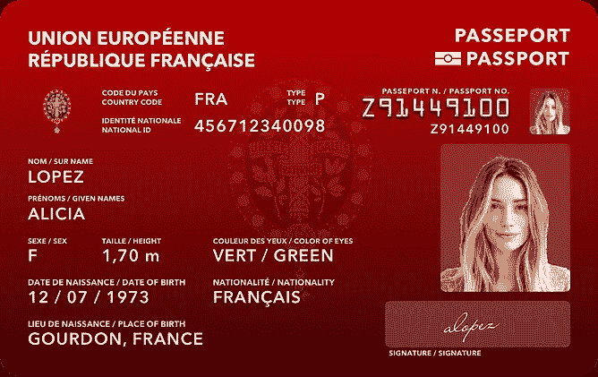

# 护照——概念

> 原文：<https://medium.com/swlh/the-passport-concept-b95c1d24e02e>

## 为每个公民提供优雅的一体化身份解决方案。

One Card Replacement for Passport Booklet,National ID, Driver’s License, Voter ID card, Government National ID, Car Registrations, Bank Debit/Credit Card and every other Personal ID.

> *原帖在 https://guptasiddhant.com/the-passport-concept-289733ba7963*

Passport Card Concept for India (black, top), France (red, left), South Korea (green, center) and United Arab Emirates (blue, right).

你有没有想过护照小册子又大又厚，而且相当没用。我质疑这是否是制作这个星球上最重要、最被接受的身份证明文件的最聪明的方法。

## 赶上世界。

几十年来，全球各国都已经实施并成功使用了国民身份证号码/卡。美国、阿联酋、韩国、欧盟国家、英国和许多其他国家都有不同版本的身份证号码，可以将所有当地活动联系起来。印度已经加入了与 Aadhaar 的竞争，但还有很多工作要做。目前，Aadhaar 仅作为一个身份证号码，但与其他政府服务的联系很少。

> 单位阿联酋政府有一个非常成功的阿联酋身份证方案，向所有公民和居民发放阿联酋身份证，其中包含生物识别身份，并提供多种功能，如在海湾合作委员会(海合会)国家更换银行卡、驾驶执照和旅行证件。越来越多的功能不断加入其中，比如医疗记录。

有了电子护照，机场入境可以有变化。对于非生物测定护照，个人需要获得当局的移民印章才能成功地在国家之间旅行。

使用生物识别或电子护照，个人可以在没有任何人工干预的情况下快速通过移民局的电子门或智能门。阿拉伯联合酋长国的迪拜国际机场成功地提供了这种移民服务。

Smart Gates Facilty at Dubai International Airport.

这种移民解决了相当多的问题。它避免了长时间排队或需要多个移民官员。这个过程很简单，而且不会以护照上满是难看的印章而告终。

**但是…** 当谈到护照册的整体尺寸和可用性时，生物识别芯片的加入仍然不会对用户体验产生太大影响。

# 解决方案——护照卡

一种国际身份证件，包含传统护照小册子和国家身份证的所有信息和好处，但结构紧凑，可像其他银行卡或驾驶执照一样放在口袋里。

Indian Passport Card — Concept Design (Front & Back)

在想了太多之后，我试着设计护照。如果我们的护照是一张卡，而不是一本小册子，它可以很容易地放在我们的钱包里，我们也不担心页面最终会用完。如果你担心签证和移民盖章，就跟着读吧。

在设计的时候，我研究了很多护照，需求，指导方针，设计和技术。我所目睹的一切给我留下了深刻的印象，我继续创作可以作为所有国家基础模型的设计。

**美国护照卡**包含以多种语言(如果需要)传播到正面和背面的所有重要信息。

*   **正面**:护照号码、国徽、国家代码、证件类型、身份证(印度 Aadhaar 号)、全名、出生日期、性别、国籍、出生地、彩色照片、数字签名。
    *可根据国家要求添加更多日期；例如，法国要求护照上显示个人的身高和眼睛的颜色。*
*   **背面**:永久地址、发证机关、发证日期、失效日期、文件编号、发证地点；EMV 芯片、国旗、非接触式支付符号和机器可读区(MRZ)。
*   **两面:**国名、生物识别标志、国徽(带有自愿设计的水印)和证件名称(如“护照”或“外交护照”或“通行证”等。)
*   **内部:**RFID/生物识别芯片，包含所需信息、彩色照片和一组指纹。

让我们逐一讨论美国护照卡的好处。

## 钱包大小

[ISO/IEC 7810](https://en.wikipedia.org/wiki/ISO/IEC_7810)

适合钱包的尺寸。根据国际标准( [ISO_IEC_7810](https://en.wikipedia.org/wiki/ISO/IEC_7810) )，护照小册子的尺寸为 125.00x88.00 mm (ID-3)，而普通借记卡/信用卡/身份证的尺寸为 85.60x53.98 mm (ID-1)。这还不到这本小册子的一半。

想象一下，一张信用卡大小的护照可以很容易地从你的钱包里塞进滑出。

## 技术

1.  [**EMV 芯片**](https://en.wikipedia.org/wiki/EMV) : EMV 卡是一种将数据存储在集成电路上的智能卡。这种集成可以用来取代银行卡。这也允许特殊的读卡器读取卡的生物特征和其他数据(通常由政府使用)。-关联公司)。
2.  [**非接触式智能卡**](https://en.wikipedia.org/wiki/Contactless_smart_card) :存储生物特征。也可用于非接触式支付或终端标签(如办公楼或地铁站的无钥匙进入)。
3.  [**(MRZ)**](https://en.wikipedia.org/wiki/Machine-readable_passport):覆盖卡背面底部三分之一的区域。该区域包含以某种方式格式化的文本，机器/扫描仪可以快速读取最重要的数据。通常情况下，护照小册子有 2 行数据，但在卡上，数据分为 3 行。
    *这项技术目前是相对的，但很快就会被这里提到的其他技术完全取代。那么也许，护照卡可以重新设计得更好，空间更大。*
4.  在线签证&移民:这是一个显而易见的问题。我们有护照用的大册子，这样可以在上面盖章。有两种盖章——签证&移民。
    移民:正如我之前介绍的智能门一样，移民印章不再是必需的了。美国甚至不在护照上盖章。
    签证:作为一个社区，我们不要求在护照上贴一张纸来提醒我们签证有效。我同意，作为一个集合，它们可能看起来很有吸引力，但它们不具备电子签证所不具备的任何功能。许多护照级别较高的国家享受免签证待遇，对他们来说，护照不比身份证好。

## 门户网站和移动应用程序

每个护照/身份证持有者都可以使用网络门户或移动应用程序来跟踪他们的所有活动。

Web Portal for Passport Control.

门户网站或应用程序将允许用户:

*   查看护照详情并申请更新。
*   签证详情:不同当局签发的有效签证和其他签证。
*   移民细节:每次入境的所有细节。
*   链接的文件:本地身份证，驾驶执照，银行卡和更多也可以从这里从多个发行机构/国家管理。

# 结论

*   单一智能卡取代所有卡(银行、执照、登记、身份证、选民身份证等)。)和护照小册子(使用内置技术，如 EMV 芯片、RFID 生物识别芯片和 MRZ)。
*   体积小巧，适合放在钱包中。
*   与智能移民门合作，无需签证和移民印章。
*   包括细节、签证和移民在内的所有信息都可以通过一个门户网站和移动应用程序很好地管理。

Passport Card Concept for India (black, top), France (red, left), South Korea (green, center) and United Arab Emirates (blue, right).

# 附录

我不是傻瓜，不会相信这很容易实现。没有一个国家能够单独考虑做这样的事情。因为像护照这样的国际文件是为了满足国际组织制定的一系列指导方针而设计的，所以类似的事情必须发生才能使这成为现实。

如果我们在谈论这个问题，让我再正确地看待一件事:国际居留权的概念。

> 国际居民的意思是，一个人作为一个特定国家的公民，被允许在全球范围内自由移动，而没有权利(如投票)在外国。
> 
> 国际公民意味着，一个人不应该是一个国家的公民，而是世界的公民，应该被允许在任何地方自由行动和享有完整的权利。

在我目前的观念中，每个出生在这个世界上的人都会被他们的国家发给一张卡片，上面会有一个国民身份证号码和一个护照号码。在这里，国家 ID 可以用于所有国家(内部)目的；护照号码将用于所有国际(外部)目的(如在国外旅行或购物)。
**这在不是国际居留权的例子。**

只有在内部和外部都只有一个识别号的情况下，才能创建 rue International Residency。取消国内身份证号有利于世界上每个人都拥有唯一的护照号码。

这应该不是很难，因为一串 7 个字母数字字符可以给出超过 780 亿个唯一 id(A-Z，0–9)。更不用说 8 个字符= 2.8 万亿+id；9 个字符= 101 万亿+id；诸如此类。

这将允许所有国家维护和共享一个单一的数据库。无论你在哪里，去哪里，你都是居民而不是游客。您的医疗记录、驾驶状态、信用报告、银行详细信息和身份都会随您一起移动。您不需要在任何国家重新注册或获得新的 ID 认证。
各国可以将他们的附加数据标记到通用护照数据库中，如劳动/就业状况等。

理论上，这也将废除双重国籍的概念，但如果出于某种原因仍然需要这样做，**只需携带两张卡。**

那么，你觉得怎么样？

Design Evolution (Left is Oldest -> Right is latest)

> 原帖:[https://guptasiddhant.com/the-passport-concept-289733ba7963](https://guptasiddhant.com/the-passport-concept-289733ba7963)