# 语音识别技术:过去、现在和未来。

> 原文：<https://medium.com/swlh/the-past-present-and-future-of-speech-recognition-technology-cf13c179aaf>

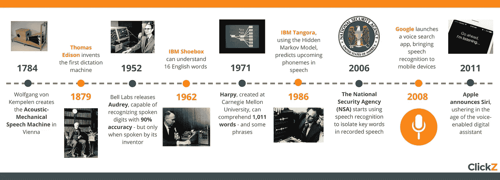

## 语音是未来。世界科技巨头都在争夺重要的市场份额，谷歌和亚马逊都将语音设备置于其战略的核心。

然而，将我们引向这一点的历史先例既重要又令人惊讶。在这份报告中，我们回顾了语音识别技术的历史，然后全面概述了当前的形势，以及所有营销人员在为未来做准备时需要牢记的技巧。

# **语音识别技术的历史**

语音识别技术进入公众意识是最近的事，来自科技巨头的光鲜发布会成为全球头条新闻。

吸引力是本能的；我们对能够理解我们的机器着迷。

从人类学的角度来看，我们发展口语的时间远早于书面词汇，我们每分钟可以说 150 个单词，相比之下，普通人 60 秒只能打 40 个单词。

事实上，通过语音与技术设备交流已经变得如此流行和自然，以至于我们有理由怀疑为什么世界上最富有的公司现在才向我们提供这些服务。

该技术的历史表明，语音识别远不是一个新的当务之急，即使发展的速度并不总是与人们对该主题的兴趣水平相匹配。正如我们在下面看到的，可以追溯到 18 世纪的重大突破为我们今天都知道的数字助理提供了平台。

History of speech recognition technology image created by author

语音识别最早的进展主要集中在元音的产生上，作为系统的基础，该系统还可以学习解释来自附近对话者的音素(语音的组成部分)。

这些发明家受到了他们所处的技术环境的限制，只有基本的手段来发明一种会说话的机器。尽管如此，它们为最近的创新提供了重要的背景。

由托马斯·爱迪生在 19 世纪末发明的听写机能够记录讲话，在医生和秘书中越来越受欢迎，因为他们每天都要做大量的笔记。

**然而，直到 20 世纪 50 年代，这种探索才导致真正的语音识别。到目前为止，我们看到了语音创作和记录的尝试，但还没有翻译。**

贝尔实验室创造的机器 Audrey 可以理解数字 0-9，准确率高达 90%。有趣的是，这个准确度水平只有在它的发明者说话时才被记录下来；当其他人和奥黛丽说话时，它徘徊在 70%到 80%之间。

这暗示了语音识别的一些持续挑战；每个人都有不同的声音，口语可能会很不一致。与标准化程度更高的文本不同，口语词因地区方言、语速、侧重点甚至社会阶层和性别而有很大差异。因此，缩放任何语音识别系统一直是一个显著的障碍。

Alexander Waibel 致力于研究哈佩，这是一台在卡耐基梅隆大学开发的可以理解 1000 多个单词的机器，他基于这一点:

> “所以你有类似‘安乐死’的东西，可能是‘亚洲青年’。或者，如果你说‘给我一个新的展示’，这可能会被理解为‘给我一部裸体剧’。”

直到 20 世纪 90 年代，即使是最成功的系统也是基于模板匹配，声波将被翻译成一组数字并存储。当一个相同的声音传入机器时，这些就会被触发。当然，这意味着一个人必须非常清晰、缓慢地说话，并且在没有背景噪音的环境中才有很好的机会识别声音。

IBM Tangora 于 20 世纪 80 年代中期发布，以当时世界上最快的打字员 Albert Tangora 的名字命名。它仍然需要缓慢、清晰的语音和没有背景噪声，但它使用隐马尔可夫模型，通过数据聚类和基于最近模式预测即将到来的音素，增加了灵活性。

虽然它需要每个用户 20 分钟的训练数据(以录音的形式)，但 Tangora 可以识别多达 20，000 个英语单词和一些完整的句子。

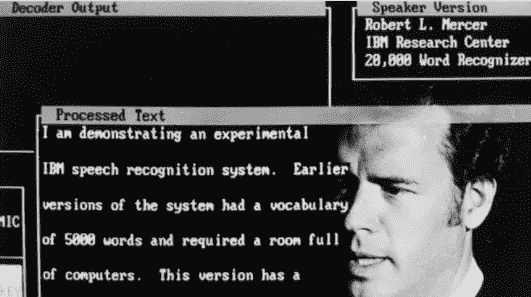

这里播下了语音识别的种子，这是该领域最重要和最基本的发展之一。众所周知，语音识别只有适应每个人独特的交流方式才能成功，但实现这一突破说起来容易做起来难。

直到 1997 年，世界上第一个“连续语音识别器”(即人们不再需要在每个单词之间停顿)以 Dragon 的自然说话软件的形式发布。它每分钟能理解 100 个单词，至今仍在使用(尽管是升级版)，并被医生们用来做标记。

正如科学发现的许多领域一样，机器学习在本世纪提供了大多数语音识别突破。谷歌将最新技术与基于云计算的能力相结合，以共享数据并提高机器学习算法的准确性。

**这在 2008 年 iPhone 上谷歌语音搜索应用的推出达到了高潮。**

在大量训练数据的驱动下，语音搜索应用程序在以前的语音识别技术的准确性水平上有了显著提高。谷歌以此为基础，在其语音搜索结果中引入了个性化元素，并利用这些数据开发了蜂鸟算法，对使用中的语言有了更加细致入微的理解。这些线索在谷歌助手中被捆绑在一起，现在几乎 50%的智能手机都安装了谷歌助手。

然而，是苹果进入语音识别市场的 Siri 首先抓住了公众的想象力。作为几十年研究的结果，这种人工智能驱动的数字助理为语音识别的无菌世界带来了一丝人性。

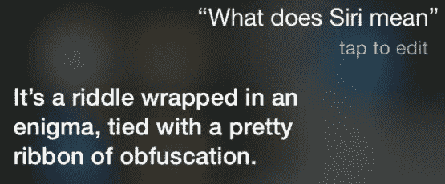

继 Siri 之后，微软推出了 Cortana，亚马逊推出了 Alexa，科技巨头各自的语音识别平台之间的争夺战已经开始。

从本质上说，我们花了数百年时间教机器完成一段普通人只需几年的旅程。从音素开始，逐步发展到单个单词，然后是短语，最后是句子，机器现在能够以接近 100%的准确率理解语音。

用于实现这些飞跃的技术已经变得越来越复杂，以至于它们现在松散地基于人类大脑的工作。基于云的计算机已经进入数百万家庭，可以通过语音控制，甚至可以对各种各样的查询提供对话式的回答。

这一旅程仍未完成，但我们已经与 20 世纪 50 年代的房间大小的计算机相差甚远。

# **当前的语音识别前景**

智能手机最初是 Siri 和 Cortana 等数字助理的唯一居住地，但这一概念在过去几年中已经分散化。

目前，重点主要是语音激活的家庭扬声器，但这本质上是一种特洛伊木马策略。通过在消费者家中占据最重要的位置，这些扬声器成为智能设备激增的门户，这些设备可以归类到广泛的“物联网”保护伞下。Google Home 或 Amazon Echo 已经可以用来控制大量支持互联网的设备，到 2020 年还会有更多的设备加入这一行列。这将包括智能冰箱、耳机、镜子和烟雾报警器，以及越来越多的第三方集成。

[最近的谷歌研究](https://www.thinkwithgoogle.com/data-collections/voice-assistance-emerging-technologies/)发现，超过 50%的用户将声控扬声器放在他们的客厅里，相当多的人还报告说他们在卧室或厨房里有一个声控扬声器。

而这正是重点；谷歌(及其竞争对手)希望我们购买不止一种这样的家用设备。它们越突出，就会有越多的人继续使用它们。

这项技术现在在完成日常任务中真正有用，这一事实极大地帮助了他们的雄心。询问 Alexa、Siri、Cortana 或谷歌明天的天气如何，它们会提供方便的语音摘要。它仍然不完善，但语音识别现在已经达到了大多数人可以接受的准确度，所有主要平台都报告错误率在 5%以下。

因此，这些公司煞费苦心地尽早在我们的家中插上他们的旗帜。硬件，例如家用扬声器系统，不是我们大多数人经常购买的东西。例如，如果消费者购买了 Google Home，他们似乎很可能会用更多支持 Google 的设备来补充，而不是从竞争对手公司购买，并在他们的屋顶下创建一个脱节的数字生态系统。更容易找到能够实现连续性和更大便利性的设备。

出于这个原因，亚马逊以低至 29.99 美元的价格出售 Echo Dot 是有道理的。这相当于亚马逊每售出一台设备都会遭受短期财务损失，但长期收益将会弥补这一损失。

据估计，已经有 3300 万智能扬声器在流通([语音实验室报告，2017 年](http://voicelabs.co/2017/01/15/the-2017-voice-report/))，年轻一代和老一代都在快速采用这项技术。

科技危机[报道](https://techcrunch.com/2017/07/11/siri-usage-and-engagement-dropped-since-last-year-as-alexa-and-cortana-grew/)称，

> *事实上，助理“超级用户”，即每月花在个人助理上的时间是平均水平的两倍的人，是一名 52 岁的女性，每月花在助理应用上的时间为 1.5 小时。*

或许对大型科技公司来说，最重要的是，消费者越来越习惯于通过语音设备进行购物。

谷歌报告称，62%的用户计划在未来一个月通过他们的扬声器购物，而 58%的用户使用他们的扬声器创建每周购物清单:

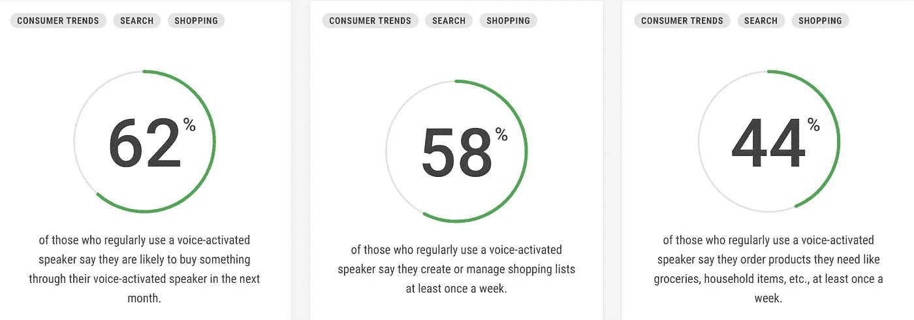

[*Source*](https://www.thinkwithgoogle.com/data-collections/voice-assistance-emerging-technologies/)

特别是关于亚马逊和谷歌各自商业战略的短期结论相对容易得出。在这一领域，先发优势看起来很明显，特别是随着语音识别继续发展成为导致购买的对话互动。

我们在之前已经写过科技巨头语音搜索战略的两个重点:技术应该无处不在，而且必须是无缝的。语音已经是一个多平台的生态系统，但我们离它所寻求的无处不在还有一段距离。

为了深入了解当前竞争的可能结果，有必要评估一下西方市场四大主要参与者的优势和劣势:亚马逊、谷歌、苹果和微软。

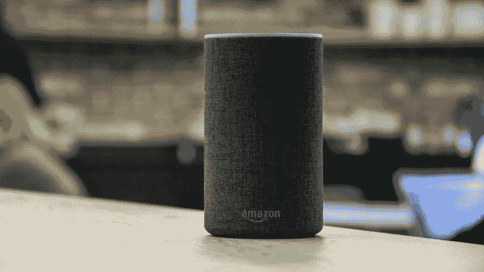

# **亚马逊**

**第一方硬件:** Echo，Echo Dot，Echo Show，Fire 电视棒，Kindle。

**数字助理:** Alexa

**使用情况统计:**

*   “数千万台支持 Alexa 的设备”在 2017 年假日季全球销售(亚马逊)
*   迄今售出的所有智能音箱中有 75%是亚马逊设备(Tech Republic)
*   Echo Dot 是亚马逊假日期间销量第一的设备，支持 Alexa 的 Fire TV stick 位居第二。(亚马逊)
*   Alexa 用户平均每月花 18 分钟与设备互动，相比之下，Google Home 用户仅花 5 分钟
*   现在有超过 25，000 种技能可供 Alexa(亚马逊)使用

**概述:**

圆柱形 Echo 设备和它的弟弟 Echo Dot 已经成为智能扬声器热潮中的热门产品。通过将扬声器与一系列流行的第三方服务和“技能”捆绑在一起，亚马逊成功地使 Echo 成为数百万家庭的有用补充。

正如亚马逊设备公司负责人戴夫·林普最近所说，

> *“我们认为它是环境计算，是一种不那么专属于你个人但却无处不在的计算机访问。”*

根据销售数据，无处不在似乎是一种真正的可能性。

在 Echo Dot 成为亚马逊全球最受欢迎的产品的假期过后，Alexa 应用程序占据了应用程序商店的首位，领先于谷歌的竞争产品。

亚马逊作为在线零售商的传统也让它在利用这项技术赚钱方面拥有先天优势。对 Whole Foods 的收购进一步增加了这一点，它有可能以其他公司肯定会羡慕的方式整合线下和线上世界。

此外，亚马逊从未依靠广告来保持股价飙升。事实上，恰恰相反。因此，短期内迫使他们的智能扬声器在这方面的压力较小。

随着广告商热衷于寻找谷歌和脸书的真正在线替代品，亚马逊处于一个很好的利用位置。然而，这里需要保持一种微妙的平衡。就消费者信任和声誉而言，亚马逊损失最大，因此它只会小心翼翼地进入 Alexa 的广告领域。

该公司否认它有这样的计划，但正如研究公司 L2 公司最近写道，

> 亚马逊已经接触了主要品牌，询问他们是否愿意为亚马逊之选付费，亚马逊之选是一个特定类别中最佳产品的名称。

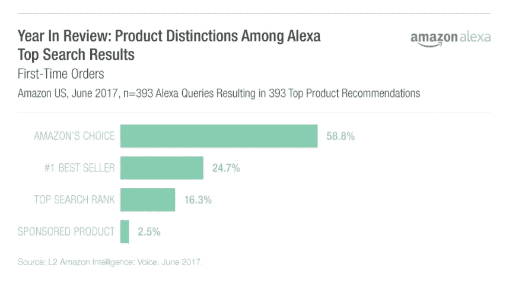

我们应该期待看到亚马逊更多的尝试，在搜索结果上提供不仅仅是付费广告的东西。语音需要新的广告解决方案，亚马逊起初会小心翼翼地确保它不会破坏 Alexa 的体验。[最近宣布与出版巨头赫斯特公司合作](http://uk.businessinsider.com/hearst-is-betting-on-amazon-alexa-2018-1?r=US&IR=T)，这是一个迹象。

Alexa 成功的关键将是整合亚马逊自己的资产，以及第三方支持，这些支持已经创造了超过 25，000 项技能。随着[宣布支持](https://www.cnbc.com/2018/01/05/amazon-alexa-is-coming-to-headphones-smart-watches-and-more.html)新款耳机、手表、冰箱等等，亚马逊看起来将在未来一段时间内保持在语音识别技术的前沿。

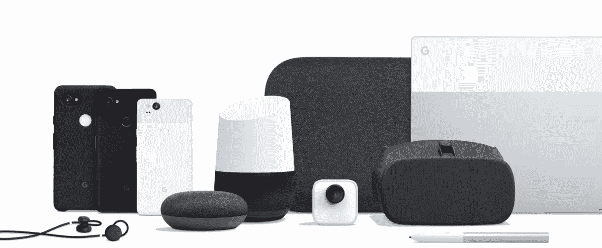

# **谷歌**

**第一方硬件:** Google Home、Google Home Mini、Google Home Max、Pixelbook、Pixel 智能手机、Pixel Buds、Chromecast、Nest 智能家居产品。

**数字助理:**谷歌助手

**使用情况统计:**

*   Google Home 在美国智能音箱市场(eMarketer)占有 24%的份额
*   谷歌主页现在有超过 1000 个动作
*   谷歌助手在超过 225 个家庭控制品牌和超过 1500 种设备上可用(谷歌)
*   最受欢迎的谷歌助手应用是游戏，其次是家庭控制应用(Voicebot.ai)

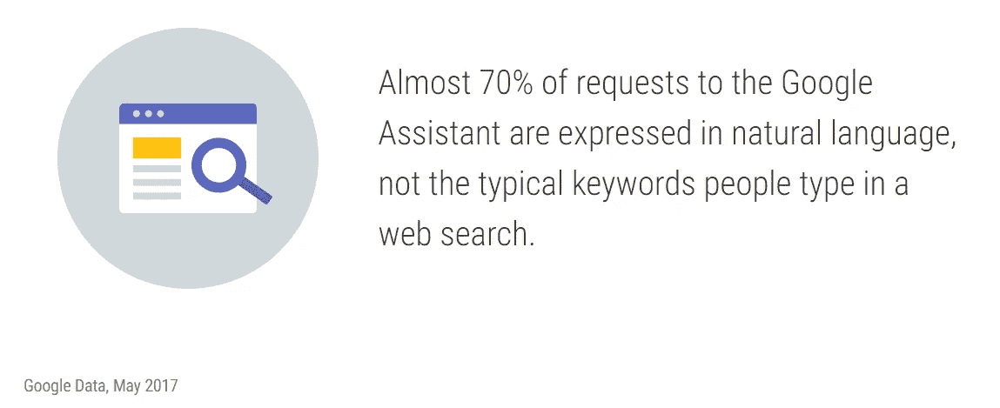

**概述:**

谷歌助手与世界上最大的搜索引擎直接相连，为用户提供了直接访问人类已知的最大信息数据库的途径。对于数字助理来说，这是一个不错的存储库，尤其是在谷歌继续对其语音识别软件进行渐进式改进的时候。

Stone Temple Consulting 最近对 5，000 个样本查询的研究发现，谷歌是最准确的解决方案，遥遥领先:

结合谷歌照片、谷歌地图、YouTube 和一系列其他有效的服务，谷歌助手不缺乏集成的可能性。

谷歌可能没有计划再次进入硬件市场，因为它的产品在过去受到了不冷不热的欢迎。然而，这种新的局面促使搜索巨头以一种非常严肃的方式采取行动。目前没有犯错的余地，因此谷歌已经通过 Pixel 智能手机、Chromecast，当然还有家用设备，将事情掌握在自己手中。

Home Mini 一直很受欢迎，谷歌也将 Home Max 加入了该系列，其价格甚至高于苹果 HomePod。所有的基础都包括在内。

谷歌知道硬件游戏不是长久之计。这是一个必要的策略，但谷歌希望说服其他硬件制造商整合该助手，就像它对 Android 智能手机软件所做的一样。这消除了昂贵的生产成本，但保持了消费者注意力的持续时间。

该计划已经付诸实施，刚刚宣布支持一系列智能显示器:

这为消费者与智能扬声器的互动增加了一个新的视觉元素，并且至关重要的是，带来了使用谷歌照片、视频聊天和 YouTube 的潜力。

> 谷歌还希望给它的人工智能助手增加“更多的人性”，并聘请了一个由喜剧演员、视频游戏设计师和移情专家组成的团队来注入一些个性。

毕竟，谷歌是一家广告公司，所以下一个项目将是将这项技术货币化。目前，核心目标是提供比竞争对手更好、更人性化的体验，并在更多家庭中获得必要的地盘。毫无疑问，这个搜索巨头会找到新的方法从这种情况中赚钱。

尽管它起步比亚马逊慢，但谷歌的广告理念和不断增长的产品种类意味着它在短期和长期仍是一个强有力的竞争者。

# **苹果**

**硬件:**苹果 HomePod(定于 2018 年推出，售价 349 美元)，iPhone，MacBooks，AirPods

**数字助理:** Siri

**使用情况统计:**

*   42.5%的智能手机安装了苹果的 Siri 数字助理(高普及率)
*   截至 2017 年 7 月，美国月活跃用户数为 4140 万，较上年下降 15%(Verto Analytics)
*   19%的 iPhone 用户至少每天使用 Siri(HubSpot)

**概述:**

苹果在智能手机和笔记本电脑市场保持着令人羡慕的地位，这使得它能够以其他公司无法复制的方式将 Siri 与其操作系统集成在一起。即使是三星的 Bixby 助手也无法达到这种协同水平，因为其智能手机运行在 Android 上，因此必须与谷歌助手争夺注意力。

尽管如此，当它的硬件进入消费者的家庭生活时，它还是有点落后。几乎可以肯定的是，HomePod 将提供比 Echo Dot 或谷歌 Home Mini 更好的音频体验，价格为 350 美元。它将包含一系列令人印象深刻的功能，包括判断周围空间并相应调整音质的能力。

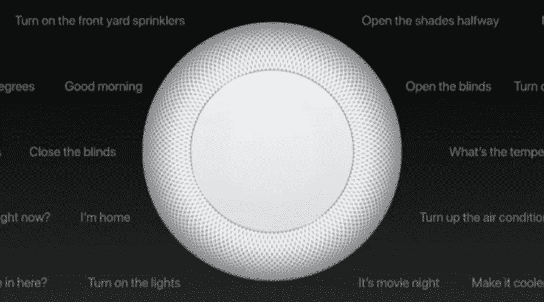

HomePod 的发布被推迟，业内人士认为 Siri 是原因。苹果对数据采取的围墙花园的方法对消费者有好处，但在语音识别等技术方面也有缺点。谷歌可以获得大量信息，它在云中处理这些信息，并利用这些信息来改善所有用户的助手体验。苹果并不拥有同样数量的这种宝贵资源，这使得 Siri 自成名以来的发展速度放缓。

也就是说，这些似乎可能是短期问题。

苹果将坚持其核心商业战略，到目前为止，这一战略很好地服务了苹果。HomePod 将位于市场的高端，并将依靠苹果的设计遗产，专注于提供卓越的音频体验。它将只支持 Apple Music，所以除非苹果向第三方开放，否则它可能只面向苹果粉丝。对苹果来说幸运的是，有足够多的这些东西来确保产品站稳脚跟。无论是它的

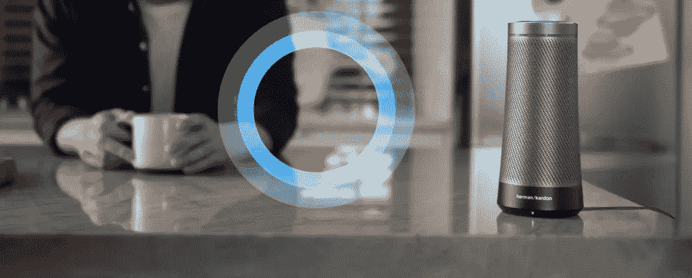

# **微软**

**硬件:**哈曼/卡顿调用音箱、Windows 智能手机、微软笔记本电脑

**数字助理:** Cortana

**使用情况统计:**

*   5.1%的智能手机安装了 Cortana 助手
*   Cortana 现在每月有 1.33 亿用户(科技雷达)
*   25%的必应搜索是通过语音进行的(微软)

**概述:**

微软在语音识别方面一直比较安静，但它拥有成功的语音识别产品所需的许多组件。

微软在商业市场、办公服务套件以及 Skype 和 LinkedIn 等热门产品中占有非常重要的份额，因此不应该被忽视。

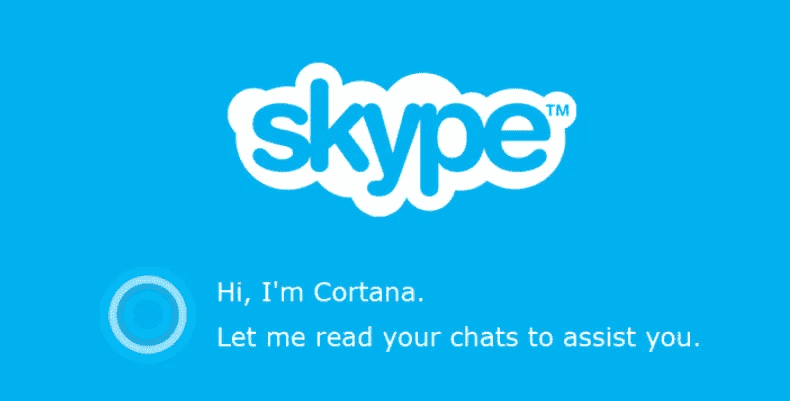

苹果决定在 Siri 助手上默认谷歌搜索结果而不是必应，这对微软的雄心是一个打击，但必应仍然可以成为微软在这一领域的竞争优势。Bing 是一个非常有价值的数据来源，并帮助 Cortana 发展成为一个更加有效的语音识别工具。

> Harman/kardon 开发的 Invoke 扬声器将 Cortana 集成到了产品中，也降低到了更容易接受的 99.95 美元。

新的支持 Cortana 的扬声器以及恒温器等智能家居产品即将问世。这应该看到它的吸收水平增加，但持续的感觉是，微软可能已经有点晚了。

微软可以非常可信地竞争的领域是办公环境，这也成为亚马逊的一个核心考虑因素。微软准备走一条不同的路线来在这个市场获得立足点，但这仍然是一条非常有利可图的路线。

# **语音识别技术的未来**

我们离实现语音识别技术的真正潜力还有一段距离。这既适用于技术本身的复杂性，也适用于它融入我们的生活。当前的数字助理可以很好地解释语音，但它们不是技术提供商希望它们成为的对话界面。此外，语音识别仍然局限于少数产品。

尽管如此，与语音识别的早期尝试相比，进步的速度确实是相当惊人的。

因此，我们可以展望不久的将来，想象与我们周围的世界互动的方式会发生巨大的变化。亚马逊的“环境计算”概念似乎很合适。

智能扬声器市场还有很大的增长空间，预计到 2020 年底，75%的美国家庭将拥有至少一台智能扬声器。

现在，用户已经克服了最初对设备说话的尴尬，告诉 Alexa 烧开水壶或制作一杯浓缩咖啡的想法似乎并不那么陌生。

> 语音正在成为它自己的界面，从智能手机进入家庭，很快进入许多其他日常环境。

随着技术的进步，我们应该会看到更复杂的投入产出关系。语音-语音关系限制了回应的潜力，但亚马逊 Echo Show 和谷歌对智能显示的支持等创新将开辟许多新的参与机会。当消费者的胃口达到所需水平时，苹果和谷歌也将整合他们的 AR 和 VR 应用程序。

然而，挑战依然存在。首先，语音搜索提供商需要找到一种方法，通过一种最适合简短回复的媒介来提供选择。否则，怎么可能确保用户的查询得到最好的响应，而不是背后有最高广告预算的响应呢？

现代消费者非常精明，可以接触到几乎无穷无尽的信息，因此品牌的任何误判都会被记录下来，并与用户网络共享。

谷歌的一项新研究表明，消费者越来越接受品牌将使用智能扬声器与他们交流。相当多的人表示愿意接收有关交易和销售的信息，几乎一半的人希望收到个性化的提示:

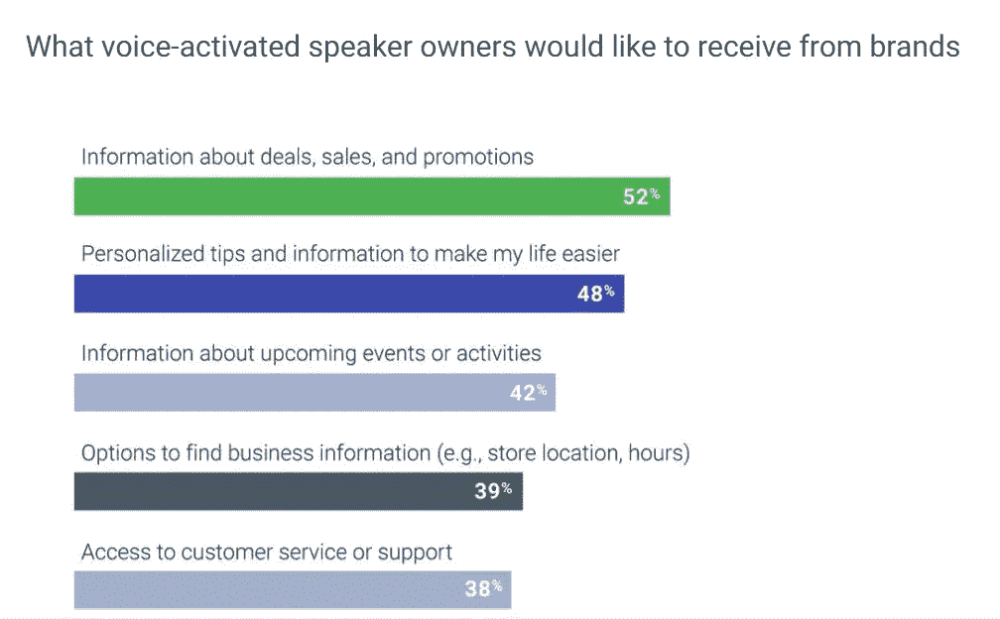

语音识别技术为我们提供了一个可信的交流平台，但要让与受众的关系互惠互利，还得靠营销人员。

# **关键要点**

*   品牌需要考虑如何让互动对消费者更有价值。语音搜索与生俱来的价值主张是快速、方便、有用。只有通过吸收——并增加——技术和消费者之间的这种关系，他们才能突破。美女与野兽的例子为我们所有人提供了一个早期的警示故事。
*   亚马逊处于将其语音识别技术货币化的有利位置，但仍面临障碍。对亚马逊选择的赞助已经被探索为在不损失客户的情况下获得收入的途径。
*   谷歌已经将语音识别作为其业务增长的核心。凭借其可支配的大量数据和越来越多的第三方支持，谷歌助手今年将对亚马逊的 Alexa 构成严重威胁。
*   营销人员应该利用语音搜索的技术最佳实践来提高当前的可见性。虽然这项技术仍在发展，但我们需要在它完成艰巨任务时助其一臂之力。
*   了解人们如何使用语音识别技术的最好方法是经常接触它。认真寻找机会的营销人员应该在家里、工作场所和旅途中进行自己的研究。

*原载于*【Clickz.com】

**

## *这篇文章发表在 [The Startup](https://medium.com/swlh) 上，这是 Medium 最大的创业刊物，有 283，454+人关注。*

## *订阅接收[我们的头条新闻](http://growthsupply.com/the-startup-newsletter/)。*

**