# 视觉搜索的过去、现在和未来

> 原文：<https://medium.com/swlh/the-past-present-and-future-of-visual-search-9178f006a985>

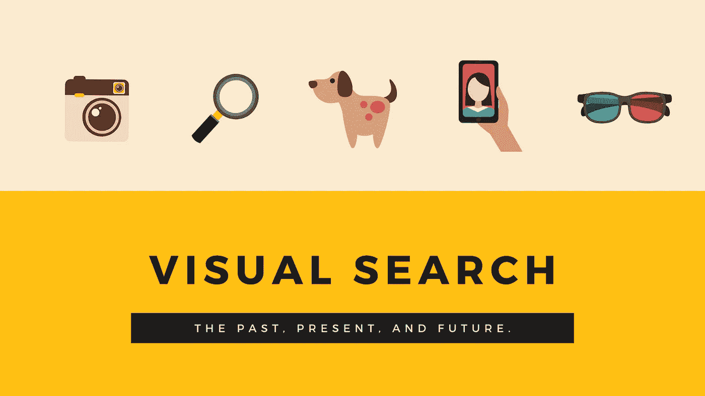

Visual search image created by author, Clark Boyd.

## 视觉搜索是科技行业中最复杂、竞争最激烈的领域之一。谷歌、Pinterest 和微软都在争夺这一市场。

我们的文化是以图像为媒介的，所以视觉搜索对世界上最大的科技公司来说如此重要是理所当然的。进步的步伐无疑在加快；但是没有明确的视觉搜索“赢家”，也不会很快出现。

通过个性化、自然语言处理和多媒体结果方面的进步，搜索行业在过去十年中有了显著的发展。然而，有人可能会说，图像的力量仍未开发。

这不是因为缺乏关注或投资。事实上，恰恰相反。破解视觉搜索需要技术理性、心理学洞察力和神经科学知识的结合。

这使得视觉搜索成为一个迷人的发展领域，但也是一个不容易掌握的领域。

因此，在本文中，我们将首先概述视觉搜索行业及其带来的挑战，然后分析谷歌、微软和 Pinterest 最近取得的进展。

# 什么是视觉搜索？

我们每天都参与视觉搜索。例如，每当我们需要在一系列其他物品中定位我们的钥匙时，我们的大脑就会进行视觉搜索。

随着时间的推移，我们学会识别某些目标，并能在繁忙的环境中越来越容易地找到它们。

然而，对计算机来说，这是一项更棘手的任务。

图像搜索是搜索引擎进行基于文本的查询，并试图找到最佳视觉匹配，这与现代视觉搜索有着微妙的区别。视觉搜索可以把图像作为它的“查询”，而不是文本。为了执行准确的视觉搜索，搜索引擎需要比传统图像搜索更复杂的过程。

通常，作为这一过程的一部分，深度神经网络将在如下测试中接受测试，希望它们能够模仿人脑识别目标的功能:

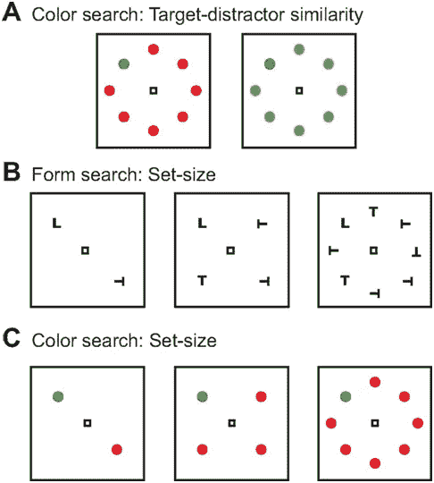

Visual search: How it works

让我们能够理解这些模式的决策(或称之为固有的“偏见”)更难整合到机器中。

> 处理图像时，机器应该优先考虑形状、颜色还是大小？一个人如何做到这一点？我们真的知道吗，还是我们只知道输出？

因此，搜索引擎仍然难以按照我们期望的方式处理图像。我们只是不太了解自己的偏见，无法在另一个系统中复制它们。

尽管如此，这一领域已经取得了很大进展。谷歌图片搜索在响应文本查询和其他选项方面有了很大的改进，比如 Tineye，也允许我们使用反向图片搜索。这是一个有用的特性，但是它的局限性是不言而喻的。

多年来，脸书已经能够识别照片中的人，就像一个人能够立即认出朋友的脸一样。这个例子更接近视觉搜索的圣杯；然而，它仍有不足之处。在这种情况下，脸书已经建立了搜索人脸的网络，给他们一个明确的目标。

最重要的是，在线视觉搜索允许我们使用一幅图像作为输入，接收另一幅相关的图像作为输出。例如，这意味着我们可以用智能手机拍一张椅子的照片，并让技术返回适合椅子风格的地毯的照片。

典型的“人类”过程在中间，我们将破译图像的组成部分，并决定它是什么，然后概念化和分类相关的项目，是由深度神经网络进行的。这些网络是“无人监管的”，这意味着没有人为干预，因为它们根据反馈信号改变其功能，并努力提供所需的输出。

结果可能是令人着迷的，正如下面由谷歌的神经网络对乔治·修拉的“拉格兰德亚特岛上的一个星期天下午”的图像的解释:

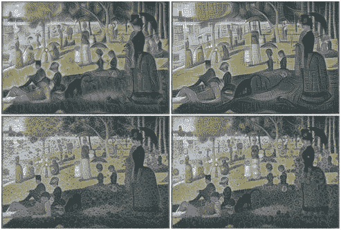

Google visual search experiment

然而，这只是回答一个微妙问题的一种方法。

就目前的情况来看，这个领域没有正确或错误的答案；只是在特定的环境下或多或少有效。

因此，我们应该评估一些科技巨头的进步，观察他们迄今为止取得的重大进展，以及在真正掌握视觉搜索之前需要克服的障碍。

# 谷歌镜头视觉搜索

谷歌最近在 2018 年 I/O 大会上宣布了其镜头产品的一系列更新。Lens 的目标是将你的智能手机变成一个可视化搜索引擎。

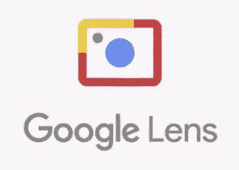

Google Lens

给外面的任何东西拍张照片，谷歌会告诉你这个物体是关于什么的，以及任何相关的实体。例如，将你的智能手机指向一家餐馆，谷歌会告诉你它的名字，你的朋友以前是否去过，并突出显示对这家餐馆的评论。

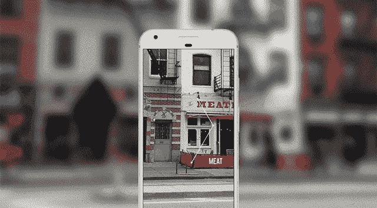

How Google can integrate Lens with Maps

这得到了谷歌令人羡慕的数据库存的补充，这些数据来自于它自己的知识图和它持有的消费者数据。

所有这些数据都可以促进和完善谷歌的深度神经网络，这是其镜头产品有效运行的核心。

谷歌战略的核心实际上是首先让人们加入视觉搜索，然后引入更多公开的电子商务形式。

除此之外，视觉搜索可以让我们拍出更好的照片。谷歌展示了即将推出的 Lens 版本，该版本将自动检测并移除图像中的障碍物，并通过向相机显示密码来输入 Wifi 代码。

我们真正寻找的是那些只有图像才能捕捉到的无形事物。因此，任何与风格或设计相关的东西，比如视觉艺术，甚至纹身(Pinterest 视觉搜索上搜索次数最多的‘物品’)，都会是一个天然的搭配。

当我们想找到一个产品或服务时，搜索已经成为一个奇妙的媒介。然而，这种输入格式限制了它的应用范围。如果搜索要继续扩大，它必须成为一个更全面的资源，在我们提供明确的指示之前代表我们积极搜索。

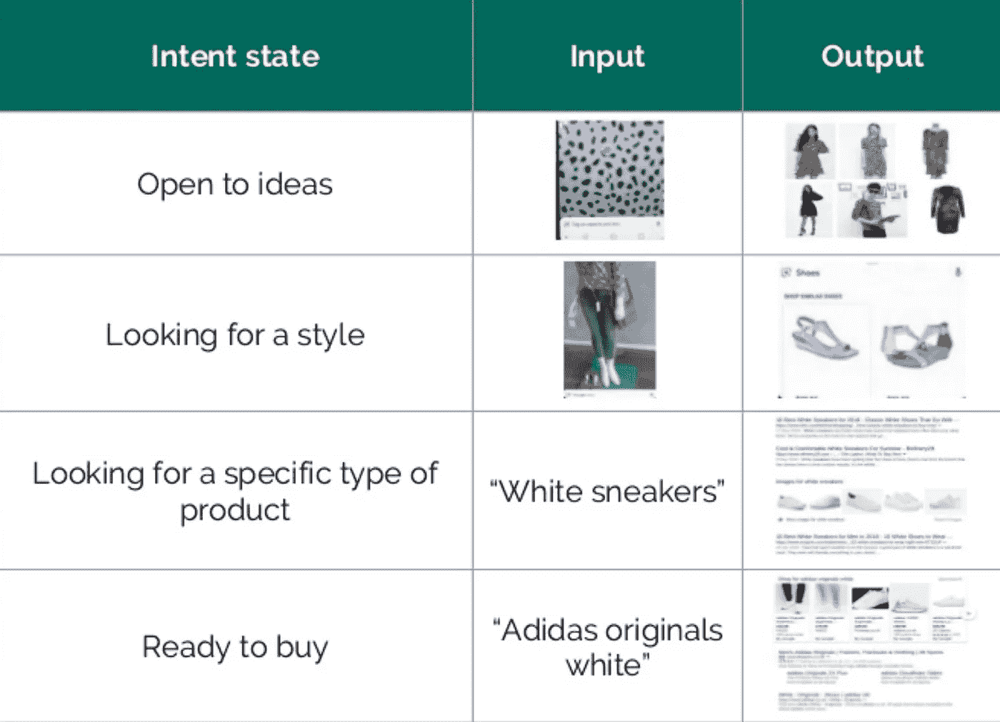

Visual search strategy for ecommerce

谷歌旗下的 DeepMind 公司处于视觉搜索创新的前沿。因此，DeepMind 也特别了解掌握这项技术有多么具有挑战性。

挑战不再仅仅是创建像人类一样有效理解图像的神经网络。更大的挑战(在这个领域被称为“黑箱问题”)是，得出结论所涉及的过程是如此复杂、模糊和多面化，以至于连谷歌的工程师都难以跟踪。

这指向了视觉搜索核心的一个相当尖锐的悖论，更广泛地说，是深度神经网络的使用。目的是模仿人类大脑的功能；然而，我们仍然没有真正理解人脑是如何工作的。

因此，DeepMind 已经开始探索新的方法。在一篇引人入胜的[博客文章](https://deepmind.com/blog/cognitive-psychology/)中，他们总结了来自[最近一篇论文](https://arxiv.org/abs/1706.08606)的发现，在论文中，他们应用了人类对图像感知中明显的归纳推理。

利用认知心理学的丰富历史(至少与新生的神经网络领域相比是丰富的)，科学家能够在他们的技术中应用我们在对物品进行分类时应用的偏见。

DeepMind 使用以下提示来阐明他们的想法:

> “一位现场语言学家去访问一种语言与我们自己的语言完全不同的文化。这位语言学家正试图从一位乐于助人的母语人士那里学习一些单词，这时一只兔子匆匆跑过。说本族语的人宣布“gavagai”，而语言学家则被留下来推断这个新词的意思。语言学家面临着大量可能的推论，包括“gavagai”指的是兔子、动物、白色的东西、特定的兔子或“兔子的未分离部分”。有无数可能的推论可以做出。人们怎么能选择正确的呢？”

认知心理学的实验表明，我们有一种‘形状偏差’；也就是说，我们突出了这是一只兔子的事实，而不是把重点放在它的颜色或它作为动物的更广泛的分类上。我们知道所有这些因素，但我们选择形状作为最重要的标准。

*“Gavagai” Credit: Misha Shiyanov/Shutterstock*

DeepMind 是谷歌发展成为“人工智能第一”公司的最重要的组成部分之一，因此我们可以预计在不久的将来，上述发现将被纳入视觉搜索。当他们这样做时，我们不应该排除推出谷歌眼镜 2.0 或类似的东西。

# Pinterest 镜头视觉搜索

Pinterest 的目标是，当你找不到合适的词语来描述你要找的东西时，把自己打造成首选的视觉搜索引擎。

现在 Pinterest 上每个月有超过 6 亿次视觉搜索，所以人们似乎真的开始接触这项技术了。

去年其镜头产品的发布是一个真实的意向声明，Pinterest 已经从谷歌的图像搜索团队中聘请了许多高级员工来推动发展。

结合其建立的[付费搜索产品](https://searchenginewatch.com/2017/10/24/pinterest-moves-into-paid-search-what-you-need-to-know/)和“购买外观”等功能，越来越多的人认为 Pinterest 可能成为一个真正的营销竞争者。除了亚马逊，它还将受益于广告客户对谷歌和脸书之外更多选择的渴望。

视觉搜索真正发挥作用，并真正超越纯小说的领域，是当它提出人们尚未想到的新想法。

Pinterest 的 Lens the Look 工具就是一个很好的例子。消费者可以搜索鞋子并找到他们想要的那双，但 Pinterest 也可以推荐一套与鞋子相配的服装。这就变成了一个持续的对话。

Pinterest 总裁蒂姆·肯德尔在 TechCrunch Disrupt 上指出:

> “我们开始能够进入差异化领域，制造其他人做不到的东西。或者他们可以建造它，但由于产品的性质，这样做没有什么意义。”

这是问题的核心。Pinterest 用户来到该网站是为了一些不同的东西，这使得 Pinterest 可以为他们打造不同的产品。虽然谷歌在许多战线上作战，但 Pinterest 可以专注于改善其视觉搜索产品。

诚然，它仍然是一项正在进行的工作，但 Pinterest Lens 是目前可用的最先进的视觉搜索工具。使用智能手机，Pinner(该网站的用户)可以在应用程序中拍摄照片，并通过 Pinterest 的技术进行高精度处理。

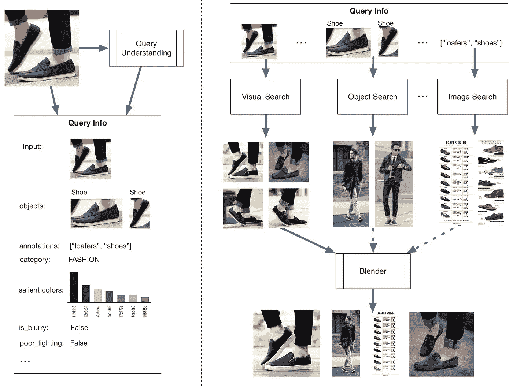

Pinterest Lens visual search: How it works

结果对于服装和家居用品非常有效，尽管在我们将 Pinterest 用作个人造型师之前还有很长的路要走。然而，作为未来诱人的一瞥，Pinterest Lens 是一个受欢迎且令人印象深刻的发展。

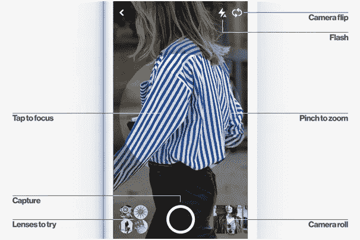

Pinterest visual search for fashion

下一步是将其货币化，这正是 Pinterest [计划做的事情](https://techcrunch.com/2017/05/16/pinterests-visual-search-technology-is-coming-to-its-ads/)。视觉搜索将成为其付费广告套餐的一部分，这一事实无疑将吸引渴望超越关键词定位和社交媒体潜在客户的零售商。

# Bing:“智能”视觉搜索

今年早些时候，微软宣布将允许用户“按图片搜索”

这是值得注意的，原因有很多。首先，虽然必应图片搜索已经存在了相当一段时间，但微软实际上在 2012 年就已经下架了其原有的视觉搜索产品。自从 2009 年发布以来，人们就不再使用它，因为它不够准确。

此外，公平地说，微软在这场竞赛中有点落后。竞争对手的搜索引擎和社交媒体平台提供视觉搜索功能已经有一段时间了。

因此，似乎有理由猜测，如果微软选择通过这样一个公开声明重新加入竞争，他们一定有令人信服的东西。虽然它不是革命性的，新的 Bing 视觉搜索仍然是一个有用的工具，在很大程度上建立在他们的图像搜索产品上。

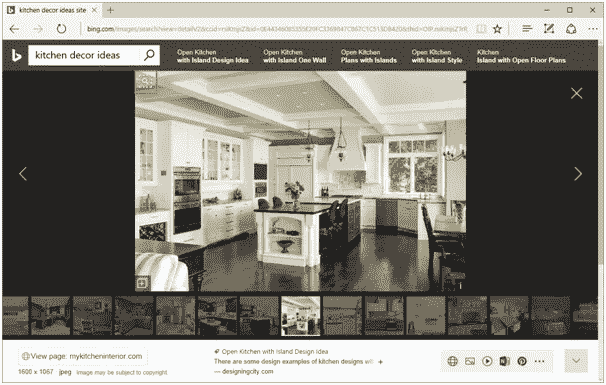

Bing visual search

*阿炳搜索“厨房装饰创意”，展示了必应新的视觉搜索能力*

Bing 视觉搜索与众不同的地方在于它能够在图片中搜索，然后将搜索范围扩大到可能补充用户选择的相关对象。

Bing visual search isolates objects

用户可以选择特定的对象，研究它们，如果他们愿意，还可以购买类似的商品。零售商的机会既明显又充足。

值得一提的是，Pinterest 的视觉搜索[能够做到这一点已经有一段时间了](https://searchenginewatch.com/2016/07/08/six-ways-pinterest-is-becoming-serious-about-visual-search/)。但是 Pinterest 的功能和 Bing 在这方面的重要区别在于，Pinterest 只能将用户重定向到商家在 Pinterest 上提供的 Pins 并不是所有的 pin 都是可购买的。另一方面，Bing 可以索引零售商的网站，并使用视觉搜索将用户引向该网站，而不需要任何一方付出额外的努力。

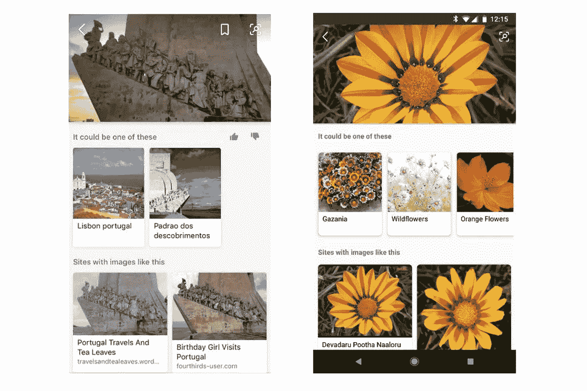

Visual search in action

在 Silverlight 技术的支持下，这应该会产生一种更加精细的图像搜索方法。微软[向](https://blogs.bing.com/search-quality-insights/2017-06/beyond-text-queries-searching-with-bing-visual-search)提供了他们的查询处理系统如何为该产品工作的以下可视化展示:

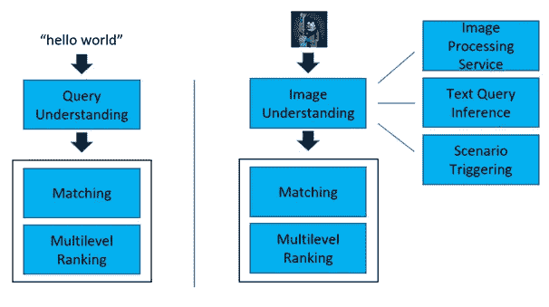

Microsoft’s visual search process

微软将该系统与其拥有的结构化数据相结合，以提供更加丰富、信息量更大的搜索体验。虽然仅限于一些搜索类别，如家居用品、旅游和体育，但我们预计今年将会在更多领域推广。

从下面的视频中公布的微软的最新更新显示，它对这一业务部门有着宏伟的雄心。

Bing visual search

使用图片作为搜索查询，用户现在只需将智能手机指向正确的方向，就可以购物和了解更多信息。准确性水平仍然落后于 Pinterest 和 Lens，但微软似乎将长期参与这场战斗。

# 下一步是什么？

首先，技术会在精度上不断提高。

收购可能是这一过程的一部分。Pinterest 早期的成功可以归因于人事和商业策略，但他们也在 2015 年收购了 Kosei，以帮助理解和分类图像。

我们应该期待谷歌投入大量资源将视觉搜索与谷歌地图和购物等其他产品整合。I/O 开发者大会为我们提供了一些引人入胜的线索。

Lens 已经内置于 Pixel 智能手机摄像头中，这使得它更容易访问，但它仍然没有以真正直观的方式与其他产品集成。当智能手机能够识别物体时，人们会印象深刻，但这种能力并没有真正增加长期价值。

因此，我们将看到更准确的图像解释，因此，更多样和有用的结果。

然而，搜索引擎和它提供的内容之间仍然存在差距。

要做到这一点，品牌也需要发挥自己的作用。有大量针对 Pinterest 搜索优化的最佳实践，所有视觉搜索引擎都利用上下文信号和元数据来理解他们在看什么。

一种可能的方式是品牌与有影响力的人合作展示他们的产品。只要他们的全部产品在主题上与展出的产品相关，这些产品就可以作为进一步创意的选择提供给消费者。

此外，视觉搜索技术和消费者行为之间仍然存在差距。消费者只是不习惯使用智能手机摄像头作为搜索输入，尽管这种情况正在改变，但进步需要时间。我们不应该排除视觉搜索更接近我们视线的可能性，甚至可能是通过复活的谷歌眼镜产品。

总之，这项技术还有一点发展，但我们需要通过给机器学习算法提供正确的数据来满足它们。例如，Pinterest 已经在训练集中使用了超过 10 亿张图片。这意味着取得所有在线房地产的所有权，并通过相关的结果为我们的内容寻找机会。

我们可能还需要几年时间才能宣布视觉搜索霸主地位的赢家，但很明显，胜利者将会获得巨大的战利品。

# **优化视觉搜索的一些技巧**

任何时候我们在处理搜索的时候，都会有很多理论和实践可以帮助任何人获得更好的结果。我们只是没有以前的捷径了。

**为了优化视觉搜索，你应该:**

*   阅读像 [Pinterest engineering](https://engineering.pinterest.com/) 这样的博客。这些事情看起来似乎很神奇，但是视觉搜索背后有一个清晰的方法论
*   在 Instagram、谷歌、Pinterest 上组织你的存在。视觉搜索引擎以此为线索来理解每张图片所包含的内容。
*   遵循传统的图像搜索最佳实践。
*   分析你自己的结果。看看你的图片表现如何，尝试新的颜色，新的主题。结果将永远是个性化的，所以没有一刀切的对或错
*   考虑一下你的可购买图片可能会如何出现。你要么想成为人们搜索的对象，要么想顺理成章地成为他们的下一步。看看你和你的竞争对手的影响者互动，看看会出现什么
*   直接与创意团队合作。搜索仍然是一个数据密集型行业，并将永远如此，但这种优势现在正与更具创造性的方面融合在一起。搜索营销人员需要与社交媒体和品牌合作，充分利用视觉搜索
*   使分离和识别图片中的项目变得容易。视觉搜索引擎有一项非常艰巨的工作要做；不要让他们更难做
*   使用一致的主题，如果你使用股票图片，稍微调整一下。否则，该图像将根据它出现过的数百万次来识别
*   想想如何优化你的实体形象。如果人们使用产品作为搜索的刺激，他们想知道什么信息？价格、产品信息、类似项目等等。然后，确保您针对这些进行了优化。使用结构化数据使搜索引擎能够轻松呈现这些信息。事实上，如果现在视觉搜索有一件事需要关注的话，那就是结构化数据。

***想随时了解最新视觉搜索新闻？查看*** [***本资源***](/@clarkboyd/visual-search-trends-statistics-tips-and-uses-in-everyday-life-d20084dc4b0a) ***！这是一个视觉搜索统计、趋势、新闻和提示的列表，每天更新。***

## 这篇文章发表在 [The Startup](https://medium.com/swlh) 上，这是 Medium 最大的创业刊物，拥有 338，320 多名读者。

## 在这里订阅接收[我们的头条新闻](http://growthsupply.com/the-startup-newsletter/)。

