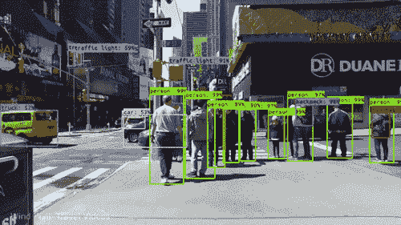

# 理解机器学习的途径

> 原文：<https://medium.com/swlh/the-path-to-understanding-machine-learning-7e9f47c54682>

人工智能一直是媒体炒作的中心。自动驾驶汽车、虚拟助手和自主性的承诺每天都出现在全球各地的头条新闻中。其中一些头条新闻是合法的，并且有真正的近期可能性，比如自动驾驶汽车。另一些则被夸张地冠以戏剧性的标题来推动广告收入。

媒体为不久的将来描绘了两种图景。一个乌托邦式的未来，商品丰富，人们不需要工作，产品由智能机器制造。一个反乌托邦式的未来，工作机会稀缺，经济濒临崩溃，所有的工作都由人工智能霸主控制的智能机器承担。虽然这些场景可以成为很好的科幻电影，但重要的是要明白什么是可能的，什么是不可能的，*什么是信号，什么是噪音*。

**的确，当前的人工智能技术正在创造巨大的经济、社会和政治影响。能够理解潜力并创造这些影响的人将成为赢家。**

如果你不想落后，你需要了解现代人工智能。真正实现人工智能潜力的首要方法是接受这方面的教育。人工智能的最新进展归功于两个子领域，机器学习和深度学习。幸运的是，由于网上有大量的资源，这两个领域很容易学习。

下面是你应该熟悉的主题列表，以便理解当你对你的智能设备说 [*“这是如此悲伤的 Alexa play Despacito”*](https://knowyourmeme.com/memes/this-is-so-sad-alexa-play-despacito)*时，在引擎盖下发生了什么。*

# 基金会

有一个基本的理解对建立直觉是必不可少的，因此总是建议学习首要原则。

## 编程；编排

要教一台机器，你首先需要学会如何说它的语言。学习像 Python 这样的编程语言是很好的第一步。

【Codecademy 中的 python 简介——python 入门

## 概率与统计

机器学习可以被认为是概率统计的一个分支。理解数据的底层统计数据是绝对必要的。实践机器学习不需要概率统计的学位。但是对它们有一个基本的理解会有很长的路要走，特别是当你在一个机器学习的问题上绞尽脑汁，停滞不前的时候。

[麻省理工学院开放课件中的概率统计简介](https://ocw.mit.edu/courses/mathematics/18-05-introduction-to-probability-and-statistics-spring-2014/index.htm)—学习理解 ML 所必需的基础知识。

## 结石

机器学习中大量使用微积分；比如为你的问题空间寻找最优解，或者做概率建模的时候。说了这么多，你也没必要去掏出一本微积分书，从头到尾读一遍。需要学习的一些关键主题是微分学和积分学。

[微积分的精髓](https://www.youtube.com/watch?v=WUvTyaaNkzM&list=PLZHQObOWTQDMsr9K-rj53DwVRMYO3t5Yr)来自 3blue1Brown 的 youtube 播放列表——绝对不容错过。这总共花了我 3-4 个小时，我从中学到的东西比我在大学第一学期的微积分还多。

[可汗学院的微分学](https://www.khanacademy.org/math/differential-calculus)—更全面的微积分课程。

## 线性代数

在机器学习中，我们可以在高维空间中表示数据。计算机擅长高维推理，比人类强多了。你能想象四维平面是什么样子吗？五点怎么样？1000 怎么样？线性代数允许您表示高维数据并对其执行数学运算。线性代数也非常好地并行化，这也是 GPU 在 ML 中如此广泛使用的原因之一。

[来自 3blue1Brown 的线性代数精华](https://www.youtube.com/watch?v=fNk_zzaMoSs&list=PLZHQObOWTQDPD3MizzM2xVFitgF8hE_ab)—又一个必看！如果你以前理解线性代数有困难，这之后你就不会了。

[深度学习书籍中的线性代数章节](http://www.deeplearningbook.org/contents/linear_algebra.html)—理解数学符号。

# 好东西

觉得先学基础会无聊吗？没问题！如果你是这样学习的话，自上而下的方法有时会更有效。从机器学习和深度学习开始，变得超级困惑，然后研究你的方式进入启蒙。

## 机器学习

机器学习是一个关注可以从经验中学习的算法的领域。它位于计算机科学、概率、统计、微积分和线性代数的交叉点。正如我之前说过的，你不必完全理解那些主题就可以开始机器学习。你可以从学习行话和高级基础知识开始，然后在此基础上深入研究数学。无论你喜欢哪个。

来自 [Vishal Maini](/@v_maini?source=post_header_lockup) 的 AI/ML 初学者指南——非常容易上手的 ML 入门。

[Andrew 在 Coursera 的机器学习](https://www.coursera.org/learn/machine-learning)——这是一个非常受欢迎的 ML 开端。缺点是，它是用八度音程教的。我推荐使用[这份材料](https://www.johnwittenauer.net/machine-learning-exercises-in-python-part-1/)在学习这门课程的同时学习 python 代码。

[ISLR](https://www-bcf.usc.edu/~gareth/ISL/) 作者[加雷思·詹姆斯](http://www-bcf.usc.edu/~gareth)、[丹妮拉·威滕](http://www.biostat.washington.edu/~dwitten/)、[特雷弗·哈斯蒂](http://www.stanford.edu/~hastie/)和[罗伯特·蒂布拉尼](http://www-stat.stanford.edu/~tibs/)——被认为是机器学习的圣经，这是一本很好的书，可以让你思考基本的人工智能主题。

## 深度学习

深度学习是机器学习的一个子领域，专注于建立可以从经验中学习的深度神经网络。深度学习最近被大肆宣传，理由很充分。他们在计算机视觉和自然语言处理任务方面非常成功。要开始深度学习，我建议先通过机器学习，因为深度学习建立在它的基础上。

[来自吴恩达的 deep Learning . ai](https://www.deeplearning.ai/)——他著名的机器学习课程的深度学习版本。你所需要知道的关于数学符号、方程和深度学习概念。

来自杰瑞米·霍华德和他的团队的 fast . ai——这是一种自上而下的方法，如果你已经是一名程序员，推荐使用。您从代码开始，然后从那里学习概念。

# 就是这样！

咻！那看起来像很多东西。但是在学会这一切之后，你将会成为人工智能革命的一名贡献者。在了解人工智能之后，当你看到这样的东西时，你就会知道什么时候该叫 **BS**

A Terrible Overhyped Headline

当你看到这样的东西时，你会欣赏它的美…

ML Algorithm Converging to the Optimal Solution

我写了很多这样的帖子！如果你喜欢这个，请查看我的其他内容

✍🏽想要更多内容？查看我的博客[**【https://www.michaelphi.com **](https://www.michaelphi.com/build-your-own-deep-learning-machine-what-you-need-to-know/)

📺喜欢看基于项目的视频？来看看我的 [**Youtube**](https://www.youtube.com/channel/UCYpBgT4riB-VpsBBBQkblqQ?view_as=subscriber) ！

🥇注册我的 [**电子邮件简讯**](http://eepurl.com/gwy3hj) **，了解最新的文章和视频！**

## 这篇文章发表在 [The Startup](https://medium.com/swlh) 上，这是 Medium 最大的创业刊物，拥有+ 376，225 名读者。

## 在这里订阅接收[我们的头条新闻](http://growthsupply.com/the-startup-newsletter/)。

