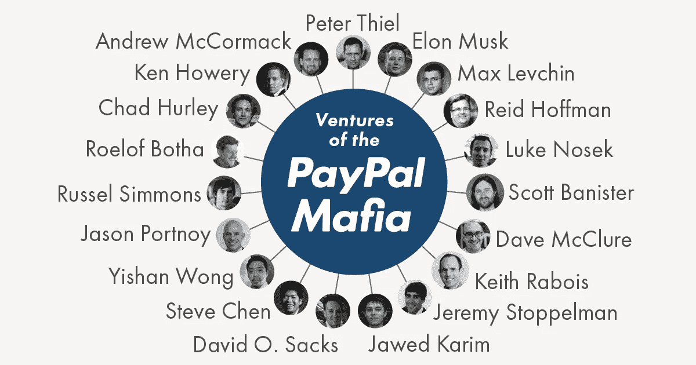

# PayPal 黑手党是为什么最好的团队不会在一起呆很久的完美例子

> 原文：<https://medium.com/swlh/the-paypal-mafia-is-the-perfect-example-why-the-best-teams-dont-stay-together-long-c8c1dfd5b1f6>

Source: [Fleximize](https://fleximize.com/paypal-mafia/)

研究表明，许多最成功的团队之所以成功，只是因为它们是临时性的——它们聚集一段时间，然后解散，一些成员去了其他团队。最终，拥有一个庞大的网络和一个紧密的团队不如拥有一个松散的网络和临时团队有价值。