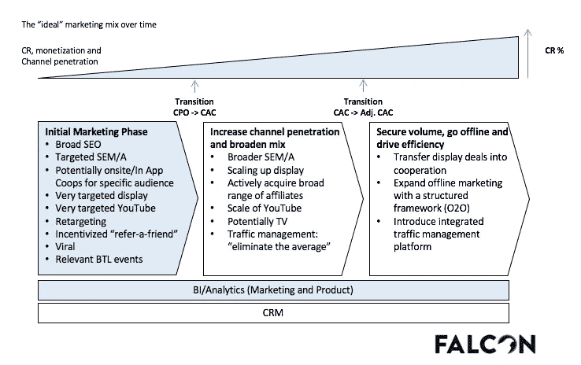
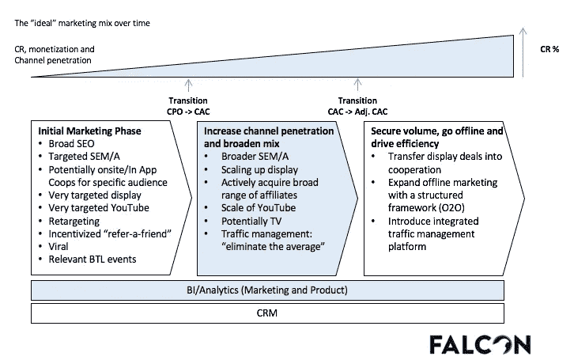
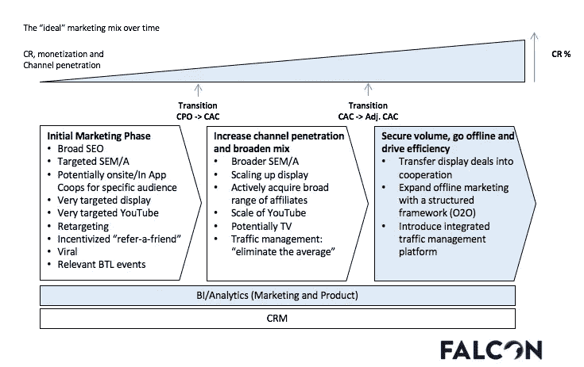

# 完美的营销组合——将你的电子商务公司从 0 美元扩大到超过 1 亿美元

> 原文：<https://medium.com/swlh/the-perfect-marketing-mix-scaling-your-ecommerce-company-from-0-to-100mm-9f957fbc02b1>

本周一早上，我收到了一封来自我一个朋友的电子邮件，他经营着一家公关公司。他问了我一个在过去十年里被问过几次的问题:

————
2018 年 7 月 30 日星期一
发件人:埃里克
至:马克斯

主题:启动我们的电子商务公司

嗨，麦克斯，

我开始了一个新的电子商务公司。我应该首先启动哪些活动和渠道？

最佳，
埃里克
— — — — — — — —

我的简短回答:“我来写篇文章，分享给你。”我下面的长回答:)

在过去的十年里，我和 20 家成功(和不太成功)的电子商务公司合作过。随着时间的推移，我想用一种方法来思考这个问题，这样就不会总有一小部分人能完成这项工作。

这是我对 Eric 和所有创业初期的创业者的回应。我不得不承认这不是我自己发明的。我第一次从弗洛里安·海涅曼博士那里了解到这一点是在他的一次臭名昭著的演讲中。不过，我确实为 APAC 市场做了调整。

The “ideal” marketing mix over time

一般来说，当我们想到“理想的”营销组合时，我们会想到转化率(CR)、货币化和渠道渗透。没有对错之分，更多的时候是你意识到你已经“挤了牛奶”，必须继续前进(也就是变得更老练)。这种转变通常以从 CPO(=每订单成本)转变为 CAC(=客户获取成本)并最终转变为调整后的 CAC(真正理解每个渠道/活动的货币化强度并最大化利润潜力)模型为标志。

如果你还没有这样做，你应该阅读一下 [FALCON 转换框架](/swlh/the-future-of-marketing-or-how-to-scale-your-ecommerce-company-1b93fd3cacd8)，因为这篇文章关注的是营销效果(作为 FALCON 转换框架的一部分)。基础是从一开始就建立的 BI/分析和 CRM 框架。是的，从一开始。不要在 3 年、5 年甚至 10 年后才开始考虑你的 CRM 解决方案。我是说，你可以，但是会非常非常疼。

我们将“完美营销组合”分为三个阶段:**初始营销阶段**、**增加**、**渠道渗透率和扩大组合**以及最后的**确保销量、下线并提高效率**。让我们把它切成片。

**初始营销阶段**

这通常是一个阶段，当你每月花费不到 1 万美元在媒体上，并且已经(或者将要)推出你的电子商务网站。在这一阶段，我们建议对您的付费渠道(有针对性的 SEM/A、展示和 FB 目标)非常具体。这将帮助你抓住你的“正确的”观众。你不会想把你所有的营销费用都花在测试什么能坚持下去。除非你是火箭互联网和愿意字面上烧钱媒体。因为你是一个聪明的营销人员，你为所有付费频道设置了重新定位的 pixel。在那里你可以让相关用户回到你的网站。

你的主要练习将是搜索引擎优化:创建大量的内容，并以广泛的方式优化你的内容。为什么？这将是你最好的现场研究工具。我将在另一篇文章中讨论这个主题。

从第一天开始就要实施的是“推荐给朋友”机制。事实证明，推荐不仅显示了一些最高的转化率(参见[推荐营销:平均订单价值提升](https://www.buyapowa.com/blog/referral-marketing-average-order-value-uplift/))，还能帮助您提高增长乘数。这种增长循环将随着时间的推移而复合，这种复合增长率将显著提高你的转化率。

最后，尝试一些(物有所值)的行业活动。我们已经看到，这是获得大量销售线索的一种非常好的(也称为有针对性的)方式。很多相关的线索。再次强调，您应该从第 0 天开始设置 CRM。

现在，您开始理解活动的依赖性(和结果),并且您正在从简单的 CPO 模型过渡到 CAC 模型。欢迎进入下一阶段:

Phase 2 — Increase channel penetration and broaden mix

**渠道渗透和拓宽混合。**

这一阶段的特点是两件事齐头并进:你扩展(有效的)和你消除(无效的)。听起来很简单，但是相信我，这在智力上是非常具有挑战性的(在 Deliveroo 的例子中，在你找到‘完美’的关键词集之前，我将测试 120，000 个关键词组合)。

首先，你开始拓宽付费渠道:你将通过 facebook 上的潜在客户创造活动产生更多的量，同时，你也在拓宽你的 SEM 关键词。我的意思是:你每分钟增加一次战役。10x！

展示与你在 facebook 上的营销支出的增加密切相关(尽管出于各种原因，我们更喜欢 facebook 而不是展示)。在这个阶段，你也将开始积极收购广泛的附属机构。(真正)让代销商发挥作用需要时间。但好的一面是，affiliate 通常是基于业绩的酬金。只要你不与垃圾会员合作伙伴(嗯…优步…嗯)那么它会对你很有帮助。但是，预计 3-6 个月，你的子公司工作。也就是说，你知道哪个合作伙伴产生了高质量的用户/转化，哪个没有。在这一阶段结束时，减少那些提供廉价/非转化流量的合作伙伴，对你的“好”合作伙伴加倍下注。我所说的翻倍，是指给他们提供非常有吸引力的业绩报酬。从技术上讲，他们在做你的营销工作:)

我故意加上了“潜在电视”。为什么？你真的必须知道你在那里做什么。我举了一个很好的例子，说明它如何与你的 SEM [在这里](/swlh/the-future-of-marketing-or-how-to-scale-your-ecommerce-company-1b93fd3cacd8)一起工作，但在 APAC，它大多工作得不好，因为电视台还没有意识到与电子商务公司的 reach-partnership 模式(至少据我所知没有)。如果没有，你将会在除了你的自我之外的任何东西上花很多钱(“嘿，你看过我们的电视广告吗？没有吗？奇怪。”)然后把它归入‘潜在电视’一类。

此阶段最重要的部分之一是“消除平均值”活动。这部分是分析性的，部分是创造性的(也要考虑目标、信息、位置和创造性的正确元素)，部分是执行性的。我们试图对某些参数制定一个明确的每日、每周、每两周和每月优化清单。但这只是一个可以遵循的指导方针——表演营销人员在做出判断之前必须了解品牌及其受众。

Phase 3 — Secure volume, go offline and drive efficiency

**保护卷、离线和提高效率**

现在，在花了几十万美元(并获得了 B+系列)后，你开始真正地获得销量，离线并提高效率。请注意，不幸的是，我们经常看到公司关闭首轮融资，将大部分资金投入无效的“接触”渠道。为什么？因为你有钱。但在 99%的情况下，你会后悔过早地在新加坡各地做广告牌营销的选择。重点是‘过早’。我认为它可以是一个伟大而有效的渠道(只要它在结构上与你所有的有偿和无偿营销活动相结合)。

在这一阶段，你非常了解你的受众，甚至更了解你的推广合作伙伴，你已经有了一个高级营销团队或代理合作伙伴来管理你的综合流量管理平台。

所以下次，我会收到埃里克(或你)的邮件，我会参考这篇文章。

*随意将* [*连接*](https://www.linkedin.com/in/max-f-scheichenost-1981733a/) *这样我们就可以继续对话了！*

## 这篇文章发表在 [The Startup](https://medium.com/swlh) 上，这是 Medium 最大的创业刊物，有 355，974 人关注。

## 在这里订阅接收[我们的头条新闻](http://growthsupply.com/the-startup-newsletter/)。

