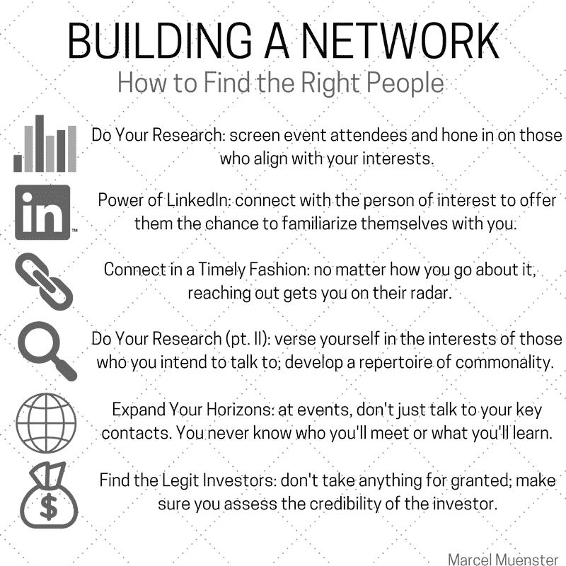
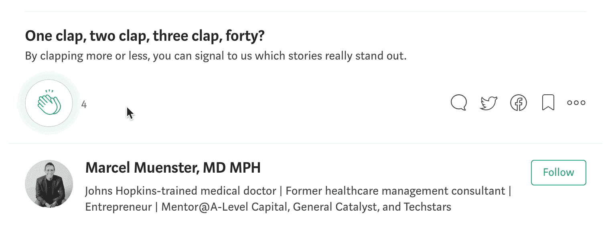

# 完美的人际关系网方程式:如何被关注，如何参与，如何迈出你的第一步

> 原文：<https://medium.com/swlh/the-perfect-networking-equation-how-to-get-noticed-get-involved-and-get-your-foot-in-the-door-a1175120c59f>

*创业不插电博客系列之一:博客 4*

在与一位有创业愿望的朋友交谈后，我决定将这篇博客献给所有创业者的一个重要话题，尤其是早期或首次创业者:有效的人际网络。无论你的技能是什么，你的事业的成功将在很大程度上取决于你的能力，网络的目的是…

*   寻找投资者，
*   找到你的联合创始人，
*   雇佣你的第一批员工，
*   得到演讲的机会，
*   发展商业伙伴关系，

还有很多。因此，任何创业公司都需要一个精通业务、外向、有同情心、值得信赖的发言人来完成这些必要的目标。有些人可能决定将自己转变成公司的代言人，而其他人只是试图找到合适的人来应对这些与网络相关的挑战。也就是说，雇佣别人来做你的人际关系网并不能让你完全摆脱困境；在这种情况下，你仍然需要能够为你自己和你的公司辩护。

无论选择哪条路，我都想分享我学到的一些人际关系网的经验，以帮助你 a)有效地推销你的想法，b)在一个充满崇拜者的嘈杂的创业世界中找到重要的人。

**创造一个对⚾️至关重要的球场**

在准备参加创业活动和比赛或其他相关场合之前，你需要了解事实，直截了当地说。在我看来，做到这一点的最好方法是把自己放在一个正在参加创业活动的潜在天使投资人的位置上。最有可能的是，他们以前从未听说过你，需求量很大，而且时间紧迫。所以问题就变成了:你如何在这个“看与被看”的马戏中脱颖而出？

过去对我来说非常有效的一种方法是基于参与；我没有背诵或照本宣科地说出推销的台词，而是通过把推销变成一系列问题来保持我的方法的灵活性。这样，我帮助投资者得出他们自己的结论，同时也让他们更多地谈论我的公司。通过激发他们对棘手问题的理解，积极地让他们参与进来，我最终用我的产品解决了问题😊

让我告诉你我在早期是如何用这种方法推销我的公司的。每当我有机会推销时，我都有一套针对不同观众的略有不同的曲目。我真的准备在睡觉的时候把它们发射出去。作为背景资料，*口袋里的医生*是业内首个全球医疗礼宾服务，为国际旅行者提供全天候和全球任何地方可信赖的本地、虚拟和上门医生服务。该服务已在全球 180 多个城市推出。

最常见的是，我的对话以如下方式形成(编造名字):

我:你好，吉姆，我叫马塞尔。你喜欢旅行吗？

吉姆:是的。

我:太好了。你最喜欢的目的地是哪里？

吉姆:我和我的家人刚刚去过意大利。

我:美丽的国家。你或你的家庭成员在旅行时生病过吗？

吉姆:你问得很有趣。我们上次旅行时，我的一个孩子得了重病。

我:你做了什么？

吉姆:嗯，我们试图通过我们的酒店找到一位医生。

我:你成功了吗？

吉姆:不尽然。我们最后去了当地的急诊室，情况非常糟糕。

我:为什么？

吉姆:我们必须等几个小时，从来没有机会去看医生，而且还有一个主要的语言障碍。

嘣！他抓住了我们服务解决的所有棘手问题:

1)语言障碍，

2)保证获得合格和经过审查的医生，以及

3)随时随地在您方便的时候看医生。

采用这种方法，并将其转化为你个人的商业问题，可能是一个很好的投资网络策略。开始思考你将如何问一系列类似的问题来吸引你的潜在投资者(或其他任何人)。

有一点是肯定的:遵循这种方法将帮助你在拥挤嘈杂的网络环境中脱颖而出。投资者会记得你，因为你在个人层面上吸引了他们，可能会让他们考虑投资！至少，你会在他们的雷达上。

总之，确保你对你正在解决的问题有一个坚实的理解，如何将其转化为有意义的问题以吸引相关人员，并且确保你掌握了其他重要的细节，如你的竞争对手、业务指标和筹资目标。

如何找到合适的交谈对象📢

完美网络等式的另一部分，我发现更具挑战性的部分，是找到合适的人与你共度时光。你怎么可能从人群中挑选出合适的人，尤其是在那些大型社交活动中？不管你做了多少准备，老实说，在正确的时间(和正确的环境)出现在正确的地点是有运气成分的。

下面是我学到的一些有助于锁定“正确”的人的事情；下面是快速总结，紧接着是对每一点的阐述。

1)做研究:

假设你要去参加一个更正式的社交活动或会议，你通常会提前得到发言者或与会者名单。两者都将给你一个机会来筛选和选择最合适的人来谈论你的商业目标。就投资者而言，有些人只投资于某些领域。这是一个重要的细节，可以帮助你关注那些对你的行业感兴趣的人。

LinkedIn 的力量:

一旦我确定了一个我想与之聊天的有趣的人，我的标准操作程序是在 LinkedIn 上与他们联系。这给他们提供了一个机会，让他们在见面之前更熟悉你，最基本的是，让你在活动中被认出来。所以，确保你有一个优秀的，详细的，最新的个人资料和清晰的个人资料图片。

3)及时连接:

给每个联系人发一封电子邮件，甚至是 LinkedIn 上的直接信息。如果他们能提前联系你安排一些事情，这很好，但是即使他们没有，他们至少会直接收到你的来信。

4)做研究(第二部分):

现在你已经确定了最好的交谈对象，通过阅读他们的 LinkedIn 个人资料、博客帖子、发布的社交媒体内容以及其他一切对建立业务关系有意义的内容来做好准备。这是一条双行道:在他们身上投入一些时间，这样他们也会投入时间(也许更多？)在你身上。

顺便说一下，所有这些对你来说可能听起来很简单。相信我，令人震惊的是，大多数人在参加会议之前从来不做功课。如果你想脱颖而出，你必须花时间。在对话中不要只问“这个会议有多棒？”给你一个指出共同兴趣的基础，让你的推销对话继续下去。再次强调，投资于他们，他们才会投资于你。

记住一件事:做真实的自己，保持真实！不管你对这个人了解多少，都不要照本宣科。你有责任让它看起来自然，让对方感到非常舒服，而不是害怕😂

5)拓展你的视野:

现在，在活动中，保持开放的心态，除了那些你认为是关键联系人的人之外，也愿意和其他人交谈。你永远不知道你还会遇到谁。总的来说，要有好奇心，愿意进行随意的、引人入胜的对话。

6)寻找合法投资者:

现在你已经建立了最终向感兴趣的投资者演讲或推销的势头，永远记住以下几点:不要想当然！例如，我见过很多人在 LinkedIn 和其他地方声称自己是天使投资人。信不信由你，大部分都是废话。虽然作为一名投资者被了解和认可听起来很棒，并给你一个有趣的社会地位，但我发现大多数人要么没有投资，要么最多投资一次。所以，你怎么知道谁是合法的？

以下是我在与潜在天使投资者交谈时要考虑的 4 件事:

1.在 [Crunchbase](https://www.crunchbase.com/) 或类似平台上调查被指控的投资者，以更好地了解他们过去的投资以及他们投资的频率。

2.假设你已经尽了最大努力去了解更多关于投资人的信息，但事先什么都没找到。你必须公开向所谓的投资者询问以下问题:

*   你投资过哪些公司？
*   在过去的 6 个月里，你做了多少投资(通常是一个好的活动指标)？
*   你通常投资多少？

对我来说，一个主要的危险信号是我认为的“所谓的投资者”，即在过去六个月，有时甚至是 12 个月内没有进行任何投资的人。离他们远点。他们对投资并不认真。你最好把时间花在其他潜在客户身上。我知道追逐那个给你哪怕一丝成功希望的人的感觉。相信我，不值得你浪费时间。

3.假设你在谈话中取得了进展，请投资者帮你联系他投资的一些公司的创始人。你想了解他就像他想了解你一样。

4.尽管你已经做了功课，但不要忘记你最强大的工具:你的直觉！当我们第一次见到别人时，每个人都有一些直觉或看法。在决定对话是否值得继续下去时，要相信自己。

在写这篇博文时，我不断想起营销界的一个伟大等式:内容占 10%，分销占剩下的 90%。同样的事情也适用于网络，毕竟，这是营销你和你的公司的过程:在你的整体成功中，你的推销占 10%，而你的有效网络占其余的 90%。因此，虽然确切地知道你在谈论什么对于顺利的社交体验来说是不可或缺的，但更重要的是知道你应该和谁交谈，花时间和谁在一起。

你认为我还遗漏了其他重要的社交技巧吗？让我知道！

干杯，

波浪形卷发

➡️每周从你的收件箱里收到一篇值得一读的文章。[在这里报名](https://goo.gl/forms/p6gnR2OTUiZc47in2)。🙏

PS:大家可以拍手跟我来，这样会有更多的人在 Medium 上看到这篇文章(见下面的视频)。👏 👍

**你可以通过**联系到我

**推特:**[@马赛明斯特](https://twitter.com/marcelmuenster?ref_src=twsrc%5Egoogle%7Ctwcamp%5Eserp%7Ctwgr%5Eauthor)

**个人网站:**[about.me/marcelmuenster](http://about.me/marcelmuenster)(了解更多关于我的信息并安排通话)

**LinkedIn:** 给我发一封[电子邮件](https://www.linkedin.com/in/marcelmuenster/)或一条[直接信息](https://www.linkedin.com/in/marcelmuenster/)

## 这篇文章发表在《创业公司》杂志上，这是 Medium 最大的创业刊物，有 306，792 人关注。

## 订阅接收[我们的头条](http://growthsupply.com/the-startup-newsletter/)。

